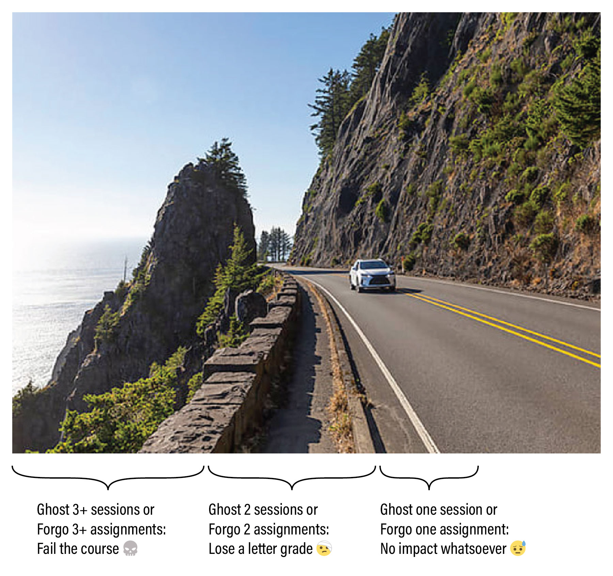

# *Creative Coding* Syllabus (60-212, Fall 2024)

## Overview

*This document covers the policies and procedures for the Fall 2024 edition of "Intermediate Studio: Creative Coding (60-212)". This document does not include information about topic modules, specific assignments, or readings; these can be found elsewhere in this repository.* 

* Title: *Intermediate Studio: Creative Coding* (60-212), Fall 2024
* Time and Location: Mon/Wed, 7:00-9:50pm in CFA-303
* Departments: Carnegie Mellon University [School of Art](http://www.art.cmu.edu/) and [IDeATe Program](https://ideate.cmu.edu/)
* Course OpenProcessing site: [https://openprocessing.org/class/86356](https://openprocessing.org/class/86356)
* Course Google Calendar: [http://bit.ly/golancoursecalendar](http://bit.ly/golancoursecalendar)
* Professor: [Golan Levin](http://www.art.cmu.edu/people/golan-levin/), golan@andrew
* Assistant: [Em Lugo](https://art.cmu.edu/people/emmanuel-lugo/), elugo@andrew

*For Zoom links, Discord channel links, and the Professor's phone number (for emergency contacts), please see the `#key-information` channel in our course Discord server.*

## Contents

* TL;DR
* Overview
* Administration
* Attendance Policies
* Grading and Evaluation Policies
* Academic Integrity
* Accommodations
* Code of Conduct
* Classroom Hygiene
* Dealing with Stress
* Land Notice

---

# TL;DR

Your grade will be based on your professionalism in completing work and attending class, subject to the following policies:

**Assignment Policy:**

* 😓 Forgo 1 weekly assignment: no impact whatsoever.
* 🤕 Forgo 2 weekly assignments: lose a letter grade.
* 💀 Forgo 3+ weekly assignments: fail the class.

Each weekly assignment has a clearly defined checklist of subtasks, whose purpose is to help you develop discipline in creating and documenting your work. Your grade is straightforwardly calculated from your fulfillment of these checklists. Partial assignments are graded as such, and don't count as "forgone".

**Attendance Policy:**

* 😓 Ghost 1 session: no impact whatsoever.
* 🤕 Ghost 2 sessions: lose a letter grade.
* 💀 Ghost 3+ sessions: fail the class.

Attendance is important, but if you need to miss class — which can happen, within reason — you are expected to be responsible about communicating with the professor about your attendance. In the above policy, *ghosting* refers specifically to "No-call, No-show" attendance events, and not excused absences.

---

# Overview

### Course Description
*Intermediate Studio: Creative Coding* (60-212) is a practical introduction to the use of programming and computation within the context of the arts. In this intermediate level course, students develop or deepen the skills and confidence to produce interactive, generative, and computational artworks; discuss their work in relation to current and historic praxes of computer art; and engage new technologies critically.

This is a “studio art course in computer science”, in which our objective is art and design, but our medium is student-written software. Intended as a second course for arts students who have already had one semester of elementary programming (in any language), this class develops craft skills in arts-engineering using a variety of creative coding toolkits, especially including [p5.js](https://p5js.org/) (JavaScript), [ComfyUI](https://www.runcomfy.com/) and [TouchDesigner](https://derivative.ca/). Through rigorous programming exercises in these environments, students will develop mastery over the basic vocabulary of constructs that govern static, dynamic, and interactive form, with the aim of applying these skills to problems in interactive art, computational design, and other creative explorations of transmediality, connectivity, generativity, and immersivity.

### Prerequisites
*What prior knowledge must students have in order to be successful in this course?*

* 60-212 is an *intermediate level course*, intended as a second course for students who have already had at least one semester of introdictory computer programming (in any language). Students must be familiar and comfortable with computer programming fundamentals, such as iteration, conditional testing, functional abstraction, static and dynamic memory structures (e.g. arrays), and object-oriented programming, as taught in a CMU course like 15-104, 15-110, or 15-112.
* General computing skills (such as browser use, file management, and word processing) are essential. Students are also expected to have some familiarity with software workflows for editing and distributing images and video. 
* A strong foundation in mathematics, especially including geometry, algebra, and trigonometry, will also be very helpful.
* This course is taught primarily with JavaScript. Students fluent only in Python may need to do some additional preparation.

### Learning Objectives and Course Goals
At the conclusion of this course, students will be able to:

* Demonstrate proficiency in creating computer programs as artworks.
* Gain familiarity with the repertoire of artists, designers, works and activities around creative coding, interactive art, generative form, and computational design.
* Understand the role of computation in artworks that explore concepts of transmediality, connectivity, generativity, and immersivity.
* Understand how to document and present creative work.

### Course Relevance

This course is relevant to students who are interested in:

* Exploring the use of computation in expanding our expressive vocabulary
* Developing expertise in the aesthetic nuances and conceptual landscape of interactivity
* Designing procedural form and generative art for games, virtual environments, and other modes of creative expression
* Understanding the practical and social assumptions that underpin code in culture

### Assessment Structure
*How will students be assessed in this course: assignments, exams, final, presentation, project, etc.?*

* **10 Assignments**. There will be 10 sets of Deliverables this semester, given at approximately weekly intervals. Each set will have several components, including warmup exercises and a main project, that may have different intermediate deadlines.
* **Complete the checklists**. For each set of deliverables, an objective checklist of subtasks will be provided, with clearly defined assessment criteria. To ensure transparency, fairness and consistency, grades in this course are straightforwardly calculated according to students' fulfillment of these checklists and criteria. Many items on these checklists are easy to fulfill; pay attention to them.
* **Qualitative evaluations are decoupled from grades**. Students will also receive qualitative feedback from the professor, other CMU faculty, outside professionals, and/or their peers. Qualitative critical feedback on the content or quality of projects does not factor into grades.

### Extra Time Commitments
*Are there extra time commitments required outside of the regularly scheduled course meeting times?*

* I anticipate that students will spend approximately 6-8 hours per week outside of class working on their projects.
* There are likely to be a small number of special events outside of class meeting times (such as public artist lectures), for which attendance is strongly recommended.
* Students may also wish to attend optional and occasional group work sessions.

---
# Administration

### Credits Allocated
60-212 provides **12** units of academic credit, and satisfies the software skills portal requirement for students pursuing IDeATe minors and concentrations. 

### Required Course Materials

* **Laptop**. Students should have access to a personal laptop with a webcam and a reliable internet connection. Recent, well-updated installations of Mac OSX, Windows and Linux are all acceptable operating systems. However, although all of the programming toolkits with which we work are free and cross-platform, it is possible that example projects may only be provided for Mac OSX.
* **Programming Environments**. This is a polyglot course. The primary programming environment used for example projects and sample code will be [p5.js](https://p5js.org/) (JavaScript, optionally with [Visual Studio Code](https://code.visualstudio.com/) and the [p5.vscode](https://marketplace.visualstudio.com/items?itemName=samplavigne.p5-vscode) extension). However, we are also likely to encounter [Processing](https://processing.org/) (Java), [TouchDesigner](https://derivative.ca/), [ComfyUI](https://www.runcomfy.com/), and Python.
* **Sketchbook**. It is extremely wise to plan your projects on paper before writing any code, and some assignments will require you to post images of your project sketches. In support of this, you are strongly advised to maintain a sketchbook for this course, ideally on paper.
* **Smartphone Camera**. Students should have access to a smartphone with a camera to document certain projects.
* **3-Button Mouse**. You will need a 3-button mouse for certain software. I recommend the [Logitech M100 wired mouse](https://www.amazon.com/Logitech-Corded-mouse-Black-910-005003/dp/B01MV1GX63/?th=1) (USB-A, $9) or the [Lenovo 400 wired mouse](https://www.amazon.com/Lenovo-USB-C-Compact-Wired-Mouse/dp/B09LRBWB5P/?th=1) (USB-C, $10). Wireless 3-button mice are also acceptable.

### Additional Expenses

* You will find it *extremely* beneficial to have a paid account for an LLM-based generative AI system, such as [ChatGPT Plus](https://openai.com/chatgpt/pricing/) ($20/month), [Anthropic Claude.ai Pro](https://www.anthropic.com/pricing) ($20/month),  or [GitHub CoPilot Individual](https://github.com/features/copilot#pricing) ($10/month).
* For certain assignments it will be necessary to create a prepaid "Hobby" account at [RunComfy.com](https://www.runcomfy.com/pricing). I estimate that a one-time balance of $20-30 should be adequate for most of the work that we need to do. 

### Communication Tools
This course uses the following software systems to share information:

* **Email**. The Professor will send emails once or twice a week. Please read them.
* **Github**, where lectures, assignments and resources will be posted. 
* **Discord**, through which you will publish your projects.
* **Zoom**, for remote meetings, in the unlikely event that circumstances require it.
* **Google Calendar**, [http://bit.ly/golancoursecalendar](http://bit.ly/golancoursecalendar).

---
# Attendance Policies

This section articulates policies on: 

* **Excused absences** (about which you communicated responsibly)
* **Ghosting** ("No-Call, No-Show" absences)
* **Partial attendance** (tardiness, mental absence)
* **Malingering** on critique days (avoidant behavior)

### Excused Absences

An *excused* absence is one about which you have communicated with me in a timely and professional manner.

* **Communication is paramount**. Attendance is important, but if you're running late or need to miss class — which can happen, within reason — you are expected to be responsible about communicating with me. If you’re ill, or if you know you will have a planned absence, please let me know by Discord or email before the beginning of that class session. I can be very understanding and accommodating about planned and necessary absences, family circumstances, and/or medical issues when you inform me in a timely and professional manner. *Within reason*, there is no specific limit on your number of excused absences. 
* **This policy on excused absences shall not be abused**. An increasing number of excused absences is OK—until it isn't. Special accommodations may be necessary if you need to miss more than a few sessions. I reserve the right to issue a low or failing grade if you miss an unreasonably large number of sessions (e.g. 8 or more) in whole or in part.
* **Missed information is your problem**. You are responsible for any information you have missed as a result of absence. Per CMU policy, "faculty are not obligated to re-teach material due to a student missing class." Organize with your classmates to get class information and material that you have missed.

Please evaluate your own health status regularly and refrain from attending class and other on-campus events if you feel even slightly ill. In the event of illness, please do not come to class or to campus! Instead, seek appropriate medical attention, and notify me about your absence as soon as possible, so that accommodations can be made.

### Ghosting (No-Call, No-Show Absences)

If I, the professor, am unable to come to class, I will send a message so that students can plan accordingly. I expect the exact same courtesy from you. Failing to communicate responsibly about your absences — in other words, *ghosting*, or "[No-Call, No-Show](https://en.wikipedia.org/wiki/No_call,_no_show)" events — is problematic and disrespectful to the classroom community, and is not acceptable in this course. Allowing one emergency for everyone, the following policy applies:

* Ghost 1 session: no impact on your grade.
* Ghost 2 sessions: lose a letter grade (A→B).
* Ghost 3 or more sessions: fail the class (B→R).

There are very few situations in which a person is *literally unable* to send a brief message. That said, the following list of incapacitating emergencies (of you or someone close to you) are examples of acceptable excuses for a *No-Call, No-Show* absence: Death of a family member, loved one, or friend; serious injuries or accidents that pose a high risk to wellbeing; hospitalization or involuntary commitment; physical assault; abduction; police arrest; housefire. 

Students are responsible for notifying the professor as soon as possible, even in a justified *No-Call, No-Show* situation — i.e. a "delayed notice of absence". Depending on the severity of the situation, the notice period should not exceed three days from the day of absence. A *post-hoc* excuse for an unexcused absence may or may not be accepted, at the professor's discretion.

### Partial Attendance

Three incidents of unexcused partial absence will cause you to lose a letter grade (A→B). Partial absence includes situations like tardiness, sleeping in class, or other forms of mental absence (i.e. distracted participation).  

* **Tardiness** is a form of partial absence in which you are more than 20 minutes late to an class event. Tardiness may be excused or unexcused. Note that I typically begin to lecture (or commence other important class activities) no more than 5 minutes after the official start time. *Your first incident of unexcused tardiness will be noted, but excused*. 
* **Focus is precious**. Physical presence means nothing if you’re “checked out”; your mental presence is extremely important. You can function for a few hours without sleeping, texting, chatting online, emailing, or doing work for other courses. During lectures, critiques, or (*especially*) during guest presentations, such distracted participation is demoralizing to those around you. If I observe you doing these things, depending on the circumstance, I may have no choice but to correct you publicly. *Your first incident of mental absence will be noted, but excused*. 

### Malingering On Critique Days

Sometimes, students who haven’t completed their projects choose to avoid attending class on critique days, because they are too embarrassed to come to class empty-handed. This type of absence, called [*malingering*](https://www.merriam-webster.com/dictionary/malinger), is stupendously self-destructive. *Please have courage.* Your participation on critique days is essential, even if your own project is incomplete or missing, because these sessions and conversations help you understand our class standards, expectations, and criteria for good work. If you are empty-handed, just say so; it happens. Even if you are without a project, you are still expected to contribute productively to the class discussion.

---
# Grading and Evaluation Policies

In this course, your work is evaluated according to three different systems, which are decoupled to the greatest extent possible:

* **Grades** (standards used by CMU on its transcripts) 
* **Evaluations** (standards used by our class community in critiques)
* **Expectations of Professionalism** (additional standards used by Golan)

### Grades

**Grades** are standards used by CMU on its transcripts, to indicate your objective level of effort in a course. 

Your grades in 60-212 will be based on your self-evident **fulfillment** of simple checklists. Projects will always have a checklist of *supporting requirements*. These are very straightforward to fulfill, but if you fail to meet these, you will have points deducted. Practically every project assignment will ask you to check off subtasks such as:

* **Create** a unique Discord post for your project.
* **Title** and **Tag** your project in a specified manner.
* **Upload** a photo of your notebook sketches for the project, if applicable.
* **Upload** a static image of your project, such as a screenshot or photograph.
* **Upload** dynamic documentation of your project (such as an animated GIF, video recording, or interactive applet) into the blog post, if applicable.
* **Write** 100-200 words about your project, describing its development process. In your writing, include some critical reflection and analysis of your project: In what ways did you succeed, and in what ways could it be better?
* **Link** to your project or code, if requested.
* As per our syllabus policies on Academic Integrity, you must also:
	* **Name** any other students (or generative AI systems) from whom you received advice or help, and describe the help you received. If you had collaborators, explain how the work was distributed among the collaborators.
	* **Cite** and link to the sources for any code, external libraries, or other media (e.g. photographs, soundtracks, source images) which you used in your Project. Citing your sources is extremely important. Err on the side of generosity.

### Evaluations

**Evaluations** are standards used by our class community in critiques, to provide subjective feedback about your creative work.

This section discusses how your work will be Evaluated. Evaluations reflect professional assessments of your work—as provided by me, our Teaching Assistant, external guest critics, and/or your peers. Evaluations articulate someone's personal *opinion* about whether your creative effort is *good*, *interesting*, *noteworthy*, etc. As such, Evaluations do not figure into your grade. 

The purpose of our open-ended projects is to provide well-circumscribed opportunities for you to make creative work with code. Generally the prompts will invite you to explore a specific conceptual theme or set of programming techniques, but, unless stated otherwise, there is no correct solution, and no specific requirement for how you should implement your idea. My assignments will not only ask for a creative solution, but also for some creativity in defining and approaching the problem.

The quality of your creative projects may be unrelated to how much time you spent making it. You may sometimes observe a very quickly-executed solution which succeeds because of its strong concept. Usually, however, the quality of a project is rewarded by extra attention to its craft.

In our critiques, we will evaluate your open-ended projects according to the following subjective considerations:

* **Curiosity**: Are you asking questions as you work?
* **Tenacity**: Are you forging through difficult problems without giving up?
* **Execution**: Are you crafting with purpose, precision, and attention?
* **Inventiveness**: Are you discovering/exploring methods outside the obvious and predictable?

Evaluations may be given along different scales, according to the project. For example, your work may be evaluated as 🔥(fire), 🤷 (mid), or 💩 (poo).  Other times, evaluation feedback may take the form of scores of S,A,B,C,D, or F, as described below. Note that it is possible for you to receive full *credit* for an assignment (i.e. you completed the checklist), while still receiving an Evaluation of B or C.

* **S** (Surpassing/秀): You made something exceptional
* **A** (Excellent): You made something very good
* **B** (Good): You made something satisfactory, that fulfills all requirements
* **C** (Needs Improvement): You tried to make something
* **D** (Unacceptable): You did not really try; the work does not fulfill any requirements completely
* **F** (No Credit): You did not even try, and made no arrangements to address this.

In addition to your projects, I will also provide a mid-semester evaluation of your classroom participation. There are a few essential things you can do to ensure that you receive a totally respectable Evaluation in this course:

* **Be good**. Have a positive attitude.
* **Be respectful** of our social space. Make space for others.
* **Be present**. Show up to all of the course sessions, alert and on time.
* **Be responsible**. Communicate with me about any issues you're having, and clean up after yourself.
* **Ask for help**. If you don’t know how/where/what, ask for help.
* **Be curious**. If you don’t understand something, start with curiosity rather than judgment.

### Expectations of Professionalism
There are a few simple things you can do to ensure that you retain my highest respect for your professionalism. At a minimum, I ask you to:

* **Be good**. Have a positive attitude.
* **Be present**. Show up to all of the course sessions, on time.
* **Be responsible**. Communicate with me beforehand if you must miss a session.
* **Be diligent**. Submit your deliverables, on time, with clear and thorough documentation. 

Beyond this, I would love it if you could:

* **Be helpful**. Help your classmates when they’re stuck. Contribute to discussions.
* **Be fearless**. Work outside your comfort zone. Give yourself permission to weird.
* **Be conscientious**. Pay attention to details of craft and execution. Put your heart in the work.
* **Be persevering**. Become resourceful about getting the assistance you need.
* **Be generous**. Make helpful contributions to discussions.

These standards help me decide whether I might someday (for example) write a letter of recommendation for you; agree to offer independent study credits to you; hire you as a research assistant; or enroll you from my waitlist for an advanced course. 

### Policies for Late Work

Our class is extremely fast-paced. When you submit work late, you will miss an important opportunity to share, show off, discuss and get critical feedback on your work.

**To receive critical feedback on your work**, your work must be available for evaluation during the designated review period. For example, at times this semester, your creative projects may be evaluated in an in-class critique, or by outside experts who review your work online. If your assignment is not uploaded and documented by the time those persons do their reviews, then your work will likely not receive feedback from them. I will do my best to provide feedback for late work, but just like everyone else, I need to reserve my effort for the next topic; generally speaking, my feedback for late work is comparatively attenuated. 

**To receive full credit towards your grade**, projects should be uploaded and completed by the time that I get around to reading them. This is usually a day or two after their stated due date, but I offer no precise details on this. If your project is late, I reserve the right to assign partial credit to it. If you know you're going to be a little late with a project, *contact me* to arrange an accommodation.

---

# Academic Integrity
Your behavior as a responsible member of the new-media arts community is very important — as demonstrated, for example, by properly citing your sources and borrowed code, and crediting those who have helped you. These expectations and obligations are addressed here.

### Policies for Open-Ended Creative Projects
For your open-ended creative projects, there are no “correct answers”. Your curiosity, creativity, ingenuity and originality are prized.

You may borrow code or ideas from other sources, within the limits of “reasonable person” principles described below, provided you attribute your sources. Your projects will likely be discussed and critiqued in front of (and with the assistance of) your peers. In some cases, your work may appear, publicly, on the open Internet. 

As art students, you are expected or invited to make extensive use of open-source toolkits, libraries and tutorials. When working in this way, much like a knitting circle, our classroom is structured around peer instruction, in which students are expected to help each other learn.

### Use of Online and/or Open-Source Code in Projects
**Credit is perhaps the most important form of currency** in the economies of commons-based peer production and open-source media arts. You are expected to cite the source of any code you use. Please note the following expectations and guidelines:

* **Use Libraries**. In your Projects, the use of general-purpose, reusable code libraries that solve specific technical problems is very strongly encouraged. The people who developed these components worked hard, often for no pay; acknowledge their community contributions by citing their name and linking to their repository.
* **Be Careful**. It sometimes happens that an artist will place the entire source code for their artwork online. You might even discover the work of a student in some other course or school, who has posted their code for a project that responds to a similar assignment. *You should probably avoid this code*, or at the very least, you should be *extremely* careful about approaching such code for any possible re-use. Forking an *artwork* from someone’s page on OpenProcessing and simply changing the colors would be unacceptably and disgracefully lazy; doing so without thorough and proper citation would be outright plagiarism.

### Policies Regarding Informal Collaboration
Our course places a very high value on civic responsibility, which includes helping others learn. In this course, we strongly encourage you to give help (or ask others for help) in using various toolkits, algorithms, libraries, or other facilities. Please note the following expectations:

* **Giving and receiving help is encouraged**. But students who receive help from someone else are obliged to acknowledge that person in their project report, clarifying the nature of the help that was received.
* **We are all teachers**. Students with advanced skills are expected to help others, yet refrain from doing another’s work for them. You can usually tell when you’re about to cross the line: Ask yourself whether you are teaching someone to fish, or merely giving them the fish.
* **Give credit**. When in doubt: *give credit* to the people who have helped you.

### Policies Regarding Formal Collaboration
The assignments in this course are primarily intended to be executed by individuals. That said, I am in favor of students collaborating occasionally if such collaborations arise organically. Please note the following expectations:

* **Notify the Professor**. It’s helpful for me to know who is working with whom. Students who wish to collaborate should jointly inform the professor as early as possible.
* **No third wheels**. Unless permission is explicitly granted by the Professor, collaborations in this course are restricted to *pairs* of students. 
* **Describe who did what**. Written reports for collaborative projects should describe how your effort was distributed.
* **Only collaborators from this class**. Your project collaborator, if you have one, must be in this semester's cohort of 60-212 students. You may not collaborate with people from outside the course (e.g. your housemate).
* **Avoid co-dependency**. It's great that you have a bestie, but you may not collaborate with the same person (i.e. submit an assignment jointly) on more than two projects.

### Policies and Suggestions Regarding Generative AI

With only a few exceptions (I'll be clear), you are *affirmatively encouraged* to use generative AI systems (such as ChatGPT, Claude, or CoPilot) to assist you with your programming projects. Indeed: it is incumbent upon us to explore how these systems are changing the nature of creative coding and software development. In using AI systems in your classwork, please keep the following in mind:

* **Use your own words when requested**. You will receive a handful of very brief writing assignments (such as providing anonymous critical feedback to your peers, or writing *Looking Outwards* reports) where your own thoughts, opinions, and voice are requested. These will not be difficult writing assignments. Using AI tools to write these for you would represent a bad-faith posture.
* **Acknowledge your use.** If you use an LLM or generative AI system to assist you in the creation of a project, you are required to say so — in exactly the same way that you would acknowledge using some code you found online, or that you would acknowledge receiving help from another student. In your project write-up and/or in your code, please state which system you used, and how you used it. Your honesty in this matter is extremely important. And, I hope we can all learn from your experiments.
* **Beware a push toward normativity.** Generative AI systems are designed to regurgitate a digested version of stuff they've seen before. The results they provide are often inherently average [slop](https://www.nytimes.com/2024/06/11/style/ai-search-slop.html). That may be sufficient for technical problems in which there is a right answer, but it may be unsuitable for an art project in which the goal is for you to develop your own creative voice. I may hope that you make something *beautiful*; I may hope that you make something *interesting*; but most importantly of all, my assignments in this course ask you to make something *yours*. No AI system can do that, by definition...unless you made the AI system.
* **There's no short-cut to skill.** There aren't many exercises in this class that could be made wholesale by an AI — but those that possibly could, are basic exercises which have been assigned to you precisely because I genuinely believe you actually need those skills in order to make the more creative stuff. 
* **Beware the loss of serendipity.** Bob Ross famously quipped, "We don't make mistakes — we just have happy accidents." Although it may be expedient to have a system write your code for you, you may miss out on the chance to become intimately familiar with the grain of your medium, and to have accidents that suggest new possibilities and ideas.
* **Beware the loss of your time.** In some cases, it may be easier just to program the damn thing yourself, than to spend your time coping with an AI's hallucinations.

### Summary of CMU Academic Integrity Policies
Carnegie Mellon University prohibits academic dishonesty. This includes plagiarism, and may consist of: submitting the work of someone else as your own; failing to cite assistance you received; or the failure to properly cite materials or ideas from other sources. **Nearly all of these problems can be easily avoided if you’re clear and generous in giving credit where credit is due.** 

CMU's [University Policy on Cheating and Plagiarism](https://www.cmu.edu/policies/student-and-student-life/academic-integrity.html) articulates the possible penalties associated with plagiarism and academic dishonesty. These may include, but are not limited to, zero credit for the specific plagiarized assignment, to failure in the class. If you have any questions about this policy as it relates to work you are doing in the course, please feel free to contact me.

---

# Accommodations

### Inclusivity Statement
It is my intent that students from all diverse backgrounds and perspectives be well served by this course, and that the diversity that students bring to this class be viewed as a resource, strength and benefit. I will gladly honor your request to address you by the pronouns and name you specify.

### Religious and/or Disability Accommodations
I commit to make individual arrangements to address disabilities and/or religious needs (e.g. religious events in conflict with class meetings). If you have a disability and have an accommodation letter from the Office of Disability Resources, you are encouraged to discuss your accommodations and needs with me as early in the semester as possible; I will work with you to ensure that accommodations are provided as best I can.

### Content Considerations
In order to best engage in our moment as critical makers and thinkers we will approach a diverse array of work with care and curiosity. As a result, it is possible that this course may present content that includes nudity and imagery, language, or dialogue that could offend or challenge some students. When possible, the professor and students should make the cohort aware of violent or sexual imagery before it is displayed. Of course, what is challenging to one person may not be challenging to another, and content warnings are culturally and personally subjective in practice. That being said, any of us may have moments when we are uncomfortable due to the content of work presented in class. Please do your best to take care of yourself as needed and respect the needs of others when they need to care for themselves. If you have a history of PTSD and require accommodations please let me know and I will do my best to accommodate your specific needs.

# Code of Conduct

I am committed to providing an educational experience that is free of harassment and intimidation for everyone in this course—regardless of race, color, ethnicity, nationality, sex, handicap or disability, age, sexual orientation, gender identity and expression, physical appearance, body size, religion, class, creed, ancestry, belief, veteran status, genetic information, or technology choices. We will not tolerate any form of harassment and/or discriminatory, oppressive, suppressive, or violent behavior.

*Harassment* may include, but is not limited to, offensive verbal comments, deliberate intimidation, stalking, following, harassing photography or recording, sustained disruption, inappropriate or non-consensual physical contact, unwelcome sexual attention, and/or refusing to accept the limits or boundaries set by another participant in our classroom. I further define *suppressive* behavior as any sort of communication that stifles or belittles another. Participants who have been asked to stop any behavior are expected to comply immediately. I expect all of the participants in our course community to adhere to this code of conduct–including myself, the Professor.

If you experience or witness harassment, threatening behavior, suppressive behavior, or have any other concerns, I encourage you to speak up, say something, and/or let me know immediately. If someone engages in harassing behavior, I may take any action deemed appropriate in the Carnegie Mellon University Policy against [Discriminatory and Sexual Misconduct Policy](https://www.cmu.edu/policies/administrative-and-governance/sexual-misconduct/index.html), or other community policies, including referral to the Dean of Student Affairs. 

For incidents that may not violate any formal policies or require disciplinary action, but which still cause harm and necessitate a thoughtful response, Carnegie Mellon has also developed a [Campus Climate and Bias Reporting Protocol](https://www.cmu.edu/title-ix/how-to-report-+-options-for-resolution/ccbrp/index.html). This a non-disciplinary mechanism for reporting and informally resolving incidents of alleged bias; it focuses on education, restoration, and strengthening and upholding our core values as a university community.

Carnegie Mellon is committed to fostering an environment where our community can grow, learn and ultimately thrive together. Sometimes things impact our community that don’t violate any formal policies or require disciplinary action, but still cause harm and necessitate thoughtful education and restoration. To that end, the [Campus Climate and Bias Reporting Protocol](https://www.cmu.edu/title-ix/how-to-report-+-options-for-resolution/ccbrp/index.html) (CCBRP) is a new, non-disciplinary mechanism for reporting and informally resolving incidents of alleged bias focusing on education, restoration, and strengthening and upholding our core values as a university community. If you need guidance or are uncertain as to what your options are, please feel free to contact CFA's Office for Diversity, Equity, and Inclusion prior to submitting a CCBRP report.

---

# Classroom Hygiene

As of fall 2024, new COVID variants are on the rise. As we head back to campus, keep in mind that thousands of students are returning from all over the world. In light of this, the following policies and suggestions govern our in-person meetings: 

* **Masks** are *strongly recommended* during the first two weeks of the semester. Following the first two weeks, the use of masks is *encouraged*. That said: It's important that we be able to see and hear each other well. In the interest of effective interpersonal communication, *feel welcome to lower your mask (if you wish) if you are actively speaking to the entire class.*
* **No food in the classroom**. It's not sanitary, it leaves a mess, and it's risky around computers.
* **Drinks** in containers with lids are permitted. 

---

# Dealing with Stress
**Take care of yourself**. Please do your best to maintain a healthy lifestyle this semester by eating well, exercising, avoiding drugs and alcohol, getting enough sleep and taking some time to relax. This will help you achieve your goals and cope with stress.

All of us benefit from support during times of struggle. You are not alone. There are many helpful resources available on campus and an important part of the college experience is learning how to ask for help. Asking for support sooner rather than later is often helpful.

If you or anyone you know experiences any academic stress, difficult life events, or feelings like anxiety or depression, we strongly encourage you to seek support. Counseling and Psychological Services (CaPS) is here to help: call 412-268-2922 and visit their website at http://www.cmu.edu/counseling/. Consider reaching out to a friend, faculty or family member you trust for help getting connected to the support that can help. If you or someone you know is feeling suicidal or in danger of harm to self or others, call someone immediately, day or night:

* **CaPS Counseling: +1-412-268-2922**
* **Re:solve Crisis Network: +1-888-796-8226**
* **On campus CMU Police: +1-412-268-2323**

---

# Land Notice

Carnegie Mellon University and the city of Pittsburgh are situated on land that has been continuously inhabited for over 16,000 years, serving as a home to members of the Adena, Hopewell, Monongahela, Lenape, Shawnee, Wyandot, Tisagechroami, Delaware, and Mohican communities before becoming a territory of the Iroquois Confederacy. The Iroquois Confederacy included the Mohawk, Onondaga, Oneida, Cayuga, Seneca, and Tuscarora people, whose relationships with the land continue to this day. The Seneca name for Pittsburgh is [*Dionde:gâ*](https://en.wikipedia.org/wiki/History_of_Pittsburgh).

We acknowledge that we operate as Carnegie Mellon University on the traditional land of these peoples, past and present, and honor with gratitude the land itself and the people who have stewarded it throughout the generations. This calls us to commit to continuing to learn how to be better stewards of the land we inhabit as well.