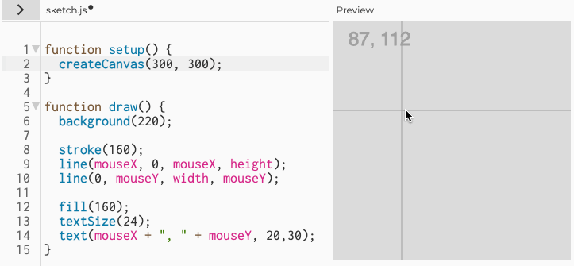
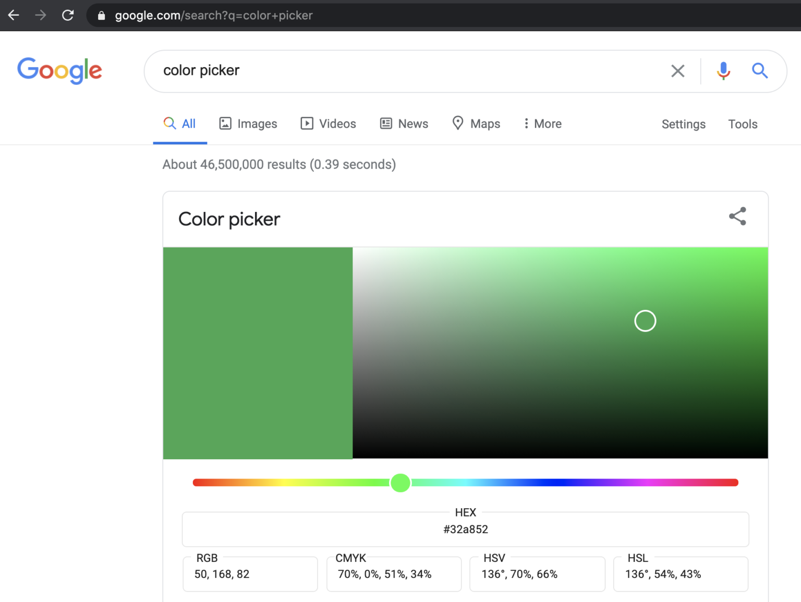

# Assignment Set #1

---

*These deliverables are due by the beginning of class on Wednesday 8/28. There are four main sections of work, the total of which should take less than 3 hours:*

* 30 minutes — Administrative tasks
* 20 minutes — Looking Outwards post
* 30 minutes — Wayfinding where to get help
* 60 minutes — Four small exercises on OpenProcessing

---

1. [***30 minutes***] Please **complete** the following administrative tasks:
	* [*1 minute*] **Bookmark** our [Course GitHub](https://github.com/golanlevin/60-212/blob/main/2024/readme.md) in your laptop's browser, and **subscribe** to our class [Calendar](http://bit.ly/golancoursecalendar). 
	* [*4 minutes*] **Create** an ID on [Discord.com](https://discord.com/) (if you don't already have one). **Join** the class Discord, using the invitation sent to you by email. **Browse** the text channels so you know what goes where.
	* [*10 minutes*] **Create** an ID on [OpenProcessing.org](https://openprocessing.org) (if you don't already have one). **Join** our [OpenProcessing classroom](https://openprocessing.org/class/93074#/), using the invitation sent to you by email, and **bookmark** it in your laptop's browser. **Browse** a few of the sketches that people have published at [https://openprocessing.org/discover](https://openprocessing.org/discover). (Note: the quality varies widely!) Run the programs, and be sure to **look** at their code (*command-shift-return* may help switch to the code view). In the `#main-chatter` channel of the course Discord, **paste** a link to one or two projects that you found interesting. (No writing is necessary.) 
	* [*15 minutes*] **Review** the [Syllabus](https://github.com/golanlevin/60-212/blob/main/2024/syllabus/60-212_syllabus_fall2024.md) carefully, and **complete** the [**Welcome Form & Exit Ticket**](https://forms.gle/qa1upyvUXWk1dWra6).
2. [***20 minutes***] Please **write** a "[Looking Outwards](https://github.com/golanlevin/lectures/blob/master/syllabi/looking-outwards.md)" post, as follows: 
	* **Recall** a project you have admired (prior to this course) which you feel falls under the broad umbrella of "Creative Coding". 
	* **Create** a post in the `#looking-outwards-1` channel in the course Discord. In a few sentences, **describe** the project, and **explain** what you like about the. It's sufficient to write 3-5 sentences. 
	* **Include** a link (URL) to the project or its documentation (such as a YouTube video).
	* **Embed** an image of the project in your post. 
3. [***30 minutes***] Wayfinding: **ensure** you know where to get help: 
   * [*10 minutes*] **Browse** the [p5.js Reference](https://archive.p5js.org/reference/). Examine at least ten Reference pages, starting with the Shape commands. Note that many of the Reference pages allow you to tinker with the code.
   * [*10 minutes*] **Browse** the [p5.js Examples](https://archive.p5js.org/examples/) archive, which are organized thematically. Review at least ten p5.js Examples, skimming their code.
   * [*10 minutes*] **Browse** some of the many free YouTube tutorials for p5.js, including those by [Dan Shiffman](https://www.youtube.com/@TheCodingTrain/playlists), [Xin Xin](https://www.youtube.com/@xinxin1011/videos) and [Patt Vira](https://www.youtube.com/@pattvira/playlists). Their offerings range from [completely introductory](https://www.youtube.com/watch?v=HerCR8bw_GE&list=PLRqwX-V7Uu6Zy51Q-x9tMWIv9cueOFTFA) to impressively advanced.
   * Additionally: 
      * Unless otherwise indicated, feel welcome to use AI systems while programming, such as ChatGPT, Claude, or CoPilot. (Be sure to indicate that you received support from these systems, and watch out for hallucinations!)
      * Be aware that Lauren McCarthy's book, "[Getting Started with p5.js](https://learning.oreilly.com/library/view/getting-started-with/9781457186769/?sso_link=yes&sso_link_from=cmu-edu)" is available online for free through the CMU libraries.
      * Remember, if you get stuck while making the projects, you can always give a shout in the `#haaaalp` channel in the course Discord.
      * See the [helpful tools](#helpful-tools) documented below. 
4. [***60 minutes***] **Complete** the following four mini-assignments on OpenProcessing. The purpose of these exercises is to help me assess your preparedness and baseline level of skill.
   * [*5 minutes*] **Do** [Iteration: Transitioning Rectangles](https://openprocessing.org/class/93074/#/c/93123)
   * [*10 minutes*] **Do** [Nested Iteration & Randomness: Grid, Interrupted](https://openprocessing.org/class/93074/#/c/93124)
   * [*15 minutes*] **Do** [Transformations + Functional Abstraction: Critter Stamps](https://openprocessing.org/class/93074/#/c/93122)
   * [*30 minutes*] **Do** [Array of (Animating) Objects: Ripples](https://openprocessing.org/class/93074/#/c/93126)

   
  
---

## Helpful Tools

### Locating Pixel Coordinates

It can sometimes be challenging to locate the pixel coordinates you want. You may find it helpful to plan your design using [graph paper](https://print-graph-paper.com/), or by displaying your cursor's coordinates using something like the following (find the code [here](https://editor.p5js.org/golan/sketches/vvEg7XbQ4)):

### Choosing Colors

In can also be challenging to get the values that describe the color you want. You may find it helpful to refer to this [table of common Web colors](https://en.wikipedia.org/wiki/Web_colors#Extended_colors) (which can help you refer to colors by name) as well as the [Digital Color Meter app](https://medium.com/mac-os-x/digital-color-meter-in-mac-machine-e961bedca040) that comes with MacOS. Additionally, you can easily access a color picker by [searching for one on Google](https://www.google.com/search?q=color+picker):

