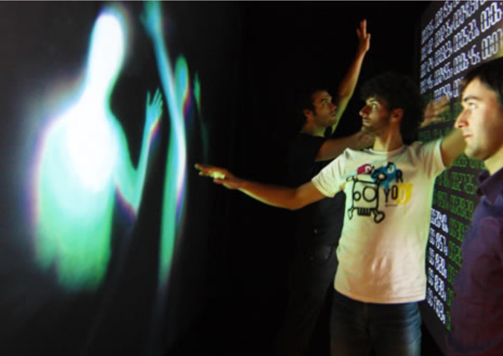
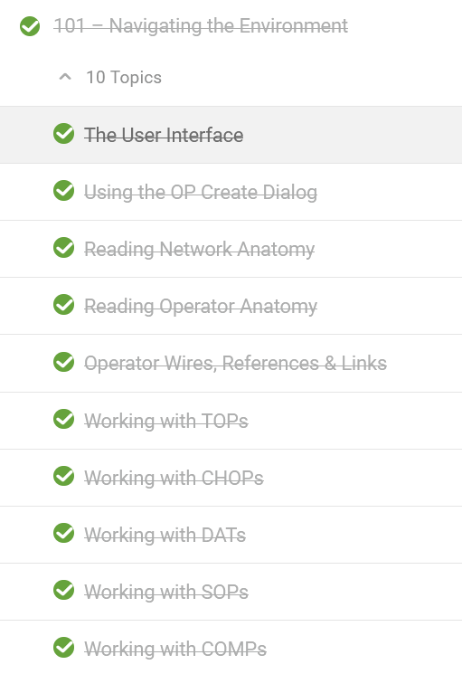
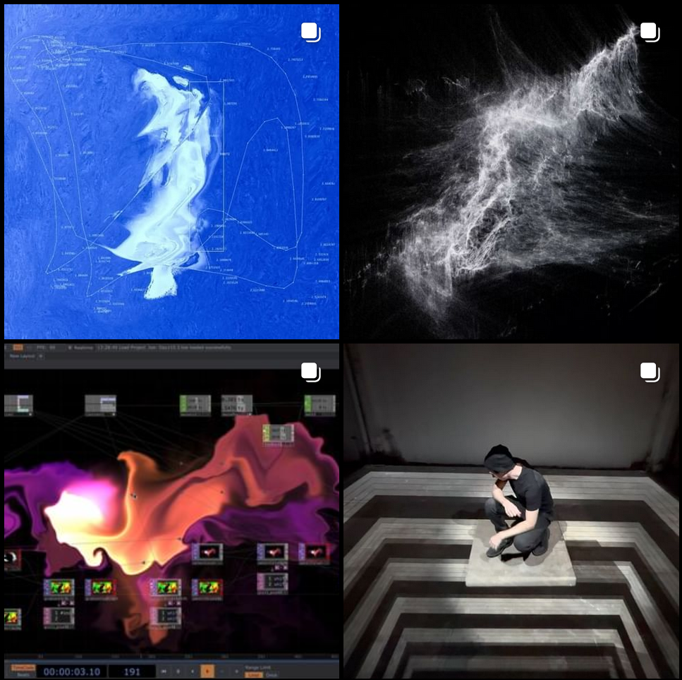

# Assignment Set #10a

## Touchdesigner: Interactive Environment

In this assignment, we will have a more open ended interactive assignment that will emphasize on visualising and mastering a real-world input. 

This assignment is due in several parts. The first portion will be to watch and follow along with some introductory technical content to catch-up the uninitiated; and to do a small looking outwards. Due at the start of class **Wednesday November 20**: 

* 10.1 : Getting Ready *(20 minutes)*
* 10.2 :[Introductory video Completion](#91-Introductory-videos) *(10%, 60-80 minutes)*
* 10.3 :[Looking Outwards: Interaction and Touch](#72-looking-outwards-generative-art) *(10%, 20 minutes)*

---
## 10.1 Getting Ready (No Deliverable)
*(5%, 20 minutes, due 11/20)* Touchdesigner is a DESKTOP rendering and programming environment, unlike p5 we will require everyone have it installed and ready to use in peak-performance

* By next class I need **4** things from you
* **A 3 Button Mouse** for you to use during class (it is POSSIBLE to use Touchdesigner without a 3-button mouse, but is significantly harder and will slow you down majorly)
* **Your Computer Charger**: Touchdesigner uses the full power of your CPU adn GPU whenever possible, especially if you intend to go above 60 fps. Every time you use Touchdesigner you will want your laptop to be plugged in
* Touchdesigner Official Release installed, and a Non-Commerical License Activated 
    * You can find the download files [here](https://derivative.ca/download) 
* Make sure TouchDesigner opens properly and runs
---

## 10.2 Introductory videos

*(10%, 60-80 minutes, due 11/20)* Touchdesigner is a multimedia, node based programming language that uses *Python* to send numerical data, and *GLSL shaders* to render images.

* **Spend 50 minutes watching** the **First Ten** demo videos on [The Touchdesigner 100 Course](https://learn.derivative.ca/courses/100-fundamentals/), a website that holds your hand through the basics of Learning Touchdesigner from nothing to beginner. **WHILE FOLLOWING ALONG** As you watch, hit "Mark Complete" 

* **Screenshot and submit** the progress you have made. In the Discord channel `#10.1-TD101`, the Screenshot should look like this :

* In this class we are working with a variety of experiences in this tool, because of this, those who have had prior exposure are encouraged to do viewings from sections *102-108* and the [Touchdesigner 200 Course](https://learn.derivative.ca/courses/200-intermediate/)

---

## 10.3 Looking Outwards: Interaction and Touch

*(10%, 20 minutes, due 11/20)* 

* **Spend 20 minutes online** looking for content made in Touchdesigner that features some interaction that interests you on socialmedia. Search under **#touchdesigner/#doitintops**. Acceptable sites to do this viewing are Instagram,Twitter,Youtube

* **Write** one sentence about why this form of interaction or visualization interests you.

* **Screenshot and submit the link** to the piece. In the Discord channel `#10.2-Looking Outwards`

* **Note** : please do not just skim from the first page of results

---
