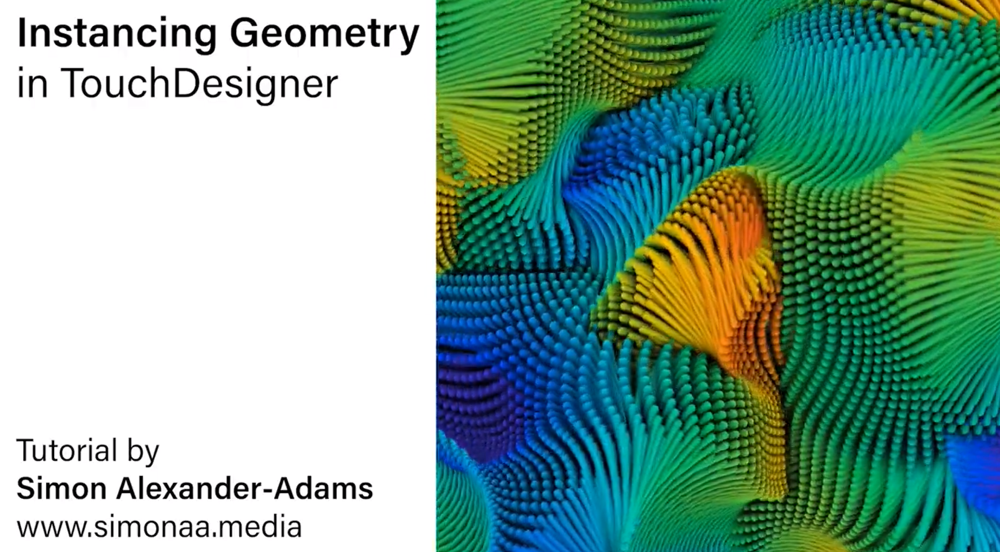
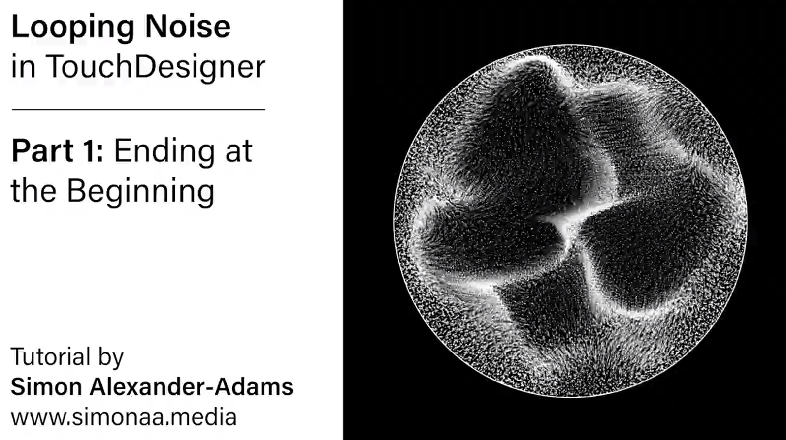
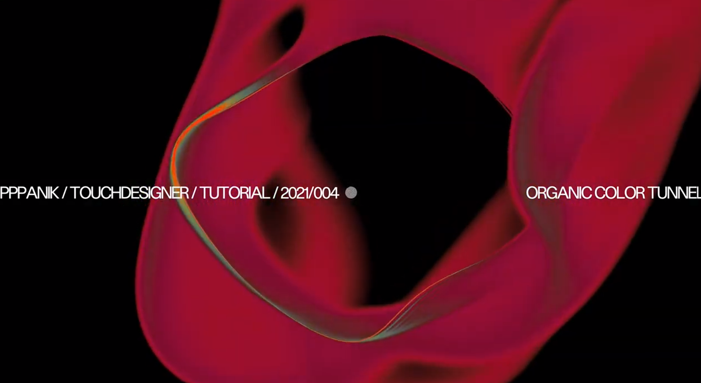
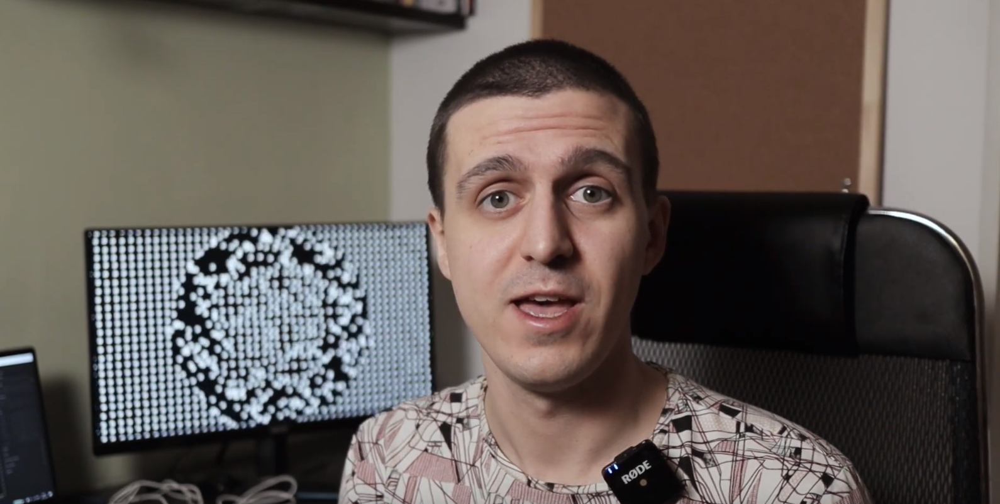

# Assignment Set #10b

## Touchdesigner: Interactive Environment

In this assignment, we will have a more open ended interactive assignment that will emphasize on visualising and mastering a real-world input. 

* 10.4 : Intermediate Instancing and Feedback Tutorials *(10% 2 hours, Due 11/25)*
* 10.5 :Interactive Environment *(70%, >5 hours, Due 12/10)*

---
## 10.4 : Instancing and Feedback Tutorials
*(10%, 2 hours, due 11/25)* 
Feedback and instancing are two effects that are common workflows I would like you all to have a mastery of. They are not difficult, but expand your arsenal. Your final project does not need to include them, but they may be useful for you to have available

* There are going to be **5** videos linked below. A mild and a spicy video for each topic. I am only asking you to watch and follow along with **2** tutorials.

* [Instancing Mild 🌶️ Instancing Basics](https://www.youtube.com/watch?v=BFG-FBKuJow)

* [Instancing Spicy 🌶️🌶️ Looping Noise](https://www.youtube.com/watch?v=TGYO1WcT5ys)

* [Feedback Mild 🌶️  Color Tunnel](https://www.youtube.com/watch?v=gHPrDMqOmJ0&t=47s)

* [Feedback Spicy 🌶️🌶️ Feedback Spitscanner](https://www.youtube.com/watch?v=jOcMCGtclBs)

* [Extra Spicy 🌶️🌶️🌶️ Feedback Influenced Instancing](https://www.youtube.com/watch?v=Qv2nTk4lr-E) (noones goes very fast, take your time, pause and slow down the video if necessary)

* Once you complete the tutorials, change SOMETHING SMALL about them. It could be something as miniscule as the period of the noise, or the shape of your instancing objects, or the color scheme. Do some simple transformation on top of the base tutorial to show that you know how certain characteristics of the patch work. Post a screenshot of the patches working, and the output in the discord channel `#10-intermediate-tutorials`

---

## 10.5 Interactive Environment

*(70%, >5 hours due 12/10)* 

* Create a Touchdesigner patch that creates a graphic corresponding to some sort of **INPUT**. This can be a Camera, Computer Vision, OSC, MIDI, Serial devices like Arduino, Mediapipe, Audio, Screen Grabs, Realtime Web Pages, keyboard input, etc.

* This project will have multiple phases over the rest of the semester

    * 12/02 will be a work day where everyone will have a ~10 minute meeting with Em to establish a project direction/prescribe useful tools/look at previous and similar work. After you meet with Em you are welcome to stay and work or work where you please. 
    * 12/04 will be a small showing of WIPs, or sketches of what you intend to do. This is non-binding. What you show in the WIP does not limit what you can do for the final submission.
    * 12/10 : final celebration of your work.

* **Export a .mp4 and submit an unlisted YouTube video** to the `10-interactive-environment` discord channel. Give a 6 minute presentation on what you did while the class responds with a google doc crit. How to export .mp4s from TD are [here](https://www.youtube.com/watch?v=DSpaWDQP5O4)

---

