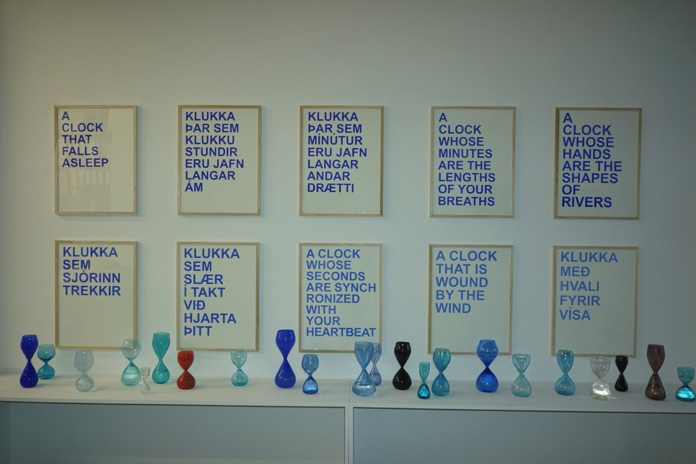
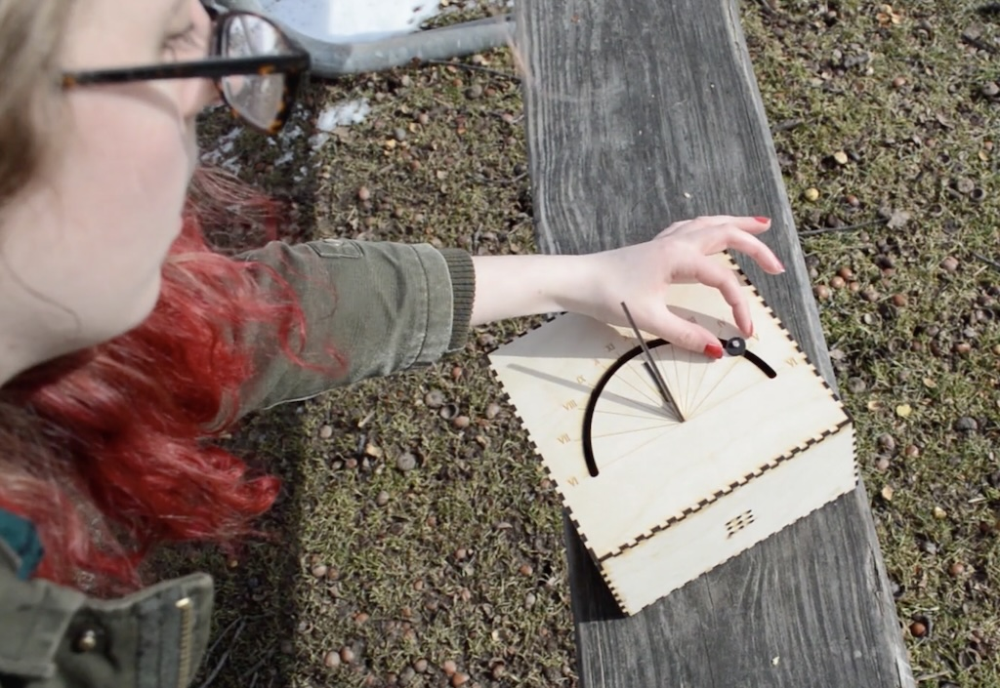

# Assignment Set #4

### Due Wednesday, September 25

--- 

The interactive and dynamic control of visual media over time is a core concern in new media arts. In this project, you are asked to create visualizations that display novel or unconventional representations of the time. This work is due at the beginning of class on Wednesday, September 25. You have **two weeks** to complete this work. As usual, please feel welcome to contact me via Discord by DM or in the `#haaalp` channel. 

This project has **4 main components**: 

1. *(15 minutes; 5%)* **[Looking Outwards](1-looking-outwards)**
2. *(60 minutes; 10%)* **[Readings and Viewings](2-readings-and-viewings)**
3. *(12 hours; 80%)* **[Make Ten Clocks](3-make-ten-clocks)**
4. *(15 minutes, 5%)* **[Document Your Work](document-your-work)**

The learning objectives of this project are:

* To become acquainted with the history of systems and devices for timekeeping
* To devise technologies and graphic concepts for representing time that go beyond conventional methods of visualization and mediation
* To refine your craft skills in the use of code to govern a spatiotemporal design, by effectively and expressively controlling shape, color, form, and motion.

*Note that we will have guest critics for your clock presentations on 9/25.*

---

## 1. Looking Outwards

*(15 minutes; 5%)* **Review** the timepieces listed in my [**Lecture on Clocks**](https://github.com/golanlevin/lectures/tree/master/lecture_clock) directory. Now, in the `#looking-outwards-3` Discord channel, **write** a couple of sentences about a clock that you find particularly memorable. Why does it stick with you? **Include** an image or screenshot of that project if possible.

Since you'll be creating a *collection* of clocks yourself, don't ignore the handful of artists and designers who have also created such collections: the [*12 O'Clocks*](https://github.com/golanlevin/lectures/tree/master/lecture_clock#software-clocks-i) collection by John Maeda; the [*24 Times*](https://24times.gysin-vanetti.com/) collection by Andreas Gysin; and the collection of [timepieces](https://cwandt.com/collections/time) created by Che-Wei Wang and Taylor Levy. *(I'm not asking you to write about these collections specifically; but of course you can if you want to. I just want to make sure you've looked them over.)*

---

## 2. Readings and Viewings

*(60 minutes; 10%)* You are asked to enrich your understanding of clocks and timekeeping by **reviewing** the following resources. These readings and viewings should take less an hour.

Attempts to mark time stretch back many thousands of years, with some of the earliest timekeeping technologies being gnomons, sundials, water clocks, and lunar calendars. Even today’s standard representation of time, with hours and minutes divided into 60 parts, is a legacy inherited from the ancient Sumerians, who used a sexagesimal counting system.

The history of timekeeping is a history driven by economic and militaristic desires for greater precision, accuracy, and synchronization. Every increase in our ability to precisely measure time has had a profound impact on science, agriculture, navigation, communications, and, as always, warcraft.

Despite the widespread adoption of technological standards, there are many other ways to understand time. *Psychological* time contracts and expands with attention; *biological* cycles affect our moods and behavior; *ecological* time is observed in species and resource dynamics; *geological* and *astronomical* rhythms can span millennia. In the twentieth century, Einstein’s theory of relativity further upended our understanding of time, showing that it does not flow in a constant way, but rather in relation to the position from which it is measured—a possibly surprising return to the significance of the observer.

Please **review** the following **5** resources:

* Please **read** this this [**5-page PDF about timekeeping**](readings/drucker_timekeeping.pdf) by design theorist Johanna Drucker, from her book *Graphesis: Visual Forms of Knowledge Production* (Harvard Press, 2014).
* Please **watch** this excellent 6-minute YouTube video on the [**History of Timekeeping Devices**](https://www.youtube.com/watch?v=SsULOvIWSUo).
* If you didn’t already see it in class, please **watch** the first 13 minutes of [**A Brief History of the Calendar and Timekeeping**](https://www.youtube.com/watch?v=OaYMK2n9Aow&t=4s), a YouTube lecture by [Dr. Donna Carroll](https://www.maastrichtuniversity.nl/dl-carroll), Lecturer of Physics, Maastricht University.
* **Browse** or **skim** the [**Wikipedia History of Timekeeping Devices**](https://en.wikipedia.org/wiki/History_of_timekeeping_devices).
* **Look** at [**https://yourcalendricalfallacyis.com/**](https://yourcalendricalfallacyis.com/). (It’s awesome!)

*Now:* In a Discord post in the `#timekeepingReadings` channel, please **write** two sentences about something that stuck with you from any of these readings/viewings. What did you see, read or learn that was interesting? Why was it interesting to you?

---

## 3. Make Ten Clocks

 *“Proposals for Clocks” by David Horvitz*

*(12 hours; 80%)* In OpenProcessing, make 10 different clocks. (Ten project slots have been created for you.) Note that your 10 timepieces are **not** expected to form a coherent collection. You are encouraged (but not required) to apply "special effort" (e.g. spend more time) on one of your clocks. 

Each timepiece should appear different at all times of the day, and should probably repeat its appearance every 24 hours (or other relevant cycle, if desired). You are invited to make the time legible through means other than Roman, Arabic, or Chinese numerals — such as by visualizing numeric bit patterns, or using iteration to present countable graphic elements. 

You will probably want to use the *[hour()](https://archive.p5js.org/reference/#/p5/hour), [minute()](https://archive.p5js.org/reference/#/p5/minute), [second()](https://archive.p5js.org/reference/#/p5/second)*, and *[millis()](https://archive.p5js.org/reference/#/p5/millis)* functions, but you’re also welcome to use *[day()](https://archive.p5js.org/reference/#/p5/day), [month()](https://archive.p5js.org/reference/#/p5/month)*, and *[year()](https://archive.p5js.org/reference/#/p5/year)* functions in order to build a clock that evolves over longer timescales. If your timepiece measures other phenomena, that’s fine too. You may choose the dimensions and aspect ratio of each clock as necessary, including fullscreen clocks. If your laptop screen does not inspire you, feel free to design a prototype clock display intended for a different display, such as a smart-watch or public outdoor screen.

You are encouraged to **question** basic assumptions about how time is represented. **Consider** things like biological time ([chronobiology](https://en.wikipedia.org/wiki/Chronobiology)), [ultradian rhythms](https://en.wikipedia.org/wiki/Ultradian_rhythm) and [infradian rhythms](https://en.wikipedia.org/wiki/Infradian_rhythm), solar and lunar cycles, celestial time, geological time, decimal time, historical time, [psychological time](http://cpl.revues.org/4998), and subjective time. (This list is not exclusive or exhaustive.) Remember to **sketch** first in your paper sketchbook.

[This sketch](https://openprocessing.org/sketch/2018166) demonstrates how to use the p5.js basic time functions: 

Here are some potentially helpful clock tutorials on YouTube: 

* Coding Train's [clock tutorial](https://www.youtube.com/watch?v=E4RyStef-gY)
* Patt Vira's [clock tutorial](https://www.youtube.com/watch?v=3Aa8CzklS6c)
* Xin Xin's [clock tutorial](https://www.youtube.com/watch?v=JgLlQPF22Gw)

---

## 4. Document Your Work

*(15 minutes, 5%)* In a Discord post in the channel `#timepiece`, concisely describe your 10 clocks in a bulleted list.

**Embed** 2-3 images of your best clock(s). Show what it looks like or how it behaves at different times of day. If your clock involves animation in a special way, embed an animated GIF or a brief video recording.

**Write** a couple sentences that describes your best clock (what is the concept, how is it made, how is a person meant to experience it). **Write** another few sentences reflecting on your experience making this work (what was successful, what was a struggle, what did you learn).

---

## CMU Student Projects

Below are some clocks made by former CMU students for this class: Lee Byron's [*Center Clock*]((https://leebyron.com/centerclock/)), 2007; and Caroline Hermans's [*Alarm Sundial*](https://vimeo.com/274997165), 2018.

