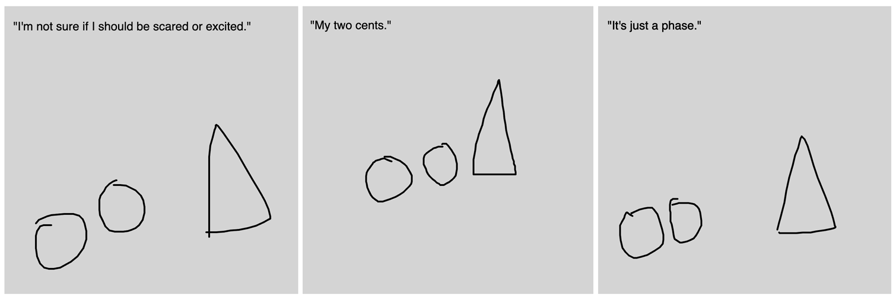

# Assignment Set #5

### Due Wednesday, October 2

This week, we begin to incorporate generative AI into our creative coding assignments. This set of deliverables has two components, which are due at the beginning of class on Wednesday 10/2:

* 5.1. [Canvas Describer](https://openprocessing.org/class/93074/#/c/94365) (15 minute exercise, 20%)
* 5.2. [LLM-Boosted Interaction](https://openprocessing.org/class/93074/#/c/94366) (main project, 2-4 hours, 80%)

--- 

## 5.1 (Exercise): Canvas Describer

*(20% - 15 minutes)* In this brief exercise, you're asked to modify a simple example sketch in a hopefully interesting way. This is intended to be a quick exercise to make sure you're able to work with the Google Gemini API.  

[**This demonstration program**](https://openprocessing.org/sketch/2369075) asks the user to make a drawing on the p5 canvas; it transmits the canvas to the [Google Gemini AI](https://ai.google.dev/gemini-api/docs) for analysis; and then it asks Gemini to generate a text response to that image — conditioned by a hard-coded text prompt in the p5.js code. *Now*, do the following: 

* **Create** a Google AI Studio developer test API key, using these instructions: 
  1. Go to the [Google AI Studio website](https://ai.google.dev/aistudio)
  2. Sign in with your Google account
  3. Navigate to the API Keys section (the blue "Get API Key" button on the top left)
  4. Click on the "Create API Key" button
  5. Follow the prompts to create a new project or select an existing one.
  6. Enable the Gemini API for your project.
  7. Copy the generated API key and paste it into the "API KEY" input field in the web application.
  8. Note: Make sure to keep your API key secure and avoid sharing it publicly.
* **Create** a simple riff of [**this demonstration program**](https://openprocessing.org/sketch/2369075) by forking this sketch and changing the prompt. You're welcome to modify the graphics and/or interaction code if you wish, but that's not required for this small exercise. 
* **Upload** your project to [this collection](https://openprocessing.org/class/93074/#/c/94365) in our OpenProcessing classroom ("5.1. Canvas Describer"). 
* In the Discord channel `#05-canvas-describer`, **paste** your revised prompt, and **embed** a few screenshots of your program in use. **Write** a sentence or two about other things you tried, critical reflection, etc. 

---

## 5.2 (Project) LLM-Boosted Interaction

*(80% - 3-4 hours)* In this project, you are asked to **make** an app in p5.js that uses the Google Gemini API to do something interesting.

It helps to understand what's possible! Please **browse** the [Google Gemini API documentation](https://ai.google.dev/gemini-api/docs/). Observe how the Gemini AI is able to do things like: 

* [Describe, summarize, and answer questions about text](https://ai.google.dev/gemini-api/docs/document-processing?lang=python#upload-document)
* [Describe, summarize, and answer questions about an image](https://ai.google.dev/gemini-api/docs/vision?lang=python#upload-image)
* [Provide the bounding box for an object in an image](https://ai.google.dev/gemini-api/docs/vision?lang=python#bbox)
* [Describe, summarize, and answer questions about audio](https://ai.google.dev/gemini-api/docs/audio?lang=python#upload-audio)
* [Provide a transcription of audio](https://ai.google.dev/gemini-api/docs/audio?lang=python#transcript)

The pandora's box of Gemini+p5 has been cracked open by [Amit Pitaru](https://pitaru.com/), [Alexander Chen](https://www.chenalexander.com/Bio), and [Trudy Painter](https://www.trudy.computer/), who all work at Google's Creative Lab in NYC. **Check out** the examples below to see how they and others have used Google's Gemini AI to make interesting interactions in p5.js. *This is not an exhaustive list of techniques or possibilities!*

* [*Gemini API starter examples*](https://x.com/pitaru/status/1819797112399511625) by Amit Pitaru: Gemini AI describes p5.js canvas. [Minimal Demo](https://editor.p5js.org/pitaru/sketches/Ixu00bucD); [Version with instructions](https://editor.p5js.org/pitaru/sketches/NSAqfrdJY).
* [*One Line, One Word*](https://editor.p5js.org/alexanderchen/sketches/UIPy0LXjm) by Alexander Chen. The AI poetically describes the quality of a line. ([Tweet](https://x.com/alexanderchen/status/1819939988676440241))
* [*Stick Figure Theater*](https://editor.p5js.org/alexanderchen/sketches/ndd3oqln2) by Alexander Chen. Draw a character; the AI returns a line of dialogue. ([Tweet](https://x.com/alexanderchen/status/1821011074658828481))
* [*Word sorter*](https://editor.p5js.org/trudypainter/sketches/cSN7DNnWG) by [Trudy Painter](https://www.trudy.computer/). A text analyzer that organizes words along user-defined spectra. ([Tweet](https://x.com/trudypainter/status/1820555477455167900))
* [*Grow a Seed*](https://editor.p5js.org/pitaru/sketches/z7Cq3HEtjo) AI-collaborative drawing tool by Amit Pitaru. The AI analyzes the canvas, and returns working p5.js code (!!) to enhance it. ([Tweet](https://x.com/pitaru/status/1821310018198642867))
* [*Crappy gaze Estimation*](https://editor.p5js.org/golan/sketches/sktetHnz8) by Golan. The AI tries to estimate which direction the eye is looking.
* [*Life's biggest questions*](https://editor.p5js.org/ttarigh/sketches/oibptLN-L) by ttarigh. Responds to all questions with a single, profound word. ([Tweet](https://x.com/tinaz0ne/status/1824153041597239433))
* [*Let's Dance*](https://editor.p5js.org/pitaru/sketches/-ujxN6JUr) by Amit Pitaru. The user draws a path for a blue dot; Gemini provides path coordinates for a red dot. ([Tweet](https://x.com/pitaru/status/1822453415013650768))

Please note that you might need to modify the code of `geminiAPI.js` in order to implement a concept with unusual functionality. *Also, please note that while it is possible to [enable reduced content safety settings in Google Gemini](https://ai.google.dev/gemini-api/docs/safety-settings#safety-filtering-per-request), your projects should still adhere to our Syllabus [Code of Conduct guidelines](https://github.com/golanlevin/60-212/blob/main/2024/syllabus/60-212_syllabus_fall2024.md#code-of-conduct).* 

*Now*: 

* **Create** an app in p5.js that uses the Google Gemini API to do something interesting.
* **Post** your app to the "5.2. LLM-Boosted Interaction" [collection in OpenProcessing](https://openprocessing.org/class/93074/#/c/94366). 
* In the Discord channel `#05-llm-app`, **describe** your project, and **embed** a few screenshots (or an animated GIF, or an unlisted YouTube video) of your program in use. **Write** a sentence or two of critical reflection about your project and/or process.

