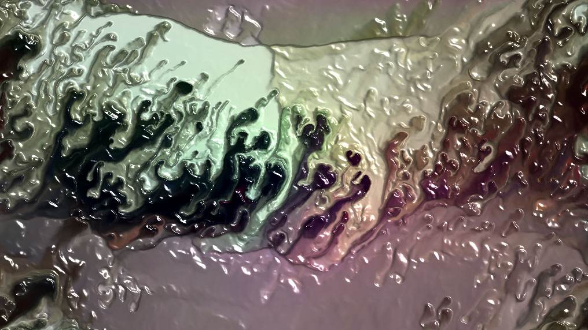
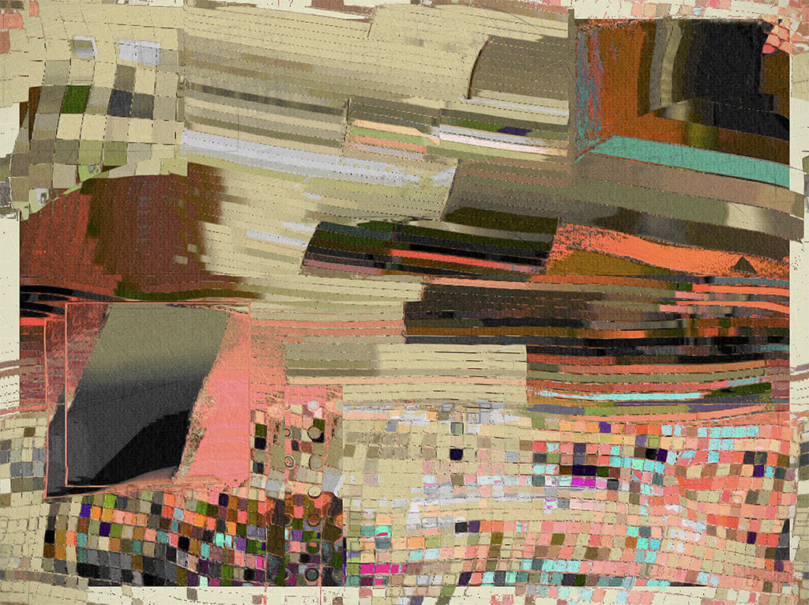
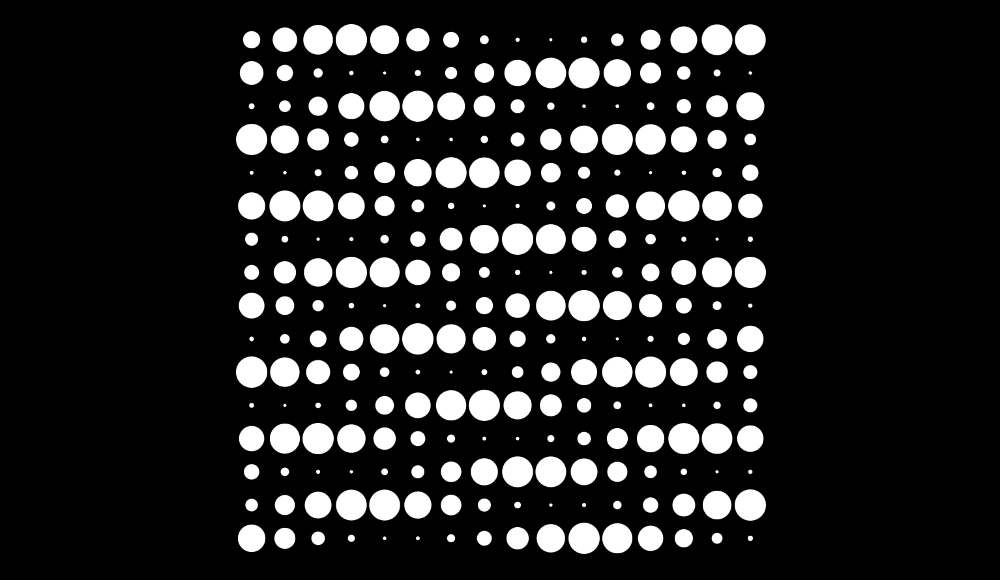

# Assignment Set #7

## Generative Art, Pixel Logics & Shaders

In this assignment, we turn our attention to the manipulation of **pixels** — including the type of "**data-parallel computing**", also known as SIMD (Single Instruction, Multiple Data) processing, that is used in GPU shaders.

This assignment is due in several parts. The first portion — just some light internet browsing — is due upon return from Fall Break, at the beginning of class on **Monday October 21**: 

* 7.1. [Looking Outwards: Shaders](#71-looking-outwards-shaders) *(10%, 30 minutes)*
* 7.2. [Looking Outwards: Generative Art](#72-looking-outwards-generative-art) *(10%, 30 minutes)*
* 7.3. [Tixy.land](#73-tixyland) *(5%, 10 minutes)*

Parts 7.4, 7.5, 7.6, and 7.7 are **due Monday 10/28** and are [described here](assignment_7b.md): 

* 7.4. [Animated Composition for Flipdot Display](assignment_7b.md#74-animated-composition-for-flipdot-display) *(10%, 30 minutes)*
* 7.5. [Custom "Pixel": Camera, Color, Nested Iteration](assignment_7b.md#75-custom-pixel-camera-color-nested-iteration) *(15%, 1.5 hours)*
* 7.6. [Generative Modular Composition: Hexagonal Truchet Tiles](assignment_7b.md#76-generative-composition-hexagonal-truchet-tiles) *(25%, 2 hours)*
* 7.7. [Shader Composition](assignment_7b.md#77-shader-composition) *(25%, 2 hours)*

---

## 7.1. Looking Outwards: Shaders

*(10%, 30 minutes, due 10/21)* "Shaders" are special programs that can do fast and powerful things with pixels. Shaders are executed on your computer's GPU rather than its CPU, and use a C-like language called GLSL. Each pixel on your screen executes the GLSL shader program, *in parallel*.

* **Spend 20 minutes browsing** the demos on [Shadertoy](https://www.shadertoy.com/), a website that showcases shaders created by contributors from all over the world. **Observe** how the code for each shader is displayed (and editable). Many of the programs there are technical demonstrations rather than artworks; noting this, **try** out different search terms in the Shadertoy search field, such as: *voronoi*, *fractal*, *oklab*, *emboss*, *fluid*, *warp*, *raymarching*, *hdr*, *cloud*, *noise*, etc. 
* **Select** one shader that interests you. In the Discord channel `#07-shadertoy`, **provide** a link to the shader's URL, **write** a sentence about what you found interesting about it, and another sentence sharing an observation of the code that produced it. **Include** a screenshot of the shader. 

---

## 7.2. Looking Outwards: Generative Art

 <small>*William Mapan*</small>

*(10%, 30 minutes, due 10/21)* Below are some collections of generative artworks. Each page presents variations produced by a single piece of software-art. **Browse** these pages and **select** a project you like (or which appeals to you more than the others). In the Discord channel `#07-generative-art`, **provide** a link to the project's URL; **write** a sentence about what you found interesting about it; and **include** an image of the artwork.

Note: many of these artworks are dynamic and/or interactive, and some allow you to generate new results beyond the ones already generated. On the [fxhash.xyz](https://www.fxhash.xyz/) website, look for the following buttons, which will allow you to experience some projects in real-time: 

* [*Forecast*](https://www.fxhash.xyz/generative/25151) by [Amy Goodchild](https://www.amygoodchild.com/about)
* [*nth culture*](https://deca.art/collection/nth-culture-by-fingacode) by [Fingacode (Junior Ngoma)](https://www.youtube.com/watch?v=2Lero3In5uc)
* [*horizon(te)s*](https://www.fxhash.xyz/marketplace/generative/16217) by Iskra Velitchkova & Zach Lieberman
* [*Cone Gradients*](https://verse.works/series/color-gradient-study-by-zach-lieberman) by Zach Lieberman
* [*Garden, Monoliths*](https://www.fxhash.xyz/generative/2969) by Michaël Zancan
* [*Coronado*](https://www.fxhash.xyz/generative/slug/coronado) by jeres
* [*monogrid 1.1 CE*](https://www.fxhash.xyz/generative/13944) by Kim Asendorf
* [*Smooth Steps*](https://www.fxhash.xyz/generative/25393) by Andreas Gysin (ertdfgcvb)
* [*Blokkendoos*](https://www.fxhash.xyz/generative/slug/blokkendoos) by Piter Pasma
* [*September*](https://www.fxhash.xyz/marketplace/generative/20000) by [Tea Boswell](https://www.fxhash.xyz/u/teaboswell)
* [*Take Wing*](https://www.fxhash.xyz/generative/slug/take-wing) by [Melissa Wiederrecht](https://melissawiederrecht.com/)
* [*Zbageti*](https://www.fxhash.xyz/generative/17737) by Melissa Wiederrecht • p5js
* [*Cosmic Rays*](https://verse.works/series/cosmic-rays-by-melissa-wiederrecht) by Melissa Wiederrecht
* [*Growth v02*](https://www.fxhash.xyz/generative/slug/growth-v02) by [Robert Hodgin](https://roberthodgin.com/) (flight404)
* [*Miniscapes*](https://www.fxhash.xyz/generative/slug/miniscapes-1) by Rich Poole & ThePaperCrane
* [*Genomes*](https://www.fxhash.xyz/generative/slug/genomes) by ciphrd & znah
* [*Barbarians*](https://verse.works/series/barbarians-by-jacek-markusiewicz) by Jacek Markusiewicz
* [*Mediterranean*](https://www.fxhash.xyz/generative/slug/mediterranean) by kira0 • p5js
* [*Turner Light*](https://www.fxhash.xyz/generative/slug/turner-light) by Aluan Wang (ileivoivm) • p5js
* [*Equinox*](https://verse.works/series/equinox-by-aluan-wang) by Aluan Wang (ileivoivm) 
* [*Rough Cuts*](https://www.fxhash.xyz/generative/16152) by [VolatileMoods](https://www.fxhash.xyz/u/Volatile%20Moods)
* [*Gerhard*](https://www.fxhash.xyz/generative/slug/gerhard) by Richard Nadler & Leander Herzog
* [*De/FragV2*](https://www.fxhash.xyz/generative/slug/defragv2) by Karsten Schmidt (Toxi)
* [*Strands of Solitude*](https://verse.works/series/strands-of-solitude-by-william-mapan) by William Mapan
* [*Distance*](https://opensea.io/collection/distance-by-william-mapan-lacma) by William Mapan
* [*Anticyclone*](https://www.artblocks.io/curated/collections/anticyclone-by-william-mapan?tab=Artworks) by William Mapan
* [*I'm Feeling Lucky*](https://verse.works/series/im-feeling-lucky-by-maya-man-1) by Maya Man
* [*FAKE IT TILL YOU MAKE IT*](https://www.artblocks.io/curated/collections/fake-it-till-you-make-it-by-maya-man?tab=Artworks) by Maya Man
* [*Fidenza*](https://www.artblocks.io/curated/collections/fidenza-by-tyler-hobbs?tab=Artworks) by Tyler Hobbs
* [*Archetype*](https://verse.works/series/archetype-by-kjetil-golid) by Kjetil Golid
* [*Risk / Reward*](https://verse.works/series/risk--reward-by-kjetil-golid) by Kjetil Golid
* [*Petro National*](https://verse.works/series/petro-national-by-john-gerrard-2) by John Gerrard
* [*Paperwork*](https://verse.works/series/paperwork-by-ana-maria-caballero) by Ana María Caballero
* [*Trossets*](https://verse.works/series/trossets-by-anna-carreras) by Anna Carreras
* [*Subscapes*](https://verse.works/series/subscapes-by-matt-deslauriers) by Matt DesLauriers
* [*Fragments of an Infinite Field*](https://www.artblocks.io/curated/collections/fragments-of-an-infinite-field-by-monica-rizzolli?tab=Artworks) by Monica Rizzolli • p5js
* [*Memories of Qilin*](https://www.artblocks.io/curated/collections/memories-of-qilin-by-emily-xie?tab=Artworks) by Emily Xie • p5js
* [*Vvttmmnn*](https://www.behance.net/gallery/79529337/vvttmmnn) by Manolo Gamboa Naon
* [*Linea*](https://verse.works/series/linea-by-stuart-batchelor) by Stuart Batchelor
* [*Geometry Runners*](https://www.artblocks.io/curated/collections/geometry-runners-by-rich-lord?tab=Artworks) by Rich Lord
* [*Naive*](https://www.artblocks.io/curated/collections/na%C3%AFve-by-olga-fradina?tab=Artworks) by Olga Fradina
* [*923 Empty Rooms*](https://www.artblocks.io/curated/collections/923-empty-rooms-by-casey-reas?tab=Artworks) by Casey Reas
* [*Gumbo*](https://www.artblocks.io/curated/collections/gumbo-by-mathias-isaksen?tab=Artworks) by Mathias Isaksen
* [*Memories of Digital Data*](https://www.artblocks.io/curated/collections/memories-of-digital-data-by-kazuhiro-tanimoto?tab=Artworks) by Kazuhiro Tanimoto
* [*Screens*](https://www.artblocks.io/curated/collections/screens-by-thomas-lin-pedersen?tab=Artworks) by Thomas Lin Pedersen
* [*Ceramics*](https://www.artblocks.io/curated/collections/ceramics-by-charlotte-dann?tab=Artworks) by Charlotte Dann
* [*Fontana*](https://www.artblocks.io/curated/collections/fontana-by-harvey-rayner-%7C-patterndotco?tab=Artworks) by Harvey Rayner
* [*Primitives*](https://www.artblocks.io/curated/collections/primitives-by-aranda-lasch?tab=Artworks) by Aranda\Lasch
* [*Running Moon*](https://www.artblocks.io/curated/collections/running-moon-by-licia-he?tab=Artworks) by Licia He
* [*Alan Ki Aankhen*](https://www.artblocks.io/curated/collections/alan-ki-aankhen-by-fahad-karim?tab=Artworks) by Fahad Karim
* [*Loom*](https://verse.works/series/loom-by-anna-lucia) by Anna Lucia

---

## 7.3. Tixy.Land

*Most of you already completed this on Wednesday October 9th, but I just want to make sure everyone has done it. This exercise is intended as play, and will be 'checked', but not critiqued.*

*(5%, 10 minutes, due 10/21)* In this very lightweight exercise, we get our first exposure to "data-parallel computing", or "SIMD (Single Instruction, Multiple Data) processing", wherein the same operation is applied to multiple data points (pixels) simultaneously. We will use [**Tixy.land**](https://tixy.land/), a tiny online environment for JavaScript code golfing in which you will write a tiny program that is applied to a 16x16 grid of pixels. In Tixy, each "pixel" executes a common program whose only inputs are the current time (T), its index (I), and its X and Y coordinates.  

If you haven't already done so: spend a few minutes **experimenting** with the creative coding toolkit at [https://tixy.land](https://tixy.land/). When you feel like you've made something appealing, **paste** the URL of your creation in the Discord channel, `07-tixyland`. Feel free to describe your project with an optional title. 

---

## *MORE TBA.*

