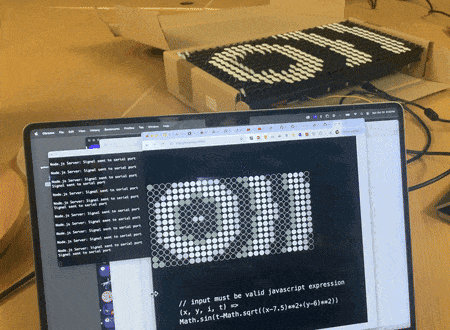
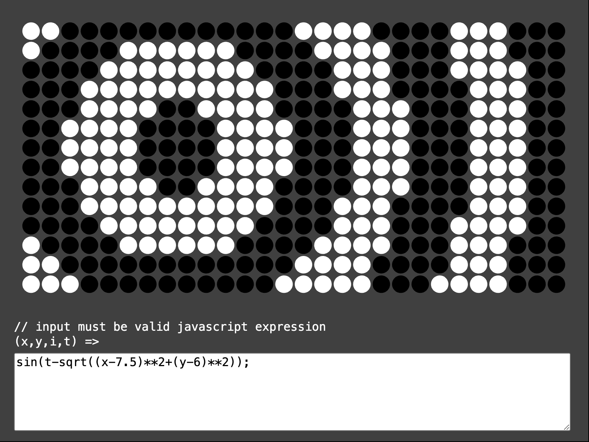
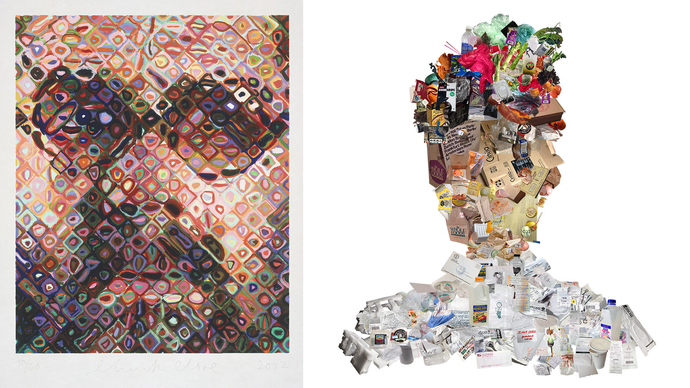
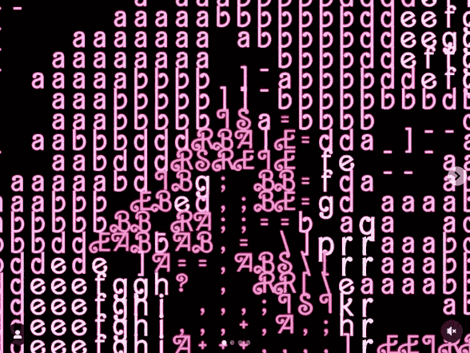
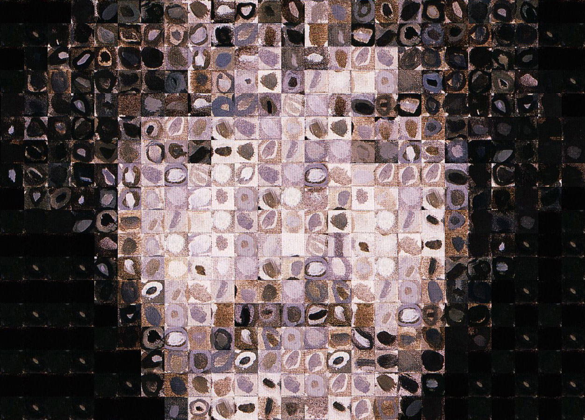
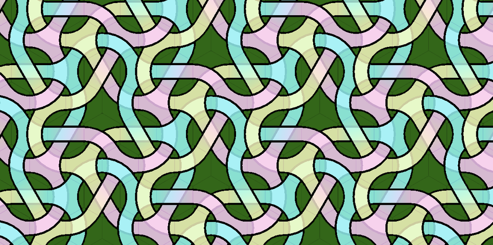

# Assignment Set #7B

## Pixel Logics, Modular Imaging, Shaders, and Generative Art

In this assignment, we turn our attention to the manipulation of **pixels** ("picture elements") — including the type of "**data-parallel computing**", also known as SIMD (Single Instruction, Multiple Data) processing, that is used in GPU shaders.

The first three exercises in Assignment 7 were due Monday 10/21 and described [here](https://github.com/golanlevin/60-212/blob/main/2024/assignments/assignment_7.md):

* 7.1. [Looking Outwards: Shaders](https://github.com/golanlevin/60-212/blob/main/2024/assignments/assignment_7.md#71-looking-outwards-shaders) *(10%, 30 minutes)*
* 7.2. [Looking Outwards: Generative Art](https://github.com/golanlevin/60-212/blob/main/2024/assignments/assignment_7.md#72-looking-outwards-generative-art) *(10%, 30 minutes)*
* 7.3. [Tixy.land Experimentation](https://github.com/golanlevin/60-212/blob/main/2024/assignments/assignment_7.md#73-tixyland) *(5%, 10 minutes)*

The remaining portions of Assignment 7 are due Monday 10/28: 

* 7.4. [Animated Composition for Flipdot Display](#74-animated-composition-for-flipdot-display) *(10%, 30 minutes)*
* 7.5. [Custom "Pixel": Camera, Color, Nested Iteration](#75-custom-pixel-camera-color-nested-iteration) *(15%, 1.5 hours)*
* 7.6. [Generative Modular Composition: Hexagonal Truchet Tiles](#76-generative-composition-hexagonal-truchet-tiles) *(25%, 2 hours)*
* 7.7. [Shader Composition](#77-shader-composition) *(25%, 2 hours)*

---

## 7.4. Animated Composition for Flipdot Display

*(10%, 20 minutes) Using SIMD code, design an animation for a flipdot display.*



Thanks to the [outstanding assistance](https://github.com/yonmaor1/p5-flipdots) of CMU Engineering + Art senior, [Yon Maor](https://www.linkedin.com/in/yonmaor/), with Microgrant support from the [Frank-Ratchye Further Fund](https://studioforcreativeinquiry.org/frff-grants-microgrants), and with inspiration from [Tixy.land](https://tixy.land/), we are now able to control a 28x14 pixel flipdot display! We are using an Alfa-Zeta XY5 Dot Matrix Display from [flipdots.com](https://flipdots.com/en/home/). This unit costs around $500 and can produce animations at 15 frames per second; at airports, many of them are combined together to make big displays. You can see a good-quality video of the device [here](https://www.andbc.co/media/flipdot-1.mp4). *Now:*

* **View** the following two artworks by Andreas Gysin & Sidi Vanetti: [*Digits 2*](https://vimeo.com/218010040), and [*Dots 4*](https://vimeo.com/160749809). If you like this work, feel free to check out [this interview with the artists](https://verse.works/journal/verse-meets-andreas-gysin-sidi-vanetti), and some [related work by BreakfastNY](https://breakfaststudio.com/works/tides).
* **Study** the screenshot below, and our flipdot [control software here](https://openprocessing.org/sketch/2405498). **Observe** how there is a text field for composing a JavaScript expression. The expression controls the value of each pixel in the display, based on its `x`, `y`, `i` (index), and `t` (time, counted using `frameCount`). The expression must produce values that are either greater than zero (for *white*), or less-than-or-equal-to zero (for *black*).
* Here are some examples of programs that show off some features — **try** them out. **Observe** that you have access to the p5.js math functions, such as `noise()`. 
	* `sin(t-sqrt((x-7.5)**2+(y-6)**2));` // p5's trig functions
	* `noise (x/10.0, y/10.0, t/10.0) - 0.5;` // p5's 3D Perlin noise
	* `((t+x)^y)%9;` // a very compact generator!
	* `random() < 0.02;` // low probability events 
* **Tinker** and **devise** one or two different expressions whose results you like. Your results must depend in some way on `t` — that is, they must be time-based or animated. (Consider that the display produces sound as well as image!) We'll have some time to test out your ideas in class on Wednesday. 
* **Paste** your JavaScript expression in the Discord channel, *#07-flipdot-composition*. **Include** a screenshot or animated GIF. Your exercise will be presented on the display in a public exhibition later this semester, in a looping sequence with the other students' exercises.



---

## 7.5. Custom Pixel: Camera, Color, Nested Iteration

<br /><small>Chuck Close; Jenny Odell</small>

*(15%, 90 minutes) Pixels are the fundamental building blocks of digital bitmap images. In this project, you will write code to interpret live video using “custom picture elements” of your own devising. These could be (for example) ASCII letters, emoji, combinations of graphic elements in the manner of painter [Chuck Close](https://walkerart.org/collections/artworks/self-portrait-slash-woodcut), or collaged pieces of garbage (in the manner of [Jenny Odell](https://www.jennyodell.com/garbage.html)). (Can you break out of the grid? Can your picture elements be "intelligent"? Can you use graphics primitives in an interesting way?)*


The following code demonstrates how to set up a video camera feed, and how to access the colors at a specified pixel location. You might want to research the following terms in the p5 reference: [get()](https://archive.p5js.org/reference/#/p5/get), and [loadPixels()](https://archive.p5js.org/reference/#/p5/loadpixels). Note, my screenshot above was created with a [template project by Dan Shiffman](https://openprocessing.org/sketch/2405701), which creates "custom pixels" by modifying the sizes of white squares. What will *your* custom pixel look like?

```
let capture;
function setup() {
  createCanvas(640, 480);
  capture = createCapture(VIDEO);
  capture.hide();
}

function draw() {
  background(255);
  capture.loadPixels(); 
  tint(255,255,255, 90); // this fades out the video
  image(capture, 0, 0); // comment this out soon!

  let px = mouseX; 
  let py = mouseY;
  let pixelCol = capture.get(px, py); 
  fill(red(pixelCol), green(pixelCol), blue(pixelCol)); 
  strokeWeight(10);
  circle(px, py, 100); 
}
```

Note that `capture.get()` is easy to understand, but runs rather slowly. For better performance, I recommend that you directly access the camera's `pixels` (array of bytes), as shown in [Shiffman's template](https://openprocessing.org/sketch/2405701) and in the following fragment. The code is slightly trickier to write, but your app will run 10x faster.

```
capture.loadPixels();   // do once per frame
let pix = capture.pixels; // do once per frame

let index = (py*capture.width + px)*4; 
// multiplied by 4 'cuz each RGBA pixel has 4 bytes!

let r = pix[index+0]; // red byte
let g = pix[index+1]; // green byte
let b = pix[index+2]; // blue byte
```

For additional instruction, see this Coding Train tutorial on [ASCII video](https://www.youtube.com/watch?v=55iwMYv8tGI) and [fetching color values from images](https://www.youtube.com/watch?v=0V3uYA1hafk); this [tutorial by Xin Xin](https://www.youtube.com/watch?v=aza-3oZjY4g); or this [tutorial by Zach Whalen](https://www.youtube.com/watch?v=8geaKSvovoA).

*Now*: 

* **Browse** the inspirational materials below.
* **Create** a p5.js program that interprets the camera using custom picture elements. (You are *not* expected to use shaders for this assignment.)
* **Upload** your project to the [corresponding assignment in our OpenProcessing classroom]().

### Viewings:

In 2023, Alida Sun published this [dopamine dazzle camouflage](https://www.instagram.com/p/Cwh1qectmVN/?img_index=1) inspired by Eva María Rey Pinto’s research on Mattel’s military alliance:



Ken Knowlton and Leon Harmon’s "[Studies in Perception #1](https://spalterdigital.com/artworks/nude-3/)" (1966) is a mosaic of small scientific symbols, arranged into a nude. It appeared on the front page of the New York Times in 1967—introducing computer art to a broad American public for the first time. 


Knowlton continued creating computational image mosaics for several decades; he made a [landmark typographic piece](https://spalterdigital.com/artworks/united-nations-declaration-of-human-rights/) (1970), and here's his "This is Not a Teapot" (1998):


**Daniel Rozin** hand-crafts pixels from every material imaginable. His "Peg Mirror" (2007) consists of 650 individually motorized wooden pegs. As they rotate, the pegs catch light, recreating video from a central camera. Check out some of his other creations: [Wooden Mirror](https://vimeopro.com/bitforms/rozin/video/101408845), [Peg Mirror](https://vimeo.com/7709408), [Shiny Balls Mirror](https://vimeo.com/57244184), [Brushed Steel Mirror](https://vimeopro.com/bitforms/rozin/video/57630829), [Weave Mirror](https://vimeopro.com/bitforms/rozin/video/7067089), [Penguins Mirror](https://vimeopro.com/bitforms/rozin/video/129674054), and [plenty more](https://vimeopro.com/bitforms/rozin/page/1).


Scott Blake’s "[Chuck Close Filter](http://www.barcodeart.com/artwork/portraits/chuck_close/index.html)" software (2001) transforms any image into the pixelated style of a Chuck Close painting—using image tiles *extracted from actual Chuck Close paintings*. Following its release, Close threatened Blake with legal action, asserting that the software trivialized his art and threatened his livelihood.



Image treatment by A.L. Crego (2023). Note the purposeful alignment of facial and geometric features.


What could it mean for your custom pixels to become more "intelligent"? Well, they could be *responsive* to the image content (such as edges, local variance, ...face tracking, etc.). For example, here is a [quadtree-based image filter](https://github.com/fogleman/Quads) by Michael Fogleman, which is responsive to the amount of detail in each region of the image. Fogleman writes: 

> *"Each node in the quadtree is filled in with the average color of its region in the input image. A score is computed for each node based on its mean squared error and its area. The node with the highest error is split into four child nodes. This process is repeated as many times as desired. Detailed regions will be recursively refined while low contrast regions will remain as larger nodes."*


---

## 7.6. Generative Composition: Hexagonal Truchet Tiles

The purpose of this exercise is to strengthen your skills in generative form-making with modular (pixel-like) design elements.

> *Making procedural patterns is a mental exercise in finding minimal reusable elements. This practice is old; we as a species have been using grids and patterns to decorate textiles, floors and borders of objects for a long time: from meander patterns in ancient Greece, to Chinese lattice design, the pleasure of repetition and variation catches our imagination. Take some time to look at decorative patterns and see how artists and designers have a long history of navigating the fine edge between the predictability of order and the surprise of variation and chaos. From Arabic geometrical patterns, to gorgeous African fabric designs, there is an entire universe of patterns to learn from.* — From the [*Book of Shaders*](https://thebookofshaders.com/09/) by Patricio Gonzalez-Vivo & Jen Lowe.


<br /><small>From [*Duotone Truchet-Like Tilings*](http://cambolbro.com/graphics/duotone/), by Cameron Browne</small>

Now: 

* **Read** this chapter from the book [*10 PRINT*](readings/10_print_excerpt.pdf): Chapter 30, pp. 64-81 by Nick Montfort et al. [6MB PDF](readings/10_print_excerpt.pdf).
* **Create** a computationally-generated artwork using hexagonal Truchet tiling patterns—in which larger-scale structures appear to emerge from the arrangement of modular elements. You can work in GLSL if you feel up to it, but I anticipate most students will develop this project in p5.js. 
* **Upload** your project to the [corresponding assignment in our OpenProcessing classroom]().
* **Remember**, your project must **satisfy** the following requirements: 
  1. **No square grids!** You're expected to implement a hexagonal tiling. (Masochists should check out these [methods for tiling the Euclidean plane with convex regular polygons](https://en.wikipedia.org/wiki/Euclidean_tilings_by_convex_regular_polygons).  
  2. **Larger visual structures should appear to emerge** from relationships between adjacent tiles. The point isn't just to make a [jumble of random hexagonal tiles](images/hexagon-multicolor.jpg).
  3. **Generate a new composition when the user clicks.**

Some potentially helpful videos are here: 

* Tutorial on [**Truchet tiling in p5.js with Hexagons**](https://www.youtube.com/watch?v=Qwb2VYrN-us)
* Tutorial on [Truchet tiling in p5.js with Squares](https://www.youtube.com/watch?v=99Hr8lpWWSg)
* Tutorial on [Truchet tiling in p5.js with Octagons](https://www.youtube.com/watch?v=tv2DgZ9dRzY)
* Tutorial on [Truchet tiling in GLSL](https://www.youtube.com/watch?v=2R7h76GoIJM)


<br /><small>*Designs by Peter Kagey and Steven Dollins.*</small>


---

## 7.7. Shader Composition

Here is some shader template code: 

* [Simple shader with uniforms](https://openprocessing.org/sketch/2405238) at OpenProcessing
* [Shader interpreting BMWalker](https://openprocessing.org/sketch/2405195) at OpenProcessing

Now, 

* **Fork** one of these template projects. 
* **Create** a composition tha


