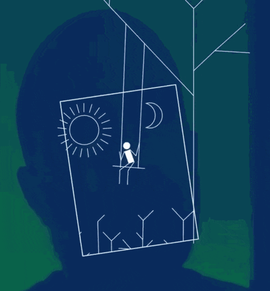
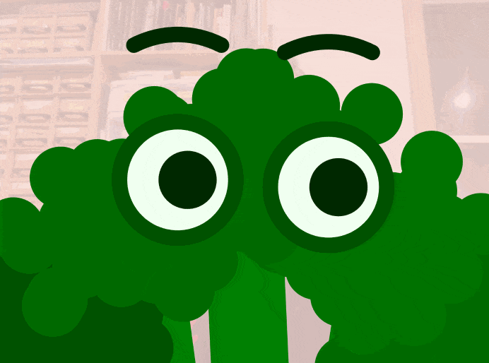
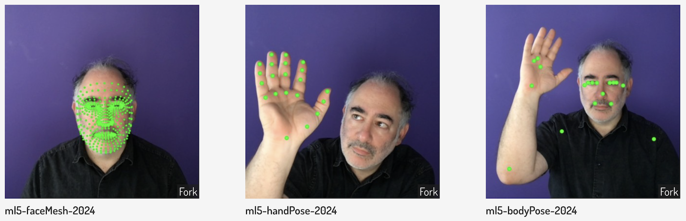

# Assignment Set #8

### Gesture Expander: Tracking and Augmenting the Body/Face/Hands

*This project is due* **Monday, November 4th.** *Please note that the due date has been moved from 11/6 to 11/4, in case Election Day proves to be too stressful or distracting.*

 <small>From *Más Que la Cara* by Zach Lieberman, 2017</small>

---

*(11 hours, due Monday 11/4)* For this project, you are asked to make and document software which creatively interprets, uses, or responds to the actions and gestures of the body, face, or hands. *In other words:* develop an interesting treatment of real-time data captured (with a camera) from a person’s face, hands, or other body parts. 

You might make a costume or a puppet; if you do, 
consider whether your treatment is a form of entertainment, or whether it serves a ritual purpose, a therapeutic purpose, a practical purpose, or something else. It could be a costume that allows you to assume a new identity, inhabiting something nonhuman or even inanimate.  It could interact with a simulated environment with articulated parts and dynamic behaviors. It may blur the line between self and others, or between self and not-self. *Note, however: you are not limited to costumes or puppets!* You can create a game; your project could be a musical instrument; it could be a drawing tool; it could be an abstract visual composition; it could be a tool for analyzing and visualizing human movement. Be prepared to explain your creative decisions. 

To share your project in documentation, you are asked to record a short video in which you use it. Design your software for a specific "performance" or "demonstration", and plan your recording with your software in mind. Rehearse and record your performance/demonstration. 

*Now:*

* **Read** (5%) Zach Lieberman's [*Más Que la Cara* Overview](https://zachlieberman.medium.com/m%C3%A1s-que-la-cara-overview-48331a0202c0) (2017). It's a nice writeup about a face-tracking project, from conceptualization to execution, art to tech. Then, in the Discord channel, `#08-reading-response`, **write** a sentence about something you observed or found interesting in the project. This is an estimated 12-minute reading.
* **Create** (60%) your project using p5.js. Some links to code for template projects are provided below. **Upload** your project to the [corresponding slot](https://openprocessing.org/class/93074/#/c/94715) in our OpenProcessing classroom.
* **Enact** a brief demonstration or performance that makes use of your software. Be deliberate about how you perform, demonstrate, or use your software. **Consider** how your demo-performance should be tailored to your software, and your software should be tailored to your performance. (It may help to write a script for your performance or demo narration.)
* **Document** (25%) your demonstration or performance by making a video recording that is at least 15 seconds long. Store this in an *Unlisted* (not Private) video on YouTube or Vimeo. 
* **Write** (10%) a post in the `#08-gesture-expander` channel on Discord. **Include** the link to your video. **Include** about 100 words (3-5 sentences) that explain and evaluate your project. **Include** at least two screenshots in your Discord post.

---

## Code Resources

For this project, we will use the [ml5.js templates](https://docs.ml5js.org/#/) for [face](https://docs.ml5js.org/#/reference/facemesh), [body](https://docs.ml5js.org/#/reference/bodypose), and [hand](https://docs.ml5js.org/#/reference/handpose) tracking, which are built on top of the Google MediaPipe tracking library. I have ported these to OpenProcessing so that you can easily fork/work on your projects there. 

**NOTE**: *If you need a template that supports multiple interaction modalities simultaneously, talk to the professor about possibilities.*

### Starter template code: 

* **Face**: [ml5-faceMesh-2024](https://openprocessing.org/sketch/2417226)
* **Hand**: [ml5-handPose-2024](https://openprocessing.org/sketch/2417093)
* **Body**: [ml5-bodyPose-2024](https://openprocessing.org/sketch/2417039)
* **Expressions**: [MediaPipe-FaceMetrics-2024](https://openprocessing.org/sketch/2066195)
* **Microphone**: [p5-Microphone-Demos-2024](https://openprocessing.org/sketch/2189436)

### Some simple demonstrations: 

* [ml5-BodyBroccoli-2024](https://openprocessing.org/sketch/2187655)
* [ml5-Mask-2024](https://openprocessing.org/sketch/2187420)
* [BigMouth-2024](https://openprocessing.org/sketch/2071101)
* [FaceExtractor-2024](https://openprocessing.org/sketch/2195649)
* [ml5-HandPuppet-2024](https://openprocessing.org/sketch/2187485)
* [ml5-handPose+Matter-2024](https://openprocessing.org/sketch/2064673)

 <small>CMU Student work by Krawleb & Kadoin, 2016</small>

---

<small>[*2023 assignment version*](https://golancourses.net/fall23/deliverables/07-gesture-expander/)</small>