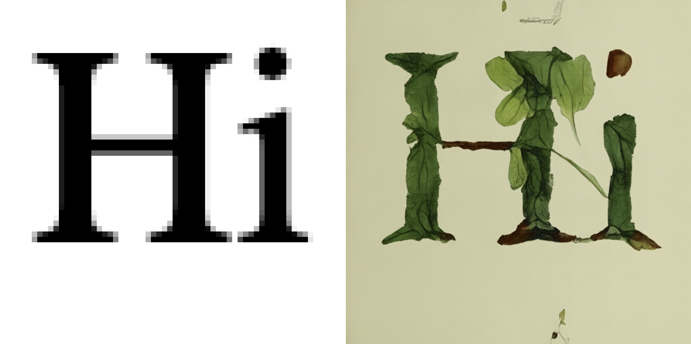
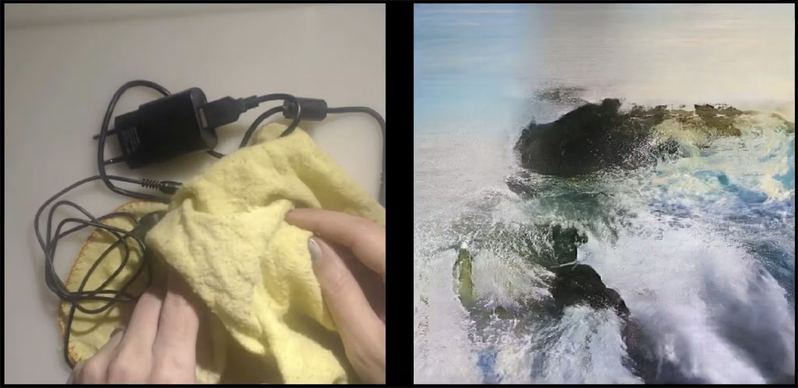
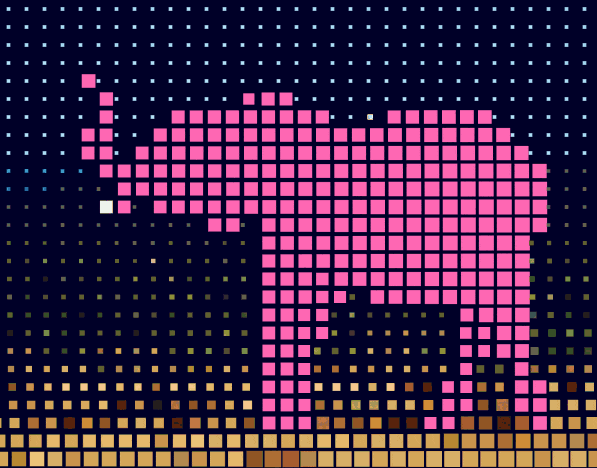
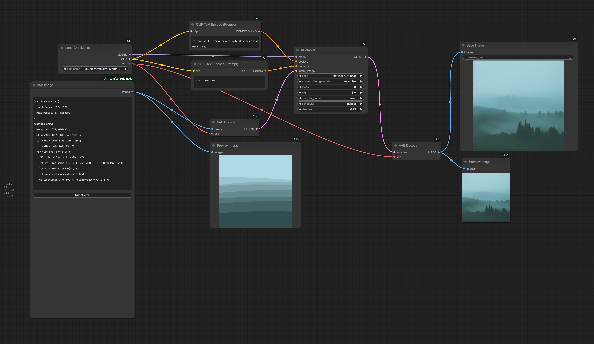

# Assignment Set #9

## Creative Coding with AI

In this unit, we will explore the combination of creative coding with AI techniques for image analysis and synthesis. There are 5 componenets to the assignment (including 4 Discord posts and 4 programming projects) which are due on either 11/11 or 11/18. 

* **9.1. Exercise: Dino Diffusion + p5** (10%, 30 minutes, due 11/11)
* **9.2. Looking Outwards #4: AI+Art** (10%, 30 minutes, due 11/11)
* **9.3. Situated Eye / Poetic Observer** (40%, 5 hours, due 11/18)
* **9.4. ComfyUI I: Image Analysis** (15%, 1.5 hours, due 11/18)
* **9.5. ComfyUI II: Image Synthesis** (20%, 2 hours, due 11/18)

**Summary of Due Dates for Assignment #9:**

* **Due Monday 11/11:** 
  * 9.1. [Exercise: Dino Diffusion + p5](#91-exercise-dino-diffusion--p5) (`#09-dino-reading` + [OpenProcessing](https://openprocessing.org/class/93074/#/c/94831))
  * 9.2. [Looking Outwards #4: AI+Art](#92-looking-outwards-4-ai--art) (`#looking-outwards-4`)
* **Due Monday 11/18:**
  * 9.3. [Situated Eye / Poetic Observer](#93-situated-eye-poetic-observer) (`#09-situated-eye`)
  * 9.4. [ComfyUI 1: Custom Pixel+AI](#94-comfyui-1-custom-pixelai) (+ [OpenProcessing](https://openprocessing.org/class/93074/#/c/94907))
  * 9.5. [ComfyUI 2: p5 in Comfy](#95-comfyui-2-p5-in-comfy) (`#09-p5-in-comfy` + [OpenProcessing](https://openprocessing.org/class/93074/#/c/94911))

---

## 9.1 Exercise: Dino Diffusion + p5

*(10%, 30 minutes, due Monday 11/11)* [Diffusion models](https://en.wikipedia.org/wiki/Diffusion_model) are the core AI algorithms used in popular image generation tools like Midjourney and DALL-E. In this warm-up exercise, you will experiment with using custom generative p5.js graphics to "condition" (guide) a simple diffusion AI. We will base our work on "Dino Diffusion", an ultra-minimal diffusion model created by [Ollin Boer Bohan](https://madebyoll.in/) that generates 512×512 botanical images in the browser. 

* **Read** "[Dino Diffusion: Bare-bones Diffusion Models](https://madebyoll.in/posts/dino_diffusion/)" (2023) by Ollin Boer Bohan. (You can play with Bohan's [demo here](https://madebyoll.in/posts/dino_diffusion/demo/).) This is an estimated 12-minute reading.
* **Write** a sentence sharing something you learned from this article, in the Discord channel `09-dino-reading`.
* **Fork** [this OpenProcessing sketch](https://openprocessing.org/sketch/2321795), which is a p5.js port of Bohan's Dino-Diffusion project. (Make sure your forked sketch includes the 8MB ONNX model file, "network.onnx", in your sketch's FILES tab; if you're lacking this file for some reason, you can also find it [here](https://github.com/golanlevin/dino-diffusion-p5/tree/main). In your sketch's LIBRARIES tab, you should also be sure to include the ONNX runtime library, `https://cdn.jsdelivr.net/npm/onnxruntime-web/dist/ort.min.js`.)
* **Experiment** with this sketch as follows:
  * Press RETURN to start or re-start the AI process.
  * Press SPACE to clear the canvas and start over.
  * Press a letter key (and then RETURN) to guide the AI with that letter.
  * **Draw** on the canvas with the cursor to provide input to the AI.
* *Now*, **modify** the code of this sketch, specifically creating your own generative image for guiding the AI. You are expected to do this by modifying the  `generateInputImage()` function. (There are no other parts of the code that should be modified.) Keep in mind that your graphics must be rendered into the `inputGraphics` buffer, an offscreen image whose dimensions are 64×64 pixels. Your program should generate a novel input image every time the user presses a key. (What works well? What doesn't? Why do you suppose?)
* **Upload** your sketch to the [corresponding slot](https://openprocessing.org/class/93074/#/c/94831) in our OpenProcessing classroom.
* **Add** an appealing screenshot of your OpenProcessing sketch to your Discord post in `09-dino-reading`. Be sure that it shows both your generated graphic and the AI result generated from it. 

---

## 9.2 Looking Outwards #4: AI + Art

*(10%, 30 minutes, due Monday 11/11)* This is a "Looking Outwards" assignment about Art+AI. Spend 45 minutes **browsing** the following online showcases of projects that make use of machine learning and ‘AI’ techniques. Look beyond the first page of results — more than a thousand projects are indexed across these sites!

* **Some AI artists I recommend**: [Lauren Lee McCarthy](https://lauren-mccarthy.com/), [Memo Akten](https://www.memo.tv/artworks/), [Mario Klingemann](https://quasimondo.com/), [Sougwen Chung](https://sougwen.com/), [Holly Herndon & Mat Dryhurst](https://herndondryhurst.studio/), [Kyle McDonald](https://kylemcdonald.net/), [Sofia Crespo](https://sofiacrespo.com/), [Scott Eaton](https://www.scott-eaton.com/category/creative-ai)
* [**NeurIPS AI Art Gallery**](https://www.aiartonline.com/) — galleries for the [2017](https://www.aiartonline.com/category/art-2017/), [2018](https://www.aiartonline.com/category/community/), [2019](https://www.aiartonline.com/category/community-2019/), and [2020](https://www.aiartonline.com/category/art-2020/) NeurIPS Workshops on Machine Learning for Creativity and Design.
* [**Mlart.co**](https://mlart.co/) — a collection of AI+art experiments from 2015-2021, curated by Emil Wallner.
* [**AiArtists.org**](https://aiartists.org/ai-artist-founding-members) — a global database of artists who are exploring AI’s impact on art and culture.
* [**Experiments with Google**](https://experiments.withgoogle.com/experiments) — a showcase of experiments commissioned by Google from 2010-2022, that creatively explore machine learning. (Look especially under tags like [Machine Learning](https://experiments.withgoogle.com/experiments?tag=Machine+Learning), [tensorflow.js](https://experiments.withgoogle.com/experiments?tag=Tensorflow.js), [t-SNE](https://experiments.withgoogle.com/experiments?tag=t-SNE), [Web Speech API](https://experiments.withgoogle.com/experiments?tag=Web+Speech+API), [CLIP](https://experiments.withgoogle.com/experiments?tag=CLIP), [Dialogflow](https://experiments.withgoogle.com/experiments?tag=Dialogflow), [GPT-2](https://experiments.withgoogle.com/experiments?tag=GPT-2), [Cloud Vision API](https://experiments.withgoogle.com/experiments?tag=Google+Cloud+Vision+API), [Handwriting Recognition](https://experiments.withgoogle.com/experiments?tag=Handwriting+Recognition), [Magenta.js](https://experiments.withgoogle.com/experiments?tag=Magenta.js), [PoseNet](https://experiments.withgoogle.com/experiments?tag=PoseNet).)

*Now,* 

* After reviewing at least 10 projects, **select** one project to feature in a *Looking Outwards* blog post. *(Restriction: You may not select a project by the professor.)*
* In the Discord channel `looking-outwards-4`, **write** a sentence or two describing the project and why you found it interesting; **include** an image of the project you selected; and **link** to information about it. 

---

## 9.3. Situated Eye / Poetic Observer

*(40%, 5 hours, due Monday 11/18)* This assignment is intended to protect and cultivate your *curiosity* — by providing you with powerful tools for computer *vision*. In this conceptually-oriented project, you are asked to create a working “situated eye” – a “contextualized classifier” – a “purposeful detector” – a “poetic observer“.

**Create** a machine that uses a camera to ask a question of the world. Your machine should either measure/detect something interesting, measure/detect something in an interesting way, or create an interesting provocation by bringing an uncommon measurement/detection to our attention. The emphasis here is on the *selection* and *collection* of intriguing data, rather than on the *production* (for now) of an attractive interpretation, visualization, or game. What overlooked phenomenon or invisible rhythm can you discover?

In other words, you are asked to create a camera-based system:

1. that is located *in a specific place*;
2. and which is trained to *detect a specific thing* (or things),
3. which is the working, "detector half" of a software system whose remaining "responsive half" you'll describe *speculatively*.
4. Your deliverable will consist of a Discord post in the in the `#09-situated-eye` channel, containing visual documentation of your working detector, and a written and sketched description of your speculative app. 

### Who, What, When, Where, Why

> **What is an interesting subject to study with a video camera? 
For this subject, what are some interesting observations you can automate? 
How might a system respond in an interesting way to these observations?**

You will be provided a webcam, and potentially a tripod and/or USB extension cable.

* You are asked to — **choose a subject**, i.e., to point the camera at something/ someplace/ someone interesting. Your system might respond to trees, machines, vehicles, places, animals. (You can point your camera at people, but it is understood that *you will not violate anyone’s privacy*.)
* You are asked to — **train a neural network to analyze your subject**. You can train a *classifier* (to recognize certain discrete patterns), or a *regressor* (to measure your subject along some continuum). You will actually train a real system. Although you will work in p5.js, there is no software deliverable expected (e.g. no OpenProcessing sketch to submit). Instead, 
* You are asked to — **document your neural network doing its job**, successfully classifying or measuring your subject. Your document can take the form of a video or animated GIF.
* You are asked to — **speculatively describe a custom app** that would respond to these measurements or classifications. You don’t actually have to make the software respond in this way—but it should be *possible* for you to do so in theory. Your deliverable will take the form of a Discord post in the `#09-situated-eye` channel, containing a 100-150 word post that should include your video/GIF documentation, a written description of your speculative custom app, and some sort of pencil-and-paper sketch of your imagined system.

**Here’s a *simple* example—you can do better**: Put the camera in your fridge. Train it to recognize when the fridge is open and closed. Perhaps you can train it to recognize the face of which roommate is opening the fridge. Use this system to create a system that records which of your roommates opened the fridge, when. *Other examples*: [*Cheese*](https://www.youtube.com/watch?v=B61CEiPWzGk) by Christian Moeller; [*Suicide Box*](https://www.youtube.com/watch?v=3L4by07T6PM) (*content warning!*) by Natalie Jeremijenko.

### Design Considerations

* **Escape the physical context of the laptop**. Don’t limit yourself to the physical constraints of your laptop’s webcam, and the implicit assumptions it imposes on where a camera can be (on a table, in a room, at waist height, with a level pitch). Give extremely careful consideration to where your camera is located, and/or what it observes. Is your camera on a building? In a refrigerator? Above a pet dish? Part of a microscope? Pointed at the sky, or at the floor? Looking at custom cardboard game pieces on a table?
* When describing your speculative system, remember that **your system might respond in real-time** (like a game, etc.), or **it might serve as a system for recording, logging, or counting** what it observes. Keep in mind that you can save files (data, images) to disk. Your system might respond audiovisually (i.e. with graphics and/or sound), and/or it might send a signal over the internet.

### Template Code: 

* Image Classification: [ml5+TeachableMachine, ml5v1](https://openprocessing.org/sketch/2430277) (2024)
* Pose Classification: [handPose Rock-Paper-Scissors, ml5v1](https://openprocessing.org/sketch/2428446) (2024)
* Pose Classification: [bodyPose Training & Recognition, ml5v1](https://openprocessing.org/sketch/2428616) (2024)
* Pose Regression: [ml5-HandRegressor-2024](https://openprocessing.org/sketch/2069567) (2024)
* Image Regression: [1D Regression using ml5v.0.12.2](https://editor.p5js.org/golan/sketches/dvQldQn7w)
* Image Regresssion: [2D Regression using ml5v.0.12.2](https://editor.p5js.org/golan/sketches/B96GvGSA-)

### Tutorials

ML5.js is *actively transitioning* to a new version. As a result, your mileage may vary with the tutorials below. 

* [ml5.js Image Classification](https://thecodingtrain.com/tracks/ml5js-beginners-guide/ml5/1-classification/image-classification)
* [ml5.js: Train Your Own Neural Network (OLD)](https://www.youtube.com/watch?v=8HEgeAbYphA)
* [ml5.js: Feature Extractor Regression (OLD)](https://thecodingtrain.com/tracks/ml5js-beginners-guide/ml5/3-feature-extractor/2-regression)
* [ml5.js: Documentation of ml5+TeachableMachine](https://docs.ml5js.org/#/reference/image-classifier-tm)

---

## **9.4. ComfyUI 1: Custom Pixel+AI** 

### TLDR: 

* **Load this RunComfy workflow: [`3_image_depth_and_segmentation.json`](../../lectures/comfy/image_analysis/workflows/3_image_depth_and_segmentation.json)**
* **Test it with this elephant image, [`original_rgb.png `](https://github.com/golanlevin/60-212/blob/main/lectures/comfy/image_analysis/input/original_rgb.png)**
* **Swap in your own image and change the Florence prompt**
* **Write [an OpenProcessing sketch](https://openprocessing.org/class/93074/#/c/94907) that uses the depth and/or segmentation.**

(*15%, 1.5 hours, due 11/18*) In this project, we will revisit the core premise of our [Custom Pixel](https://github.com/golanlevin/60-212/blob/main/2024/assignments/assignment_7b.md#75-custom-pixel-camera-color-nested-iteration) project from Assignment #7.5. This time, however, we will use machine learning techniques (such as monocular depth estimation and semantic segmentation) in order to provide *additional channels of information* to our custom image interpreting software.

1. **First**: briefly familiarize yourself with ComfyUI: what it *is*, and what it can *do*. **Read** the following article: [Beginner's Guide to ComfyUI](https://aituts.com/comfyui/) by AITuts. This should take about 10 minutes. If you're interested in learning more, feel free to browse any or all of the following optional resources: 
  * [ComfyUI Github](https://github.com/comfyanonymous/ComfyUI/blob/master/README.md)
  * [ComfyUI Examples](https://github.com/comfyanonymous/ComfyUI_examples)
  * [Beginner's Guide to ComfyUI](https://stable-diffusion-art.com/comfyui/)
  * [Pixaroma ComfyUI YouTube Tutorials](https://www.youtube.com/playlist?list=PL-pohOSaL8P9kLZP8tQ1K1QWdZEgwiBM0)
  * [Purz ComfyUI YouTube Channel](https://www.youtube.com/@PurzBeats)
  * [ComfyUI Reddit](https://www.reddit.com/r/comfyui/)
2. *Now*:
  * **Select** a static image that you'd like to use as the basis for a computational image treatment. (Your image can be something of your own, or something from the internet, but be sure to give credit in your code if the image is borrowed.)
  * Using [this readymade RunComfy workflow](../../lectures/comfy/image_analysis/workflows/3_image_depth_and_segmentation.json), **compute** a *depthmap* for your selected image, as well as one or more *semantic segmentation* masks. This workflow is explained in great detail on [this lecture page](../../lectures/comfy/image_analysis/readme.md). **Make sure** your (possibly resized) color image, as well as your depth and segmentation images, all have the same dimensions. 
  * Using p5.js, **develop** a custom treatment of your selected image, making use of at least one of the new additional channels of information. (You're not required to use both.) Your treatment can be generative, animated, or static — up to you. You are permitted to recycle ideas from project 7.5, but you are also encouraged to develop fresh ideas that take advantage of the new data channels. A [simple p5 project](https://openprocessing.org/sketch/2440728) that demonstrates how to ingest the 5 data channels can be found [here](https://openprocessing.org/sketch/2440728), and a fancy version can be found [here](https://editor.p5js.org/golan/sketches/-_cFmLtoP).
  * **Upload** your project to the appropriate slot [in our OpenProcessing classroom](https://openprocessing.org/class/93074/#/c/94907). 

---

## **9.5. ComfyUI 2: p5 in Comfy**

### TLDR: 

* **Load this workflow into RunComfy: [`p5-in-comfy.json`](../../lectures/comfy/image_synthesis/workflows/p5-in-comfy.json)**
* **Write a simple p5 sketch to control it, and a text prompt**
* **Document it in the Discord channel `#09-p5-in-comfy`**

*(20%, 2 hours, due 11/18)* In this exercise, you will write a small program in p5.js that generates a conditioning image for Stable Diffusion in ComfyUI. *Now*: 

* **Study** this [presentation about running p5.js in RunComfy](../../lectures/comfy/image_synthesis/readme.md) 
* **Load** the following workflow into RunComfy. It is available in this JSON workflow, [`p5-in-comfy.json`](../../lectures/comfy/image_synthesis/workflows/p5-in-comfy.json), and/or in the screenshot image below (whose metadata contains a copy of the workflow).
* **Develop** a simple p5.js program, whose canvas dimensions are (exactly) 512x512. Your p5 program should generate a new image whenever the user clicks the mouse. **Upload** a backup copy of your p5.js generator program into the [correct slot](https://openprocessing.org/class/93074/#/c/94911) in our OpenProcessing classroom, for safekeeping.
* **Paste** a copy of your p5.js generator program into the *comfyui-p5js-node* in the Comfy workflow. Make sure it works. 
* **Devise** a text prompt for the CLIP text conditioner which tells the Stable Diffusion process how to interpret the image from your p5 generator. 
* **Iterate.** Explore how you can change the code of your generator, and the text prompt you're using, so that they work together well.
* **Queue the Prompt!** Generate some pairs of input-output images. 
* In the Discord channel `#09-p5-in-comfy`, **post** 2 or 3 pairs of images, showing your results. Also, please **paste** the text prompt you used into the Discord post as well. **Write** a couple of sentences about your experience.
* **Experiment**! Try some of the other Stable Diffusion models (as long as you're using SD 1.5 models). The following models are all working well in this setup — they are built-in to the dropdown menu in RunComfy: 
  * sd1/animeStills_v1.safetensors
  * sd1/dreamshaper_8.safetensors
  * sd1/meinapastel_v6Pastel.safetensors
  * sd1/universestable_v50Comics.safetensors
  * sd1/crystalClear2_crystalClear2V1.safetensors

