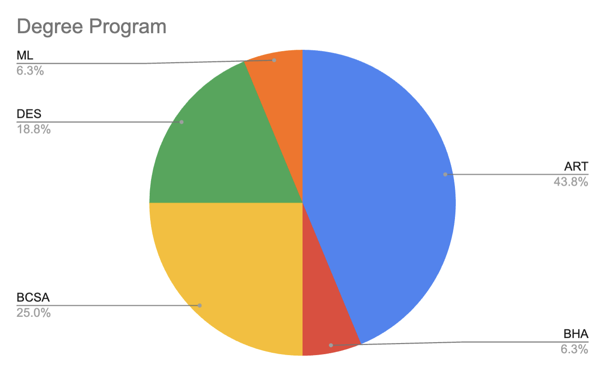
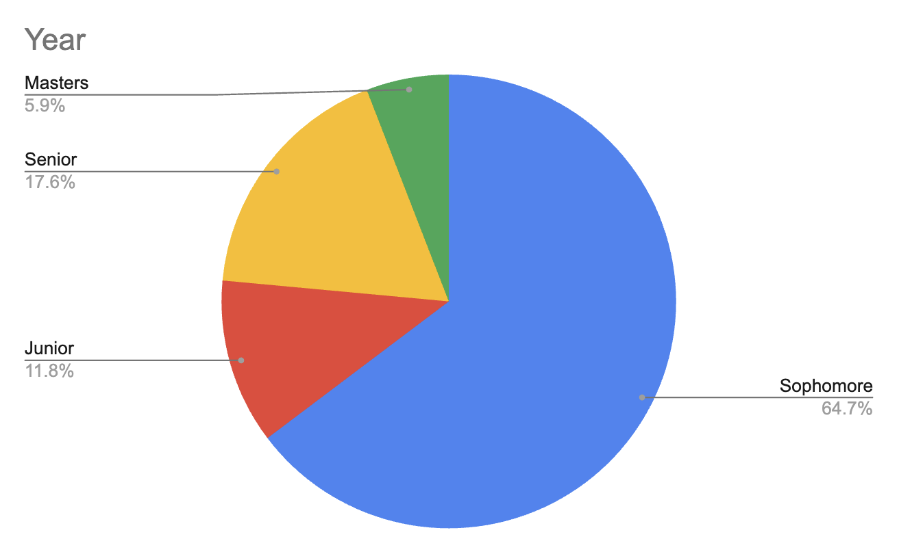

# 8/26/2024

Welcome to the Fall 2024 edition of *Creative Coding* at CMU!

---

## Agenda

* [Who's Here?](#introductions)
* [Syllabus Review](https://github.com/golanlevin/60-212/blob/main/2024/syllabus/60-212_syllabus_fall2024.md)
* [Introduction to Poetic Computing]()
* [Presentation of Assignment #0](../assignments/assignment_0.md)
* [Welcome Form & Exit Ticket](https://forms.gle/qa1upyvUXWk1dWra6)

---
## Introductions

Who am I? Here are a few things I've done.

* [Generative art!](https://www.artblocks.io/curated/collections/cytographia-by-golan-levin)
* [Artificial Intelligence!](https://github.com/golanlevin/AmbigrammaticFigures)
* [Lasers!](https://flong.com/archive/projects/gpp-ii/index.html)
* [Robots!](https://flong.com/archive/projects/snout/index.html)
* [Weird performance!](https://flong.com/archive/projects/messa/index.html)

Who's here? Here's a brief overview of the student population in our class.

 