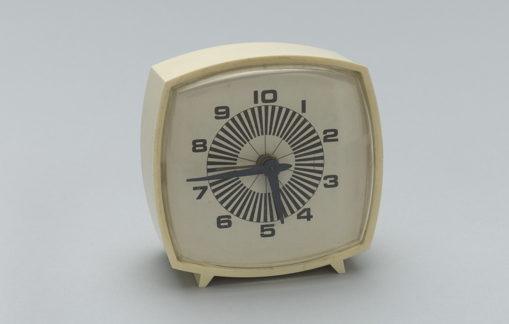

# 9/11/2024

*Today is Wednesday, September 11th. Welcome!*

---
## Agenda

* [*Clocks*](https://www.youtube.com/watch?v=xjRQvbPh9tQ) (Royksopp Trembling Heart Remix)
* Attendance
* Upcoming
* [10 Rules for Students](images/corita_rules_poster.gif) by Sister Corita Kent
* **Guest speaker ([Derrick Schultz](https://artificial-images.com/))** 
* Review of Assignment #3
* *Break*
* Lecture: Clocks
* Introduction to Assignment #4

---
## Upcoming

* `Thu 09/12`: [Information session on the STUDIO's Student Grants](https://studioforcreativeinquiry.org/events/infosession2024), 5:30pm
* `Mon 09/16`: CoPilot presentation.
* `Wed 09/18`: Golan away; independent work session.
* `Tue 09/24`: [Artist talk by Brain & Lavigne](https://studioforcreativeinquiry.org/events/brain-lavigne), 5:30pm CFA-111 (*Required*)
* `Wed 09/25`: Assignment #4 Due

---

## Lecture

Lecture: **[Representing Time; Clocks, Reimagined](https://github.com/golanlevin/lectures/tree/master/lecture_clock)**

---

## Introduction to Assignment #4

* **[Assignment Set 4](../assignments/assignment_4.md)**, due 9/25
* Discussion: crit process for Assignment #4

---

## Viewings / Time Permitting

* Lingdong Huang, [Hermit](https://www.youtube.com/watch?v=mPYeTJd8klQ), 2016; [Fishdraw](https://fishdraw.glitch.me/), 2021; [Shan-Shui](http://shan-shui-inf.lingdong.works/), [Shan-Shui photos](https://flickr.com/photos/creativeinquiry/albums/72157673905317117/) 2018.