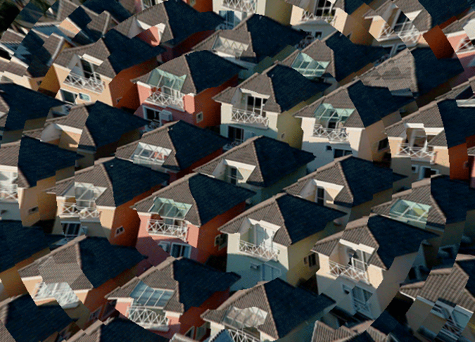

# Em's Shader Tour
---

## Level 1 : Fragment shader Introduction 
### Some of what you saw:

### Some stuff I want you to see: 

* [Adam Ferriss](https://amf.fyi/)
  - [Sobel](https://adamferriss.com/sobel/)
  - [Rain](https://www.adamferriss.com/rain/)
  - [Canny](https://adamferriss.com/canny/)
  - [shadertoy](https://www.shadertoy.com/user/aferriss)

### Keep this Handy!!
* [The Book of Shaders](https://thebookofshaders.com/)

### 2D processes
* [Random](https://thebookofshaders.com/10/) and [Noise](https://thebookofshaders.com/11/)
* [Signed Distance Functions](https://www.shadertoy.com/results?query=distance+2d)
* [distances for gradients](https://www.shadertoy.com/view/3s3GDn)
* [Shaping Functions](https://thebookofshaders.com/05/)
* Color Buffers (& texture sampling)

[Sage Jenson 36 points](https://opensea.io/collection/36-points-by-sage-jenson)

### Shader platforms in web 
 * [The Force](https://shawnlawson.github.io/The_Force/)
 * [Shader Booth](https://shaderbooth.com/)
 * [p5.shaders](https://p5js.org/tutorials/intro-to-shaders/)
 * [Compute.toys](https://compute.toys/) (only available on recent versions of Chrome, using webgpu)

### When coming from js
* no object orientation
* STRONGLY TYPED
* no console or print statement

### Performance with shaders 
* [Olivia Jack](https://ojack.xyz/)
  * [hydra](https://hydra.ojack.xyz/?sketch_id=example_9)
  * [sketches](https://ojack.xyz/work/code-sketches/)
  * [how hydra works](https://hydra.ojack.xyz/docs/docs/learning/extending-hydra/glsl/)

* [Char Stiles](https://www.youtube.com/watch?v=lEJiP4JGEh0) / [Shawn Lawson](https://www.shawnlawson.com/artworks/)

## Level 2 : 3D shader technologies
* Raymarching

* Mr Doob & threejs
  * [vertex displacement shader(webcam)](https://mrdoob.com/#/145/webcam_displacement)
  * [shaders on objects in three.js](https://threejs.org/examples/?q=shader#webgl_shader_lava)

* Shaders in games
   * [Acerola](https://www.youtube.com/@Acerola_t/videos)
   * [Freya Holmer Shader Basics Lecture ](https://www.youtube.com/watch?v=kfM-yu0iQBk)(4 hours)
