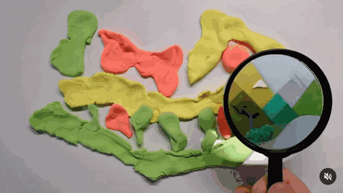

# 11/11/2024

*Today is Monday, November 11: Welcome!*

--- 

* Reminder: [Demosplash Festival](https://www.demosplash.org/), November 15-16
* Inspirations: Teachable Machine Projects by CMU Alums
* Inspirations: Realtime Stable-Diffusion Projects
* Introduction to ComfyUI
  
---

### Teachable Machine Projects by CMU Alums

In using Teachable Machine, we're using work by several former CMU students. [Irene Alvarado](https://www.irenealvarado.com/) is a recent graduate of CMU's HCII program. [Gautam Bose and Lucas Ochoa](https://design.cmu.edu/news/design-alumni-pioneering-business-automation-through-ai-innovation) are recent graduates of CMU's School of Design. As employees of Google's Creative Lab, they helped develop Teachable Machine and its demos. 

* [Irene Alvarado, *Teachable Machine*](https://www.youtube.com/watch?v=T2qQGqZxkD0)
* [Lucas & Gautam, *Teachable Sorter*](https://www.youtube.com/watch?v=ydzJPeeMiMI)
* [Lucas & Gautam, Pancakes alarm](https://medium.com/google-design/teaching-a-bell-to-ring-when-your-pancakes-are-ready-d65db43fffe5)

---

### Inspirations: Realtime Stable-Diffusion Projects

* [Transformirror](https://www.instagram.com/p/C4Rl0m-xXCT/) by Kyle McDonald and Daito Manabe
* Experiments by Hugues Bruyère (smallfly): 
  * [Plasticine: Octopus](ttps://www.instagram.com/p/C7ft_5Ztm-9/)
  * [Plasticine: Magnifier](https://www.instagram.com/p/C7syabsN547/)
  * [Plasticine: Magnifier Improved](https://www.instagram.com/p/C8QjD73NsRm/)
  * [Milk & Ink](https://www.instagram.com/p/C8TKkI2Nn5K/)
  * [Flashlight Brutalism](https://www.instagram.com/p/C8k4PuVPNl9/)
  * [Summary](https://www.instagram.com/p/C9nKGOnpnh5/)
* [StreamDiffusion TD demo](https://www.youtube.com/watch?v=X4rlC6y1ahw)
* [GTA game remastered (in post) with diffusion](https://www.reddit.com/r/aivideo/comments/1fx6zdr/gta_iv_with_a_photorealistic_filter_with_runway/)

---

### Introduction to ComfyUI

* [Image Analysis workflow](../../lectures/comfy/image_analysis/readme.md)
* [Image Synthesis workflow](../../lectures/comfy/image_synthesis/readme.md)

