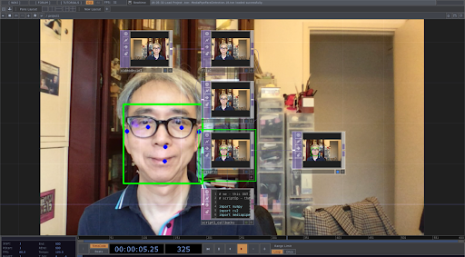

# 11/20/2024

*Today is Monday, Novenber 20th. Welcome!*

---
## Agenda
* Due : Assignments **10.1, 10.2,10.3**
* Previous Semesters and Viewings. 
* Touchdesigner First Steps / Refresher
* Methods of linking external data
* Read Assignment 10b
* Tinker Time 

## Previous Semester viewings

## Interactive Extractions  
### Commercial stuff
* [Deeplocal Installations](https://www.deeplocal.com/google-store-chelsea-2023-refresh)
* [SudoMagic](https://www.sudomagic.com/)

### Artists
* [Matthew Ragan](https://matthewragan.com/teaching-resources/touchdesigner/) 
*   [the_poet_engineer](https://www.instagram.com/the.poet.engineer/) 
* [Crystal Jow](https://www.crystaljow.com/portfolio)
* [newnome_beauton](https://www.instagram.com/newnome_beauton/)
* [pepepebrick](https://www.instagram.com/pepepepebrick/)
* [David Brown](https://www.instagram.com/david_braun/)
* [Samuel Alexander Adams](https://www.instagram.com/david_braun/)
* [Soyun Park Class](https://derivative.ca/community-post/beauty-nodes-investigating-touchdesigner-soyun-park-and-her-students/68408) 

## Touchdesigner Refresher and Class Assets
* Unlike p5 I cannot simply share a sketch online with you all, you must have you download my .tox or .toe files and boot them up in order to see. Because of this I have our [TD Demo](https://drive.google.com/drive/folders/10GZBHYytJOIZNoSTE4rzYP59RFDA83OU?usp=sharing) linked from my personal drive. 
* Sometimes I use different builds of Touchdesigner in parallel, so if there is an error saying that there is "version difference", ignore it, everything should work exactly the same

* What we will talk about today BASELINE
    * TOP workflows
    * SOP workflows
    * CHOP referencing

### Tools(Time Permitting)
* [Motion Detection](https://youtu.be/NSS6yAMZF78?si=QG5vdh0sa7Wfi-S1)

* [GPU accellerated Mediapipe](https://www.youtube.com/watch?v=Cx4Ellaj6kk&t=5s) by Torin Blankensmith
    * can track Hands, Face, Body
    * Object tracking
    * Object Classification
    * Image Segmentation

* OSC
