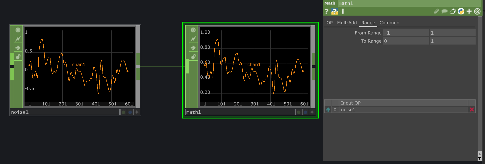
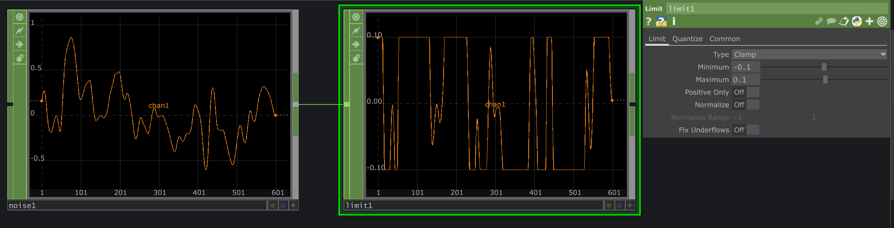
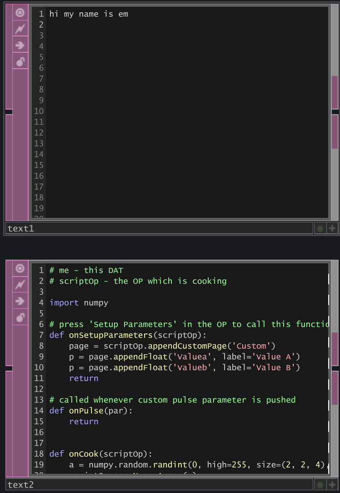
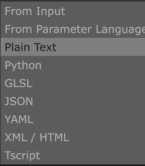
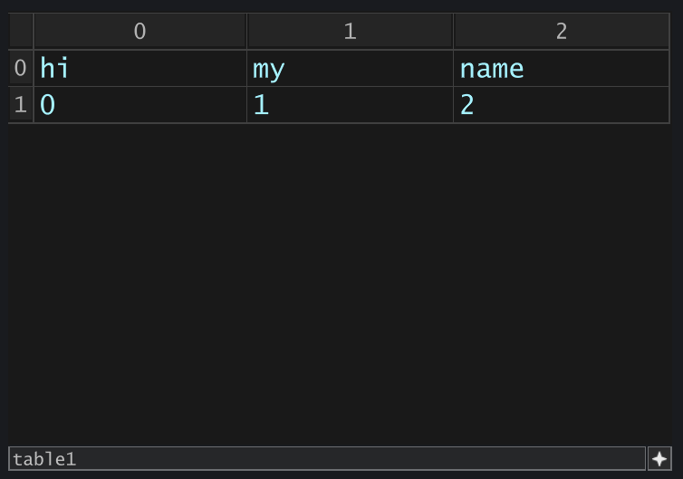

# 11/25/2024

*Today is Monday, Novenber 25th. Welcome!*

---
## Agenda
* Due : Assignments **10.4**
* Methods of linking external data
* Little Bits p5,Processing,Touchdesigner demos

## If you haven't seen
* there's a google docs folder where I have been uploading .tox files following the lecture topics I gave, as well as some advanced workflows
* [This](https://drive.google.com/drive/folders/10GZBHYytJOIZNoSTE4rzYP59RFDA83OU?usp=drive_link) is the drive link

## remapping,clamping,data manipulation
* **Map function**: `Math` Chop

* **Clamp/Max/Min**:`Limit` Chop

* How to write text: `Text` DAT

* Structuring data: `Table` DAT

### Thinking about interaction
* [Motion Detection](https://youtu.be/NSS6yAMZF78?si=QG5vdh0sa7Wfi-S1)

* [blobtracking](https://www.youtube.com/watch?v=ioSVh06MySc)

* [GPU accellerated Mediapipe](https://www.youtube.com/watch?v=Cx4Ellaj6kk&t=5s) by Torin Blankensmith
    * can track Hands, Face, Body
    * Object tracking
    * Object Classification
    * Image Segmentation

* OSC

