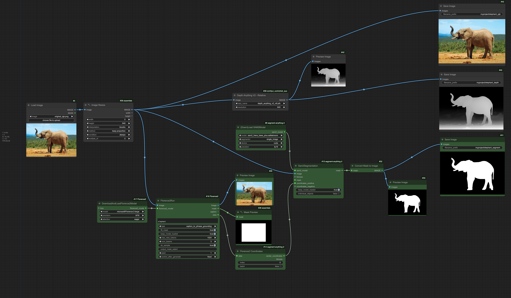

# P5+AI: Extending a Creative Coding Course with Generative AI 

* Presented at [#LTT2025](https://wp.nyu.edu/ltt2025/) — Friday, 17 January 2025
* Golan Levin ([@golan.bsky.social](https://bsky.app/profile/golan.bsky.social))
* Professor of Computational Art, CMU

---

## Overview

> **I report on a collection of weekly exercises that were used to integrate generative AI toolkits into a fall 2024 studio art course in creative coding at Carnegie Mellon University.** 
>
> “[Intermediate Studio: Creative Coding](https://github.com/golanlevin/60-212/tree/main/2024)” (60-212) is a practical introduction to the use of programming and computation within the context of the arts. In this course, students develop or deepen the skills and confidence to produce interactive, generative, and computational artworks; discuss their work in relation to current and historic praxes of computer art; and engage new technologies critically. The primary toolkit used in the course is p5.js, and most of the assignments are adapted from the book I co-authored with Tega Brain, “[Code as Creative Medium](https://mitpress.mit.edu/9780262542043/code-as-creative-medium/)”. In previous editions of this course, the integration of AI techniques has been limited to the use of Google’s Teachable Machine and MediaPipe libraries (via ml5.js) to analyze, recognize and track body movements for e.g. gestural interactions.
>
> **In Fall 2024, I devised a series of new exercises and templates specifically intended to integrate generative AI techniques into creative coding education.** These included: 
> 
> 1. the use of Google’s Gemini 1.5 LLM within p5.js; 
> 2. the use of p5.js directly within the ComfyUI environment, in order to generatively guide Stable Diffusion image synthesis; 
> 3. the use of ComfyUI's affordances for AI image *analysis* (such as monocular depth estimation and promptable object segmentation) to boost classic creative coding exercises.
> 4. and the use of a [simplified, low-resolution Stable Diffusion model directly within p5.js](https://github.com/golanlevin/60-212/blob/main/2024/assignments/assignment_9.md#91-exercise-dino-diffusion--p5).
> 
> *I'm going to speak about the first three items today.*

## Preliminary Remarks

* Thank you for allowing me to share with you today!
* I'm privileged to work with an unusual population of hybrid students at CMU, an R1 university with strong Computer Science and strong arts. The typical student in my Creative Coding class is a sophomore Art undergraduate who is double-majoring or minoring in Computer Science, HCI, Information Science, or related technical fields. 
* The students in my course are Art students who have previously studied programming -- usually, either as AP CS in high school, or Introductory Programming in our School of Computer Science. They have strong visual skills and strong algorithmic thinking skills, but my Creative Coding course is often the first time that they are "putting together" their two interests. 


---

# 1. p5.js + Gemini LLM


## 1.1. "Canvas Describer" (Warmup Exercise)

*Connecting p5.js code to a powerful LLM.*

* **Summary**: Students are provided with a brief p5.js doodling program, which captures an image of the user's scribbles on the canvas, and then prompts Google's Gemini AI to describe that image. Students are asked to fork the sketch, modify the prompt (one line of p5 code), and screenshot their interactions. The main purpose is to ensure that the students are able to get the API key installed and working correctly. 
* **Acknowledgements**: Thanks to Trudy Painter, Alexander Chen, and Amit Pitaru at Google Creative Lab for creating the initial [Gemini starter examples for p5](https://x.com/pitaru/status/1819797112399511625). 
* **Assignment**: Detailed assignment statement [**here**](https://github.com/golanlevin/60-212/blob/main/2024/assignments/assignment_5.md#51-exercise-canvas-describer)
* **Template code**: p5 demo program [**here**](https://openprocessing.org/sketch/2369075)


```
function keyPressed(){
  // (Here are some quick examples, try them out.)
  // let myPrompt = "In 1 word and one emoji, tell me what you see.";
  // let myPrompt = "Count how many things you see. Provide a number";
  // let myPrompt = "Give 1 paragraph of art-school analysis of my drawing."
  // let myPrompt = "Provide a number (0-100) that describes how smooth or wiggly my line is.";
  
  let myPrompt = "Provide one caption for this New Yorker cartoon. Only provide the caption."
  askGeminiWithCanvas(myPrompt);
} 
```


#### Some Student Work

> "Describe the portrait as if it is a deity" — Bee Jackson 


> "Describe this as an sophisticated product using product design vernacular" — Brooke Schwartz


## 1.2. "LLM-Boosted Interaction"

* **Summary**: "In this project, you are asked to make an app in p5.js that uses the Google Gemini API to do something interesting." Students are given a week.
* **Assignment**: Detailed assignment statement [**here**](https://github.com/golanlevin/60-212/blob/main/2024/assignments/assignment_5.md#52-project-llm-boosted-interaction)
* **Template code**: Lots of sample programs linked [**here**](https://github.com/golanlevin/60-212/blob/main/2024/assignments/assignment_5.md#52-project-llm-boosted-interaction)

#### Some Student Work

> "I wanted to generate a receipt of arbitrary costs that comes with achieving a goal. Users type in their goal and then I ask Gemini to give me itemized receipt." — Angie Chang


---

# 2. p5.js in ComfyUI

 *Using a p5.js sketch to guide Stable Diffusion image synthesis, directly in ComfyUI*


* **ComfyUI** is a node-based development environment for creating custom AI systems. It’s similar to MaxMSP and TouchDesigner, except it’s for generative AI and runs in a browser.
* ComfyUI is the first AI tool I’ve found with both a low floor and a high ceiling — *WAY* more powerful and flexible than MidJourney, but without the technical pain of coping with people’s GitHub repos and Colab notebooks. 
* An online service called **RunComfy.com** allows you to host ComfyUI environments on cloud-based virtual machines, which removes much of the remaining pain of system configuration. 
* There's a fast pipeline from the lab to your classroom. It's become commonplace for enthusiasts to convert AI research code into Comfy nodes, often within days of their release. 


In this assignment, students are able to write and execute p5.js code —*directly within ComfyUI*— and use the generatively-produced images (such as this pair of ellipses), along with a text prompt, to guide a Stable-Diffusion image synthesis process. 
 
* **Summary**: Students are provided with a template ComfyUI [workflow](https://github.com/golanlevin/60-212/blob/main/lectures/comfy/image_synthesis/workflows/p5-in-comfy.json), which they load into RunComfy. They write a simple p5 sketch to control it, along with a text prompt, an document the pairs of images it produces. This is the students' first exposure to ComfyUI, so the main goal is for them to become familiar with its user interface. 
* There's lots of parameters for the students to modify, including their choice of AI model. 

Here is the actual template [workflow](https://github.com/golanlevin/60-212/blob/main/lectures/comfy/image_synthesis/workflows/p5-in-comfy.json) students receive: 


It produces image doublets like this (p5 on the left, Stable Diffusion (with the prompt "rolling hills, foggy day") on the right):


Here's a generative bowl of oatmeal, in a [nod to Kate Compton](https://www.tumblr.com/galaxykate0/139774965871/so-you-want-to-build-a-generator). 


#### Some Student Work

Here are some examples produced by my students. Having spent the semester trying hard to achieve nuance in p5.js, they're tickled to be able to achieve such results with simple shapes. 

> "nuclear explosion" – Tippi Li


> “Chinese painting, plants, ink, transparent” — Xiao Yuan


> "NASA space image of a new cosmos detected" — Aarnav Patel


* **Acknowledgements**: Thanks to Benjamin Fox, creator of [comfyui-p5js-node](https://github.com/tracerstar/comfyui-p5js-node), a "custom node for ComfyUI which passes a p5js canvas through ComfyUI for img2img generation use"; and thanks to [Derrick Schultz](https://linktr.ee/dvsmethid), an amazing educator who taught me how to use ComfyUI. 
* **Assignment**: Detailed assignment statement [**here**](https://github.com/golanlevin/60-212/blob/main/2024/assignments/assignment_9.md#95-comfyui-2-p5-in-comfy). 
* **Technical instructions**: Detailed advice [**here**](https://github.com/golanlevin/60-212/blob/main/lectures/comfy/image_synthesis/readme.md)
* **Template ComfyUI Workflow**: p5-in-comfy.json [**here**](https://github.com/golanlevin/60-212/blob/main/lectures/comfy/image_synthesis/workflows/p5-in-comfy.json)

---

# 3. Using AI Image Analysis (from ComfyUI) in p5

As some of you know, I'm co-author with Tega Brain of "[Code as Creative Medium](https://mitpress.mit.edu/9780262542043/code-as-creative-medium/)", a compendium of exercises for computational arts. One of the canonic creative coding assignments we document is "Custom Pixel", in which students write code to make a Chuck-Close like image filter. (See, for example, [Shiffman's Mirror](https://openprocessing.org/sketch/2405701), shown at left below). The assignment teaches concepts like iteration and pixel array access, 


Presently, I use ComfyUI's affordances for AI image *analysis* (such as monocular depth estimation and promptable object segmentation) to *extend* this classic creative coding exercise. I want to remind students that AI is not just for image *synthesis*, but can be used for image *analysis* as well. This concept was suggested by [Tom White](https://drib.net/).



**Summary**: 

* Students are provided with a readymade ComfyUI [**workflow**](https://github.com/golanlevin/60-212/blob/main/lectures/comfy/image_analysis/workflows/3_image_depth_and_segmentation.json), and test it with a [known input image](https://github.com/golanlevin/60-212/blob/main/lectures/comfy/image_analysis/input/original_rgb.png). 
* The workflow uses 'AI' to compute two images based on the input: a semantic segmentation image ("which pixels are part of the elephant?"), and a monocular depth estimation ("how far away is each pixel?"). 
* Students can then swap in their own image and change the segmentation-detection prompt. 
* At OpenProcessing, students use the exported images to create a p5.js "Custom Pixel" project that uses five channels of information instead of three: RGB, the depth, and the segmentation.
* In my demo program, for example, I use the semantic segmentation to color the *elephant* pink;  and I retain the colors of the background pixels, but change their size based on AI-estimated depth. 


#### Some Student Work

> *Dream Scene Painting* by Jeffrey Wang


> *Electric hand* by Kai Okorodudu


* **Acknowledgements**: Thanks to [Tom White](https://drib.net/) who suggested the premise of this assignment. 
* **Assignment**: Detailed assignment statement [**here**](https://github.com/golanlevin/60-212/blob/main/2024/assignments/assignment_9.md#94-comfyui-1-custom-pixelai). 
* **Technical instructions**: Detailed advice [**here**](https://github.com/golanlevin/60-212/blob/main/lectures/comfy/image_analysis/readme.md)
* **Template ComfyUI Workflow**: 3_image_depth_and_segmentation.json [**here**](https://github.com/golanlevin/60-212/blob/main/lectures/comfy/image_analysis/workflows/3_image_depth_and_segmentation.json)

---

# THANK YOU!

  
---
  
### p.s. Plug — Learn ComfyUI Online
  
The terrific educator who taught me ComfyUI, Derrick Schultz, is teaching an online Zoom course introducing how to use ComfyUI to make stopframe animations. His course starts Monday, January 27th; you can find information [here](https://www.bustbright.com/product/stop-motion-ai-animation-starts-monday-january-27-2025-/339?mc_cid=79920675ee&mc_eid=5f5bc73b5f).
  

  
