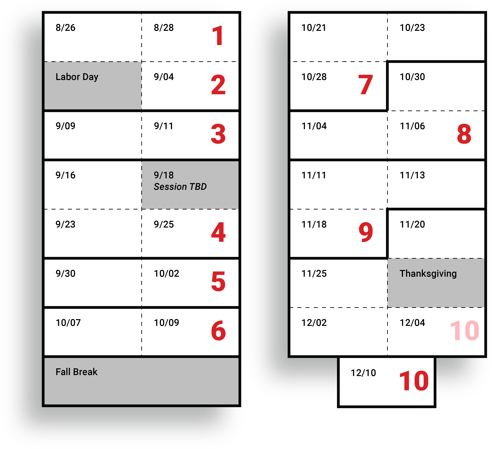

# Creative Coding • Fall 2024

*This is the main landing page for 60-212, Fall 2024.*
  
---

## Key Links

* [Syllabus](syllabus/60-212_syllabus_fall2024.md)
* OpenProcessing Classroom: [https://openprocessing.org/class/93074](https://openprocessing.org/class/93074#/) 
* Google Calendar: [http://bit.ly/golancoursecalendar](http://bit.ly/golancoursecalendar)

---

## Daily Notes & Lectures

* `Mon 08/26`: [Hello World!](daily_notes/20240826.md)
* `Wed 08/28`: [Code & Form](daily_notes/20240828.md)
* `Wed 09/04`: [Movement](daily_notes/20240904.md)
* `Mon 09/09`: [Movement, Loops, Shaping Functions](daily_notes/20240909.md)
* `Wed 09/11`: [Guest lecture; Clocks](daily_notes/20240911.md)
* `Mon 09/16`: [Timekeeping (cont'd)](daily_notes/20240916.md)
* `Wed 09/18`: *Work session class; Golan away.*
* `Mon 09/23`: [Timekeeping worksession](daily_notes/20240923.md)
* `Wed 09/25`: [Timepiece Review](daily_notes/20240925.md)
* `Mon 09/30`: [AI + Worksession](daily_notes/20240930.md)
* `Mon 10/07`: [Computational Color](daily_notes/20241007.md)
* `Mon 10/07`: [Color+](daily_notes/20241009.md)
* `Mon 10/21`: [Pixel Logics I](daily_notes/20241021.md) + [Em](daily_notes/20241021_em.md)
* `Wed 10/23`: [Pixel Logics II](daily_notes/20241023.md)
* `Mon 10/28`: [Body Tracking](daily_notes/20241028.md)
* `Wed 10/30`: [Full-Body Interactive Art](daily_notes/20241030.md)
* `Mon 11/04`: *Work session for Body/Gesture project*
* `Wed 11/06`: [Teachable Interactions](daily_notes/20241106.md)
* `Mon 11/11`: [Introduction to ComfyUI](daily_notes/20241111.md)
* `Wed 11/13`: [Worksession for AI projects](daily_notes/20241113.md)
* `Mon 11/18`
* `Wed 11/20`
* `Mon 11/25`
* `Mon 12/02`
* `Wed 12/04`
* `Tue 12/10`

---

## Assignments & Critical Dates

This information is also available in our Google [**Calendar**](http://bit.ly/golancoursecalendar):

* `Wed 08/28`: [Assignment Set 1](assignments/assignment_1.md) Due
* `Wed 09/04`: [Assignment Set 2](assignments/assignment_2.md) Due
* `Wed 09/11`: [Assignment Set 3](assignments/assignment_3.md) Due
* `Tue 09/24`: [Artist talk by Brain & Lavigne](https://studioforcreativeinquiry.org/events/brain-lavigne)
* `Wed 09/25`: [Assignment Set 4](assignments/assignment_4.md) Due
* `Wed 10/02`: [Assignment Set 5](assignments/assignment_5.md) Due
* `Wed 10/09`: [Assignment Set 6](assignments/assignment_6.md) Due
* `Mon 10/21`: [Assignment Set 7](assignments/assignment_7.md) (Part I) Due
* `Mon 10/28`: [Assignment Set 7B](assignments/assignment_7b.md) (Part II) Due
* `Wed 11/06`: [Assignment Set 8](assignments/assignment_8.md) Due 
* `Mon 11/18`: [Assignment Set 9](assignments/assignment_9.md) Due  
* `Wed 12/04`: Assignment Set 10 *Work-in-Progress* (Interactive Environment)
* `Tue 12/10`: Assignment Set 10 Due (Interactive Environment), 5:30pm‐8:30pm

### Calendar Visual Overview: 

