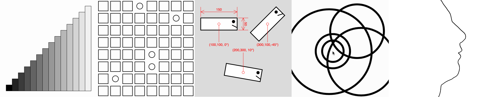

# Assignment Set #1: Getting Started

### Due Wednesday, August 27, 2025

---

*This set of deliverables is due by the beginning of class on Wednesday 8/27. There are four main tasks, the total of which should take less than 4 hours:*

* 1.1. [Administrative Tasks](#11-administrative-tasks) *(30 minutes)*
* 1.2. [Looking Outwards Post](#12-looking-outwards-post) *(15 minutes)*
* 1.3. [p5 Wayfinding](#13-p5-wayfinding) *(30 minutes)*
* 1.4. [Five Small Exercises](#14-five-small-exercises) *(2 hours)*

---

## 1.1. Administrative Tasks

(***30 minutes***) Please **complete** the following administrative tasks:

* (*1 minute*) **Bookmark** our [Course GitHub](https://github.com/golanlevin/60-212/blob/main/2025/readme.md) in your laptop's browser.
* (*4 minutes*) **Create** an ID on [Discord.com](https://discord.com/), if you don't already have one. **Join** our class Discord, using the invitation sent to you by email. **Browse** our server's channels so you know what goes where.
* (*10 minutes*) **Create** an ID on [OpenProcessing.org](https://openprocessing.org) (if you don't already have one). **Join** our [OpenProcessing classroom](https://openprocessing.org/class/100952#/), using the invitation sent to you by email, and **bookmark** it in your laptop's browser. **Browse** some of the sketches that people have published at [https://openprocessing.org/discover](https://openprocessing.org/discover). *(Note: the quality varies widely!)* Run the programs, and be sure to **look** at their code (*command-shift-return* may help switch to the code view). In the `#main-chatter` channel of the course Discord, **paste** a link to one or two projects that you found interesting. (No writing is necessary.)
* (*15 minutes*) **Review** the [Syllabus](https://github.com/golanlevin/60-212/blob/main/2025/syllabus/60-212_syllabus_fall2025.md) carefully, and **complete** the [**Welcome Form & Exit Ticket**](https://forms.gle/L4FDuXApCnWMobiX7).

---

## 1.2. Looking Outwards Post

(***20 minutes***) The purpose of this exercise is that I would like to understand your interests, tastes, and experience, and for you to be able to share some work you admire with your peers. Please **write** a "[Looking Outwards](https://github.com/golanlevin/lectures/blob/master/syllabi/looking-outwards.md)" post, as follows: 

* **Recall** a project you have admired (prior to this course) which you feel falls under the broad umbrella of "Creative Coding".
* **Create** a post in the `#looking-outwards-1` channel in our course Discord. In a few sentences, **describe** the project, and **explain** what you like about it. It's sufficient to write 3-5 sentences. 
* **Answer** the questions: *Who* made this project? (Was it an individual, a small team, a big company?) *Why* did they make it, or for whom (what kind of audience)?
* **Include** a link (URL) to the project or its documentation (such as a YouTube video).
* **Embed** an image of the project in your post. 

---

## 1.3. p5 Wayfinding 

(***30 minutes***) The purpose of this task is to help **ensure** that you know where to find good-quality information about the p5.js toolkit, such as documentation and tutorials. 

* (*10 minutes*) **Browse** the [p5.js Reference](https://p5js.org/reference/). Examine at least ten Reference pages, starting with the [Shape commands](https://p5js.org/reference/#Shape). Note that many of the Reference pages allow you to tinker with the code. *(For what it's worth, I happen to prefer the [old version of the reference](https://archive.p5js.org/reference/).)*
* (*10 minutes*) **Browse** the [p5.js Examples](https://archive.p5js.org/examples/) archive, which are organized thematically. Review at least ten p5.js Examples, skimming their code.
* (*10 minutes*) **Browse** some of the many free YouTube tutorials for p5.js, including those by: [Dan Shiffman](https://www.youtube.com/@TheCodingTrain/playlists) (Coding Train), [Xin Xin](https://www.youtube.com/@xinxin1011/videos) and CMU alum, [Patt Vira](https://www.youtube.com/@pattvira/playlists). Their offerings range from [completely introductory](https://www.youtube.com/watch?v=HerCR8bw_GE&list=PLRqwX-V7Uu6Zy51Q-x9tMWIv9cueOFTFA) to impressively advanced.

Additionally: 

* Unless otherwise indicated, feel welcome to use AI systems while programming, such as ChatGPT, Claude, or CoPilot. *(In your project reports, be sure to indicate that you received assistance from these systems.)*
* If you find it helpful, Lauren McCarthy's book, "[Getting Started with p5.js](https://learning.oreilly.com/library/view/getting-started-with/9781457186769/?sso_link=yes&sso_link_from=cmu-edu)" is available online for free through the CMU libraries.
* Remember, if you get stuck while making a project, you can always give a shout in the `#haaaalp` channel in the course Discord!

---

## 1.4. Five Small Exercises

(***2 hours***) Please **complete** the following five mini-assignments in our [OpenProcessing classroom](https://openprocessing.org/class/100952#/). The purpose of these exercises is to help me assess your preparedness and baseline level of skill. (For this reason, these exercises are not as open-ended as the others you'll encounter this semester.) In case it's helpful, a tutorial on how to use OpenProcessing is available [here](https://www.youtube.com/watch?v=Oj3DGSCMAOQ).

* **1.4.1.** (*5 minutes*) **Do** [Iteration: Transitioning Rectangles](https://openprocessing.org/class/100952/#/c/100955)
* **1.4.2.** (*10 minutes*) **Do** [Nested Iteration & Randomness: Grid, Interrupted](https://openprocessing.org/class/100952/#/c/100956)
* **1.4.3.** (*15 minutes*) **Do** [Transformations + Functional Abstraction: Critter Stamps](https://openprocessing.org/class/100952/#/c/100957)
* **1.4.4.** (*30 minutes*) **Do** [Array of (Animating) Objects: Ripples](https://openprocessing.org/class/100952/#/c/100958)
* **1.4.5.** (*60 minutes*) **Do** [Expressive Control of a Line: Profile Generator](https://openprocessing.org/class/100952/#/c/100959)

For each exercise, remember to do the following:

* **Add metadata** to your project, by giving it a title, description, and thumbnail image. To do this, click *SAVE* or ⓘ, then click *EDIT*, and add information to the various fields. Click on the thumbnail square in order to capture a thumbnail image in the browser.
* **Submit** your project to the appropriate collection in the OpenProcessing classroom. 

No additional documentation (writeup, screenshot, etc.) is required for these exercises.

---

## Helpful Information

### Locating Pixel Coordinates

It can sometimes be challenging to locate the pixel coordinates you want. You may find it helpful to plan your design using [graph paper](https://print-graph-paper.com/), or by displaying your cursor's coordinates using something like the following (find the code [here](https://editor.p5js.org/golan/sketches/vvEg7XbQ4)):

