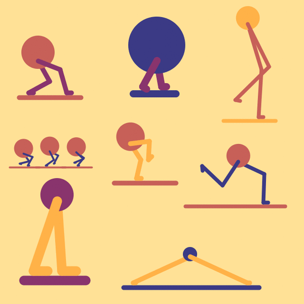
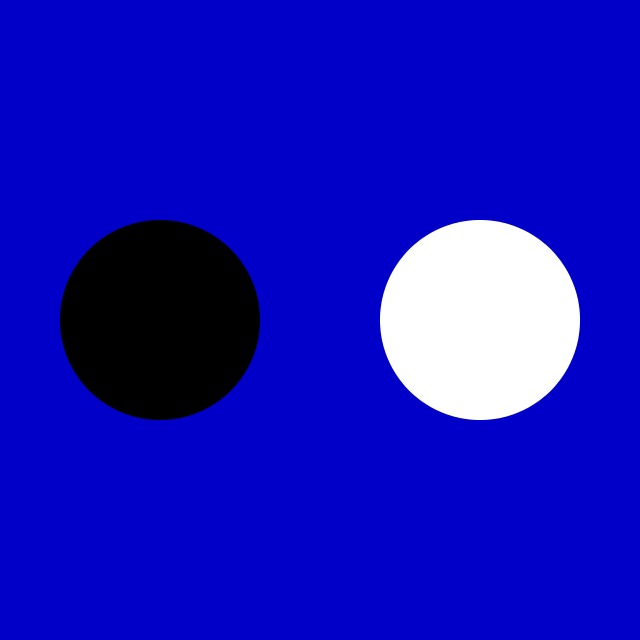

# Assignment Set #3

### Due Wednesday, September 10, 2025

   *GIF loops by previous School of Art undergraduates in this course.*

---

*Our third set of Deliverables is due at the beginning of class on Wednesday, September 10. The primary topics it emphasizes are animation, timing, and geometry. I estimate that it will take you about 6-7 hours. In addition to 4 creative coding projects, it also requires 2 brief Discord posts.*

***NOTE: I will have office hours next Tuesday evening (9/9/24) in CFA-303 from 5-11pm.*** *Lorie and I are also generally available on Discord for questions!*

---

## Readings & Looking Outwards

1. **Looking Outwards.** Spend 10-20 minutes checking out the work of professional loopmakers like: 
	* [Bees and Bombs](https://www.instagram.com/davebeesbombs/) [instagram](https://www.instagram.com/davebeesbombs/) / [tumblr](https://beesandbombs.tumblr.com/)
	* [Melissa Rodriguez](https://objkt.com/profile/tz1UtTasn4DTyb9rHYnLAjxSQHfkvAWtBbAQ/created)
	* [Etienne Jacob](https://bleuje.com/animationsite/)
	* [Cindy Suen](https://cargocollective.com/cindysuen)
	* [Lucas Zanotto](https://www.instagram.com/lucas_zanotto/?hl=en)
	* [Andreas Wannerstedt](https://andreaswannerstedt.se/oddly-satisfying-vol2)'s "Oddly Satisfying" series
	* [Paolo Ceric](https://patakk.tumblr.com/)
	* [DVDP](https://www.instagram.com/dvdp/)
	* [89a](https://www.89a.co.uk/)

	In the Discord channel `#3-Looking-Outwards`, **embed** or **post** a link to a loop that you appreciated, and **write** a sentence or two about what you liked.
2. **Reading**. Skim or read the article “[On Repeat: How to Use Loops to Explain Anything](https://www.propublica.org/nerds/on-repeat-how-to-use-loops-to-explain-anything)” by Lena Groeger, an information designer at ProPublica. This article is purely for your edification/entertainment; there’s no deliverable for this reading. It should take about 10-15 minutes to browse this elegant stack of inspirations.

---

## Projects

*The four projects below are due at the beginning of class on Wednesday, September 10th.*

* (30 minutes) [**3.1. Trigonometry, Iteration: Phyllotactic Spiral**](https://openprocessing.org/class/100952/#/c/101413) Use mathematics to reproduce an important pattern in nature.
* (45 minutes) [**3.2. Reproduce a Program from this Screen Recording**](https://openprocessing.org/class/100952/#/c/101416) An exercise in observation and forensic reverse-engineering.
* (45 minutes) [**3.3. Five-Second Timer**](https://openprocessing.org/class/100952/#/c/101414) Construct a five-second timer that causes an event.
* (2-4 hours) [**3.4. Rhythm Loop**](https://openprocessing.org/class/100952/#/c/101415) Explore visual rhythm by creating a seamlessly looping, animated GIF.

#### Additional Requirements

*For the main creative project, [**3.4. Rhythm Loop**](https://openprocessing.org/class/100952/#/c/101415):*

* **Create** a post in the Discord channel, `#3-rhythm-loop`
* **Ensure** that your GIF is under 10MB using a tool like [ezgif.com](https://ezgif.com/optimize).
* **Upload** your exported GIF to your Discord post.
* If you happen to have paper sketches of your design, **upload** a quick photograph of your sketches, so we can learn more about your process. 
* In your post, **write** a few sentences discussing your design.

---

