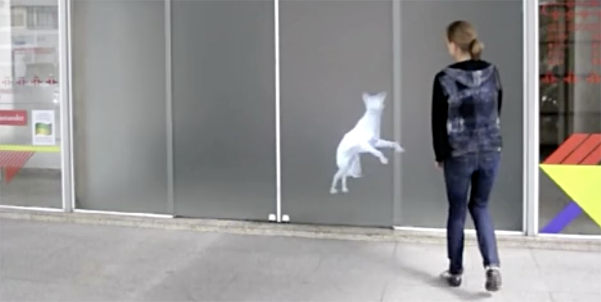

# Assignment Set #7: Body / Creature

In this project you are invited to create:

* An interactive software **creature**, **OR**
* An interactive software system that **responds** to and **augments** the Body/Face/Hands, **OR**
* An interactive software **creature that responds** to the Body/Face/Hands.

Ultimately this project is concerned with **interactivity and behavior**. Possible metaphors that could structure your project include (but are not limited to) concepts like: a virtual **pet**, a **puppet**, a **costume**, or a **terrarium**. The project is due in *two parts*, according to this schedule: 

* A working draft (40%), **due Monday 11/3**. *Note, this will be graded.*
* A revised version (60%) **due Wednesday 11/12**.

 [*Sniff*](https://vimeo.com/13791894) by Karolina Sobecka and James George (2011)

---

## A Living Thing that Responds to the User

*(10 hours, due Monday 11/3)* For this project, you are asked to make and document software which creatively interprets, uses, or responds to the actions and gestures of a person's **body, face, or hands** — a treatment of real-time data captured (with a camera) from a person’s actions. For example: 

* One form your software might take is a **virtual life form**. This could be (for example) a sensate creature, a dynamic flock or swarm, an artificial cell-culture, or an ecosystem, whose behavior is algorithmically generated in response to the user's actions. By placing a creature into feedback with external forces or subjects, and especially with the actions of an interacting user, we can create companions that stave off loneliness or appear to have feelings, virtual pets like the Tamagotchi that evoke empathy through their fragility, or sublime simulated ecosystems that evolve in surprising ways.
* Alternatively, you might make a **costume or a puppet**; if you do, consider whether your treatment is a form of entertainment, or whether it serves a ritual purpose, a therapeutic purpose, a practical purpose, or something else. It could be a costume that allows you to assume a new identity, inhabiting something nonhuman or even inanimate.  It could interact with a simulated environment with articulated parts and dynamic behaviors. It may blur the line between self and others, or between self and not-self. 
* *Note: you are not limited to creatures, costumes, or puppets.* You could create a game; your project could be a musical instrument; it could be a drawing tool; it could be an abstract visual composition; it could be a tool for analyzing and visualizing human movement. Be prepared to explain your creative decisions. 

To share your project in documentation, you are asked to record a short video in which you use it. Design your software for a specific "performance" or "demonstration", and plan your recording with your software in mind. Rehearse and record your performance/demonstration. 

*Now:*

* For Monday 11/3, **create** a working *draft* of your project using p5.js. Some links to code for template projects are provided below. **Upload** your project to the corresponding slot (#7a) in our OpenProcessing classroom, and **post** a few screenshots and a brief description of your project in the Discord channel, `#7a-draft`. 
* For Wednesday 11/12, **upload** a revised version of your project to the correct slot (#7b) in our OpenProcessing classroom, 
* ...and **enact** a brief demonstration or performance that makes use of your software. Be deliberate about how you perform, demonstrate, or use your software. **Consider** how your demo-performance should be tailored to your software, and your software should be tailored to your performance. (It may help to write a script for your performance or demo narration.) Then,
* **Document** (25%) your demonstration or performance by making a video recording that is at least 15 seconds long. Store this in an *Unlisted* (**not** Private) video on YouTube or Vimeo. 
* **Write** (10%) a post in the `#7b-body-creature` channel on Discord. **Include** the link to your video. **Include** about 100 words (3-5 sentences) that explain and evaluate your project. 
* **Include** at least two screenshots in your Discord post, in addition to the video link.

 [*Puppet Parade*](https://vimeo.com/34824490) by Emily Gobeille & Theo Watson (2012)

---

## Code Resources

For this project, you are encouraged to use [**this Google Mediapipe all-in-one template**](https://openprocessing.org/sketch/2760298); these ml5.js starters for [face](https://openprocessing.org/sketch/2417226), [body](https://openprocessing.org/sketch/2417039), and [hand](https://openprocessing.org/sketch/2417093) tracking; and some code for [using the microphone](https://openprocessing.org/sketch/2189436) (if you wish). I have ported these to OpenProcessing so that you can easily fork/work on your projects there. 

**NOTE**: *If you need a template that supports multiple interaction modalities simultaneously, talk to the professor about possibilities.*

### Starter template code: 

* **Holistic**: [MediapipeHolistic-2025](https://openprocessing.org/sketch/2760298)
* **Expression metrics**: [MediaPipe-FaceMetrics-2025](https://openprocessing.org/sketch/2066195)
* **Microphone 1**: [Simple Mic Demo](https://openprocessing.org/sketch/2189445)
* **Microphone 2**: [p5-Microphone-Demos-2025](https://openprocessing.org/sketch/2189436)

### Some simple demonstrations: 

* [ml5-BodyBroccoli-2025](https://openprocessing.org/sketch/2187655)
* [ml5-Mask-2025](https://openprocessing.org/sketch/2187420)
* [BigMouth-2025](https://openprocessing.org/sketch/2071101)
* [FaceExtractor-2025](https://openprocessing.org/sketch/2195649)
* [ml5-HandPuppet-2025](https://openprocessing.org/sketch/2187485)
* [ml5-handPose+Matter-2025](https://openprocessing.org/sketch/2064673)

---

*Optionally*, **Read** Zach Lieberman's [*Más Que la Cara* Overview](https://zachlieberman.medium.com/m%C3%A1s-que-la-cara-overview-48331a0202c0) (2017). It's a nice writeup about a face-tracking project, from conceptualization to execution, art to tech. Then, in the Discord channel, `#08-reading-response`, **write** a sentence about something you observed or found interesting in the project. This is an estimated 12-minute reading.

 [*Más Que la Cara* Overview](https://zachlieberman.medium.com/m%C3%A1s-que-la-cara-overview-48331a0202c0) by Zach Lieberman (2017)

<!-- 
[*2023 assignment version*](https://golancourses.net/fall23/deliverables/07-gesture-expander/)
-->
