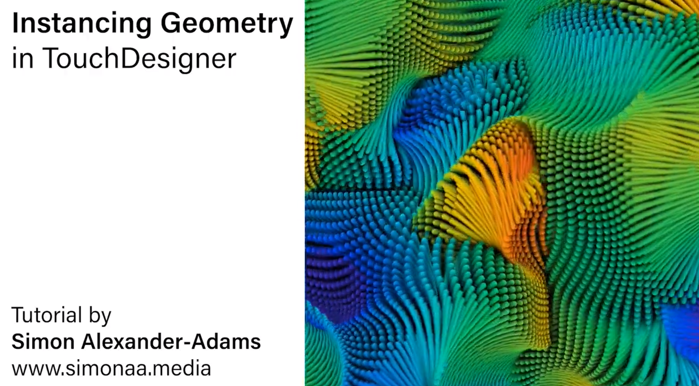
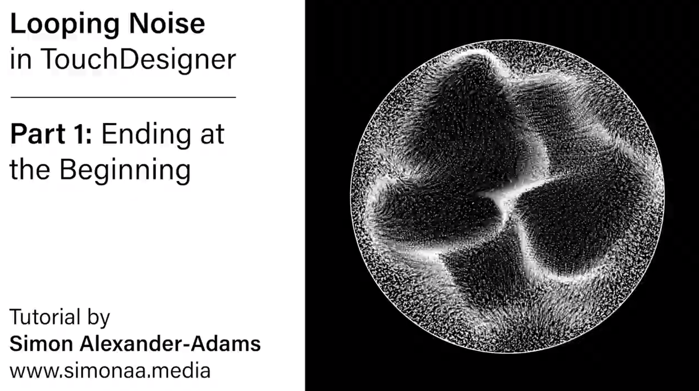
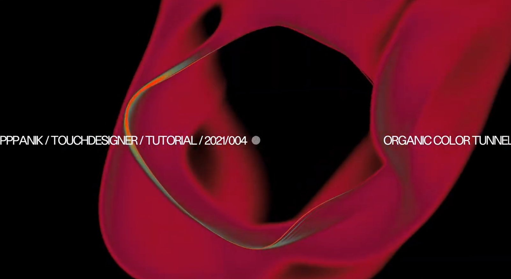
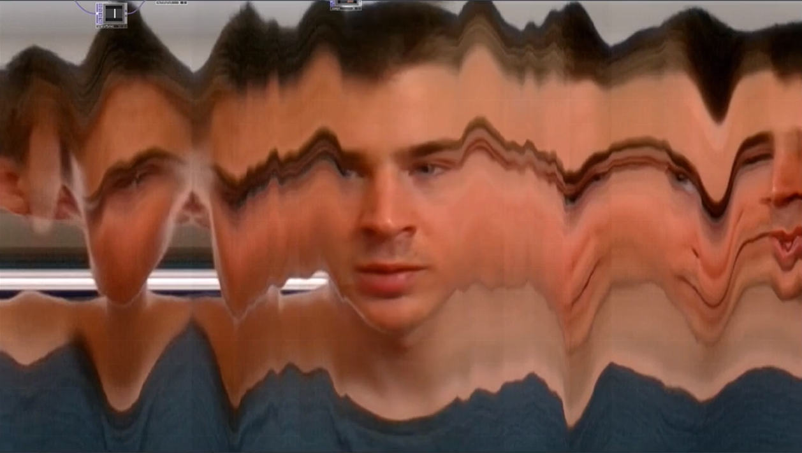
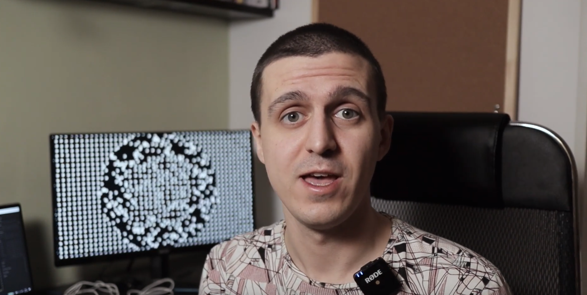
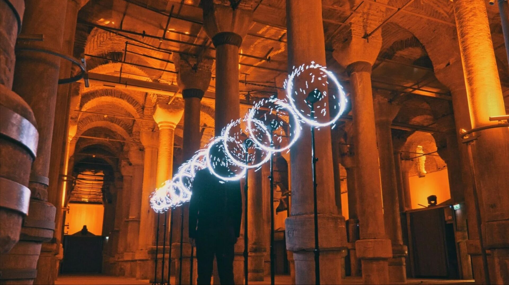

# TouchDesigner: Interactive Environment

In this assignment, we will have a more open ended interactive assignment that will emphasize on visualising and mastering a real-world input. 

* 8.4: Intermediate Instancing and Feedback Warmup Tutorials *(10% 2.5 hours, Due 11/24)*
* 8.5: Interactive Environment *(70%, >5 hours, Due 12/7)*

---
## 8.4 : Instancing and Feedback Tutorials

*Due Monday November 24; 2-3 hours.* We are still learning the basics. For next monday 11/24, **do** the following:

* **Watch**: [Shapes and Colors](https://learn.derivative.ca/courses/100-fundamentals/lessons/102-tops-working-with-images/topic/shapes-colors/) (5 minutes)
* **Watch**: [Basic Compositing](https://learn.derivative.ca/courses/100-fundamentals/lessons/102-tops-working-with-images/topic/basic-compositing/) (5 minutes)
* Feel free to **watch** any of the other sections of the [100-series Working with Images lectures](https://learn.derivative.ca/courses/100-fundamentals/lessons/102-tops-working-with-images/). 
 
Then: **follow along** and **execute** these two TouchDesigner tutorial projects, shown below, on **Feedback** and **instancing**. Feedback and instancing are two effects that are common workflows I would like you all to have a mastery of. They are not difficult, but expand your arsenal. Your final project does not need to include them, but they may be useful for you to have available.

### 8.4.1. Instancing

Do **one** of the following tutorials on Instancing:

* [**Instancing** Mild 🌶️ Geometry with Mouse Interactivity](https://www.youtube.com/watch?v=SJZIMGg-thY)
* [**Instancing** Mild 🌶️ Instancing Basics](https://www.youtube.com/watch?v=BFG-FBKuJow)
* [**Instancing** Spicy 🌶️🌶️ Looping Noise](https://www.youtube.com/watch?v=TGYO1WcT5ys)

### 8.4.2. Feedback 

Do **one** of the following tutorials on Feedback:

* [**Feedback** Mild 🌶️  Color Tunnel](https://www.youtube.com/watch?v=gHPrDMqOmJ0)
* [**Feedback** Spicy 🌶️🌶️ Feedback Spitscanner](https://www.youtube.com/watch?v=jOcMCGtclBs)
* [**Feedback** Extra Spicy 🌶️🌶️🌶️ Feedback Influenced Instancing](https://www.youtube.com/watch?v=Qv2nTk4lr-E) (goes very fast, take your time, pause and slow down the video if necessary)

Once you complete the tutorials, **change** SOMETHING SMALL about them. It could be something as miniscule as the period of the noise, or the shape of your instancing objects, or the color scheme. Do some simple transformation on top of the base tutorial to show that you know how certain characteristics of the patch work. 

*Now,* in a Discord post in the `#8-4-warmup` channel, please do the following:

* **Embed** a brief moving image (screen-captured video, animated GIF, or unlisted YouTube link) for each of the two project tutorials. It doesn’t have to be a fancy or lengthy video; I just need to see receipts. (However, if you'd like to know how to export a noce clean video, follow [this tutorial](https://www.youtube.com/watch?v=G01ZRJpkDCA).)
* **Write** a sentence or two about your experience. What do you appreciate about TouchDesigner? What concerns or confusions do you have? What did you change in the project, and how?

---

## 8.5 Interactive Environment

*(70%, >5 hours due 12/3 + Revised 12/7)* 

* **Create** a Touchdesigner patch that creates a graphic corresponding to some sort of **INPUT**. This could be a camera, computer vision, a serial device like Arduino, Google MediaPipe bodytracking, audio (like the TouchDesigner [audioAnalysis](https://www.youtube.com/watch?v=Qnuc-TEDmaI) tool), keyboard input, etc.

This project will have multiple phases over the rest of the semester: 

* Monday 12/01 will be a work day. 
* Wednesday 12/03 will be a small showing of work-in-progress, or sketches of what you intend to do. This is non-binding. What you show in the WIP does not limit what you can do for the final submission.
* 12/7: final presentations and celebration of your work.

### Project 8 Final Deliverables

*You'll give final presentations on Sunday evening, December 7th from 5:30-8:00pm in our classroom. You should have the following prepared:*

* **Video Documentation**. Create a brief video to document your project. This likely means you will **export an .mp4 file and create an unlisted YouTube video**. Instructions on how to export .mp4 videos from TouchDesigner are [here](https://www.youtube.com/watch?v=DSpaWDQP5O4). Depending on your project, it may also be helpful for you to record and intercut "over-the-shoulder" (camera) video of you using your interactive software, interface hardware, etc. If you do appear in your documentation, give consideration to lighting, your choice of environment, your 'costume', and rehearsing your 'performance'. 
* **Create a post** in the `#8-6-interactive-environment` Discord channel.
* In the post, **write 1-2 paragraphs** (150-200 words) about your project: what it *is*, what your *goals* were, the *challenges* you overcame in developing it, and your *evaluation* of the results. Be sure to **acknowledge** any inspirations or sources of assistance.
* In the post, **link** to your YouTube video documentation. **Make sure** the video is set to unlisted/public (and not "private").
* In the post, **include 1-3 images** of your project. These might be screengrabs, photographs, sketches, diagrams, etc.
* **Final Presentation**. In our special evening session on Sunday December 7, **give a 3-5 minute presentation** about your project. (The class will provide feedback in a collective Google doc.)

---
