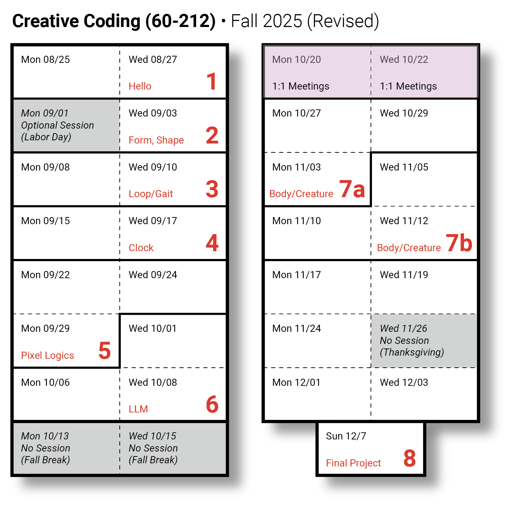

# 8/25/2025

Welcome to the **[Fall 2025 edition of *Creative Coding* at CMU](https://github.com/golanlevin/60-212/blob/main/2025/readme.md)!**

---

## Agenda

* *Moment of Mindfulness:* [**Tokyo Strut**](https://www.youtube.com/watch?v=4M-j0Wnjb7Q&t=6s) by Masahiko Sato
* [**Introductions**](#introductions) 
* [**Logistics**](#logistics) 
* [**What is Creative Coding?**](#what-is-creative-coding)
* [**Let's Get To Work**](#lets-get-to-work) 

---
## Introductions

*Who's in this room?*

* About the Professor, [Golan Levin](https://art.cmu.edu/people/golan-levin/): Here are a few things I've done — art with [Generativity](https://www.artblocks.io/collection/cytographia-by-golan-levin) • [Artificial Intelligence](https://github.com/golanlevin/AmbigrammaticFigures) • [Lasers](http://flong.com/archive/projects/gpp-ii/index.html) • [Robots](http://flong.com/archive/projects/snout/index.html) • [Weird performance](http://flong.com/archive/projects/messa/index.html) • [Creative Coding pedagogy](https://mitpress.mit.edu/9780262542043/code-as-creative-medium/)
* About our Teaching Assistant, [Lorie Chen](https://www.loriechen.com/) (BCSA '26)
* Please introduce yourselves! 

---
## Logistics

*How does this class work?*

* [**Syllabus Review**](../syllabus/60-212_syllabus_fall2025.md)
* [No Tourists](../../2024/daily_notes/images/0826/no-tourists.jpg) 
* [Art will save us](../../2024/daily_notes/images/0826/maeda_nyt.jpg)
* This course is *doubly-intermediate*.
* Some students have reported that this is the hardest class you will take at CMU.
* [You're growing up](../../2024/daily_notes/images/0826/baby-bird-worm.gif). Inevitably, in this course, you'll have to figure some things out yourself.
* Playing a sport or musical instrument requires *practice*. This course is a type of athletic training. 
* Thankfully, units do not build on each other. If you miss a unit, just move on.
* [Make (lots of) shoddy work](images/fast-cheap-good.jpg).

In *Art & Fear*, authors David Bayles and Ted Orland tell a vivid parable:
>  A ceramics teacher split their class in two on the first day. One group would be graded on quantity—they must produce many pots (e.g. fifty pounds scores an *A*, etc.). The other group was graded on quality—just one near-perfect pot is sufficient for an *A*. At semester’s end, the highest-quality work came from the quantity group. While those students learned through trial and error, the quality-focused group overthought and produced little usable work.

### Key Upcoming Dates

Here's a look ahead at the next month:

* `Wed 08/27`: **[Assignment Set 1](../assignments/assignment_1.md) Due**
* `Wed 09/03`: **Assignment Set 2 Due**
* `Wed 09/10`: **Assignment Set 3 Due**
* `Wed 09/17`: **Assignment Set 4 Due**
* `Thu 09/18`: 5:30pm: [Artist talk at the STUDIO: experimental animator Jodie Mack](https://studioforcreativeinquiry.org/events/jodiemack25)
* `Sat 09/20`: 10am-5pm: [Pittsburgh Art Book Fair](https://carnegieart.org/event/pittsburgh-art-book-fair-2025/), at the Carnegie Museum of Art

---

## What is Creative Coding?

*What is this class about?*

* **MAIN LECTURE PRESENTATION:** [**An Introduction to Poetic Computing**](https://github.com/golanlevin/lectures/blob/master/lecture_introduction/readme.md)
* Who *does* creative coding?
  * Here's a [list of some creative-technology studios](../../resources/studios.md)
  * Why is [creative coding important?](https://github.com/golanlevin/60-212/blob/main/2024/daily_notes/importance.md)
  * Example spotlight on Maya Man (born 1996): [Homepage](https://mayaontheinter.net/), at [Feral File](https://feralfile.com/explore/artists/maya-man-75d), at [Google Creative Lab](https://experiments.withgoogle.com/billtjonesai), in an [interview](https://verse.works/journal/in-conversation-with-maya-man-im-feeling-lucky-2).

**Time permitting:**

* [**Generative art**](https://github.com/golanlevin/60-120/blob/main/2025/lectures/creative_code/readme.md)
* [Additional themes and viewings](https://courses.ideate.cmu.edu/60-212/s2022/daily-notes/01-19-hello/themes-and-viewings/) (Immersivity, generativity, autonomy, transmediality, connectivity.)
* *Some recommended works in poetic computing:*
	* Scott Snibbe, [*Boundary Functions*](https://www.snibbe.com/digital-art#/projects/interactive/boundaryfunctions/), 1998
	* Camille Utterback & Romy Achituv, [Text Rain](https://www.youtube.com/watch?v=f_u3sSffS78), 1999
	* Christine Sugrue, [*Delicate Boundaries*](http://csugrue.com/delicateboundaries/), 2007
	* Camille Scherrer, [*Le Monde Des Montagnes*](https://vimeo.com/49153795), 2008
	* Theo Watson & Emily Gobeille, [*Weather Worlds*](http://design-io.com/projects/WeatherWorlds/), 2013
	* Zachary Lieberman, [*Más Que la Cara*](https://vimeo.com/211271693), 2016
	* Madeline Gannon, [*Mimus*](https://atonaton.com/mimus/), 2016
	* Everest Pipkin, [*Moth Generator*](https://twitter.com/mothgenerator), 2015
	* Kate Compton, [*Puppets*](http://www.galaxykate.com/apps/unpublic/puppet/index.html), 2017
	* Michael Chang, [*Generative Machines*](https://web.archive.org/web/20200513075153/http://machines.chromeexperiments.com/), 2011
	* Matthias Dörfelt, [*Munching*](https://www.mokafolio.de/works/Munching), 2014
	* Lauren McCarthy, [*Social Turkers*](http://lauren-mccarthy.com/Social-Turkers)
	* Miranda July, [*Somebody* app](https://vimeo.com/105256055)

---
## Let's Get To Work

*How do I get started?*

* Look at the [p5.js Reference](https://p5js.org/reference/) or [the older version](https://archive.p5js.org/reference/)
* Look at our [OpenProcessing classroom](https://openprocessing.org/class/100952#/). *(Peek at classrooms from [2024](https://openprocessing.org/class/93074#/) and [2023](https://openprocessing.org/class/86356#/)!)*
* Let's [make a new sketch at OpenProcessing](https://openprocessing.org/sketch/create), and submit it.
* [**Walkthrough of Assignment #1**](../assignments/assignment_1.md), due this Wednesday
* Don't forget the [**Welcome Form & Exit Ticket**](https://forms.gle/L4FDuXApCnWMobiX7)!

<!--

### Regarding AI

This course will intersect with AI in a lot of different ways: for example, as a subject for creative exploration, but also as a tool to help you realize your work. 

The best creative coders I know use AI routinely, as do I. That said, if I'm giving you a problem that could be solved entirely by AI, then one of the following things must be the case:

* I'll be crystal clear about the fact that I want you to do it yourself, *regardless*, OR
* I'm expecting you to use AI, *dammit*; why are you wasting your time, OR
* I didn't give you an interesting problem; it's my fault, OR
* You haven't found a way to make it *your own* —or you didn't even think to try

-->

