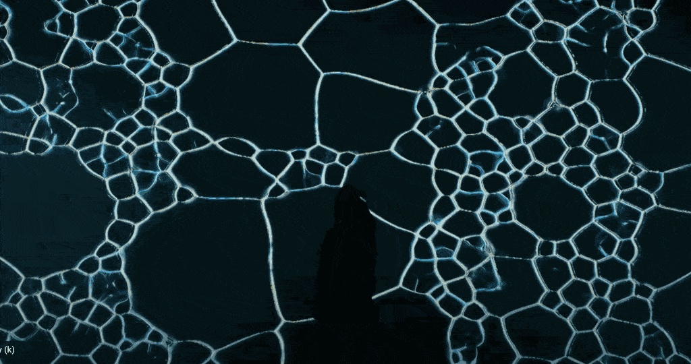

# Monday, November 24, 2025

---

 *[The improvisation of water](https://www.youtube.com/watch?app=desktop&v=SbYtIiZdrew)* (2023) by Ahyun Cho

## Agenda 

* TD Recap — view feedback and instancing tutorial work in #8-4-warmup
* Useful Stuff
* MediaPipe in TouchDesigner
* Arduino, Littlebits

---

### TD Recap (was due today)

* **Watch**: [Shapes and Colors](https://learn.derivative.ca/courses/100-fundamentals/lessons/102-tops-working-with-images/topic/shapes-colors/) (5 minutes)
* **Watch**: [Basic Compositing](https://learn.derivative.ca/courses/100-fundamentals/lessons/102-tops-working-with-images/topic/basic-compositing/) (5 minutes)
* *Then*: **Do** [Feedback and Instancing tutorials for assignment 8.4](https://github.com/golanlevin/60-212/blob/main/2025/assignments/assignment_8b.md#84--instancing-and-feedback-tutorials). 

---

### Useful Stuff

* [Texture instancing](https://www.youtube.com/watch?v=m5ZupBiaZGE) (Collage Typography tutorial video)
* Feedback
	* [The Feedback TOP](https://vimeo.com/1094478432/d864d256f5) (official explanation video)
	* [gl_feedback.toe](resources/touchdesigner/gl_feedback.toe) (simple demo)
* [Recording a video out](https://www.youtube.com/watch?v=G01ZRJpkDCA) (explanation video)
	* On Mac, the h.264 codec may not work.
	* 30fps should suffice for most purposes.
	* [Reference your audio CHOP if you want audio](images/movie-file-out.webp)
* Motion extraction by frame-differencing (the Cache object)
	* [Explanation](https://www.youtube.com/watch?v=NSS6yAMZF78) video
	* [Em Demo](https://www.youtube.com/watch?v=KC8H0V2Ystw) video
	* [gl_frame_differencing.toe](resources/touchdesigner/gl_frame_differencing.toe) (simple demo)
* Audio reactive visuals
	* [Audio reactive visuals](https://www.youtube.com/watch?v=R7sAomk2vR4) (video tutorial)
	* [How to Use Audio Analyzer in TouchDesigner](https://www.youtube.com/watch?v=Qnuc-TEDmaI) (video tutorial)
	* [gl_audio_analysis.toe](resources/touchdesigner/gl_audio_analysis.toe) (simple demo)
* Arduino communication
	* [repository with Arduino setup](https://github.com/golanlevin/p5-littleBits)
	* [gl_littlebits_arduino.toe](resources/touchdesigner/gl_littlebits_arduino.toe) (simple demo)

---
 
### MediaPipe in TouchDesigner

* [TouchDesigner Mediapipe Plugin on Github](https://github.com/torinmb/mediapipe-touchdesigner) (Repo) and [Downloads](https://github.com/torinmb/mediapipe-touchdesigner/releases)
* [gl_mediapipe_handtracking_demo.toe](https://cmu.box.com/s/c7bgn08l0ugaxbfy7y6al3qw369jpxpk) (Simple demo, 180MB download)
* TD+Mediapipe video tutorials, FYI: 
	* [MediaPipe Motion Tracking plugin for TouchDesigner](https://www.youtube.com/watch?v=Cx4Ellaj6kk) (30m video explanation)
	* [Hand Tracking in TouchDesigner - Master Class Part 1](https://www.youtube.com/watch?v=e2FtkufeErY)
	* [Watercolor Hand Tracking Brush](https://www.youtube.com/watch?v=IATX3biLoZg)

---

### 🌶️ Other interesting plugins: 

* Stable Diffusion in TouchDesigner
	* [Generate AI Images with Stable Diffusion](https://www.youtube.com/watch?v=mRXTR9vcHAs)
	* [Real-time diffusion in TouchDesigner - StreamdiffusionTD Setup](https://www.youtube.com/watch?v=X4rlC6y1ahw)
* [DepthAnything](https://www.youtube.com/watch?v=9-e4MguRDA0&t=35s) depth estimation

---
