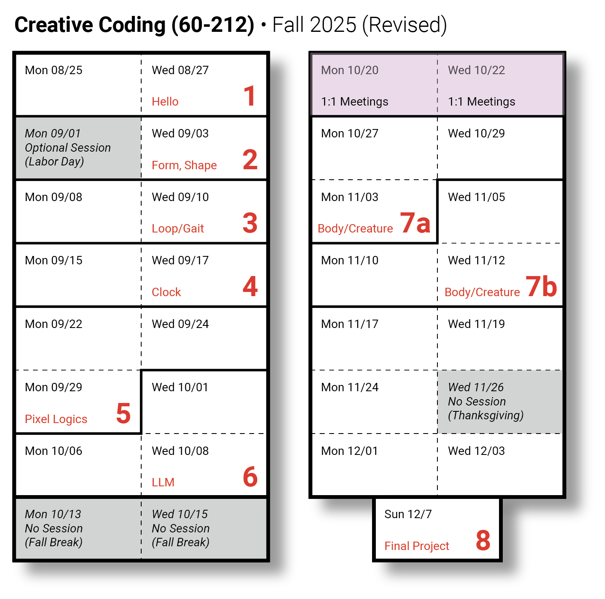

# Creative Coding (60-212) • Fall 2025

* Creative Coding [Fall 2025 Syllabus](syllabus/60-212_syllabus_fall2025.md)
* OpenProcessing Classroom: [https://openprocessing.org/class/100952](https://openprocessing.org/class/100952#/)
* Time and Location: Mon/Wed, 2:00-4:50pm in CFA-318
* Professor: [Golan Levin](http://www.art.cmu.edu/people/golan-levin/), golan@andrew
* Assistant: [Lorie Chen](https://www.loriechen.com/), ylchen@andrew

---

## Assignments

* `Wed 08/27`: [**Assignment Set 1**](assignments/assignment_1.md) Due: *Getting Started*
* `Wed 09/03`: [**Assignment Set 2**](assignments/assignment_2.md) Due: *Form and Shape*
* `Wed 09/10`: Assignment Set 3 Due: *Looping Movement*
* `Wed 09/17`: Assignment Set 4 Due: *Timekeeping*
* `Mon 09/29`: Assignment Set 5 Due: *Pattern and Pixel Logics*
* `Wed 10/08`: Assignment Set 6 Due: *LLM Interactivity*
* `Mon 10/27`: Assignment Set 7 Due: *Gesture-Mapping and Augmented Body*
* `Wed 11/05`: Assignment Set 8 Due: *Telematic System*
* `Mon 11/17`: Assignment Set 9 Due: *Code and Diffusion*
* `12/08-12`: Assignment Set 10 Due: *Final Project*

---

## Special Events

*Your attendance at these artist talks is very strongly encouraged:*

* `Mon 10/06`: [Daniel Temkin artist talk](https://danieltemkin.com/), STUDIO for Creative Inquiry, 5:30pm 
* `Tue 10/21`: [Everest Pipkin artist talk](), Kresge Theater, 5:30pm.

## Daily Notes, Lectures, & Events

* `Mon 08/25` [Hello World!](daily_notes/20250825.md)
* `Wed 08/27` #2 Due. 
* `Mon 09/01` — *No session (Labor Day)*
* `Wed 09/03` 
* `Mon 09/08`  
* `Wed 09/10` #3 Due.
* `Mon 09/15` 
* `Wed 09/17` #4 Due.
* `Mon 09/22` 
* `Wed 09/24` 
* `Mon 09/29` #5 Due.
* `Wed 10/01` 
* `Mon 10/06` 
* `Wed 10/08` #6 Due.
* `Mon 10/13` — *No session (Fall Break)*
* `Wed 10/15` — *No session (Fall Break)*
* `Mon 10/20`
* `Wed 10/22` 
* `Mon 10/27` #7 Due.
* `Wed 10/29` 
* `Mon 11/03` 
* `Wed 11/05` #8 Due.
* `Mon 11/10` 
* `Wed 11/12` 
* `Mon 11/17` #9 Due.
* `Wed 11/19` 
* `Mon 11/24` 
* `Wed 11/26` — *No session (Thanksgiving)*
* `Wed 12/01` 
* `Mon 12/03` 
* `TBA, 12/8-12` — #10 Due.
* `Mon 12/15`

---

<!--

* `Mon 08/26`: [Hello World!](daily_notes/20240826.md)
* `Wed 08/28`: [Code & Form](daily_notes/20240828.md)
* `Wed 09/04`: [Movement](daily_notes/20240904.md)
* `Mon 09/09`: [Movement, Loops, Shaping Functions](daily_notes/20240909.md)
* `Wed 09/11`: [Guest lecture; Clocks](daily_notes/20240911.md)
* `Mon 09/16`: [Timekeeping (cont'd)](daily_notes/20240916.md)
* `Wed 09/18`: *Work session class; Golan away.*
* `Mon 09/23`: [Timekeeping worksession](daily_notes/20240923.md)
* `Wed 09/25`: [Timepiece Review](daily_notes/20240925.md)
* `Mon 09/30`: [AI + Worksession](daily_notes/20240930.md)
* `Mon 10/07`: [Computational Color](daily_notes/20241007.md)
* `Mon 10/07`: [Color+](daily_notes/20241009.md)
* `Mon 10/21`: [Pixel Logics I](daily_notes/20241021.md) + [Em](daily_notes/20241021_em.md)
* `Wed 10/23`: [Pixel Logics II](daily_notes/20241023.md)
* `Mon 10/28`: [Body Tracking](daily_notes/20241028.md)
* `Wed 10/30`: [Full-Body Interactive Art](daily_notes/20241030.md)
* `Mon 11/04`: *Work session for Body/Gesture project*
* `Wed 11/06`: [Teachable Interactions](daily_notes/20241106.md)
* `Mon 11/11`: [Introduction to ComfyUI](daily_notes/20241111.md)
* `Wed 11/13`: [Worksession for AI projects](daily_notes/20241113.md)
* `Mon 11/18`: Critique of Project 9
* `Wed 11/20`: TouchDesigner tutorial by Em
* `Mon 11/25`: [TD interaction & LittleBits](daily_notes/20241125.md)
* `Mon 12/02`: TouchDesigner worksession
* `Wed 12/04`: TouchDesigner worksession
* `Tue 12/10`: Final Presentations, 5:30-8:30pm
* `Mon 12/16`: *Remaining deliverables due, 12 Noon.*

Body/gait interp things to see: 
https://x.com/yugop/status/1842149619167531174
https://x.com/jtchomko/status/1935364536623562853?s=46&t=UdwSqA9DrI0efjW7u0Ittw

Shader template: 
https://openprocessing.org/sketch/2334454

-->

