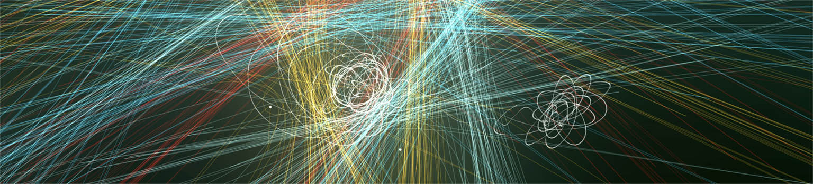
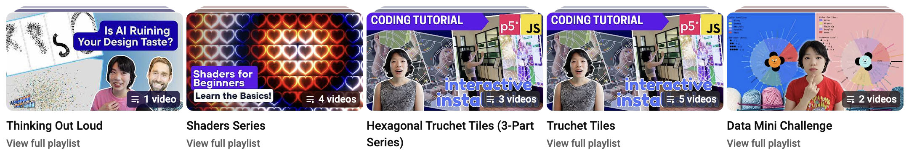
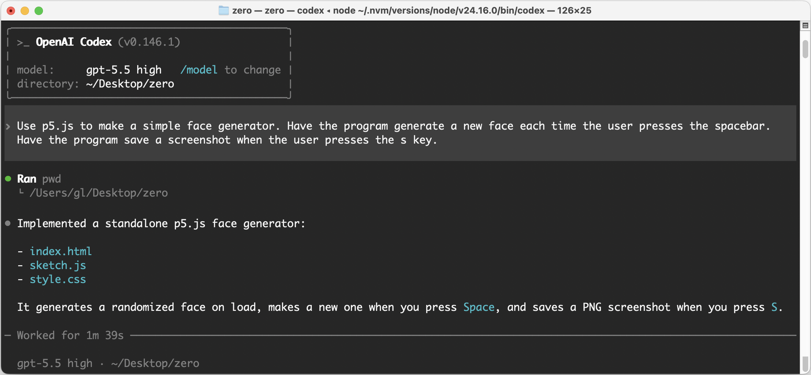
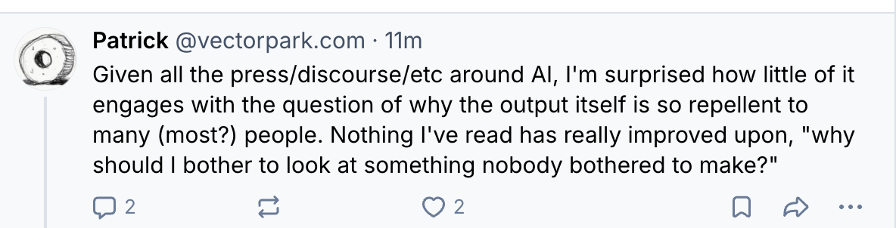
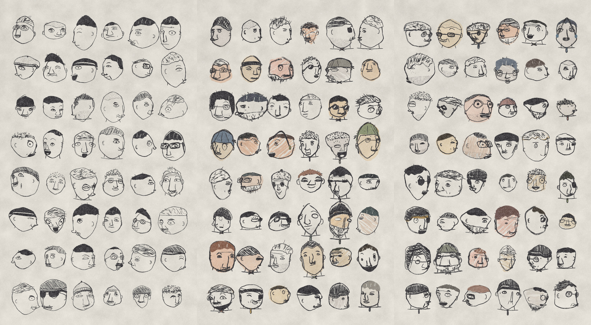
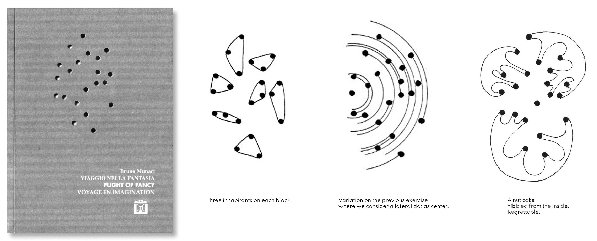
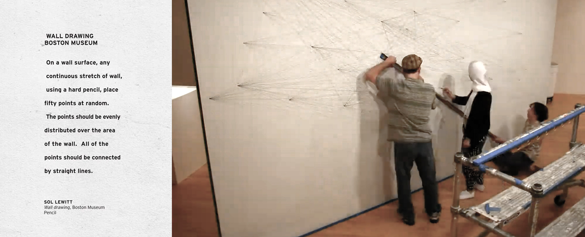
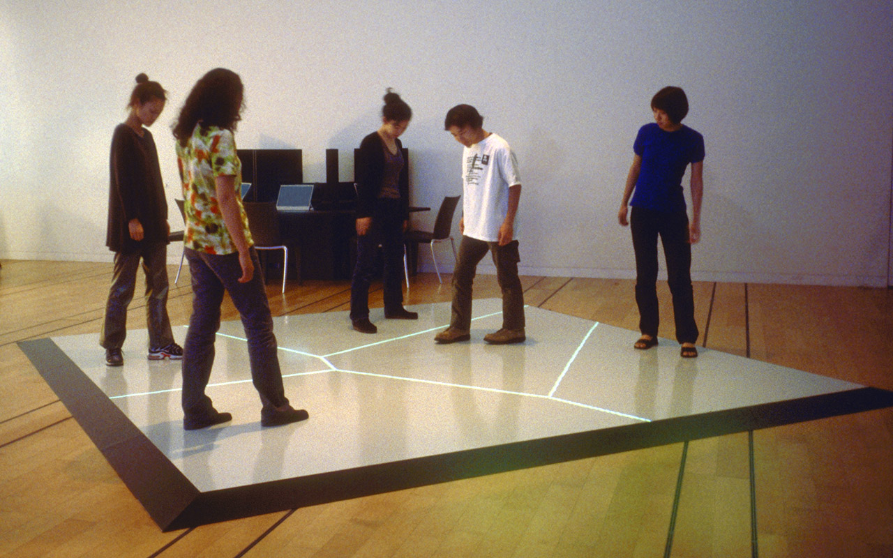
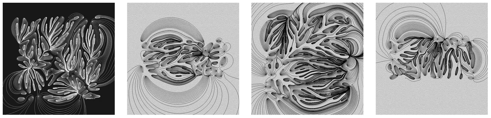
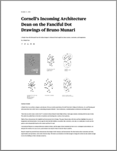

# Assignment Set #1

## Getting Started; Points and Lines

### Due Wednesday, August 26, 2026

---

*This set of deliverables is due by the beginning of class on Wednesday 8/26. There are six main sets of tasks, the total of which should take 5-6 hours:*

* 1.1. [Administrative Tasks](#11-administrative-tasks) *(30 minutes, 10%)*
* 1.2. [Share a Touchstone](#12-share-a-touchstone) *(15 minutes, 5%)*
* 1.3. [p5.js Wayfinding](#13-p5js-wayfinding) *(30 minutes, 5%)*
* 1.4. [Test Your Coding Agent: Zero-Shot Generation](#14-test-your-coding-agent-zero-shot-generation) *(10-30 minutes, 5%)*
* 1.5. [**One Point Set, 27 Ways**](#15-one-point-set-27-ways) *(4 hours; "Main Project")*
  * [1.5.0. Overview](#150-overview)
  * [1.5.1. Part A: Coding](#151-part-a-coding) (*60 minutes, 15%*)
  * [1.5.2. Part B: Summoning](#152-part-b-summoning) (*60 minutes, 15%*) 
  * [1.5.3. Part C: Inventing](#153-part-c-inventing) (*2 hours, 35%*) 
* 1.6. [Reflection](#16-reflection) (*30 minutes, 10%*)

*Note that these exercises are not as open-ended as the others you'll encounter this semester.*

---

## 1.1. Administrative Tasks

(***30 minutes***) Please **complete** the following administrative tasks:

* (*1 minute*) **Bookmark** our [Course GitHub](https://github.com/golanlevin/60-212/blob/main/2026/readme.md) in your laptop's browser, so you can easily find it. Assignments and lecture notes will be shared here.
* (*1 minute*) **Create** an ID on [Discord.com](https://discord.com/), if you don't already have one. **Join** our class Discord, using the invitation sent to you by email. **Browse** our server's channels so you know what's where.
* (*1 minute*) In the `#11-introductions` channel of our course Discord, **introduce** yourself in a sentence or two. Please **share** something about yourself — pets, favorite food, arcane superpowers, etc.
* (*2 minutes*) **Create** an ID on [OpenProcessing.org](https://openprocessing.org) (if you don't already have one). **Join** our [OpenProcessing classroom](https://openprocessing.org/class/107236/#/), using the invitation sent to you by email, and **bookmark** it in your laptop's browser. Take a moment to **browse** some of the sketches that people have published at [https://openprocessing.org/discover](https://openprocessing.org/discover). *(Note: the quality varies widely.)* **Run** the programs, and be sure to **look** at their code (*command-shift-return* may help switch to the code view).
* (*15 minutes*) **Review** our [**Syllabus**](../syllabus/README.md) carefully (!) 
* (*10 minutes*) **Complete** the 2026 [**60-212 Welcome Form**](https://forms.gle/Dtg5fU9wtkG6q3Fm7).

---

## 1.2. Share a Touchstone

 *Helen Evans & Heiko Hansen, [Nuage Vert](https://vimeo.com/17350218) (2008)*

(***15 minutes***) You are asked to share a "touchstone" — a computational project (made by someone else) that you admire, hold close to your heart, or find yourself thinking about often. The purpose of this exercise is to help us become familiar with your interests and tastes — and for you to be able to share something interesting with your peers. I also want to make sure that you're able to access and use the Discord.

* **Recall** a project you have admired (by someone else) which you feel falls under the broad umbrella of "Creative Coding".
* **Create** a post in the `#12-touchstone` channel in our course Discord. 
* **Describe** the project in a few sentences, and in your own voice, **explain** what you like about it. It's sufficient to write 3-5 sentences. *Please don't write with AI here.*
* **Answer** the questions: *Who* made this project? (Was it an individual, a small team, a big company?) *Why* did they make it, or for whom (what kind of audience)?
* **Include** a link (URL) to the project and/or its documentation (such as a YouTube video).
* **Embed** an image of the project in your Discord post. 

---

## 1.3. p5.js Wayfinding

(***30 minutes***) The purpose of this task is to help ensure that you know where to find good-quality information about the p5.js toolkit, such as documentation and tutorials. 

* (*10 minutes*) **Browse** the [p5.js Reference](https://p5js.org/reference/). Examine at least ten Reference pages, starting with the [Shape commands](https://p5js.org/reference/#Shape). Note that most of the Reference pages allow you to see the effects of tinkering with the code.
* (*10 minutes*) **Browse** the [p5.js Examples](https://archive.p5js.org/examples/) archive, which are organized thematically. Review at least ten p5.js Examples, skimming their code. 
* (*10 minutes*) **Browse** some of the many free YouTube tutorials for p5.js, which range from [completely introductory](https://www.youtube.com/watch?v=HerCR8bw_GE&list=PLRqwX-V7Uu6Zy51Q-x9tMWIv9cueOFTFA) to impressively advanced. Some legendary p5 YouTubers include:
  * [Dan Shiffman](https://www.youtube.com/@TheCodingTrain/playlists) (Coding Train)
  * [Patt Vira](https://www.youtube.com/@pattvira/playlists) (CMU alum!)
  * [Xin Xin](https://www.youtube.com/@xinxin1011/videos)
  * The [ProcessingFoundation](https://www.youtube.com/@ProcessingFoundation/videos)

*Remember, if you get stuck, you can always give a shout in the `#haaaalp` channel in the course Discord!*

---

## 1.4. Test Your Coding Agent: Zero-Shot Generation

(***10-30 minutes***) Make sure you have a working coding agent.

This semester we will -- intentionally, critically, and with care -- make use of LLM-based coding agents:

* Partially, to understand firsthand the new things we can do and make with them;  
* Partially, to see if it is possible for us to make something with them that feels like it is *ours*, and 
* Partially, to see if it is possible for us to find some *joy* in doing so. 

But not right now. The primary purpose of this present task (1.4) is purely **infrastructure verification**: to make sure that you have access to a tool such as OpenAI *Codex* or *ChatGPT*, Anthropic *Claude*, or Google's *AI Studio* or *Antigravity* — ideally installed as a **CLI** (command-line interface) — and that you are able to demonstrate its use. For this present task, your creative energy is not requested; save it for later.

I am aware that Codex and Claude cost money. Fortunately, as a CMU student, you receive free access to Google's Gemini LLM through your university Google account. It can be accessed in your browser through these links:

* [https://www.cmu.edu/computing/services/ai/tools/google-ai-tools/](https://www.cmu.edu/computing/services/ai/tools/google-ai-tools/)
* Gemini.Google.com: [https://gemini.google.com/](https://gemini.google.com/)

Now: 

* **Prompt** your preferred coding agent to "**[zero-shot](https://www.promptingguide.ai/techniques/zeroshot)** a face generator" using the prompt below:

> Use p5.js to make a simple face generator. Have the program generate a new face each time the user presses the spacebar. Have the program save a screenshot when the user presses the `s` key.

*(If it helps, you can provide the agent with [this blank template](resources/simple-p5v2-project.zip) project.)*

### 1.4 Task Checklist

* **Run** the generated program to **test** it. You might run it locally, or paste the code into [OpenProcessing.org](https://openprocessing.org/) or the [p5.js editor](https://editor.p5js.org/). 
* **Please don't** do any iterative refinement (as long as the project is working).
* **Note** that the latest version of p5.js (v.2), which is quite new, has made some breaking changes to splines and curves. You might hit an easy-to-fix bug if your agent generated p5v1 curve commands in a p5v2 environment.
* **Create** a post in the `#14-zero-shot` channel in our course Discord. 
* **Tell** us which coding agent you used, and whether you used it at the command line or from within a browser.
* **Observe** the results. In 1-2 sentences, in your own voice, **write** about one specific choice the coding agent made that reveals the agent's assumptions about what a “face generator” means.
* **Embed** a screenshot of the agent's project in your Discord post. It might look something like the image below.

Making a face generator has been a classic creative coding assignment for more than two decades. For example, here are some of my CMU student's projects [from 2011](https://openprocessing.org/class/877/#/c/904) and [from 2012](https://openprocessing.org/class/1886/#/c/2034). For many years we posted our code in the open, so others could learn from it. Your agent has undoubtedly been trained on code produced by generations of students just like yourselves. 

*(For what it's worth: if you'd like to see some contemporary, thoughtfully-executed, procedurally-generated faces in JavaScript, the artist @Mannay [released this project](https://x.com/mannay/status/2087522034351796728) last week. They achieved these designs by "placing features on a rough 3D head for proper positioning on face tilts/rotations".)* 

---

## 1.5. One Point Set, 27 Ways

 
Illustrations from Bruno Munari, *Flight of Fancy* (1992)

(***4 hours***) Please **complete** and **submit** the following three programming assignments in our [OpenProcessing classroom](https://openprocessing.org/class/107236/#/). (In case it's helpful, a tutorial on how to use OpenProcessing is available [here](https://www.youtube.com/watch?v=Oj3DGSCMAOQ).)

* OpenProcessing slot for [Part A: Coding](https://openprocessing.org/class/107236/#/c/107238) (*60 minutes*)
* OpenProcessing slot for [Part B: Summoning](https://openprocessing.org/class/107236/#/c/107239) (*60 minutes*) 
* OpenProcessing slot for [Part C: Inventing](https://openprocessing.org/class/107236/#/c/107240) (*2 hours*) 

More details about each part are below. For each exercise, **remember** to do the following:

* **Add a thumbnail image** to your project in OpenProcessing. To do this, click *SAVE* or ⓘ, then click *EDIT*, and add information to the various fields. Click on the thumbnail square in order to capture a thumbnail image of your project. Projects that are missing thumbnail images will lose an unexpectedly large amount of points.
* **Submit** your project to the appropriate collection in the OpenProcessing classroom.
* **Document** your project as requested in the appropriate Discord channel. 

### 1.5.0. Overview

This assignment presents the position that 

> *Creative coding is not about making pictures with code; it is about making* ***systems whose behavior can be seen.***

In this assignment, you will explore how different algorithms can allow a single set of random points to give rise to a wide variety of geometric structures. You will be given a p5.js template with a 3×3 grid of panels, where each panel shows the same set of points. Your job is to create a different computational process to interpret the points in each panel. Every panel will show the visible consequence of a different process: the results of a different question asked of the same set of points. 

You will do this 3 times, creating a total of **27 functions**: 

* In **Part A (Coding)**, you will be given a list of 9 functions to write. *You must write all the code for these functions yourself, "by hand", without using any AI coding agent.* The point is to make sure you have the basic programming skills necessary to take this course.
* In **Part B (Summoning)**, you will be given a list of 9 algorithms that are drawn from several computational fields. These algorithms are easy to appreciate conceptually, but tricky to implement correctly and efficiently. You will be asked to direct a coding agent to write the code for these algorithms, and to ensure they are working properly. It may help to do some independent reading about these algorithms, as you will also be asked to explain them in your own words. The point of this part is for you to *develop an intuitive understanding of what these algorithms do*. 
* **Part C (Inventing)** is open-ended. You are asked to research and/or devise 9 algorithmic treatments that interpret the points in creative and surprising new ways. In this part, you are encouraged to work collaboratively (in two-person teams) and in feedback with an AI coding agent. 

While **Part A** must be programmed entirely by you, **Part B** (and likely **Part C**) of this assignment are intentionally designed so that they cannot reasonably be completed *without* AI assistance. For all three parts, restrict the elements you draw to black-and-white forms. [**Here is the p5.js starter code you will modify**](resources/assignment_1_sketch_template.js).

#### Learning Objectives

On completion of *One Point Set, 27 Ways*, students will be able to demonstrate:

* **Part A**: Translating straightforward computational procedures into code oneself.
* **Part B**: Understanding and directing algorithms that one couldn't reasonably implement oneself, at least given the available time.
* **Part C**: Using that expanded capability to research, invent, and direct the creation of sophisticated new procedures.

---

### 1.5.1. Part A: Coding

> [!CAUTION]
> **AI coding agents are strictly prohibited for Part A.**

> *Sol Lewitt's [Wall Drawing #118](https://massmoca.org/sol-lewitt/) (1971) is a codelike set of instructions that asks drafters to connect each of 50 points to every other.*

[Here](resources/assignment_1_sketch_template.js) is a p5.js (v2) program for you to complete. (You can also find this code [at OpenProcessing](https://openprocessing.org/@golan/2991107), and [at editor.p5js.org](https://editor.p5js.org/golan/sketches/CqeRhgfJZ).) The program fills an array with data for a set of random 2D points, and then displays them 9 times, in a 3×3 grid. When you press the spacebar, the points are randomized. 

Your job in **Part A** is to write 9 specific functions that interpret these points as described below. You may watch tutorials, ask your friends for guidance, or do internet searches for necessary documentation (e.g. [`Array.prototype.sort()`](https://developer.mozilla.org/en-US/docs/Web/JavaScript/Reference/Global_Objects/Array/sort), [`beginShape()`](https://p5js.org/reference/p5/beginShape/), [`atan2()`](https://p5js.org/reference/p5/atan2/), etcetera), but **you are strictly prohibited from using an LLM or AI coding agent for Part A:**

1. Draw a spline curve connecting all the points, in order. *(Use p5's spline tools.)*
2. Draw a perpendicular line segment from each point to the horizontal centerline
3. Star Graph: connect every point to the centroid of the set
4. Sort the points from left to right; connect them with a polyline
5. Compute and draw the axis-aligned bounding box (AABB)
6. Sort points clockwise around the centroid; connect them with a closed loop
7. Connect each point to its nearest neighbor
8. Connect each point to the point farthest from it
9. Complete Graph: connect each point to every other (hairball)

#### Part A Deliverables: 

* **Create** your project in OpenProcessing and **save** it to [this OpenProcessing collection](https://openprocessing.org/class/107236/#/c/107238).
* **Ensure** your project has a thumbnail image in OpenProcessing.
* **Create** a post in the Discord channel, `#15A-pointset-coding`.
* **Embed** a screenshot of your project in your Discord post.
* **Select** two of your nine panels. In your own voice, briefly **contrast** what each one makes you notice about the points that the other does not.

---

### 1.5.2. Part B: Summoning

> *Scott Snibbe's interactive installation artwork "[Boundary Functions](https://www.youtube.com/watch?v=5wA3lKcDrlM)" (1998) summons a [Voronoi diagram](https://en.wikipedia.org/wiki/Voronoi_diagram) to visualize the personal space of its participants' bodies.*

In **Part B**, our learning objective shifts from writing algorithms to understanding and directing sophisticated algorithms. This exercise is intended to impart a lesson that computer science courses often miss: *understanding what an algorithm does* and *being able to implement it from scratch* are not the same skill. 

Some algorithms are so well-established, intricate, and widely available that reimplementing them from first principles is rarely the best use of your effort. Very few practicing engineers write their own FFTs or Delaunay triangulations from scratch. Instead, they understand:

* what problem the algorithm solves;
* what assumptions it makes;
* what its output represents;
* how to verify that it is behaving correctly;
* what its limitations and failure modes are;
* when it is the wrong tool, or the right one.

As creative coders, our challenge is (often) not to recreate an algorithm’s internal mechanics, but instead to understand its behavior, its limitations, and what might make it potentially compelling as an aesthetic building block.

Using the same [template code](resources/assignment_1_sketch_template.js) as before, use your coding agent to **implement functions for each of the following**: 

1. [Minimum Spanning Tree](https://en.wikipedia.org/wiki/Minimum_spanning_tree) of the points (Prim's algorithm)
2. Minimum-area [oriented bounding box](https://geidav.wordpress.com/2014/01/23/computing-oriented-minimum-bounding-boxes-in-2d/) (OBB) of the points
3. [Delaunay triangulation](https://en.wikipedia.org/wiki/Delaunay_triangulation) (Bowyer-Watson) of the points
4. [Open traveling-salesperson path](https://en.wikipedia.org/wiki/Travelling_salesman_problem) (TSP) through the points. *(Approximation is acceptable.)*
5. [2D Metaballs](https://en.wikipedia.org/wiki/Metaballs) (isoline of the points' density-field, using marching squares)
6. [Convex hull](https://en.wikipedia.org/wiki/Convex_hull) peeling ([onion decomposition](https://en.wikipedia.org/wiki/Convex_layers)) of the point set
7. Project every point onto the [Principal Component Analysis](https://en.wikipedia.org/wiki/Principal_component_analysis) major axis
8. [Voronoi diagram](https://en.wikipedia.org/wiki/Voronoi_diagram), clipped to circular bubbles around each point
9. Approximate [smallest enclosing annulus](https://doc.cgal.org/latest/Bounding_volumes/index.html#title3)

<strong>What question does each algorithm answer?</strong>

- **Minimum Spanning Tree (Prim's algorithm)** asks:  
  *“How can all the points be connected using the least total length of line?”*
- **Minimum-area Oriented Bounding Box (OBB)** asks:  
  *“What is the smallest-area rectangle, at any rotation, that contains all the points?”*
- **Delaunay Triangulation (Bowyer-Watson)** asks:  
  *“How can the points be connected into triangles so that no point lies inside the circumcircle of any triangle?”*  
  Or more intuitively: *“What triangulation connects nearby points while avoiding unnecessarily skinny triangles?”*
- **Open Traveling-Salesperson Path (TSP)** asks:  
  *“What is the shortest path that visits every point exactly once?”*
- **2D Metaballs / Density Isoline (Marching Squares)** asks:  
  *“If every point contributes to a continuous field around it, where does the combined field reach a chosen threshold?”*
- **Convex Hull Peeling / Onion Decomposition** asks:  
  *“What nested convex boundaries are revealed if we repeatedly remove the outermost layer of points?”*
- **Principal Component Analysis (PCA), major axis** asks:  
  *“Along which direction does the point set vary the most?”*  
  Projecting onto that axis then asks: *“Where does each point fall along that dominant direction?”*
- **Voronoi Diagram** asks:  
  *“Which part of the plane is closest to each point? (within some radius)”*  
- **Smallest Enclosing Annulus** asks:  
  *“What is the thinnest ring that can contain all the points?”*

This list draws from several disciplines, including computational geometry, graph theory, statistics, optimization, and numerical methods. Each field offers different ways of interpreting the same point set: as a spatial arrangement, a network, a statistical distribution, a boundary, a field, a noisy sample of an underlying form, or a path through space.

Some of these methods are ordinarily taught only in advanced courses, and many of these algorithms would require substantial time to implement correctly and efficiently. Nevertheless, the behavior of each of these algorithms can be *understood visually*, and each can play an important role in creating expressive and interactive graphical systems.

#### Part B Deliverables: 

* **Create** your project in OpenProcessing and **save** it to [this OpenProcessing collection](https://openprocessing.org/class/107236/#/c/107239).
* **Ensure** your project has a thumbnail image in OpenProcessing.
* **Create** a post in the Discord channel, `#15B-pointset-summoning`.
* **Embed** a screenshot of your project in your Discord post.
* **Select** your favorite algorithm of the 9, and in your own voice, **write** a brief explanation of what it does, or how to interpret it. (Can you imagine using it for something?)
* **Identify** one way that you *verified* that one of the algorithms was actually doing what it claimed to do.
* **Cite** which coding agent you used. Feel free to share any interesting struggles you had with it.

> *Summoning: you understand what you want to exist, invoke something capable of producing it, and remain responsible for determining whether what appears is actually what you asked for. Summoned things may not obey exactly, may be malformed, and may need supervision.*

---

### 1.5.3. Part C: Inventing

> *[Elektrobotanika](https://www.raster.art/artwork/elektrobotanika-by-nekropunk) (2024) by Nekropunk is a real-time generative artwork series which records fluid streamlines from a configuration of points.*

#### In Part B, you were given 9 questions to ask of the points. In Part C, your job is to invent the questions.

Before you begin Part C, **please read this one-page article** by J. Meejin Yoon, "[Cornell’s Incoming Architecture Dean on the Fanciful Dot Drawings of Bruno Munari](../../readings/yoon_on_munari_21_dots.pdf)" ([*Metropolis*](https://metropolismag.com/projects/j-meejin-yoon-bruno-munari-flight-of-fancy/), 2018).

*Now*: working individually or in a two-person team, create **9 new computational treatments** of the same point set. You may research existing algorithms, modify or combine algorithms you discover, or devise procedures of your own. You are encouraged to work extensively with your AI coding agent: ask it for suggestions, use it to help identify names for algorithms you have imagined, ask it about unfamiliar areas of mathematics and computation, and direct it to help implement and refine your ideas.

You are not making nine pictures *of* something; you are constructing nine open-ended ways for the same information to behave and become visible. My hope is that you can begin building a personal vocabulary of computational ideas (that you might later use as components of artworks), and develop your sensibility for which procedures are worth making in the first place.

**Explore** a broad space of possible relationships, structures, behaviors, and representations. What else could these points mean? What questions could you ask of them? For example, you might investigate questions about connection, proximity, paths, boundaries, partitions, clustering, fitting, growth, fields, forces, optimization, topology, or transformation. These are starting points, not a checklist. Ask the computer: *what if...?*

**Try inventing a behavior first**, and searching for its name second. You may discover that something you imagined already has a name and a substantial literature. That's great: use what you find to understand and develop the idea further.

Nine variations of the same underlying method do not constitute nine different ideas; a modification should substantially change the computational question being asked, not merely the appearance of its answer. Your treatments must be substantially different from one another, and from those in Parts A and B. Aim for conceptual **breadth**, visual **surprise**, and behavioral **richness**. A mathematically tricky algorithm is not necessarily an interesting one, and a simple rule can produce remarkably interesting behavior. Part of your job is to exercise aesthetic judgment: which computational processes are worth looking at?

As you work, continually re-randomize the point set to test your designs. An interesting treatment should not merely produce one fortunate composition; it should define an open-ended system whose behavior remains interesting as its input changes.

#### Part C Deliverables: 

* **Create** your project in OpenProcessing and save it to [this OpenProcessing collection](https://openprocessing.org/class/107236/#/c/107240). As before, you should start with [this template code](https://openprocessing.org/@golan/2991107), and you are *still* restricted to black-and-white graphics.
* **Ensure** your project has a thumbnail image in OpenProcessing.
* **Create** a post in the Discord channel, `#15C-pointset-inventing`.
* **Embed** a screenshot of your project in your Discord post.
* For each of your 9 treatments: 
  - **Give** it a descriptive name or caption. 
  - Clearly **state** whether it was an algorithm you *chose* (an existing method you adopted), *modified* (an existing method you substantially altered or combined with another), or *devised* (a procedure you formulated yourself). It's entirely possible to devise something yourself and later discover that someone else has already given it a name; that's perfectly fine.
  - In your own voice, **state the question it asks of the points** in one or two sentences.
* **Select** your two favorite treatments and briefly **explain** how they work and why you found their behavior interesting.
* If you worked with a partner, **identify** your collaborator. Each partner should nevertheless submit their own project and Discord post.
* **Cite** which coding agent you used. Feel free to share any interesting struggles you had with it.

#### During Critique

We will share and discuss your work in **Part C** on Wednesday, 8/26, at the beginning of class. During critique, *you may be called to the whiteboard and asked to explain one of the treatments you created*; be prepared. You are not expected to derive its mathematics, explain the code of its implementation, or discuss its algorithmic complexity; however, you *are* expected to be able to explain, in clear language:

1. What question does the treatment answer? What does it *do*?
2. What does the resulting graphic represent?
3. What conditions, parameters, or assumptions affect it?
4. Why did you find it interesting to include?

---

## 1.6. Reflection

(*30 minutes*) This exercise has **two parts**: 

* 1.6.1. **Complete** this [Questionnaire on AI Use](https://forms.gle/7kZrFXS3yT3dVe3y5).
* 1.6.2. **Write** a brief reflection on Assignment 1.5.

### 1.6.1. Anonymous [Questionnaires](https://forms.gle/7kZrFXS3yT3dVe3y5) on AI Use

(*15 minutes*) Please **complete** the questions in [**this anonymous form**](https://forms.gle/7kZrFXS3yT3dVe3y5), which combines two sets of questions:

* (Part A) **The Fall 2026 CMU Student Survey on AI.** This is a set of 4 questions about AI use by students, produced by CMU's [Eberly Center for Teaching Excellence](https://www.cmu.edu/teaching/technology/aitools/genai-studentsurvey/index.html) for distribution at the start of the fall 2026 semester. The Eberly Center will receive your responses to these questions.
* (Part B) **Assessing your use of AI in Assignment 1.5.** This is a set of 6 questions developed in collaboration with my doctoral student, Alice Tang, who is researching the impact of AI tools on creative technology practice and education. These questions are part of an IRB-approved study. 

### 1.6.2. Brief Written Reflection

(*15 minutes*) In the Discord channel `#16-reflection`, please **write** a few sentences about your experience with the *One Point Set, 27 Ways* assignment (1.5). *Please write in your own voice, without AI assistance.*

For your reflection, **pick any one** of the following starting points. (You don't have to address more than one!)

* **What did you learn?** Share something you learned about programming, algorithms, AI coding agents, creative coding, or your own working process.
* **Compare the experiences** of "coding", "summoning", and "inventing". Where did you feel most engaged, frustrated, capable, or creative?
* Seymour Papert used the phrase “[**hard fun**](https://dailypapert.com/hard-fun/)” for the satisfaction of working hard on a difficult problem you care about. Where, if anywhere, did you experience "hard fun" in this assignment? **What effect, if any, did using AI have on that experience?**
* Did working with your coding agent ever ***click***, allowing you to quickly implement ideas? When did it instead feel confusing, hollow, or alienating? **What made the difference?**
* After completing all three parts of *One Point Set, 27 Ways*, do you have any new opinions about what is worth knowing how to do yourself, and what you feel comfortable delegating?

---
