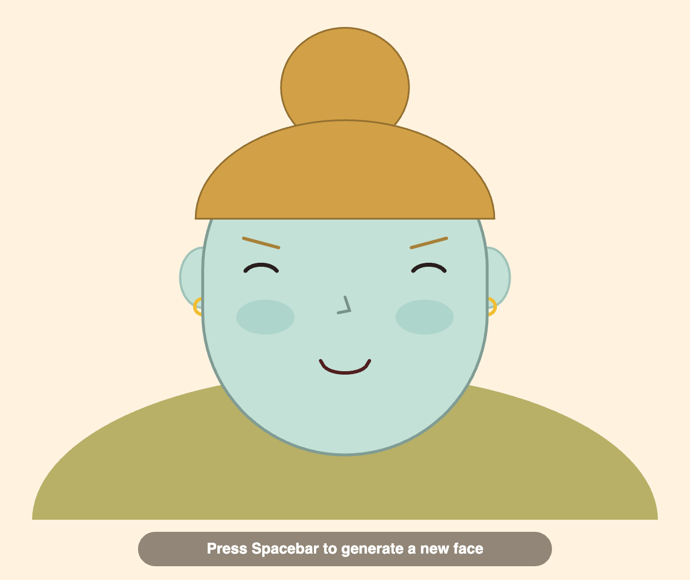
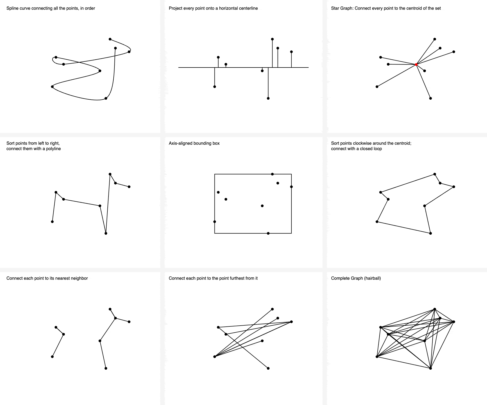
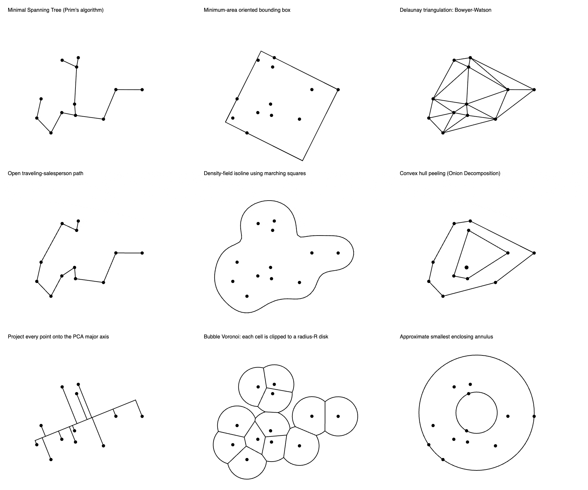

# Assignment Set #1

## Getting Started; Points and Lines

### Due Wednesday, August 26, 2026

---

*This set of deliverables is due by the beginning of class on Wednesday 8/26. There are four main sets of tasks, the total of which should take less than ~6 hours:*

* 1.1. [Administrative Tasks](#11-administrative-tasks) *(30 minutes)*
* 1.2. [Touchstone Sharing](#12-touchstone-sharing) *(15 minutes)*
* 1.3. [p5.js Wayfinding](#13-p5-wayfinding) *(30 minutes)*
* 1.4. [Test Your Coding Agent: Zero-Shot Generation](#14-test-your-coding-agent-zero-shot-generation) *(30 minutes)*
* 1.5. [One Point Set, 27 Ways](#15-one-point-set-27-ways) *(3.5 hours)*
  * [1.5.0. Overview]()
  * [1.5.1. Part A: Coding]() (*60 minutes*)
  * [1.5.2. Part B: Summoning]() (*30 minutes*) 
  * [1.5.3. Part C: Creating]() (*2 hours*) 

---

## 1.1. Administrative Tasks

(***30 minutes***) Please **complete** the following administrative tasks:

* (*1 minute*) **Bookmark** our [Course GitHub](https://github.com/golanlevin/60-212/blob/main/2026/readme.md) in your laptop's browser, so you can easily find it. Assignments and lecture notes will be shared here.
* (*4 minutes*) **Create** an ID on [Discord.com](https://discord.com/), if you don't already have one. **Join** our class Discord, using the invitation sent to you by email. **Browse** our server's channels so you know what's where.
* (*5 minutes*) In the `#main-chatter` channel of our course Discord, **introduce** yourself in a sentence or two. Please share something about yourself — pets, favorite food, arcane superpowers, etc.
* (*5 minutes*) **Create** an ID on [OpenProcessing.org](https://openprocessing.org) (if you don't already have one). **Join** our [OpenProcessing classroom](https://openprocessing.org/class/107236/#/), using the invitation sent to you by email, and **bookmark** it in your laptop's browser. Take a moment to **browse** some of the sketches that people have published at [https://openprocessing.org/discover](https://openprocessing.org/discover). *(Note: the quality varies widely!)* Run the programs, and be sure to **look** at their code (*command-shift-return* may help switch to the code view).
* (*15 minutes*) **Review** the [Syllabus](https://github.com/golanlevin/60-212/blob/main/2026/syllabus/README.md) carefully, and **complete** the [**Welcome Form**](https://forms.gle/Dtg5fU9wtkG6q3Fm7).

---

## 1.2. Touchstone Sharing

(***15 minutes***) You are asked to share a "touchstone" — a computational project (made by someone else) that you admire, hold close to your heart, or find yourself thinking about often. The purpose of this exercise is to help us become familiar with your interests and tastes — and for you to be able to share something interesting with your peers. I also want to make sure that you're able to access and use the Discord.

* **Recall** a project you have admired (by someone else) which you feel falls under the broad umbrella of "Creative Coding".
* **Create** a post in the `#01-touchstone` channel in our course Discord. 
* **Describe** the project in a few sentences, and in your own voice, **explain** what you like about it. It's sufficient to write 3-5 sentences. *Please don't write with AI here.*
* **Answer** the questions: *Who* made this project? (Was it an individual, a small team, a big company?) *Why* did they make it, or for whom (what kind of audience)?
* **Include** a link (URL) to the project and/or its documentation (such as a YouTube video).
* **Embed** an image of the project in your Discord post. 

---

## 1.3. p5.js Wayfinding 

(***30 minutes***) The purpose of this task is to help ensure that you know where to find good-quality information about the p5.js toolkit, such as documentation and tutorials. 

* (*10 minutes*) **Browse** the [p5.js Reference](https://p5js.org/reference/). Examine at least ten Reference pages, starting with the [Shape commands](https://p5js.org/reference/#Shape). Note that most of the Reference pages allow you to see the effects of tinkering with the code.
* (*10 minutes*) **Browse** the [p5.js Examples](https://archive.p5js.org/examples/) archive, which are organized thematically. Review at least ten p5.js Examples, skimming their code. 
* (*10 minutes*) **Browse** some of the many free YouTube tutorials for p5.js, which range from [completely introductory](https://www.youtube.com/watch?v=HerCR8bw_GE&list=PLRqwX-V7Uu6Zy51Q-x9tMWIv9cueOFTFA) to impressively advanced. Some legendary p5 YouTubers include:
  * [Dan Shiffman](https://www.youtube.com/@TheCodingTrain/playlists) (Coding Train)
  * [Patt Vira](https://www.youtube.com/@pattvira/playlists) (CMU alum!)
  * [Xin Xin](https://www.youtube.com/@xinxin1011/videos)
  * The [ProcessingFoundation](https://www.youtube.com/@ProcessingFoundation/videos)

*Remember, if you get stuck, you can always give a shout in the `#haaaalp` channel in the course Discord!*

---

## 1.4. Test Your Coding Agent: Zero-Shot Generation

(***10-30 minutes***) Make sure you have a working coding agent.

***Note: Your creative effort is purposefully not requested for this task.***

This semester we will make use of LLM-based coding agents such as OpenAI *Codex* or *ChatGPT*, Anthropic *Claude*, or Google's *AI Studio* or *Antigravity*. The purpose of this task is simply infrastructure verification: to make sure that you have one of these tools installed — ideally as a **CLI** (command-line interface) — and that you are able to successfully demonstrate its use.

I am aware that Codex and Claude cost money. Fortunately, as a CMU student, you receive free access to Google's Gemini LLM through your university Google account. It can be accessed in your browser through these links:

* [https://www.cmu.edu/computing/services/ai/tools/google-ai-tools/](https://www.cmu.edu/computing/services/ai/tools/google-ai-tools/)
* Gemini.Google.com: [https://gemini.google.com/](https://gemini.google.com/)
* Google AI Studio: [https://aistudio.google.com/apps](https://aistudio.google.com/apps) *(preferable, as it is able to create and manage multi-file projects)*

Now: 

* **Prompt** your preferred coding agent to **"[zero-shot](https://www.promptingguide.ai/techniques/zeroshot)** a face generator" using the following prompt:

> Use p5.js to make a simple face generator. Have the program generate a new face each time the user presses the spacebar. Have the program save a screenshot when the user presses the `s` key. 

* **Run** the generated program to **test** it: for example, at [OpenProcessing.org](https://openprocessing.org/), or in the [p5.js editor](https://editor.p5js.org/). 
* **Please don't** do any iterative refinement (as long as the project is working).
* **Note** that the latest version of p5.js (v.2), which is quite new, has made some breaking changes to splines and curves. You might hit a small bug if your agent generated p5v1 curve commands in a p5v2 environment.
* **Create** a post in the `#01-zero-shot` channel in our course Discord. 
* **Tell** us which coding agent you used, and whether you used it at the command line or from within a browser.
* **Observe** the results. In 1-2 sentences, in your own voice, **write** about one specific choice the coding agent made that reveals the agent's assumptions about what “a simple face generator” means.
* **Embed** a screenshot of the agent's project in your Discord post. It might look something like the image below.

*(For what it's worth, if you'd like to see a thoughtfully-executed implementation of procedurally generated faces in JavaScript, the artist Mannay [released this project](img/mannay_generated_faces.jpg) last week, published [here](https://x.com/mannay/status/2087522034351796728).)*

---

## 1.5. One Point Set, 27 Ways

(***3.5 hours***) Please **complete** and **submit** the following three assignments in our [OpenProcessing classroom](https://openprocessing.org/class/107236/#/). (In case it's helpful, a tutorial on how to use OpenProcessing is available [here](https://www.youtube.com/watch?v=Oj3DGSCMAOQ).)

* OpenProcessing slot for [Part A: Coding]() (*60 minutes*)
* OpenProcessing slot for [Part B: Summoning]() (*30 minutes*) 
* OpenProcessing slot for [Part C: Creating]() (*2 hours*) 

More details about each part are below. For each exercise, **remember** to do the following:

* **Add a thumbnail image** to your project in OpenProcessing. To do this, click *SAVE* or ⓘ, then click *EDIT*, and add information to the various fields. Click on the thumbnail square in order to capture a thumbnail image of your project. Projects that are missing thumbnail images will lose an unexpectedly large amount of points.
* **Submit** your project to the appropriate collection in the OpenProcessing classroom.
* **Document** your project as requested in the appropriate Discord channel. 

### 1.5.0. Overview

#### Creative coding is not about making pictures with code. It is about making **systems whose behavior can be seen**.

In this assignment, you will explore how different algorithms can allow a single set of random points to give rise to a wide variety of geometric structures. You will be given a p5.js template with a 3x3 grid of panels, where each panel shows the same set of points. Your job is to create a different computational process to interpret the points in each panel. Every panel will show the visible consequence of a different process: the results of a different question asked of the same set of points. 

You will do this 3 times, creating a total of **27 functions**: 

* In **Part A (Coding)**, you will be given a list of 9 functions to write. *You must write all the code for these functions yourself, without using any AI coding agent.* The point is to make sure you have the basic programming skills necessary to take this course.
* In **Part B (Summoning)**, you will be given a list of 9 algorithms that are widely used in computer graphics. These algorithms are easy to appreciate conceptually, but tricky to implement correctly and efficiently. You will be asked to direct a coding agent to write the code for these algorithms, and to ensure they are working properly. It may help to do some independent reading about these algorithms, as you will also be asked to explain them in your own words. The point of this part is for you to *develop an intuitive understanding of what these algorithms do*. 
* **Part C (Creating)** is open-ended. You are asked to research and/or devise 9 algorithmic treatments that interpret the points in creative and surprising new ways. In this part, you are encouraged to work collaboratively, in two-person teams, and in feedback with an AI coding agent. 

While **Part A** must be programmed entirely by you, **Part B** and **Part C** of this assignment are intentionally designed so that they cannot reasonably be completed *without* AI assistance. For all three parts, restrict the elements you draw to black-and-white forms. [**Here is the p5.js starter code you will modify**](resources/assignment_1_sketch_template.js).

---

### 1.5.1. Part A: Coding

[Here](resources/assignment_1_sketch_template.js) is a p5.js (v2) program for you to complete. (You can also find this code [at OpenProcessing](https://openprocessing.org/@golan/2991107), and [at editor.p5js.org](https://editor.p5js.org/golan/sketches/CqeRhgfJZ).) The program fills an array with data for a set of random 2D points, and then displays them 9 times, in a 3x3 grid. When you press the spacebar, the points are randomized. 

Your job in **Part A** is to write 9 specific functions that interpret these points as described below. You may do internet searches for necessary documentation (e.g. [`Array.prototype.sort()`](https://developer.mozilla.org/en-US/docs/Web/JavaScript/Reference/Global_Objects/Array/sort), [`beginShape()`](https://p5js.org/reference/p5/beginShape/), etcetera), but **you are strictly prohibited from using an AI coding agent:**

1. Draw a spline curve connecting all the points, in order
2. Draw a perpendicular projection from every point to the horizontal centerline
3. Star Graph: connect every point to the centroid of the set
4. Sort the points from left to right; connect them with a polyline
5. Compute and draw the axis-aligned bounding box (AABB)
6. Sort points clockwise around the centroid; connect them with a closed loop
7. Connect each point to its nearest neighbor
8. Connect each point to the point furthest from it
9. Complete Graph: Connect each point to every other (hairball)

#### Part A Deliverables: 

* **Create** your project in OpenProcessing and **save** it to [this collection](https://openprocessing.org/class/107236/#/c/107238).
* **Ensure** your project has a thumbnail image in OpenProcessing.
* **Create** a post in the Discord channel, `#01A-pointset-coding`.
* **Embed** a screenshot of your project in your Discord post.
* **Write**, in your own voice, a bried reflective statement about _________.

---

### 1.5.2. Part B: Summoning

In **Part B**, our learning objective shifts from writing algorithms to working responsibly with sophisticated algorithms. This exercise is intended to impart a lesson that computer science courses often miss: *understanding what an algorithm does* and *being able to implement it from scratch* are not the same skill. 

Some algorithms are so well-established, intricate, and widely available that reimplementing them from first principles is rarely the best use of your effort. Very few practicing engineers write their own FFTs or Delaunay triangulations from scratch. Instead, they understand:

* what problem the algorithm solves;
* what assumptions it makes;
* what its output represents;
* how to verify that it is behaving correctly;
* what its limitations and failure modes are;
* when it is the wrong tool, or the right one.

As creative coders, our challenge is (often) not to recreate an algorithm’s internal mechanics, but instead to understand its behavior, its limitations, and what might make it potentially compelling as an aesthetic building block.

Using the same [template code](resources/assignment_1_sketch_template.js) as before, use your coding agent to **implement functions for each of the following**: 

1. [Minimum Spanning Tree](https://en.wikipedia.org/wiki/Minimum_spanning_tree) of the points (Prim's algorithm)
2. Minimum-area [oriented bounding box](https://geidav.wordpress.com/2014/01/23/computing-oriented-minimum-bounding-boxes-in-2d/) (OBB) of the points
3. [Delaunay triangulation](https://en.wikipedia.org/wiki/Delaunay_triangulation) (Bowyer-Watson) of the points
4. [Open traveling-salesperson path](https://en.wikipedia.org/wiki/Travelling_salesman_problem) (TSP) through the points
5. [2D Metaballs](https://en.wikipedia.org/wiki/Metaballs) (isoline of a density-field, using marching squares)
6. [Convex hull](https://en.wikipedia.org/wiki/Convex_hull) peeling ([onion decomposition](https://en.wikipedia.org/wiki/Convex_layers)) of the point set
7. Project every point onto the [Principal Component Analysis](https://en.wikipedia.org/wiki/Principal_component_analysis) major axis
8. [Voronoi diagram](https://en.wikipedia.org/wiki/Voronoi_diagram), clipped to circular bubbles around each point
9. Approximate [smallest enclosing annulus](https://doc.cgal.org/latest/Bounding_volumes/index.html#title3)

This list draws from several disciplines, including computational geometry, graph theory, statistics, computer vision, numerical analysis, optimization, and machine learning. Each field offers different ways of interpreting the same point set: as a spatial arrangement, a network, a statistical distribution, a collection of clusters, a noisy sample of an underlying form, or the initial state of a dynamic system. 

Some of these methods are ordinarily taught only in advanced courses, and many of these algorithms would require substantial time to implement correctly and efficiently. Nevertheless, each of these algorithms is easy to understand visually, and can play an important role in creating expressive and interactive graphical systems.

#### Part B Deliverables: 

* **Create** your project in OpenProcessing and **save** it to [this collection](https://openprocessing.org/class/107236/#/c/107239).
* **Ensure** your project has a thumbnail image in OpenProcessing.
* **Create** a post in the Discord channel, `#01B-pointset-summoning`.
* **Embed** a screenshot of your project in your Discord post.
* **Select** your favorite algorithm of the 9, and in your own voice, in thre Discord post, **write** a brief explanation of what it does, or how to interpret it.

---

