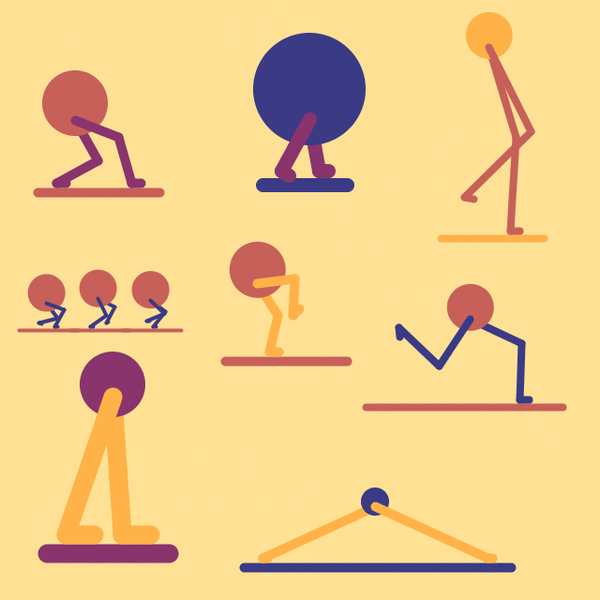
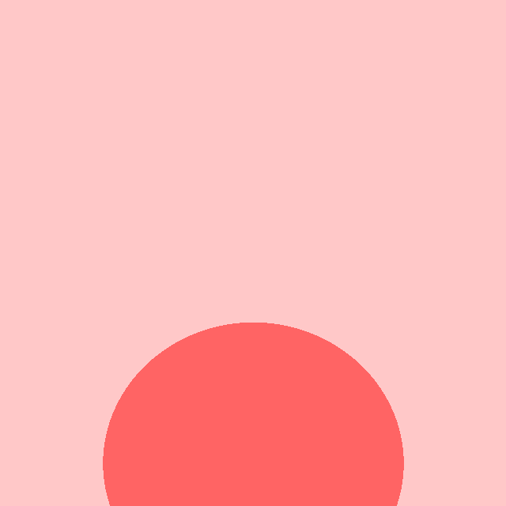
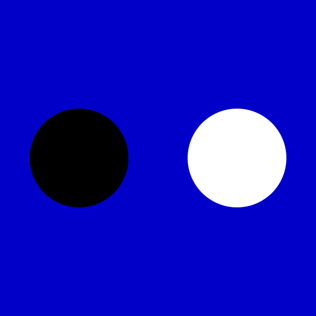
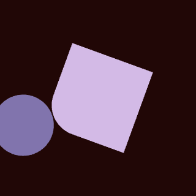

# Assignment Set #2

## Patterns and Loops

### Due Wednesday, September 2, 2026

<!--
  
<br />*Some loops by previous Art undergraduates in 60-212.*
-->


Our second set of Deliverables is due at the beginning of class on Wednesday, September 2. The primary topics it emphasizes are iteration, pattern, and looping movement. I estimate that it will take you about 6-7 hours.

We are still in a phase of the course that emphasizes the development of programming skills, knowledge of your toolset, careful observation, and precision execution. In terms of creative expression, this is not a particularly “open-ended” set of Deliverables. Things will open out more, soon, however. 

* (30 minutes) 2.1. [Moiré Pattern Composition](https://openprocessing.org/class/107236/#/c/107368)
* (30 minutes) 2.2. [Simple Duotone Truchet Tiling](https://openprocessing.org/class/107236/#/c/107369)
* (90 minutes) 2.3. [Aperiodic Truchet Tiling](https://openprocessing.org/class/107236/#/c/107370)
* (30 minutes) 2.4. [Reading and Looking: Loops](#24-reading-and-looking-loops) (see below)
* (90 minutes) 2.5. [Rhythm Loop with Figure-Ground Reversal](https://openprocessing.org/class/107236/#/c/107377)
* (120 minutes) 2.6. [Freestyle Rhythm Loop](https://openprocessing.org/class/107236/#/c/107371)

---


## 2.1. Moiré Composition (Iteration, Transforms, Pattern)

(**30 minutes**) First, please take a few minutes to **review** [this lecture about Moiré patterns](https://github.com/golanlevin/60-212/blob/main/lectures/moire/README.md) in art. 

*I would strongly prefer that you didn't use AI for this exercise. The `for`-loops it requires should be well within your abilities, and much of what leads to success here is your craft — the extent to which you are in command of subtle perceptual details.*

Now: **write** a program which uses iteration to generate a compelling [Moiré pattern](https://en.wikipedia.org/wiki/Moir%C3%A9_pattern) composition. Begin with a set of parallel lines or curves, spaced at narrow intervals. Onto this, **overlap** another set of very similar lines, which differ by a very small rotation, translation, and/or other distortion, to create a subtle Moiré. Use [this OpenProcessing slot](https://openprocessing.org/class/107236/#/c/107368) to host your project.

You may use any colors you prefer. That said, for this project, **less is more.** Keep your composition **simple**, maintain a light touch, and allow the interference patterns to do the work for you!

One possible way to get started is to use the p5.js [`rotate()`](https://p5js.org/reference/p5/rotate/) function to offset the second set of lines. If you're feeling more advanced, you could also consider creating sets of near-parallel polylines that are *subtly* perturbed by the p5.js `noise()` function, as demonstrated in [this tutorial](https://www.patreon.com/posts/exploring-moire-61867805) by Maks Surguy.

**Include** some dimensions of variability (such as the line separation, position, rotation angle, or strokeWeight()) under time-based or interactive control. **Present** your composition in a fullscreen canvas (use `createCanvas(windowWidth, windowHeight);` or the [fullscreen()](https://p5js.org/reference/p5/fullscreen/) command).


The code below shows an example of a possible starting point. 

```
function setup() {
  createCanvas(300, 300);
}

function draw() {
  background(255);
  
  for (let x=100; x<200; x+=3){
    line(x,50, x,250); 
  }

  push();
  rotate(0.1 * sin(millis()/1000.0));
  for (let x=100; x<200; x+=3){
    line(x,50, x,250); 
  }
  pop(); 
}
```

---

## 2.2. Simple Duotone Truchet Tiling

**(30 minutes)** *This is a primarily technical exercise, intended to keep your chops sharp. Please do this one yourself rather than using AI to solve it for you. Implementing this project yourself will give you critically important insights into the next exercise.*

Use [this OpenProcessing slot](https://openprocessing.org/class/107236/#/c/107369) to host this project.

**Review** [this presentation](https://github.com/golanlevin/60-212/tree/main/lectures/truchet) about Truchet Tiles, and [this OpenProcessing tutorial](https://openprocessing.org/@golan/2731464#page-1) on how you can implement them in p5.js. **Observe** how Truchet tiles with circular arcs "work" — by randomly choosing between two complementary tile orientations: 


Now, **Modify** the basic Truchet tiling so that its curves become boundaries between solid black and white regions, producing a continuous two-color pattern with no visible tile seams. You can start from scratch, or you may use the tutorial code as your starting point if you wish. This is called a "Duotone Truchet Tiling", as discussed in [this enjoyable article](https://cambolbro.com/graphics/duotone/) by Cameron Browne:


Your finished tiling should contain only black and white areas. As before, the curved boundaries between colors should flow smoothly from tile to tile. But now, there is an **additional new constraint**: black must always meet black, and white must always meet white, across every shared tile edge. No straight tile seams should be visible in the finished image. A naive solution will look like the version at left below; your goal is the seamless version at right:


Clicking your sketch should generate a new random valid tiling. You’re also welcome to use colors other than black/white, and you're welcome to tinker with more elaborated designs, so long as you meet the new constraint. But I encourage you not to dwell too long on this exercise; your creative energy is needed on the ones to follow.

### Implementation Advice

Suppose you start with the two-tile Truchet program from the [tutorial](https://openprocessing.org/@golan/2731464#page-1). Simply filling its quarter-circles black will not work! Neighboring tiles will sometimes disagree about which side of a curve is black.

Think of each tile as having information on its four edges. When you place a tile, its coloring must agree with any neighboring tiles that have already been placed. Thus, a useful strategy could be:

* **Execute** the grid from left to right and top to bottom.
* **Keep track** of which tile you placed in every grid cell.
* For each new cell, **examine** the tile immediately to its left and above it.
* **Determine** which possible tiles would match those neighbors along their shared edges.
* Randomly **choose** among the possibilities that remain.

You will need to expand the original set of two Truchet tiles. **Ask** yourself: what additional tile states are needed once the two sides of each curve have different colors? **Observe** that randomness is still allowed, but only among choices that satisfy the local edge constraints. This is closely related to the logic of *[Wang Tiles](https://www.boristhebrave.com/permanent/24/06/cr31/stagecast/wang/2edge.html)*, devised by Hao Wang in 1961, wherein neighboring tiles must agree along their shared edges.

---

## 2.3. Aperiodic Truchet Tiling

**(90 minutes)** *In the previous exercise, you modified a simple square Truchet tiling so that colors and curves agreed across the boundaries between tiles. In this exercise, the grid itself gets much stranger.*

Use [this OpenProcessing slot](https://openprocessing.org/class/107236/#/c/107370) to host this project.

### About Aperiodic Tilings

Most familiar tilings are **periodic**: somewhere in the pattern there is a translation that makes the entire tiling coincide with itself. Checkerboards, brick walls, and hexagonal honeycombs all repeat themselves. An **aperiodic set of tiles** is stranger: the tiles can cover the entire plane without gaps or overlaps, but **cannot do so periodically**.

In the 1960s, mathematicians discovered the first such tile sets, initially requiring thousands of different tiles. In the 1970s, mathematician Roger Penrose famously reduced the problem to just **two tiles**. [Penrose tilings](https://en.wikipedia.org/wiki/Penrose_tiling) never repeat periodically, yet exhibit unmistakable large-scale structure: stars, rings, decagons, and other forms seem to emerge from local rules:


This suggested the question: "Could a *single* tile force the plane to be tiled aperiodically?" Such a hypothetical shape became known as an **einstein** (from German, meaning "one stone"). For decades, nobody knew whether such a tile existed. Then, in 2023, shape enthusiast David Smith discovered an extraordinary 14-sided polygon he called [**Tile(1,1)**](https://polytope.miraheze.org/wiki/Tile(1,1)). Working with a global team of mathematicians, Smith showed that, if reflections are disallowed, then Tile(1,1) is an aperiodic monotile. That's the tile shape we'll use for this exercise. Below are the coordinates of its vertices, and a photo of one of Smith's experiments with it:

```
const rt3 = Math.sqrt(3);
const tile11 = [
  [0.0,             0.0],
  [1.0,             0.0],
  [1.5,            -rt3/2],
  [1.5 + rt3/2,     0.5 - rt3/2],
  [1.5 + rt3/2,     1.5 - rt3/2],
  [2.5 + rt3/2,     1.5 - rt3/2],
  [3.0 + rt3/2,     1.5],
  [3.0,             2.0],
  [3.0 - rt3/2,     1.5],
  [2.5 - rt3/2,     1.5 + rt3/2],
  [1.5 - rt3/2,     1.5 + rt3/2],
  [0.5 - rt3/2,     1.5 + rt3/2],
  [-rt3/2,          1.5],
  [0.0,             1.0]
];
```


### Your Challenge

**Create** a Truchet-like design that seamlessly spans an aperiodic tiling made entirely from copies of Tile(1,1).

You are **allowed to use AI** to help you generate the underlying Tile(1,1) tiling. You do not need to derive or understand the mathematics of its aperiodic substitution system — although you should be able to explain generally what the code is doing. Your real problem begins **after you have the tiling working**: 

**Design** a modular graphic system for the Tile(1,1) shape. When many copies of your decorated tile are assembled, marks should connect seamlessly across their shared edges, producing larger visual structures that are not explicitly drawn anywhere. The key challenge is: 

> **Modular elements, randomized; larger structures seemingly emerging therefrom.**

Your program should not simply draw an interesting picture *inside each tile*. Lines, bands, colors, contours, paths, or other graphical elements should **enter and leave tiles in ways that connect with their neighbors**. Ideally, when the tile outlines are hidden, it should become difficult to tell where one Tile(1,1) ends and another begins.

### Think Like a Truchet Designer

In the previous exercise, you learned that a tile cannot always be placed without considering its neighbors. Its edges carry information about what may legally touch them. Apply that idea here.

* **Study** the geometry of Tile(1,1). It has many more edges than a square, but because copies meet edge-to-edge, every shared edge creates an opportunity for continuity.
* **Print out** some tilings (you can use [this image](img/2/tile11.png)) and **draw** with a pencil!
* **Decide** what information your design needs to communicate across those edges. For example, you might consider:
	* where a line or band crosses an edge;
	* whether an edge carries one color or another;
	* which edges should become connected through the interior of a tile;
	* whether several different decorations of the same Tile(1,1) can be chosen while remaining mutually compatible;
	* whether a decision made in one tile should constrain the appearance of its neighbors.

You do **not** need to imitate the circular arcs of traditional Truchet tiles. Invent a visual vocabulary appropriate to this strange 14-sided shape.

### Requirements

Your sketch must:

* cover the visible canvas with an **aperiodic Tile(1,1) tiling**;
* use only translated and rotated copies of Tile(1,1), **not reflected copies**;
* apply your own modular graphic design to the tiles;
* make graphical structures connect **seamlessly across tile boundaries**;
* contain meaningful variation between tiles rather than simply stamping the identical decorated polygon everywhere;
* allow the tile outlines to be hidden, so that the emergent larger-scale structure becomes visible;
* generate a new variation when the sketch is clicked.

You may use AI extensively for the **aperiodic tiling machinery**. You may also ask AI technical questions while developing your design. But the **visual system and the decisions about how modules connect across boundaries are yours**. Do not ask an AI to invent or implement the finished design for you.

This is not primarily an exercise about aperiodic-tiling mathematics. Tile(1,1) is providing you with an unusually complicated substrate for a familiar creative-coding problem: **How can simple local decisions produce convincing global structure?**

A successful project should reward looking at several scales. Up close, we can understand the individual modules and their rules. From farther away, those modules should cease to dominate, and larger structures should seem to emerge from their interactions. The strongest solutions will make those larger structures feel simultaneously **surprising and inevitable**: clearly governed by rules, but not obviously designed in advance.

---

## 2.4. Reading and Looking: Loops

(*30 minutes*) The purpose of this exercise is to become familiar with idioms of creative loopmaking in art, animation, visualization, and creative coding. 

1. **Looking Outwards.** Spend 10 minutes checking out the work of professional loopmakers like [Bees and Bombs](https://www.instagram.com/davebeesbombs/), [Melissa Rodriguez](https://objkt.com/profile/tz1UtTasn4DTyb9rHYnLAjxSQHfkvAWtBbAQ/created), [Cindy Suen](https://cargocollective.com/cindysuen), [Lucas Zanotto](https://www.instagram.com/lucas_zanotto/?hl=en), [Andreas Wannerstedt](https://andreaswannerstedt.se/projects) ("Oddly Satisfying" works), [Etienne Jacob](https://bleuje.com/animationsite/), [Paolo Ceric](https://patakk.tumblr.com/), and [DVDP](https://www.instagram.com/dvdp/). You can also check out the wild variety of looping GIFs at the [Objkt.com NFT bazaar](https://objkt.com/tokens?search=GIFDAY2024), which just hosted a [#GIFDAY2024 showcase](https://objkt.com/tokens?search=GIFDAY2024). an In the Discord channel *#25-looking-outwards*, embed or post a link to a loop that you appreciated, and write a sentence or two about what you liked.
2. **Reading**. Skim the article “[On Repeat: How to Use Loops to Explain Anything](https://www.propublica.org/nerds/on-repeat-how-to-use-loops-to-explain-anything)” by Lena Groeger, a journalist/developer/information-designer at ProPublica. This article is purely for your edification/entertainment; there’s no deliverable for this reading. It should take about 10 minutes to browse this elegant stack.

---

## 2.5. Rhythm Loop with Figure-Ground Reversal

(**90 minutes**) *This is primarily a technical exercise to ensure that you're able to create a loop, and to make sure you're locked in on carefully looking at what you're doing.*

**Create** a simple, temporally seamless, 640x640-pixel looping animation in p5.js with a "figure-ground reversal". A figure-ground reversal occurs when the positive and negative spaces switch roles: what initially appears to be the foreground shape becomes the background, and vice versa.

Here's one example. This was written with 43 lines of p5.js code: 


Here's another example; this one differs from the example above by just a single line of code: 


For some more examples to inspire you, see: 

* <https://beesandbombs.tumblr.com/image/186503916064>
* <https://beesandbombs.tumblr.com/image/178459794764>
* <https://beesandbombs.tumblr.com/image/178493871934>
* <https://www.instagram.com/p/BslTILaHYwV/>
* <https://www.instagram.com/p/CwORLIRoFRA/>
* <https://www.instagram.com/p/Cur8ndtg6B5/>
* <https://www.instagram.com/p/BuCFzGICmZi/>

To support you in this and the following assignment, below is a very simple p5.js program that shows some different ways of making seamless looping movement, and also how to export an animated GIF file. The resulting GIF that it produces is also shown:

```javascript
let progress = 0;
let cycleLength = 90; // frames

function setup() {
  createCanvas(400, 400);
}

function draw() {
  background(0);
  noStroke(); 

  // progress is a number that goes from 0 to 1
  // it describes where we are in the current cycle
  progress = (frameCount%cycleLength)/cycleLength;

  // Draw a green square that travels across the screen.
  // Use the map() function to create proportions/
  fill("lime"); 
  let squareSize = 50; 
  let sx = map(progress, 0,1, 0-squareSize,width); 
  square(sx,0,squareSize); 

  // Draw a blue circle that travels around. 
  // Use math to calculate its position.
  fill("blue"); 
  let r = 150; 
  let cx = width/2; 
  let cy = height/2; 
  let px = cx + r * cos(progress * TWO_PI); 
  let py = cy + r * sin(progress * TWO_PI); 
  circle(px,py, 100); 

  // Draw a rotating red rectangle. Rotate it
  // using transforms (rotate, translate, etc.)
  fill("red"); 
  push(); 
  translate(200,200); 
  rotate(progress * 0.5 * TWO_PI); 
  rect(-75,-50, 150,100); 
  pop(); 
}


// Save a 3-second gif when the user presses the 's' key.=
function keyPressed() {
  if (key == "s") {
    saveGif("mySketch", 90, { units: "frames" } );
  }
}
```


---

## 2.6. Rhythm Loop


(**2 hours**) In this mini-project, you will explore visual rhythm— by creating a seamlessly looping, animated GIF using computationally generated graphics. In addition to the code-based project [presented on OpenProcessing](https://openprocessing.org/class/107236/#/c/107371), you are also expected to **post** your exported GIF to the `#26-rhythm-loop` channel of our Discord, along with a brief **writeup** about your design. Use [this OpenProcessing slot](https://openprocessing.org/class/107236/#/c/107371) to host your project.

This is a mini-project, so **SKETCH FIRST** and **KEEP IT SIMPLE**. There are several important constraints:

* Your canvas must be **square**, with dimensions of exactly 640×640 pixels. The square format and resolution are important, as these will allow us to exhibit your work consistently later.
* Your looping GIF must be **seamless**: it should be impossible to determine the moment at which your loop “begins”, and there should be no hiccups or jarring discontinuities.
* Your design is restricted to using exactly **2,3, or 4 colors**: ultra-flat with no transparency blending, please. One possibility is to have a background, foreground, and special spot (highlight) color. (If you use alpha transparency or blend modes, your GIF will likely  have too many colors and won't work well!)
* To create expressive animation, you are encouraged to experiment with the **[p5.func](https://idmnyu.github.io/p5.js-func/)** library for shaping/easing functions.
* To export an animated GIF of your project, you should probably use the [`saveGif()`](https://p5js.org/reference/p5/saveGif/) function. 
* After you upload your GIF, you may wish to use a tool like [ezgif.com](https://ezgif.com/optimize) to **optimize** it and reduce its file size. Please keep your GIF under 8MB in order to be able to upload it to Discord!

You can see these constraints in the example above (whose code is [here](https://editor.p5js.org/golan/sketches/b6pgPm9Ab)). There are only **3 flat colors** (black, white, red); the loop is **seamless**; the dimensions are square. Notice how there is a "graphical concept" or "premise" (the roundedness of the corners circulate around the design; the corners of the red shape kiss the corners of the white one, etc.). *To be extremely clear, I am NOT asking you to reproduce this design!*

If it's helpful, here's a Coding Train tutorial on [creating a seamless loop in p5.js](https://thecodingtrain.com/challenges/135-making-a-gif-loop-in-processing) (with shaping functions!), as well as an [older Coding Train walkthrough](https://www.youtube.com/watch?v=c6K-wJQ77yQ) and [my own video demo](https://www.youtube.com/watch?v=-HPjv-KVUe0) of a similar workflow. For my own 12-minute overview about shaping functions, [see this video](https://www.youtube.com/watch?v=wJRgAs6rbUY).


MORE INFORMATION

Here’s a sketch showing the use of a progress variable that goes from 0 to 1 each loop: [[@OpenProcessing](https://openprocessing.org/sketch/1464775) / [@Editor.p5](https://editor.p5js.org/golan/sketches/EmjMT6z_P)]. This demo also introduces some of the simplest possible shaping functions (sq and sqrt):


This sketch [[@OpenProcessing](https://openprocessing.org/sketch/1464779) / [@Editor.p5](https://editor.p5js.org/golan/sketches/Vr8Wop-1Q)] demonstrates some ways in which a "progress" variable can be used to govern many different kinds of visual properties— such as size, angle, rotation, opacity, count, etc.:


Here’s a template for a Lissajous-inspired loop using `sin()` and `cos()`: [At OpenProcessing](https://openprocessing.org/sketch/1461727) • [At Editor.p5js.org](https://editor.p5js.org/golan/sketches/iTE-QYKLZ)


Here’s a reminder that you can eliminate visual certain discontinuity hiccups by going all the way offscreen: [At OpenProcessing](https://openprocessing.org/sketch/1464781) • [At Editor.p5js.org](https://editor.p5js.org/golan/sketches/s42vcR_pO)


---
