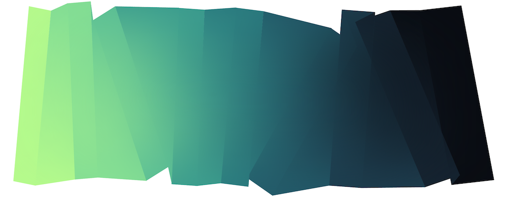
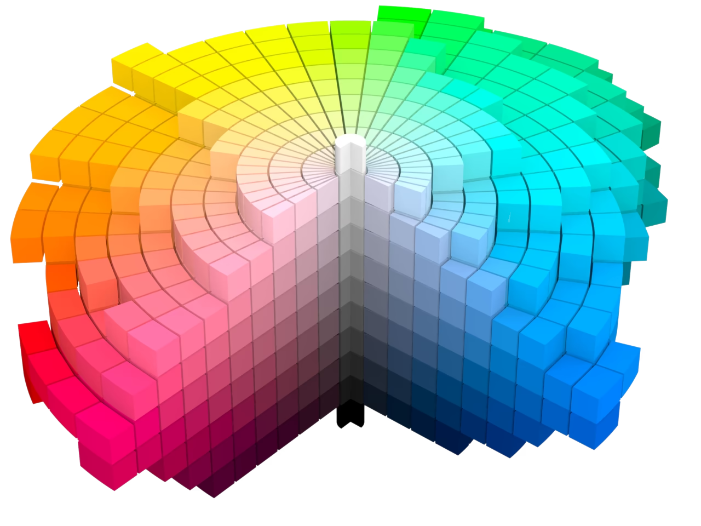
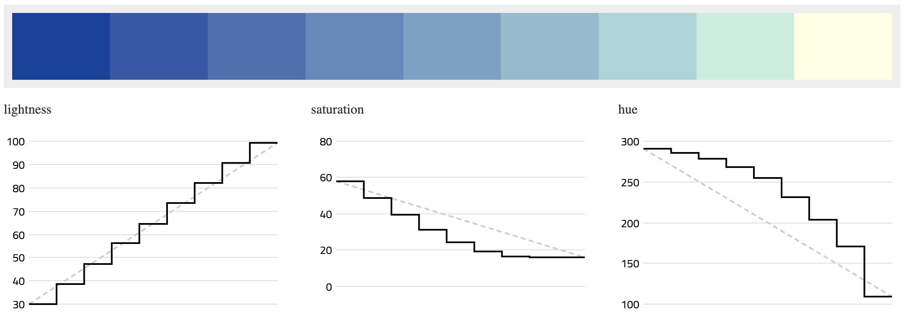
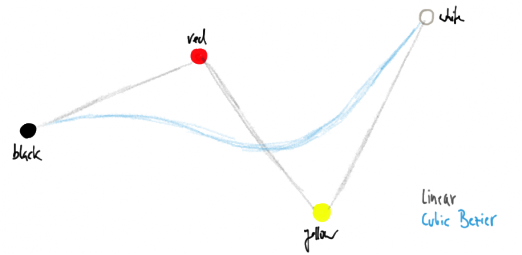
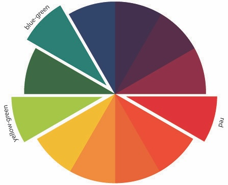
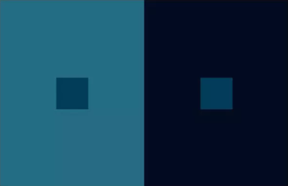
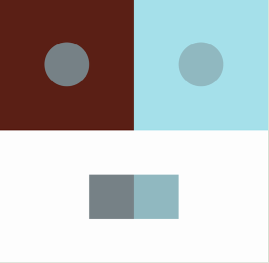
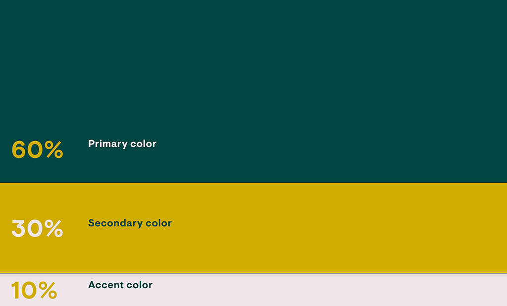

# Assignment Set #3: Color

 [*Albers*, an artwork by David Aerne](https://albers.elastiq.ch/)

---

## Summary of Deliverables

This assignment has six parts, paced out on different days, totaling about 5 hours:

Due **Monday** September 7:

* 3.1. Readings: Computational Color *(10%, 30m)*
* 3.2. Interactives! Color Explorers *(15%, 30m)*

Due **Wednesday** September 9:

* 3.3. Four-Color Gradient *(10%, 45m)*
* 3.4. Split Complementaries *(15%, 30m)*

Due **Monday** September 14:

* 3.5. Color Relativity *(20%, 45m)*
* 3.6. 60-30-10 Composition *(30%, 120m)*

The following p5.js **template demos** may be helpful for this Assignment: 

* Color interpolations (with and without **Chroma.js**): [ChromaJs2024](https://editor.p5js.org/golan/sketches/CYUB1GAJV) /  [ChromaJs2026](https://editor.p5js.org/golan/sketches/2pkxnwYxF) / [p5js2026](https://editor.p5js.org/golan/sketches/Aki6fvzQe)
* [Dead-simple Chroma + p5 example at OpenProcessing](https://openprocessing.org/sketch/2384439)
* [Texel/Color + p5.js](https://editor.p5js.org/golan/sketches/Ya1xm67i6)
* [Dead-simple Texel/Color + p5 example at OpenProcessing](https://openprocessing.org/sketch/2384613)
* [Mixbox + p5.js](https://editor.p5js.org/golan/sketches/FPtOVXlpV)

*Note: The "60-30-10 Composition" exercise is the "main" creative project, with the most room for creativity.* 

---

## 3.1. Readings: Computational Color

(*10%, 30 minutes*) **Briefly skim** all three of the following articles, and **select one** for close reading. Complete your reading/response by Monday September 7: 

* [*Computational Color*](http://printingcode.runemadsen.com/lecture-color/) by Rune Madsen (20 minute read)
* [*Okay, Color Spaces*](https://ericportis.com/posts/2024/okay-color-spaces/), Eric Portis, 2024. Includes interactives. (20 minute read)
* [*A perceptual color space for image processing*](https://bottosson.github.io/posts/oklab/) by Björn Ottosson, 2020 ("From personal project to industry standard")

*Now*: In the Discord channel, `#31-color-readings`, in your own words, **write** a sentence of reflection about something that you found interesting or helpful from these readings. 

---

## 3.2. Interactives! Color Explorers

(*15%, 30 minutes*) By Monday September 7: **Interact** with each of the following interactive color explorers for a few minutes apiece: 

* [**Chroma.js Color Palette Helper**](https://gka.github.io/palettes/#/9|s|00429d,96ffea,ffffe0|ffffe0,ff005e,93003a|1|1)
* David Aerne's [**Poline**](https://meodai.github.io/poline/)
* David Aerne's [**Rampensau**](https://meodai.github.io/rampensau/).
* Cynthia Brewer's [**Color Advice for Cartographers**](https://colorbrewer2.org/#type=sequential&scheme=BuPu&n=3)
* [**OK Color Picker**](https://bottosson.github.io/misc/colorpicker/) by Björn Ottosson
* [**OKLCH Color Picker & Converter**](https://oklch.com/#77.33,0.141,123.88,100) by Evil Martians

*Now*: In the Discord channel, `#32-color-explorers`, in your own words, **write** a sentence of reflection about something that you found interesting or helpful from interacting with these tools. 

---

## 3.3. Four-Color Gradient

(*10%, 45 minutes*) This is due at the beginning of class on Wednesday September 9.

**Above**: The "Magma" color palette is a sequential colormap by Nathaniel J. Smith and Stefan van der Walt. It is designed to be perceptually uniform even when viewed by persons with common forms of color vision deficiency, and when printed in black-and-white. It is widely used in scientific imaging, as in this [thermal camera](https://www.youtube.com/watch?v=WkxKrk8lqE4). (Note, this is just an *example* of a multi-color gradient; you are not being asked to reproduce this gradient specifically.) The lines show the intensity of the individual RGB channels.

Now observe how David Aerne and Rik Oostenbroek have developed [an entire artwork](https://verloop.xyz/) out of multi-stop gradients: 

In this exercise you are asked to **make a gradient** that, in a manner similar to the Magma color palette, smoothly transitions between a sequence of four different colors. (Note that because some tools use smoothed interpolation, it's possible that your gradient may not pass precisely through all four colors, as shown in the doodle below.)

* **Read** or **skim** this article: [*Mastering Multi-hued Color Scales with Chroma.js*](https://www.vis4.net/blog/mastering-multi-hued-color-scales/)
* Carefully **examine** this [Chroma.js+p5 example](https://editor.p5js.org/golan/sketches/2pkxnwYxF), — especially the `scale` feature of Chroma.js. *(There are alternate implementations here: [Chroma.js+p5.js 2024](https://editor.p5js.org/golan/sketches/CYUB1GAJV), [Pure p5.js](https://editor.p5js.org/golan/sketches/Aki6fvzQe)).*
* Feel free to **study** and/or **fork** this [dead-simple Chroma + p5 example at OpenProcessing](https://openprocessing.org/sketch/2384439).
* **Create** a sketch that presents a smooth gradient through four colors. 
* In a separate part of your canvas, **display** chips of the four colors in isolation. 
* **Be prepared** to discuss the question: *which color interpolation technique(s) did you use and why?*
* Consider testing a screenshot image of your gradient using this [Color Blind Check tool](https://www.color-blindness.com/coblis-color-blindness-simulator/). (What did you learn?)
* **Save** your work to the [correct slot in our OpenProcessing classroom](https://openprocessing.org/class/107236/#/c/107469).

---

## 3.4. Split Complementaries

(*15%, 30 minutes*) This is due at the beginning of class on Wednesday September 9.

A color’s “split complements” are a pair of colors that are not quite opposite to it, but just adjacent (±15–30°) to its opposite on the color wheel. Here, you are asked to create an interactive sketch that displays swatches of the split complements for a randomly generated color.

For this project, I recommend you work with a color space that allows explicit and perceptual control of hue, such as **OKLCH**, **OKHSV**, or **OKHSL**. <!--Good choices would be [Texel/Color](https://editor.p5js.org/golan/sketches/Ya1xm67i6) or [Chroma.js](https://editor.p5js.org/golan/sketches/2pkxnwYxF). -->

* [**Modify** the code from this empty sketch](https://editor.p5js.org/golan/sketches/VtdpsUYLU) so that the chips are colored with a main color and its split complementaries. 
* Your program must generate a new set of colors each time the user clicks the mouse button. 
* **Save** your work to the [correct slot in our OpenProcessing classroom](https://openprocessing.org/class/107236/#/c/107470).

---

## 3.5. Color Relativity (Make 4 Colors Look Like 3)

(*20%, 45 minutes*) This is due at the beginning of class on Monday September 14.

* **Create** a program to generate novel color sets that always fulfill Josef Albers's *four-look-like-three* condition. Your program should generate a new set of colors each time the user clicks the mouse button. **Demonstrate** the relativity of color by duplicating the spots’ colors in a location where they can be more easily compared. 
* *For this assignment, you are asked to use an advanced color library, such as [Chroma.js](https://editor.p5js.org/golan/sketches/2pkxnwYxF), [Texel/Color](https://editor.p5js.org/golan/sketches/Ya1xm67i6), [Mixbox](https://editor.p5js.org/golan/sketches/FPtOVXlpV), [Color.js](https://colorjs.io/), or [Culori.js](https://culorijs.org/).*
* You might find [this video](https://www.youtube.com/watch?v=_Le83fKGKEo) and [this video](https://www.youtube.com/watch?v=foEBm-LCzT0) to be helpful in explaining color strategies for this project. 
* **Save** your work to the [correct slot in our OpenProcessing classroom](https://openprocessing.org/class/107236/#/c/107471).

  

---

## 3.6. 60-30-10 Color Composition

(*30%, 120 minutes*) This is due at the beginning of class on Monday September 14.

A *quick rule of thumb* is that you can generate satisfying compositions with three well-chosen colors, when these appear in proportions of 60% (the "main" color), 30% (a supporting color), and 10% (an "accent" color). In this assignment we will explore this proposition.

* Please **watch** [this 3-minute video about the "60-30-10 rule"](https://www.youtube.com/watch?v=rAfjUOkbyr0).
* [This p5.js sketch](https://editor.p5js.org/golan/sketches/U5EgeSwwR) presents a set of three colors in approximately 60-30-10 proportions. **Begin** by modifying [this sketch](https://editor.p5js.org/golan/sketches/U5EgeSwwR) to use a satisfying trio of colors, replacing lines 14-16 with your own generative strategy. Your program must generate a new set of colors each time the user clicks the mouse button, and those colors must work well in the 60-30-10 proportions (they should interrelate with each other; they can't be mutually random.)
  * *For this assignment, you are asked to use a color model which is* ***not*** *RGB or HSB/HSL,* such as OKLAB or OKLCH. Consider using a color library like [Chroma.js](https://editor.p5js.org/golan/sketches/2pkxnwYxF), [Texel/Color](https://editor.p5js.org/golan/sketches/Ya1xm67i6), [Mixbox](https://editor.p5js.org/golan/sketches/FPtOVXlpV): [Mixbox](https://github.com/scrtwpns/mixbox), [Color.js](https://colorjs.io/), or [Culori.js](https://culorijs.org/).
* **Change** the composition to use your own generative strategy for laying out the image — so long as the three colors are still distributed in approximately 60-30-10 proportions. Some possible compositional strategies could include:
	* [**Circle packing**](https://www.google.com/search?q=circle+packing&sca_esv=47811f8b104e4ef5&hl=en&source=hp&biw=1537&bih=924&ei=ujuYaragDoi15NoPzMvoiQE&iflsig=ABILxe8AAAAAaphJygUk7EHQkL5B7SLrDmsVloEqhdaD&ved=0ahUKEwi25fmqltCWAxWIGlkFHcwlOhEQ4dUDCA0&uact=5&oq=circle+packing&gs_lp=EgNpbWciDmNpcmNsZSBwYWNraW5nMgUQABiABDIFEAAYgAQyBRAAGIAEMgUQABiABDIFEAAYgAQyBRAAGIAEMgUQABiABDIFEAAYgAQyBRAAGIAEMgUQABiABEjqElC9Alj6EHAAeACQAQCYAXOgAbkEqgEEMTMuMbgBA8gBAPgBAYoCC2d3cy13aXotaW1nmAIOoALhBKgCAMICCBAAGIAEGLEDwgILEAAYgAQYsQMYgwHCAg4QABiABBiKBRixAxiDAZgDAZIHBDEzLjGgB5JBsgcEMTMuMbgH4QTCBwYwLjEzLjHIBxyACAE&sclient=img&udm=2&sei=vjuYapHaCNrn5NoP75bSiQY) — circles grow until collision; assign colors based on their area.
	* **Subdivision**: Quadtree subdivision, BSP (binary space partitioning), or recursive rectangular subdivision — recursively split rectangles; color terminal cells according to area budget.
	* **Treemap** — explicitly construct nested regions with 60/30/10 area relationships.
	* **Voronoi diagram** — generate cells from points and assign colors according to measured cell areas.
	* **Truchet tiling** — use three colors within the motifs themselves.
* **Save** your work to the [correct slot in our OpenProcessing classroom](https://openprocessing.org/class/107236/#/c/107472).
* In the Discord channel `#36-color-composition`, **write** a few sentences describing your strategies for the project, and **include** a screenshot or two. 

---