# Assignment Set #4: Cam/Puppet


---

## Summary of Deliverables

This assignment has six parts, paced out on different days, totaling about 7 hours of effort. The expected deliverables include four small technical exercises, one main project, and a performance-documentation.

* [4.1. Viewings (Realtime Tracking)](#41-viewings-realtime-tracking) *(10%, 40m)*, due 9/16.
* [4.2. Inverse Kinematics Exercise](#42-inverse-kinematics-exercise) *(10%, 20m)*, due 9/18.
* [4.3. ARAP Shape Deformation Exercise](#43-arap-shape-deformation-exercise) *(10%, 45m)*, due 9/18.
* [4.4. Deforming a Shape with Your Body](#44-deforming-a-shape-with-your-body) *(10%, 45m)*, due 9/18.
* **[**4.5. Camera-Driven Live Animation Puppet**](#45-camera-driven-live-animation-puppet) *(45%, 4 hours; main project)*, due 9/23**.
* [4.6. Puppet Party Trick Performance](#46-puppet-party-trick-performance) *(15%, 30m)*, due 9/23.


---

## 4.1. Viewings (Realtime Tracking)

[](https://vimeo.com/34824490)

(*10%, 40 minutes*) You are invited to browse a variety of new media artworks that use body-tracking, face-tracking, and hand-tracking. In order to keep you on track, this viewing and its written response is due this Wednesday, September 16.

* **Spend** 30 minutes reviewing this set of lecture notes on [**Realtime Tracking in Interactive Art**](https://github.com/CMUSchoolOfArt/60-120/blob/main/lectures/responsive_environment/body_tracking/readme.md). *(It's possible you may have seen this presentation before, in 60-120.)* This presentation links to dozens documentation videos of projects.  
* **Select** one project from these lecture notes whose way of responding to the body you find interesting. *(You may choose any project, with the exception of those created by the Professor.)*
* **Create** a post in the Discord channel `#41-viewing-response`. **Write** a sentence or two, describing the interaction and what you appreciate about it. **Include** a link to documentation of the project. 
* *Optionally*, if you happen to find this material interesting and want more, here are some additional lectures you may browse: 
  * [Shadow Play (Computing with Silhouettes)](https://github.com/golanlevin/lectures/tree/master/lecture_shadow)
  * [Faces in New Media Art](https://github.com/golanlevin/lectures/tree/master/lecture_face)
  * [The Expanded Body](https://github.com/golanlevin/lectures/tree/master/lecture_expanded_body)


---

## 4.2. Inverse Kinematics Exercise

[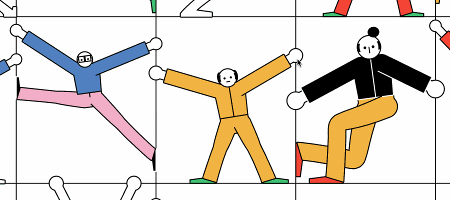](https://spacetypegenerator.com/boxsquad)

(*10%, 20 minutes*) In order to keep you on track, this simple technical exercise is due before the end of this week (~Friday 9/18).

**Inverse kinematics** (IK) is a technique for figuring out how a chain of connected joints should bend in order to place its endpoint at a desired location. Instead of specifying the angle of every joint yourself, you specify where you want a hand, foot, or robotic gripper to go, and IK computes the joint angles needed to get it there. For fun, here's an interactive, browser-based [IK demo for a 6DOF robot arm](https://www.grippy.app/). 

***To get started:***

* **View** and **explore** the "[BoxSquad](https://spacetypegenerator.com/boxsquad)" artwork by creative coder, [Kiel Mutschelknaus](https://www.instagram.com/kiel.d.m/?hl=en). Here is the [Live interactive experience](https://spacetypegenerator.com/boxsquad) (try out the "twerk" and "debug" buttons), and here is a [recorded interaction](https://www.instagram.com/p/DajD1SPmK8t/) on Instagram (as a backup).
* **Read** [this 800-word article on Inverse Kinematics](https://www.davepagurek.com/blog/inverse-kinematics/) by Dave Pagurek, an artist and p5.js contributor. (If you'd like to learn more about Inverse Kinematics, feel free to **watch** [this 35m Coding Train video](https://www.youtube.com/watch?v=hbgDqyy8bIw).)
* **View** and **explore** [this p5.js sketch](https://openprocessing.org/@golan/3008809), adapted from Pagurek's demo, which allows you to easily see the IK code. This project works in the following way: 

> The mouse specifies a target position, and the chain of connected bones repeatedly adjusts its joint angles to reach toward it. The IK solver works recursively from the end of the chain backward, rotating each bone so that the chain’s current endpoint moves toward the target; repeating this process several times rapidly converges on a solution.

### Your Task: Recreate this Y-Shape with IK

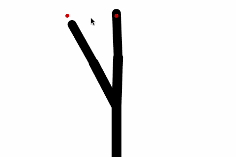

***Now:***

* **Fork** [Pagurek's IK demo](https://openprocessing.org/@golan/3008809) in OpenProcessing.
* **Modify** the construction of the skeleton so that it forms a simple **Y**-shaped puppet: a torso with two simple articulated arms extending from the same shoulder point, as shown above.
  * You should not need to modify the `Bone` class or the IK algorithm itself.
  * Currently, Dave Pagurek's inverse-kinematics sketch consists of a *single* chain of connected bones. Instead of one variable called `chain`, you will want *two* IK chains, with variable names like (e.g.) `leftArm` and `rightArm`. Both arms can begin at the same (x, y) position. Call `updateIK()` and `draw()` separately for each arm.
* **Make** the Y's two hands chase points located ±50 pixels to the left and right of the mouse cursor, i.e, `[mouseX - 50, mouseY]` and `[mouseX + 50, mouseY]`.
* **Make** the Y's shoulder point move independently (autonomously) according to a slow sinusoid or noise wave, as shown below.
* **Upload** your sketch to [the OpenProcessing slot for Exercise 4.2](https://openprocessing.org/class/107236/#/c/107628).

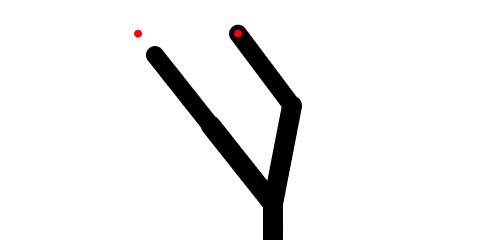


---

## 4.3. ARAP Shape Deformation Exercise

(*10%, 45 minutes*) In order to keep you on track, this technical exercise is due before the end of this week (~Friday 9/18)

**ARAP**, or “as-rigid-as-possible” deformation, lets you bend, stretch, or pose a 2D shape by moving a few control points while the rest of the shape tries to preserve its original local structure. It is an interesting and useful algorithm because it feels almost like puppeteering a material object: the shape can change globally, but local regions still behave as if they have some stiffness and memory.

You are provided with a [p5.js wrapper](https://golanlevin.github.io/arap-p5/arap-p5.js) for Kyle McDonald's [JS reimplementation](https://github.com/kylemcdonald/puppetry) of the 2D "[As-Rigid-As-Possible (ARAP) Shape Manipulation](https://dl.acm.org/doi/10.1145/1073204.1073323)" method by Takeo Igarashi et al., published in SIGGRAPH 2005. Igarashi's algorithm is discussed [here](https://www-ui.is.s.u-tokyo.ac.jp/~takeo/research/rigid/index.html) and demonstrated [in this fantastic video](https://www.youtube.com/watch?v=1M_oyUEOHK8):

[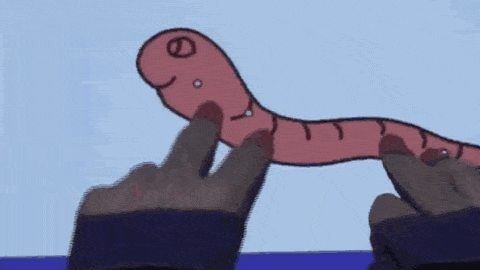](https://www.youtube.com/watch?v=1M_oyUEOHK8)

To get started, **spend 5 minutes exploring** [Kyle's interactive ARAP demo](https://kylemcdonald.github.io/puppetry/): 

[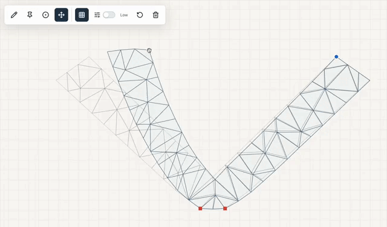](https://kylemcdonald.github.io/puppetry/)

### Your Task: Recreate this Y-Shape with ARAP

Now that you understand what ARAP is and does, your task will be to use the arap-p5.js library to **reproduce** a manipulable **Y-shape** design, as shown below. Almost everything you need has been provided; all you have to do is connect up the arap-p5.js API correctly. **Here is what you need:** 

* **The arap-p5 library is available here:** [https://golanlevin.github.io/arap-p5/arap-p5.js](https://golanlevin.github.io/arap-p5/arap-p5.js)
* **Documentation for the library API is here:** [resources/arap-p5-documentation.md](resources/arap-p5-documentation.md). You will definitely want to read this.
* *This isn't typical, but in case you wanted to work purely offline, you would also need this .wasm (web assembly) file: [https://golanlevin.github.io/arap-p5/arap2d_bg.wasm](https://golanlevin.github.io/arap-p5/arap2d_bg.wasm)*

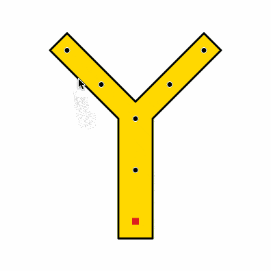

***Now:***

* **Create** a sketch at OpenProcessing.
* **Add** the arap-p5.js library to the OpenProcessing sketch, using the URL `https://golanlevin.github.io/arap-p5/arap-p5.js` for the library.
* **Add** the `myShapeVertices` coordinate information (provided below) to your sketch. **Use** `beginShape()`/`endShape()` to render the Y-shape using this data. 
* **Add** `myControlPoints` and `myPins` likewise, displaying them with small circles or squares.
* **Study** the [arap-p5.js documentation](resources/arap-p5-documentation.md), and **use** the API to **add** the control points and pins to the shape. 
* **Add** mouse interactions to the sketch so that you can deform the shape. 
* **Change** your sketch so that it displays the deformed boundary, instead of the unmodified original.
* **Add** your sketch to the [OpenProcessing slot for this exercise](https://openprocessing.org/class/107236/#/c/107629).


```
  myShapeVertices = [
    [200, 150], [300,  50], [325,  75], 
    [225, 175], [225, 350], [175, 350],
    [175, 175], [ 75,  75], [100,  50],
  ];

  myControlPoints = [
    [300, 75], [100, 75], [250,125],
    [150,125], [200,175], [200,250],
  ];

  myPins = [
    [200,325],
  ];
```

*Perhaps you're asking why.*

[](https://www.youtube.com/watch?v=FEzxchU4RUY)


---

## 4.4. Deforming a Shape With Your Body

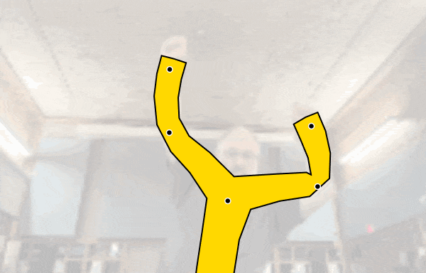

(*10%, 45 minutes*) This brief exercise should be completed before the end of this week (~Friday 9/18). *This is a primarily technical exercise whose goal is to make sure you are well-prepared for the main assignment.*

Your task in this exercise is to **reproduce the sketch shown above**, in which your Y-shaped ARAP model from exercise 43 is controlled by your body pose. In this sketch, I have: 

* attached the Y-shape's upper control points to my wrists;
* attached the next-lowest pair to my elbows; 
* attached the Y-shape's branch point to the midpoint between my shoulders; 
* attached the point below that to my waist; and 
* attached the Y's foot to an imaginary point offset below my waist. 

You are provided with [a p5.js wrapper on Google's MediaPipe](https://openprocessing.org/@golan/2760298), a high-quality computer vision system that can track the face, body, and hands. Note that for the best quality performance, you should **disable** the MediaPipe modalities you're not using (in this case, the face and hands; there are boolean settings for this).

[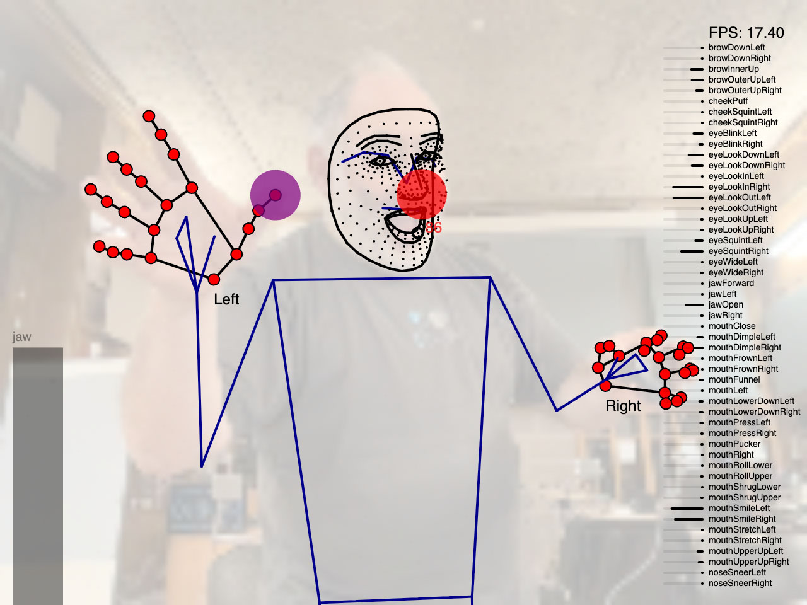](https://openprocessing.org/@golan/2760298)

***Now:***

* **Fork** [the MediaPipe demo](https://openprocessing.org/@golan/2760298). 
* **Add** the [arap-p5.js](https://golanlevin.github.io/arap-p5/arap-p5.js) library to it, and add your deformable Y-shape from exercise #43.
* **Fetch** the correct body pose data points, using the provided MediaPipe wrapper commands like `getPoseLandmark()` and index constants like `POSE_RIGHT_SHOULDER`. You can find these commands and constants in `trackerstuff.js`. 
* **Use** your joint data to govern the ARAP control points.
* **Add** your sketch to the [OpenProcessing slot for this exercise](https://openprocessing.org/class/107236/#/c/107652).
* **Screenshot** a goofy image of yourself puppeteering the Y-shape with your body.
* **Create** a post in the Discord channel `44-camera-deformation`, and **embed** the screenshot in the post.


---

## 4.5. Camera-Driven Live Animation Puppet

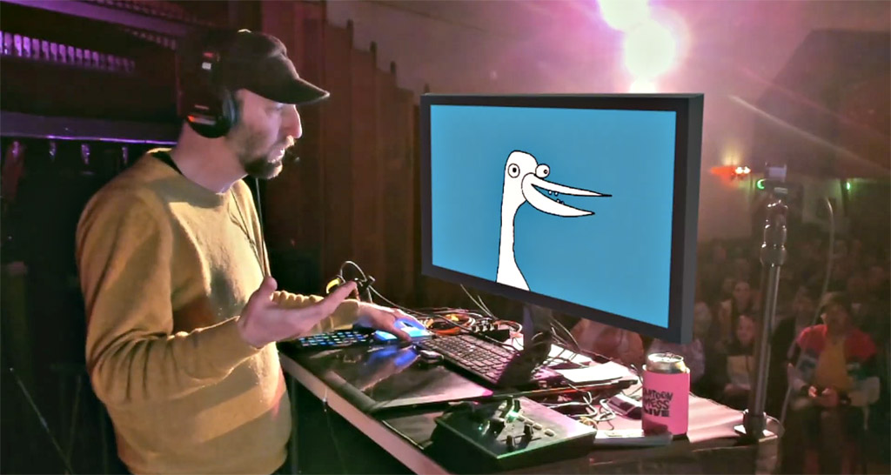

*(45%, 4 hours)* **This is the main exercise**. Using p5.js and MediaPipe, you are asked to create a virtual puppet which is driven by your camera and voice. You may use your face, body, and/or hands. You are encouraged to use ARAP deformation and inverse kinematics, as appropriate to your design. *Keep in mind that you will be asked to use this puppet in a brief performance (see exercise 4.6).*

You are now able to track landmarks on the face, body, and hands with a realtime motion capture system. You can use those landmarks to control a jointed physical simulation, using inverse kinematics. And you can use tracked landmarks and IK joints to govern the control points of a deformable 2D shape, using the ARAP algorithm. 

### Your Task: Make a Virtual Puppet

* For some inspiration, **check out** the following "live animation" performers: 
  * Cartoon Mess Live: [Roger and Gorf](https://www.instagram.com/p/DXF6SdtkhJ_) 
  * [Tom's custom software](https://www.instagram.com/p/DXSKQdTEojQ/). 
  * Kellie Kiakas's [Interactive Rig Demo](https://www.instagram.com/p/DbI1A7zuHTk)
* **SKETCH FIRST!** Make some sketches! Make more sketches. Your puppet can be any kind of character you wish: human, animal, monster, alien, sentient object, etc.
* **Create** a virtual puppet in p5.js which is controlled (directly or indirectly) by landmarks on your face, body, and/or hands. You are encouraged to take advantage of inverse kinematics and as-rigid-as-possible (ARAP) deformation to design your creature. **Remember** that you don't have to map like-parts-to-like-parts: for example, your fingers could puppeteer the legs of a spider. (For the best frame rate, be sure to disable the MediaPipe tracking modes (face, hands, or body) that you're not using.)
* Your puppet should probably respond to your voice. **View** and **explore** [this microphone audio demo](https://openprocessing.org/@golan/3009672), which uses the [p5.sound.js](https://p5js.org/reference/p5.sound/) library. Also check out [this demo](https://openprocessing.org/@golan/3009913) (wear headphones!), which applies a real-time pitch shifter to your voice -- very useful for puppets.
* You may **collaborate** with a partner if you wish; in that case, you should create *two* puppet characters, who inhabit the same canvas space.
* **Add** your sketch to the [OpenProcessing slot for this exercise](https://openprocessing.org/class/107236/#/c/107653).
* **Record** a brief (2-3 second) GIF showing your puppet moving in response to your body. *This GIF is not the video performance documentation; see exercise 4.6.*
* **Create** a post in the Discord channel, `#45-puppet`, to document your project. In your post, **write** about your character and how you operate it. **Describe** some of the decisions you made about your control mappings. **Embed** a screenshot and your GIF recording. 

---

## 4.6. Puppet Party Trick Performance

*(15%, 30m)* In this exercise, you are asked to **create a brief video recording** (10-15s) of a performance you make with your puppet. 

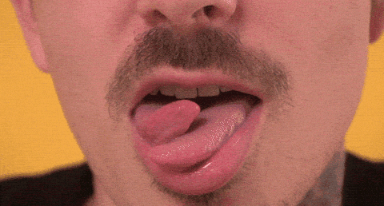
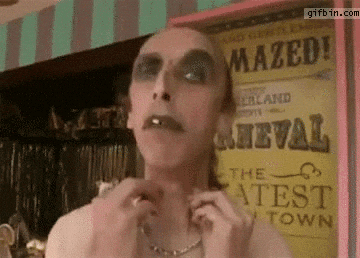

* **Imagine** that your puppet character is auditioning to perform a [party trick on television](https://www.youtube.com/watch?v=oW3Xt-FqWng). In this scenario, your character might **introduce** themselves, and **perform** some interesting trick with their body. For example, Gorf might say, *"Check out this thing I can do with my fleebles"*.
* You might need to add keypresses to help conrol your puppet. That's fine.
* **Plan** and **record** a screen-recording of your puppet performing this party trick. I recommend you **hide** the direct view of your webcam pixels.
* **Consider** using the p5 pitch shifter [demo](https://openprocessing.org/@golan/3009913) to alter your voice, or experiment with other professional voice-altering software like [Voicemod](https://www.voicemod.net/) or [Voxal Voicechanger](https://www.nchsoftware.com/voicechanger/index.html) to get into character.
* It's great if your recording is brief, like 5-15 seconds. 
* **Upload** the video of your performance to an unlisted YouTube video.
* In the Discord channel `#46-performance`, **link** to your performance video. **Write** a sentence or two about your character and what they're doing. **Share** some of the backstory or development notes. 

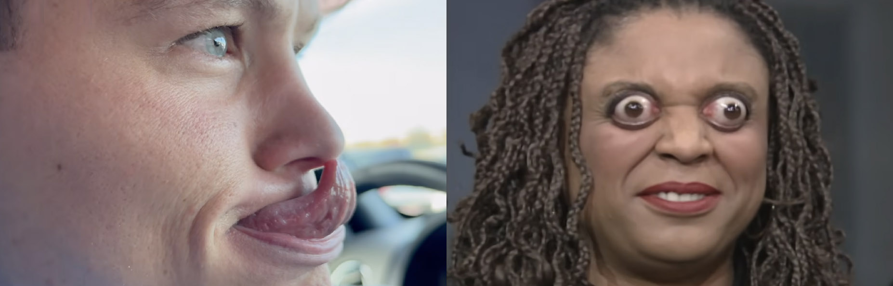


---

<!--

* **Watch** the following three brief videos: 
  * Cartoon Mess Live: [Roger and Gorf](https://www.instagram.com/p/DXF6SdtkhJ_) 
  * [Tom's custom software](https://www.instagram.com/p/DXSKQdTEojQ/). 
  * Kellie Kiakas's [Interactive Rig Demo](https://www.instagram.com/p/DbI1A7zuHTk)

Live Animation

* [**DesignIO**](https://www.design-io.com/) (Emily Gobeille and Theo Watson)
  * [Original prototype](https://vimeo.com/16985224)
  * [Puppet Parade](https://www.design-io.com/projects/puppetparade)
* [**Cartoon Mess Live**](https://www.cartoonmess.live/)
	* [Roger and Gorf](https://www.instagram.com/p/DXF6SdtkhJ_)
	* [Tom's custom software](https://www.instagram.com/p/DXSKQdTEojQ/)
	* [Ninja turtle drawing](https://www.instagram.com/p/DYieH0eyh4C/)
	* [Duck in use; mild cartoon violence](https://www.instagram.com/p/DXxj2IBPJVr/)
	* [Duck in use; building](https://www.instagram.com/p/Db-D3rayrHq)
	* [Full show](https://www.youtube.com/watch?v=SrfYwPvaL34&t=1650s)
* [**Kiafoolish**](https://www.instagram.com/foolishkia/) (Kellie Kiakas)
	* [Interactive Rig Demo](https://www.instagram.com/p/DbI1A7zuHTk)

Hand Stuff


* [@ojrgb](https://www.instagram.com/p/DVn2ryfkSOj)
* [@cottondesigninc](https://www.instagram.com/p/DdBwZBNtErn)
* @Karakold: [jealous](https://www.instagram.com/p/Dc58CAENsqE), [yesterday](https://www.instagram.com/p/DcWOZgMNG9L)
* [@julip.mp3](https://www.instagram.com/p/DSoKeDGjMHU/), [nike](https://www.instagram.com/p/DZ5pmXLIlQV/)
* [@elliotisacoolguy](https://www.instagram.com/p/Dbr08NlxDXO)

Face Stuff

* Karolina Sobecka, [All the Universe is Full of the Lives of Perfect Creatures](https://vimeo.com/35262930) (2012)
* Zach Lieberman, [Más Que la Cara overview](https://medium.com/@zachlieberman/m%C3%A1s-que-la-cara-overview-48331a0202c0) (2016)
* Rachel Ciavarella (CMU), [Animatronic Avatars](https://vimeo.com/126283584) (2015)

-->


