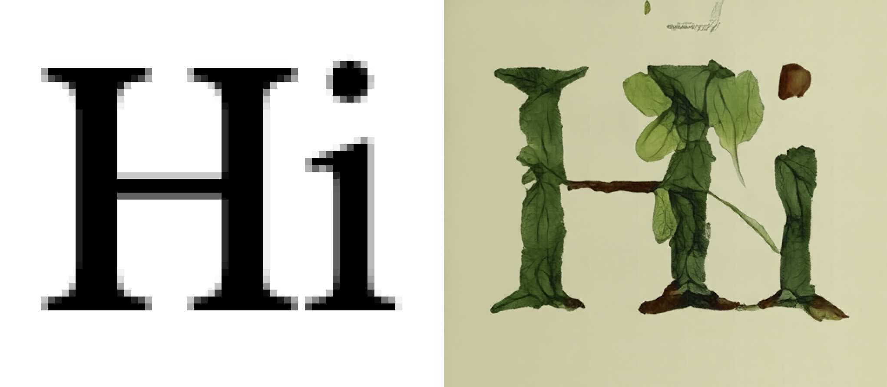
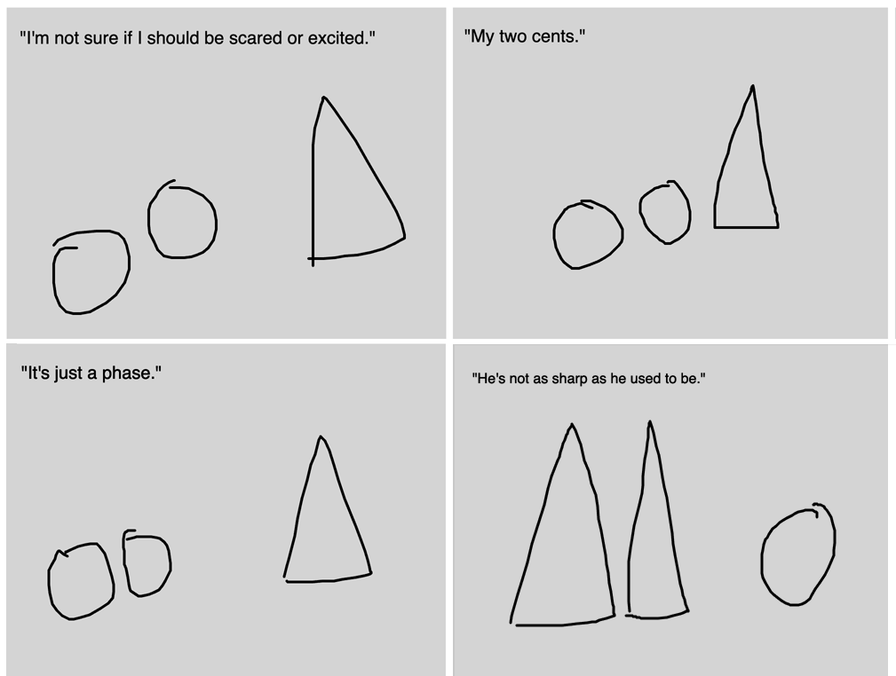

# Assignment Set #5: LLM/AI Buffet

---

## Summary of Deliverables

* 5.1. [Dino Diffusion + p5](https://openprocessing.org/class/107236/#/c/107705) • *(10%, 30m)*
* 5.2. [Canvas Describer: Gemini + p5](https://openprocessing.org/class/107236/#/c/107706) • *(10%, 15m)*
* More TBA.

---

## 5.1. Exercise: Dino Diffusion + p5

*(10%, 30 minutes, due Monday 11/11)* [Diffusion models](https://en.wikipedia.org/wiki/Diffusion_model) are the core algorithms used in popular AI-image generation tools like MidJourney. In this quick warm-up exercise, you will experiment with using custom, generative p5.js graphics to "condition" (guide) a simple diffusion AI. We will base our work on "Dino Diffusion", an ultra-minimal diffusion model created by [Ollin Boer Bohan](https://madebyoll.in/) that generates 512×512 botanical images in the browser, in real-time.

* **Read** "[Dino Diffusion: Bare-bones Diffusion Models](https://madebyoll.in/posts/dino_diffusion/)" (2023) by Ollin Boer Bohan. (You can play with Bohan's [demo here](https://madebyoll.in/posts/dino_diffusion/demo/).) This is an estimated 12-minute reading.
* **Write** a sentence sharing something you learned from this article, in the Discord channel `#51-dino-diffusion`.
* **Fork** [this OpenProcessing sketch](https://openprocessing.org/@golan/3016653), which is a p5.js port of Bohan's Dino-Diffusion project. In your sketch's `LIBRARIES` tab, you should also **ensure** that your sketch includes the following ONNX runtime library: `https://cdn.jsdelivr.net/npm/onnxruntime-web@1.30.0/dist/ort.webgl.min.js`
* **Experiment** with this sketch as follows:
  * Press RETURN to start or re-start the AI process.
  * Press SPACE to clear the canvas and start over.
  * Press a letter key (and then RETURN) to guide the AI with that letter.
  * **Draw** on the canvas with the cursor to provide input to the AI.
* *Now*: **modify** the code of this sketch, creating your own generative image for guiding the AI. You are expected to do this by specifically modifying the  `generateInputImage()` function. (There are no other parts of the code that should be modified.) Keep in mind that your graphics must be rendered into the `inputGraphics` buffer, an offscreen image whose dimensions are 64×64 pixels. Your program should generate a novel input image every time the user presses a key.
* **Upload** your sketch to the [corresponding slot](https://openprocessing.org/class/107236/#/c/107705) in our OpenProcessing classroom.
* **Add** an appealing screenshot of your OpenProcessing sketch to your Discord post in `51-dino-diffusion` (you can press the Down arrow to generate a screenshot image from the forked sketch). Be sure that it shows both your generated graphic and the AI result generated from it. In your post, **write** a sentence describing what you generated, and what guided your experiments. 

--- 

## 5.2. Canvas Describer: Gemini + p5

*(10% - 15 minutes)* 

In this brief exercise, you're asked to modify a simple example sketch in a hopefully interesting way. This is intended to be a quick exercise to make sure you're able to work with the [Google Gemini API](https://ai.google.dev/gemini-api/docs), which CMU provides to you. 

[**Here is an interactive demonstration/template program**](https://openprocessing.org/@golan/3016851). It asks the user to make a drawing on the p5 canvas; it transmits the canvas image to the Google Gemini AI for analysis; and then it asks the AI to generate a text response to that image — conditioned by a text prompt provided in the p5.js code. When Gemini's text is returned, it is displayed in an HTML `div` below the canvas.

*Now:*

* **Fork** this [demonstration program](https://openprocessing.org/@golan/3016851) and change the prompt. You're welcome to modify the graphics and/or interaction code if you wish, but that's not required for this small exercise.
* **Upload** your modified sketch to the [OpenProcessing channel for this exercise](https://openprocessing.org/class/107236/#/c/107706).
* **Create** a post in the Discord channel `#52-canvas-describer`, and **paste** in your revised prompt.
* In your Discord post, **embed** two screenshots of your program in use, and **provide** the Gemini system's responses to those images. **write** a sentence or two about other things you tried, and some reflection on your process.

To get started, you'll need to **make** a Google AI Studio developer test API key. Use the [**instructions here**](resources/gemini/README.md) ("Canvas Describer: Gemini API Key Setup").
 
*Note:* Make sure to keep your API key secure, and avoid sharing it publicly!

---

## More TBA.

<!--

## 5.x (Project) LLM-Boosted Interaction

*(80% - 3-4 hours, Due Wednesday October 8)* In this project, you are asked to **make** an app in p5.js that uses the Google Gemini API to do something interesting. 

*wut?*

It helps to understand what's possible! Please **browse** the [Google Gemini API documentation](https://ai.google.dev/gemini-api/docs/). Observe how the Gemini AI is able to do things like: 

* [Describe, summarize, and answer questions about text](https://ai.google.dev/gemini-api/docs/document-processing?lang=python#upload-document)
* [Describe, summarize, and answer questions about an image](https://ai.google.dev/gemini-api/docs/vision?lang=python#upload-image)
* [Provide the bounding box for an object in an image](https://ai.google.dev/gemini-api/docs/vision?lang=python#bbox)
* [Describe, summarize, and answer questions about audio](https://ai.google.dev/gemini-api/docs/audio?lang=python#upload-audio)
* [Provide a transcription of audio](https://ai.google.dev/gemini-api/docs/audio?lang=python#transcript)

### Some lightweight examples

The pandora's box of Gemini+p5 has been cracked open by [Amit Pitaru](https://pitaru.com/), [Alexander Chen](https://www.chenalexander.com/Bio), and [Trudy Painter](https://www.trudy.computer/), who all work at Google's Creative Lab in NYC. **Check out** the examples below to see how they and others have used Google's Gemini AI to make interesting interactions in p5.js. *This is not an exhaustive list of techniques or possibilities!*

* [*Gemini API starter examples*](https://x.com/pitaru/status/1819797112399511625) by Amit Pitaru: Gemini AI describes p5.js canvas. [Minimal Demo](https://editor.p5js.org/pitaru/sketches/Ixu00bucD); [Version with instructions](https://editor.p5js.org/pitaru/sketches/NSAqfrdJY).
* [*One Line, One Word*](https://editor.p5js.org/golan/sketches/7k4imWAs1) by Alexander Chen. The AI poetically describes the quality of a line. ([Tweet](https://x.com/alexanderchen/status/1819939988676440241))
* [*Stick Figure Theater*](https://editor.p5js.org/golan/sketches/LIaa52nxi) by Alexander Chen. Draw a character; the AI returns a line of dialogue. ([Tweet](https://x.com/alexanderchen/status/1821011074658828481))
* [*Word sorter*](https://editor.p5js.org/golan/sketches/dt6OLwey8) by [Trudy Painter](https://www.trudy.computer/). A text analyzer that organizes words along user-defined spectra. ([Tweet](https://x.com/trudypainter/status/1820555477455167900))
* [*Grow a Seed*](https://editor.p5js.org/golan/sketches/ZkdhSxlGx) AI-collaborative drawing tool by Amit Pitaru. The AI analyzes the canvas, and returns working p5.js code (!!) to enhance it. ([Tweet](https://x.com/pitaru/status/1821310018198642867))
* [*Crappy gaze Estimation*](https://editor.p5js.org/golan/sketches/sktetHnz8) by Golan. The AI tries to estimate which direction the eye is looking.
* [*Life's biggest questions*](https://editor.p5js.org/golan/sketches/em7IzgngM) by Tina Tarighian. Responds to all questions with a single, profound word. ([Tweet](https://x.com/tinaz0ne/status/1824153041597239433))
* [*Penny Dater*](https://editor.p5js.org/golan/sketches/x3oKtHYtP) by Golan. The AI reads the date on a penny. 

Please note that you might need to modify the code of `geminiAPI.js` in order to implement a concept with unusual functionality. *Also, please note that while it is possible to [enable reduced content safety settings in Google Gemini](https://ai.google.dev/gemini-api/docs/safety-settings#safety-filtering-per-request), your projects must still adhere to our Syllabus [Code of Conduct guidelines](https://github.com/golanlevin/60-212/blob/main/2024/syllabus/60-212_syllabus_fall2024.md#code-of-conduct).* 

*Now*: 

* **Create** an app in p5.js that uses the Google Gemini API to do something interesting.
* **Post** your app to the "6.2. LLM-Boosted Interaction" collection in OpenProcessing. 
* In the Discord channel `#62-llm-app`, **describe** your project, and **embed** a few screenshots (or an animated GIF, or an unlisted YouTube video) of your program in use. **Write** a sentence or two of reflection about your project and/or process.

---

-->