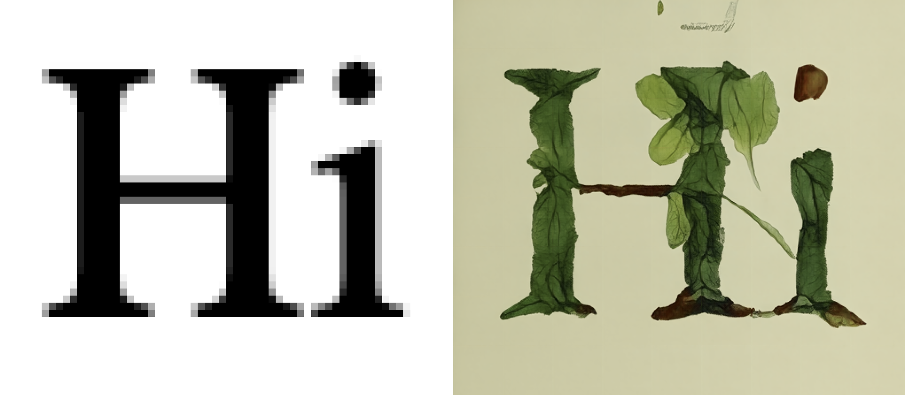
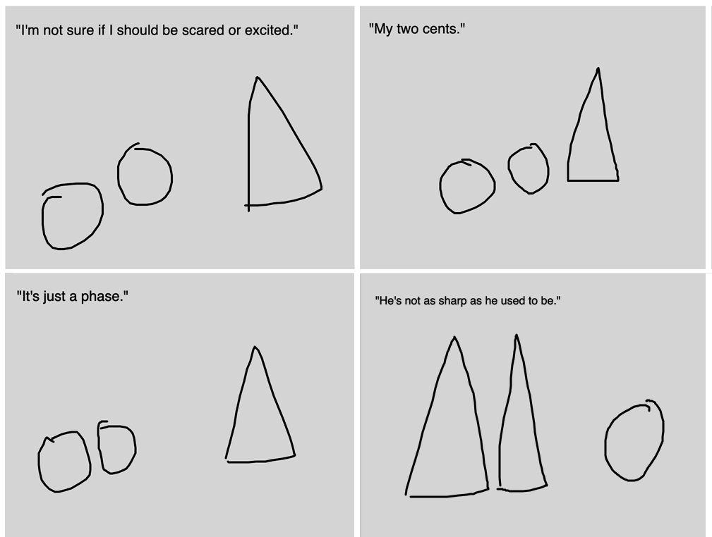

# Assignment Set #5: LLM/AI Buffet

---

## Summary of Deliverables

* 5.1. [Dino Diffusion + p5](https://openprocessing.org/class/107236/#/c/107705) • *(10%, 30m, due Wednesday 9/30)*
* 5.2. [Canvas Describer: Gemini + p5](https://openprocessing.org/class/107236/#/c/107706) • *(10%, 30m, due Wednesday 9/30)*
* 5.3. [LLM-Boosted Interaction](https://openprocessing.org/class/107236/#/c/107809) *(35%, 3 hours, due Wednesday 10/7)*
* 5.4. [Poetic Detector](https://openprocessing.org/class/107236/#/c/107810) *(35%, 2 hours, due Wednesday 10/7)*
* 5.5. ComfyUI+p5 Exercise *(10%, in-class exercise, due Monday 10/5)*

---

## 5.1. Exercise: Dino Diffusion + p5

(*10%, 30 minutes, due Wednesday 9/30.*) [Diffusion models](https://en.wikipedia.org/wiki/Diffusion_model) are the core algorithms used in popular AI-image generation tools like MidJourney. In this quick warm-up exercise, you will experiment with using custom generative p5.js graphics to "condition" (guide) a simple diffusion AI. We will base our work on "Dino Diffusion", an ultra-minimal diffusion model created by [Ollin Boer Bohan](https://madebyoll.in/) that generates 512×512 botanical images in the browser, in real-time.

* **Read** "[Dino Diffusion: Bare-bones Diffusion Models](https://madebyoll.in/posts/dino_diffusion/)" (2023) by Ollin Boer Bohan. (You can play with Bohan's [demo here](https://madebyoll.in/posts/dino_diffusion/demo/).) This is an estimated 12-minute reading. *You will be asked to respond to this reading (see below).*
* **Fork** [this OpenProcessing sketch](https://openprocessing.org/@golan/3016653), which is a p5.js port of Bohan's Dino-Diffusion project. In your sketch's `LIBRARIES` tab, you should also **ensure** that your sketch includes the following ONNX runtime library: `https://cdn.jsdelivr.net/npm/onnxruntime-web@1.30.0/dist/ort.webgl.min.js`
* **Experiment** with this sketch as follows:
  * Press RETURN to start or re-start the AI process.
  * Press SPACE to clear the canvas and start over.
  * Press a letter key (and then RETURN) to guide the AI with that letter.
  * **Draw** on the canvas with the cursor to provide input to the AI.
* *Now*: **modify** the code of this sketch, creating your own generative image for guiding the AI. You are expected to do this by specifically modifying the  `generateInputImage()` function. (There are no other parts of the code that should be modified.) Keep in mind that your graphics must be rendered into the `inputGraphics` buffer, an offscreen image whose dimensions are 64×64 pixels. Your program should generate a novel input image every time the user presses a key.
* **Upload** your sketch to the [corresponding slot](https://openprocessing.org/class/107236/#/c/107705) in our OpenProcessing classroom.
* **Create** a post in the Discord channel `#51-dino-diffusion`, and **write** a sentence sharing something you learned from [Ollin's article](https://madebyoll.in/posts/dino_diffusion/).
* **Add** an appealing screenshot of your OpenProcessing sketch to your Discord post. (You can press the *Down* arrow to generate a screenshot image from the forked sketch); be sure that it shows both your generated input and the AI result generated from it. In your post, **write** a sentence describing what you generated, and what guided your experiments.

--- 

## 5.2. Canvas Describer: Gemini + p5

(*10%, 30 minutes, due Wednesday 9/30.*) The goal of this exercise is to introduce you to the [Google Gemini API](https://ai.google.dev/gemini-api/docs), and to a small taste of scripting an LLM through your own JS code. In this exercise, you're asked to **modify** an example sketch in a simple but hopefully interesting way. 

[**Here is an interactive demonstration/template program**](https://openprocessing.org/@golan/3016851). It asks the program's user to make a drawing on the p5 canvas, paired with a text prompt designed by you. The program transmits the canvas image to the Google Gemini AI for analysis; and then it asks the AI to generate a text response to that image — conditioned by the text prompt in the p5.js code. When Gemini's text is returned, it is displayed in an HTML `div` region below the canvas.

*Now:*

* To get started, you'll need to **make** a Google AI Studio developer test API key. **Follow** the [**instructions here**](https://github.com/golanlevin/60-212/blob/main/2026/assignments/resources/gemini/README.md). *Make sure to keep your API key secure.*
* **Fork** this [**demonstration program**](https://openprocessing.org/@golan/3016851) and **change** the prompt. 
* You're also welcome to modify the graphics if you wish, but that's not specifically required.
* **Upload** your modified sketch to the [OpenProcessing channel for this exercise](https://openprocessing.org/class/107236/#/c/107706).
* **Create** a post in the Discord channel `#52-canvas-describer`, and **paste** in your revised prompt.
* In your Discord post, **embed** two screenshots of your program in use, and **provide** the system's responses to those images. **Write** a sentence or two about the things you tried, and some reflections on your process.

---

## 5.3. LLM-Boosted Interaction

*(30% - 3 hours, due Wednesday, 10/7)* In this project, you are asked to **create** a *small* app in p5.js that uses the Google Gemini API to do something interesting/personal/unexpected. 

It helps to understand what's possible. **Browse** the [Google Gemini API documentation](https://ai.google.dev/gemini-api/docs/), and  =**observe** how the Gemini AI is able to do things like: 

* [Describe, summarize, and answer questions about text](https://ai.google.dev/gemini-api/docs/document-processing?lang=python#upload-document)
* [Describe, summarize, and answer questions about an image](https://ai.google.dev/gemini-api/docs/vision?lang=python#upload-image)
* [Provide the bounding box for a desired object in an image](https://ai.google.dev/gemini-api/docs/vision?lang=python#bbox)
* [Describe, summarize, and answer questions about audio](https://ai.google.dev/gemini-api/docs/audio?lang=python#upload-audio)
* [Provide a transcription of audio](https://ai.google.dev/gemini-api/docs/audio?lang=python#transcript)

**Check out** the examples below to see some examples of using Google's Gemini AI to make interesting interactions in p5.js. *This is not an exhaustive list of techniques or possibilities!*

* [*Word sorter*](https://openprocessing.org/@golan/3023627) by [Trudy Painter](https://www.trudy.computer/). A text analyzer that organizes words along user-defined spectra. ([Tweet](https://x.com/trudypainter/status/1820555477455167900))
* [*Grow a Seed*](https://openprocessing.org/@golan/3023629) AI-collaborative drawing tool by Amit Pitaru. The AI analyzes the canvas, and returns working p5.js code (!!) to enhance it. ([Tweet](https://x.com/pitaru/status/1821310018198642867))
* [*Penny Dater*](https://openprocessing.org/@golan/3023640) by Golan. The AI reads the date on a penny. 
* [*Life's biggest questions*](https://openprocessing.org/@golan/3023647) by ttarigh. Responds to all questions with a single, profound word. ([Tweet](https://x.com/tinaz0ne/status/1824153041597239433))

Please note that you might need to modify the code of `geminiAPI.js` in order to implement a concept with unusual functionality. *Also, please note that while it may be possible to [enable reduced content safety settings in Google Gemini](https://ai.google.dev/gemini-api/docs/safety-settings#safety-filtering-per-request), your projects should still adhere to our Syllabus [Code of Conduct guidelines](https://github.com/golanlevin/60-212/blob/main/2026/syllabus/README.md#code-of-conduct).* 

*Now*: 

* **Create** an app in p5.js that uses the Google Gemini API to do something interesting.
* **Post** your app to the "5.3. LLM-Boosted Interaction" [collection in OpenProcessing](https://openprocessing.org/class/107236/#/c/107809). 
* **Create** a post in the Discord channel `#53-llm-app`. **Describe** your project, and **embed** a few screenshots (or an animated GIF, or an unlisted YouTube video) of your program in use. **Write** a sentence or two of critical reflection about your project and/or process.

---

## 5.4. Poetic Detector

> What is an interesting subject to detect or classify with a video camera? How might a system respond in an interesting way to these observations?

*(30%, 3 hours, due Wednesday 10/7)* This assignment is intended to deepen your understanding of how AI models are trained. In this conceptually-oriented project, you are asked to create a working “situated eye” – a “contextualized classifier” – a “poetic detector“.

You will **create** a machine that uses a camera and neural net to detect something of interest. Your machine should either detect something interesting, detect something in an interesting way, or create an interesting provocation by bringing a detection to our attention. What overlooked phenomenon or invisible rhythm can you discover?

The emphasis here is on the *selection* and *collection* of intriguing data, rather than on the *production* of an attractive interpretation, visualization, or game. In other words, you are asked to create a camera-based system that is located *in a specific place*; which is trained to *detect a specific thing*; and which is the "detector half" of a software system whose remaining "responsive half" you only need to describe *speculatively*.

**Now:**

* You have been provided with a tethered webcam, tripod, and USB extension cable. **Consider** where to put it! Don’t limit yourself to the physical constraints of your laptop’s webcam, and the default assumptions it imposes on where a camera is located and what a camera looks at.
* **Choose** a subject. Your system might respond to things like machines, vehicles, places, trees, animals. (You may point your camera at people, but *you must not violate anyone’s privacy*.)
* **Train** a working image classifier using [Google's Teachable Machine](https://teachablemachine.withgoogle.com/). **Export** the model for p5.js, **save** it to Google's cloud, and be absolutely sure to **keep** a copy of the model's URL. The URL will look like `https://teachablemachine.withgoogle.com/models/XXXXXX/`. *Do not train a model on any confidential data (such as an ID card or credit card), or private/NSFW imagery*.
* **Fork** this sketch, [**ml5_teachable_machine_2026**](https://openprocessing.org/@golan/3019306), for a working p5.js project that loads Teachable Machine models using the ml5.js library. **Replace** the model URL with that of your model.
* **Modify** your sketch to better reflect the content of your detected subject(s). Keep it simple. 
* **Upload** your sketch to the *Poetic Detector* [OpenProcessing collection](https://openprocessing.org/class/107236/#/c/107810).
* **Document** your detector doing its job, successfully classifying your subject from within your p5.js sketch. Your documentation should take the form of an unlisted YouTube video or an animated GIF.
* **Create** a post in the Discord channel `#54-detector`. **Link** or **embed** your video/GIF documentation in the post. In a couple of sentences, *describe* what your app is detecting/classifying. 
* In your post, **speculatively describe** a *hypothetical app* that would respond to these detections or classifications. You don’t actually have to make your software respond in this way—but it should be *possible* for someone to do so in theory. Remember that your system could respond in real-time, or it might serve as a system for recording, logging, or counting what it observes. Keep in mind that you can save files (data, images) to disk. Your system might respond audiovisually (i.e. with graphics and/or sound), and/or it might send a signal over the internet. **Include** a pencil-and-paper sketch of your imagined system.

---

## 5.5. ComfyUI+p5 Exercise

### Details TBA

*(10%, in-class exercise, due Monday 10/5)*

---

<!--

* Log into RunComfy
* Go to https://www.runcomfy.com/comfyui-workflows/my-workflows
* Launch & Build "ComfyUI-NodesLoaded"
* Choose "Medium" (0.99/hr)
* On the Machine Stop Timer, allocate 2 hours
* Click Launch Now, then wait 3-5 minutes for the machine to build
* When the ComfyUI interface shows up, zoom in and have a look. Click "Run" in the upper right to run the default patch and make sure everything is working. It will take a minute the first time, to load the necessary models. 
* Go to the "C" menu in the upper left and select ⚙️ Settings. This will open a Settings control panel interface.
* Under Settings→Comfy→Dev Mode, enable Dev Mode ("Enable dev mode options (API save, etc.)"), by turning the switch to ON (blue).
* Under Settings→Lite Graph→Node (scroll down), set "Node ID badge mode" to “Show All”.

-->