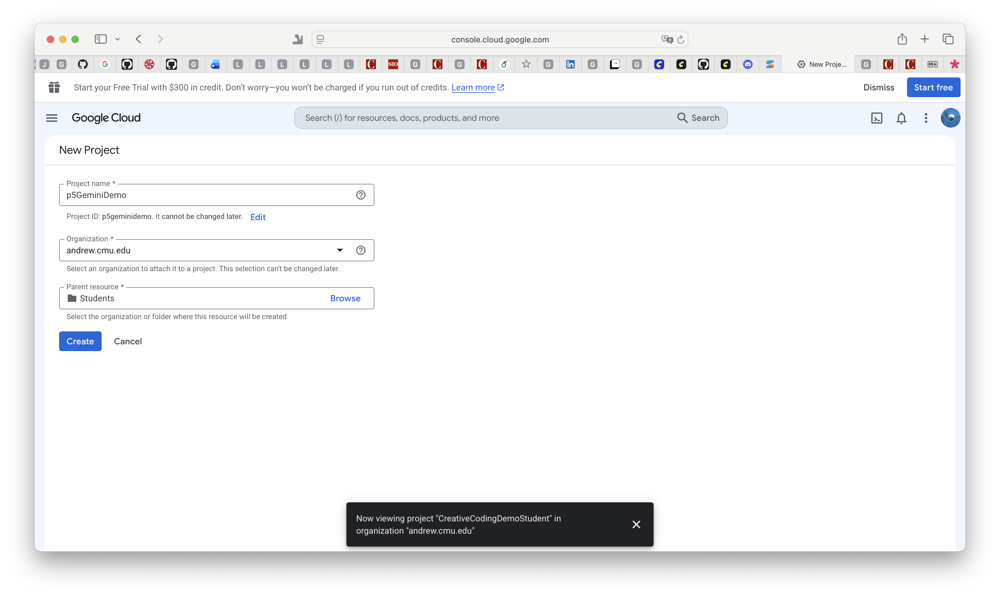
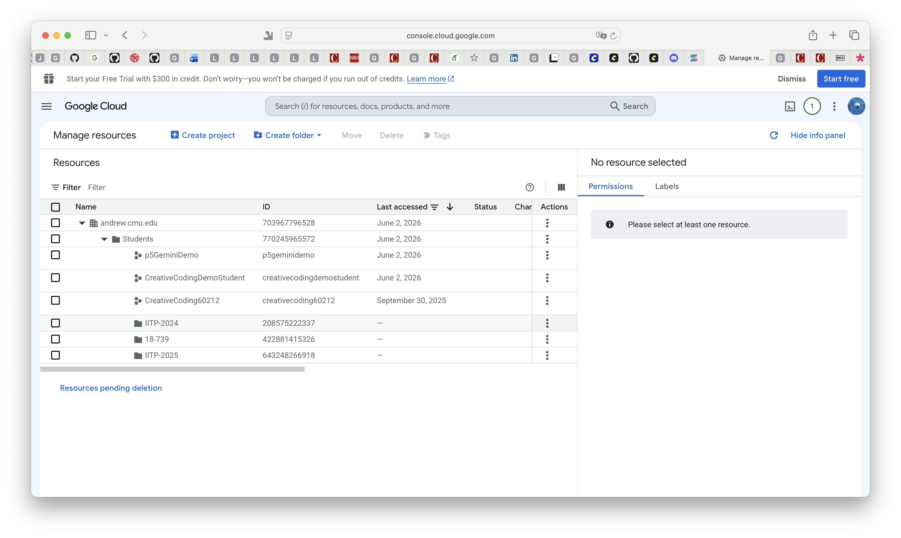
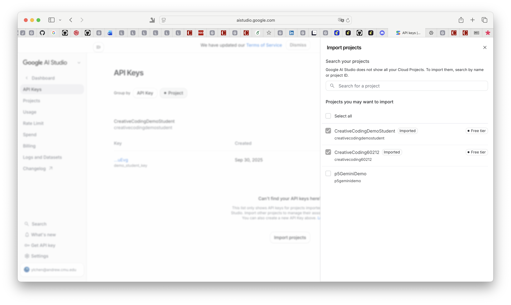
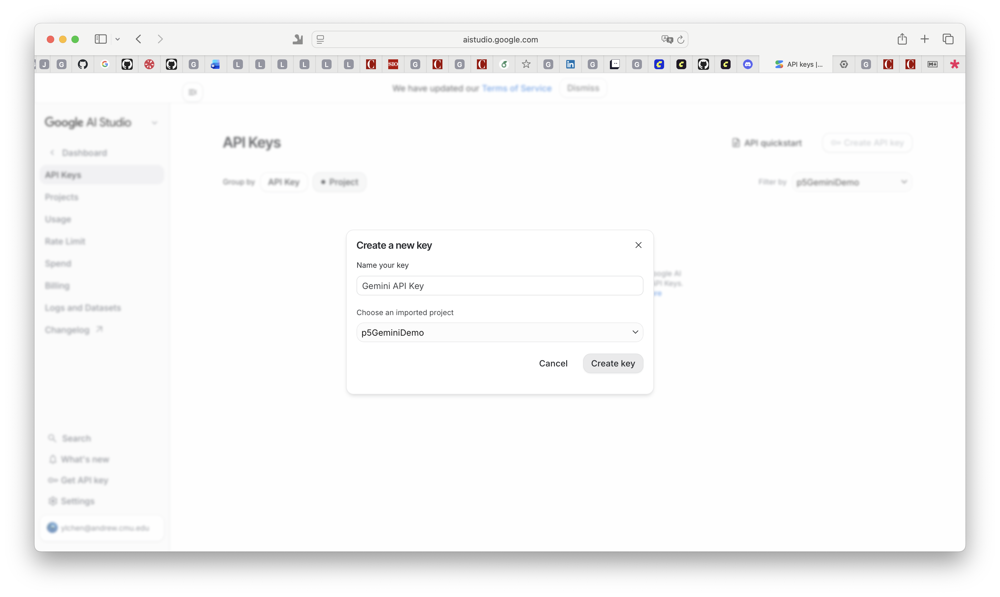

# Gemini API Key Setup

This project is a p5.js sketch that sends your drawing to the Google Gemini API and displays Gemini's response below the canvas.

CMU provides students access to Gemini at [gemini.google.com](https://gemini.google.com/) when you sign in with your Andrew userID. For this coding exercise, however, you also need a **Gemini API key** from Google AI Studio. The Gemini web app and the Gemini API are related, but they are not exactly the same service.

## Before You Start

Use your CMU Andrew Google account when creating your project and API key.

Do not share your API key publicly. Do not post it to Discord, GitHub, OpenProcessing comments, screenshots, or anywhere else. The sketch stores your key in your browser's local storage so you should only need to paste it once.

## Create a Google Cloud Project

1. Go to the [Google Cloud Resource Manager](https://console.cloud.google.com/cloud-resource-manager?walkthrough_id=resource-manager--create-project&start_index=1#step_index=1).
2. Click **Create project**.
3. Give the project a simple name, such as `p5GeminiDemo`.
4. For **Organization**, choose `andrew.cmu.edu`.
5. For **Parent resource**, choose **Students**.
6. Click **Create**.



After creating the project, you should be able to see it listed under the CMU/Andrew organization.



## Import the Project into Google AI Studio

1. Go to [Google AI Studio](https://aistudio.google.com/).
2. Open the **Dashboard**.
3. Go to **Projects** or **API Keys**.
4. Click **Import projects**.
5. Select the Google Cloud project you just created.
It is normal for these projects to show as **Free tier**.



## Create Your API Key

1. In Google AI Studio, go to **API Keys**.
2. Click **Create API key**.
3. Choose your imported project.
4. Copy the key that Google creates.



## Use the Key in the Sketch

1. Open the Canvas Describer sketch.
2. Draw something on the canvas.
3. Press **Return/Enter**.
4. When the browser asks for your Gemini API key, paste the key you copied from Google AI Studio.
5. Wait for Gemini's response to appear below the canvas.

The sketch saves the key in this browser. If you need to replace it, open the browser's JavaScript console and run:

```js
resetGeminiApiKey()
```

Then press **Return/Enter** in the sketch again and paste the new key when prompted.

## Quota and Rate Limit Notes

The free tier is enough for this short exercise if you make a modest number of requests. You may still see a quota or rate-limit message, especially if you submit many drawings quickly.

If you see a message like:

```text
Gemini quota/rate limit reached.
```

wait a little while and try again. Do not repeatedly press Return/Enter while waiting.

Google's limits are attached to your Google AI Studio / Google Cloud project, not to the p5.js sketch. You can view usage and rate limits here:

- [Google AI Studio API keys](https://aistudio.google.com/apikey)
- [Gemini API rate limits](https://ai.google.dev/gemini-api/docs/rate-limits)
- [Gemini API billing](https://ai.google.dev/gemini-api/docs/billing)

## Privacy Reminder

CMU's Computing Services page explains CMU access to Gemini at `gemini.google.com`: [CMU Google Gemini information](https://www.cmu.edu/computing/software/titles/google-gemini/index.html).

For this assignment, your sketch sends your canvas image and prompt through the Gemini API using your Google AI Studio project. Do not draw or submit private, sensitive, or personal information for this exercise.
