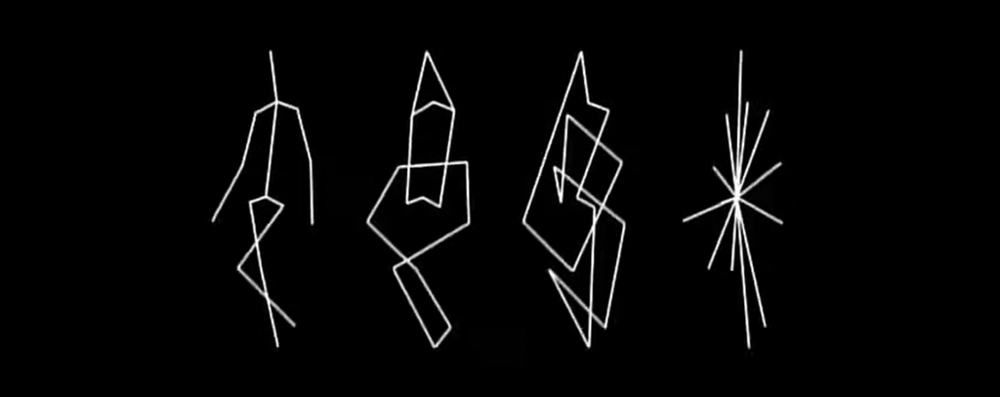
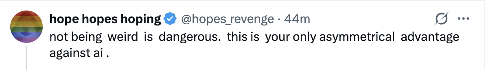
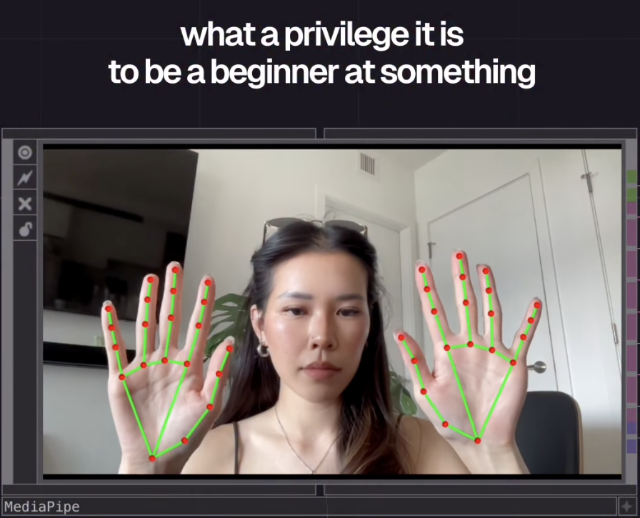

# Monday 8/24/2026

Welcome to the **[Fall 2026 edition of *Creative Coding* at CMU](https://github.com/golanlevin/60-212/tree/main/2026)!**

---

## Agenda

* *Moment of Mindfulness:* [Tokyo Strut](https://www.youtube.com/watch?v=4M-j0Wnjb7Q&t=6s) by Masahiko Sato & Mio Ueta, 2007
* [Introductions](#introductions) 
* [Logistics](#logistics) 
* [What is Creative Coding?](#what-is-creative-coding)
* [Let's Get To Work](#lets-get-to-work)
* [Exit Ticket / Welcome Form](https://forms.gle/Dtg5fU9wtkG6q3Fm7)

---
## Introductions

*Who's in this room?*

* About the Professor, [Golan Levin](https://art.cmu.edu/people/golan-levin/): Here are a few things I've done — art with [Generativity](https://www.artblocks.io/collection/cytographia-by-golan-levin) • [Artificial Intelligence](https://github.com/golanlevin/AmbigrammaticFigures) • [Lasers](http://flong.com/archive/projects/gpp-ii/index.html) • [Robots](http://flong.com/archive/projects/snout/index.html) • [Weird performance](http://flong.com/archive/projects/messa/index.html) • [Creative Coding pedagogy](https://mitpress.mit.edu/9780262542043/code-as-creative-medium/)
* About our Teaching Assistant, [Libby McCaffrey](https://elizabethmccaffrey.com/) (MSCD)
* Please introduce yourselves!

---
## Logistics

*How does this class work?*

* [Syllabus Review](../syllabus/README.md) • [**Condensed Syllabus**](../syllabus/synopsis.md)
* This course is *doubly-intermediate*.

Here's a look ahead at the next couple of weeks:

* [**Semester calendar overview**](../readme.md#assignments)
* `Wed 08/26`: **[Assignment Set 1](../assignments/assignment_1.md) Due** (Getting Started; Points and Lines)
* `Wed 09/02`: Assignment Set 2 Due (Movement; Illusion, Loops)
* `Mon 09/14`: Assignment Set 3 Due (Pattern; Color)
* `Mon 09/14`: at 5:30pm, [Patrik Hübner](https://www.patrik-huebner.com/) speaks in the IDeATe Lecture Series, Hunt Library 106B // *+snacks*

---

## What is Creative Coding?

*What is this class about?*

* Generativity, autonomy, transmediality, connectivity, immersivity.
* [**A Brief Introduction to Poetic Computing**](https://github.com/golanlevin/lectures/blob/master/lecture_introduction/readme_short_2026.md)
* [Zach Lieberman interviewed by Verse](https://twitter.com/verse_works/status/1688889255995609088), 2023. (5 minutes)

---

## Philosophy

* [No Tourists](../../2024/daily_notes/images/0826/no-tourists.jpg) 
* [Something worth valuing](../../2024/daily_notes/images/1106/show-people-something-worth-valuing.png)
* [Art will save us](../../2024/daily_notes/images/0826/maeda_nyt.jpg)
* [Abstraction is political](../../2024/daily_notes/images/1106/toddler-photo-by-jenny-sowry.jpg)
* [You're growing up](../../2024/daily_notes/images/0826/baby-bird-worm.gif). 
* Training requires practice. 
* Painting class and brush marks.
* [Escalator vs. Cyclones](img/ai_debate.png)

---

## Let's Get To Work

*How do I get started?*

* Look at the [p5.js Reference](https://p5js.org/reference/) or [the older version](https://archive.p5js.org/reference/). 
* Let's watch a few minutes of [https://hello.p5js.org/](https://hello.p5js.org/)
* Look at our [OpenProcessing Classroom](https://openprocessing.org/class/107236/#/). 
* Let's do this [Munari exercise](../assignments/img/munari_21dots.jpg).
* [**Walkthrough of Assignment #1**](../assignments/assignment_1.md), due this Wednesday
* Don't forget the [**Welcome Form & Exit Ticket**](https://forms.gle/Dtg5fU9wtkG6q3Fm7)!

---

**Time permitting:**

* *[A list of some creative-technology studios](../../resources/studios.md)*
* *Previous years' courses*: *[2025](https://openprocessing.org/class/100952#/), [2024](https://openprocessing.org/class/93074#/), [2023](https://openprocessing.org/class/86356#/)*
* *Some nice projects in poetic computing:*
	* Christine Sugrue, [*Delicate Boundaries*](http://csugrue.com/delicateboundaries/), 2007
	* Camille Scherrer, [*Le Monde Des Montagnes*](https://vimeo.com/49153795), 2008
	* Matthias Dörfelt, [*Munching*](https://www.mokafolio.de/works/Munching), 2014

