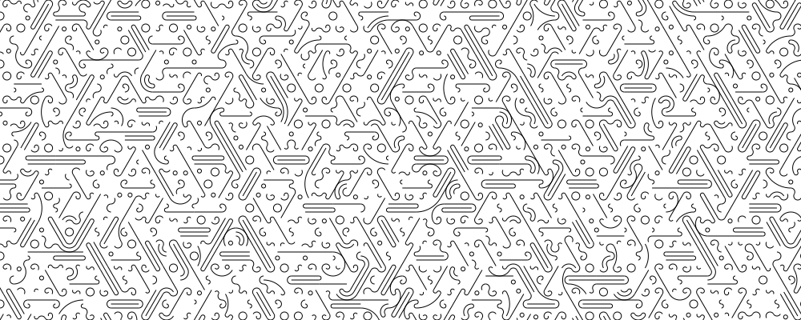

# Monday 8/31/2026

---

## Agenda

* Tilings: aperiodic vs. merely non-square tilings
  * Tiling assignment: [Fall 2025](https://openprocessing.org/class/100952/#/c/101942); [Fall 2024](https://openprocessing.org/class/93074/#/c/94624). 
  * For 2026, I wanted to give you a tiling assignment that couldn't be trivially executed with AI, but also in which (sigh) you could use AI to do some things you couldn't do easily before. 
  * [L-system substitution rules](https://editor.p5js.org/golan/sketches/bG1fxG3Bh)
  * [amman_chair.png](img/0831/amman_chair.png)
  * [amman_chair_patch.png](img/0831/amman_chair_patch.png)
  * [recursive_sub.png](img/0831/recursive_sub.png)
* Moiré concept review. 
* [Tutorial for the Figure-Ground Reversal](https://openprocessing.org/@golan/2997911), and making the animation loop.
	* Blobby isoline animation: [orig](https://editor.p5js.org/golan/sketches/_WaqM7xQk), [mod](https://editor.p5js.org/golan/sketches/lixvdP9S9), [chat](../assignments/img/2/conversation.md)
* [Finessing animation](../assignments/assignment_2.md#more-information) with shaping functions (demos)
* **Work Session.**

---

### Time permitting

* *Some nice projects in poetic computing:*
	* Christine Sugrue, [*Delicate Boundaries*](http://csugrue.com/delicateboundaries/), 2007
	* Camille Scherrer, [*Le Monde Des Montagnes*](https://vimeo.com/49153795), 2008
	* Matthias Dörfelt, [*Munching*](https://www.mokafolio.de/works/Munching), 2014
	* Qubibi, [*Awakened*](https://awakened.qubibi.org/) 
