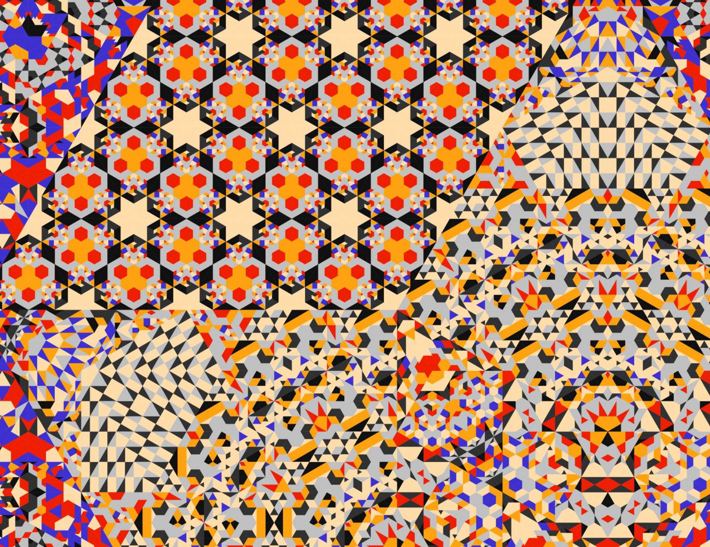

# Wednesday 9/02/2026

 *Generative art by [Lars Wander](https://larswander.com/art/).*

---

## Agenda

### Announcements & Reminders

* [Art&&Code: Transmissions — Workshops & Events](https://transmissions.artandcode.org/), September 19–20 ([RSVP](https://forms.gle/TkkSD9eEk7thPRHh6))

### 2.x Critique/Discussion: 

* [2.1. Moiré Composition](https://openprocessing.org/class/107236/#/c/107368)
* [2.3. Non-Square Truchet Tiling](https://openprocessing.org/class/107236/#/c/107370)
* [2.5. Rhythm Loop with Figure-Ground Reversal](https://openprocessing.org/class/107236/#/c/107377)
* [2.6. Freestyle Rhythm Loop](https://openprocessing.org/class/107236/#/c/107371)

**Evaluation Forms:**

* [2.1. Moiré Evaluation](https://forms.gle/ZjkoffUosYCrwf7L9)
* [2.5. Figure/Ground Evaluation](https://forms.gle/jg89Rkc8wNvYbpVm9)
* [2.6. Freestyle Rhythm Loop Evaluation](https://forms.gle/HUmh7CgWZ28iYtWFA)

---

### Introduction to Color

 [*Albers*, an artwork by David Aerne](https://albers.elastiq.ch/)

* [Cursed HDR demo](https://editor.p5js.org/golan/sketches/BpueAd_aZ)
* [OKLAB Demo](https://editor.p5js.org/golan/sketches/XMN8UmnLP)
* [Mixbox video](https://www.youtube.com/watch?v=Xsqtg2yRl8M) & [p5-mixbox-demo](https://editor.p5js.org/golan/sketches/FPtOVXlpV)
* [**COLOR LECTURE**](../../lectures/color/readme.md)
* Artworks
	* Kjetil Golid's [*Archetype*](https://www.artblocks.io/collection/archetype-by-kjetil-golid)
	* Anatoly Zenkov's [*Parametric Pottery*](https://anatolyzenkov.com/parametric-pottery/preview/22) (click!) & [code](https://anatolyzenkov.com/preview/parametric-pottery/js/colors.js) (uses OKlab!)
	* David Aerne's [*Albers*](https://albers.elastiq.ch/)
* Color interpolation demos
	* [chroma.js color_interpolation_demo_2024](https://editor.p5js.org/golan/sketches/CYUB1GAJV)
	* [chroma.js color_interpolation_demo_2026](https://editor.p5js.org/golan/sketches/2pkxnwYxF)
	* [p5.js color_interpolation_demo_2026](https://editor.p5js.org/golan/sketches/Aki6fvzQe)
* [**ASSIGNMENT 3**](../assignments/assignment_3_color.md) (due 9/7—9/14)

---

<!--
* Class visitors:
	* 9/9: [David Aerne](https://elastiq.ch/)
	* 9/14: [Patrik Hübner](https://www.patrik-huebner.com/)
	* 10/22: [Char Stiles](https://www.instagram.com/charstiles/)
-->
