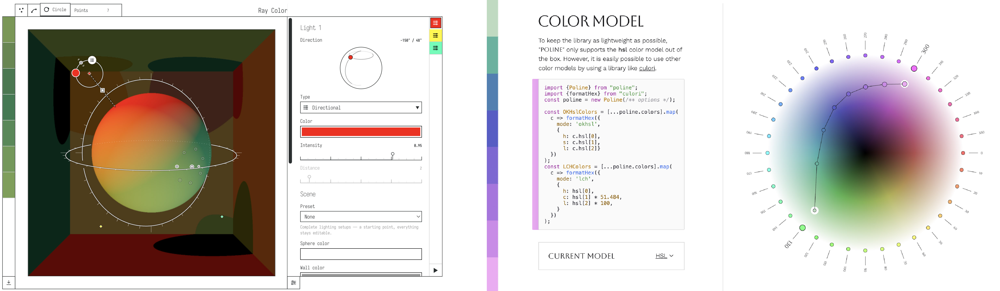
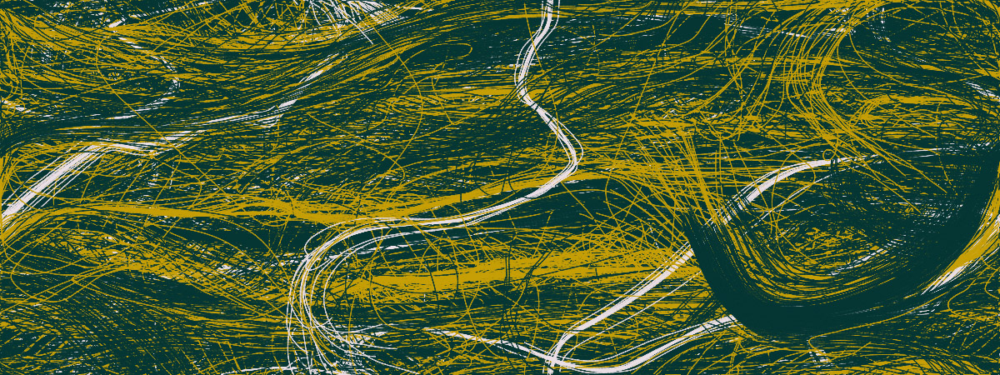

# Wednesday 9/09/2026
	
**Agenda:** 

* Guest Presentation: David Aerne
* Coding Color with Chroma.js: Practicalities
* Provocations for Exercise 36
* Work Session

---

### Guest Presentation: David Aerne

> **David Aerne** is a computational designer and interaction developer based in Zürich, whose work sits at the intersection of code, visual design, and color theory. Through his studio [Elastiq](https://elastiq.ch/), he has spent many years developing open-source tools for generative color and design systems, including [Color Names](https://github.com/meodai/color-names), [Rampensau](https://meodai.github.io/rampensau/), and [Poline](https://meodai.github.io/poline/). In 2026, he received the [Swiss Design Award](https://en.wikipedia.org/wiki/Swiss_Design_Awards) in Media & Interaction Design for Poline, a generative color system that can be explored both through code and through an interactive visual interface. He is a world expert in computational control of color, and his work is a particularly good example of both open-source color research, and creative coding in which the software itself becomes a designed creative medium.

Links: 

* [Elastiq](https://elastiq.ch/) (portfolio site)
* [Why I Build Generative Design Tools](https://github.com/meodai/meodai/blob/main/README.md) (statement)

---

### Coding Color with Chroma.js: Practicalities

* p5.js + Chroma.js [**tutorial**](https://openprocessing.org/@golan/3002523): defining colors, converting colors, manipulating colors, `mix()`
* Chroma.js `scale` [demo](https://openprocessing.org/@golan/3000734)

---

### Provocations for [Exercise 36](https://openprocessing.org/class/107236/#/c/107472): 

* [Flocking](https://editor.p5js.org/golan/sketches/8qxoDkrh6) (intelligent paint)
* [Circle packing 1](https://editor.p5js.org/golan/sketches/quQfGlLY_)
* [Circle packing 2](https://editor.p5js.org/golan/sketches/QSZ5OWzu0)

---

<!--
* Class visitors:
	* 9/9: [David Aerne](https://elastiq.ch/)
	* 9/14: [Patrik Hübner](https://www.patrik-huebner.com/)
	* 10/22: [Char Stiles](https://www.instagram.com/charstiles/)
-->
