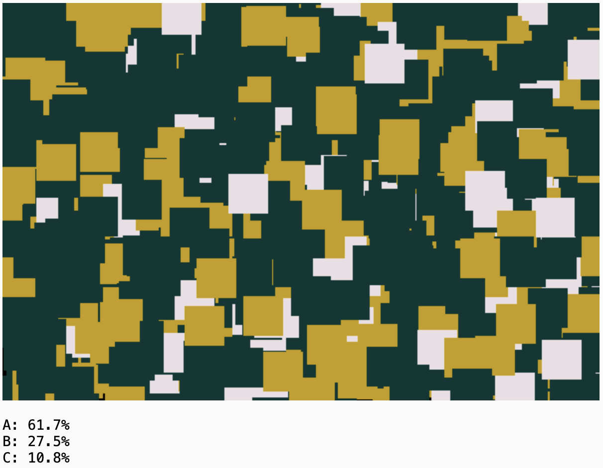

# Wednesday 9/09/2026
	
**Agenda:** 

* Guest Presentation: David Aerne
* Coding Color with Chroma.js: Practicalities
* Provocations for Exercise 36
* Work Session

---

## Guest Presentation: David Aerne

> **David Aerne** is a computational designer and interaction developer based in Zürich, whose work sits at the intersection of code, visual design, and color theory. Through his studio [Elastiq](https://elastiq.ch/), he has spent many years developing open-source tools for generative color and design systems, including [Color Names](https://github.com/meodai/color-names), [Rampensau](https://meodai.github.io/rampensau/), and [Poline](https://meodai.github.io/poline/). In 2026, he received the [Swiss Design Award](https://en.wikipedia.org/wiki/Swiss_Design_Awards) in Media & Interaction Design for Poline, a generative color system that can be explored both through code and through an interactive visual interface. He is a world expert in computational control of color, and his work is a particularly good example of both open-source color research, and creative coding in which the software itself becomes a designed creative medium.

Links: 

* [Elastiq](https://elastiq.ch/) (portfolio site)
* [Why I Build Generative Design Tools](https://github.com/meodai/meodai/blob/main/README.md) (statement)

---

## Coding Color with Chroma.js: Practicalities

* p5.js + Chroma.js [**tutorial**](https://openprocessing.org/@golan/3002523): defining colors, converting colors, manipulating colors, `mix()`
* Chroma.js `scale` [demo](https://openprocessing.org/@golan/3000734)

---

---

## Provocations for [Exercise 36](https://openprocessing.org/class/107236/#/c/107472)

### Generating nice 3-color palettes

Questions for the class: 

* *What might be the characteristics of a "nice" palette (i.e. with a main, secondary, and accent color)?*
* *What are some ways you can think to do this?*

Some example strategies

Here are three broadly useful generative strategies: **derivation, role-based parameterization, and generate-and-test**:

* **Start with one color, then move through color space deliberately.** Generate a random color, then derive the other two by shifting its OKLCH hue by some constrained amount while also varying both lightness and chroma. Rather than choosing three independent colors, think of the palette as three points in color space, with a relationship that you set.
* **Give the three colors different jobs.** Since one color occupies 60% of the image and another only 10%, they need not (and probably shouldn't) have equal visual strength. Try making the dominant color quieter or less chromatic, and letting the accent differ more strongly in lightness, chroma, hue, or some combination. Ask: *what properties make a color tolerable at 60% but noticeable at 10%?*
* **Generate more candidates than you need, then reject bad ones.** Random generation doesn't have to mean accepting everything you generate. Establish some constraints on the relationships between colors, such as minimum/maximum perceptual distance, lightness difference, or chroma, and keep generating candidates until you find a trio that passes your tests. This is essentially **rejection sampling**, and your definition of “passes” becomes the interesting part of the algorithm.

### Achieving or maintaining the 60-30-10 proportions

Question for the class: *What are some ways you can think to do this?*

Some example strategies

* [Measuring area](https://editor.p5js.org/golan/sketches/ZZ6Znukpo)
* [Flocking](https://editor.p5js.org/golan/sketches/8qxoDkrh6) (intelligent paint)
* [Circle packing 1](https://editor.p5js.org/golan/sketches/quQfGlLY_)
* [Circle packing 2](https://editor.p5js.org/golan/sketches/QSZ5OWzu0)

---

Also see [https://colorandcontrast.com/#/simultaneous-contrast](https://colorandcontrast.com/#/simultaneous-contrast)!

<!--
* Class visitors:
	* 9/9: [David Aerne](https://elastiq.ch/)
	* 9/14: [Patrik Hübner](https://www.patrik-huebner.com/)
	* 10/22: [Char Stiles](https://www.instagram.com/charstiles/)
-->
