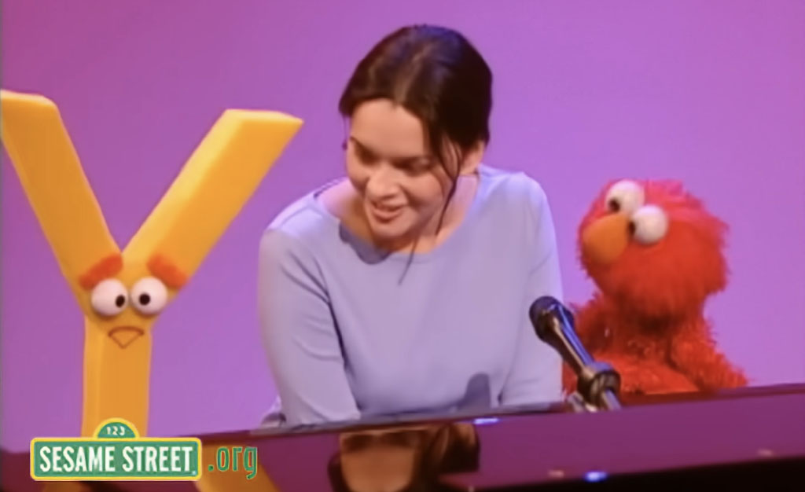

# Wednesday 9/16/2026

	
## **Agenda:** 

#### Viewings

* [Norah Jones](https://www.youtube.com/watch?v=FEzxchU4RUY)
* [**DesignIO**](https://www.design-io.com/) (Emily Gobeille and Theo Watson)
  * [Original prototype](https://vimeo.com/16985224)
  * [Puppet Parade](https://www.design-io.com/projects/puppetparade)
* [**Cartoon Mess Live**](https://www.cartoonmess.live/)
	* [Roger and Gorf](https://www.instagram.com/p/DXF6SdtkhJ_)
	* [Tom's custom software](https://www.instagram.com/p/DXSKQdTEojQ/)
	* [Ninja turtle drawing](https://www.instagram.com/p/DYieH0eyh4C/)
	* [Duck in use; mild cartoon violence](https://www.instagram.com/p/DXxj2IBPJVr/)
	* [Duck in use; building](https://www.instagram.com/p/Db-D3rayrHq)
	* [Full show](https://www.youtube.com/watch?v=SrfYwPvaL34&t=1650s)
* [**Kiafoolish**](https://www.instagram.com/foolishkia/) (Kellie Kiakas)
	* [Interactive Rig Demo](https://www.instagram.com/p/DbI1A7zuHTk)

---

#### Assignment 4 & Code Samples

* Introduction to Assignment 4, [Camera-Driven Puppet](../assignments/assignment_4_puppet.md)
* Inverse Kinemtatics
  * [Boxsquad](https://spacetypegenerator.com/boxsquad)
  * [Pagurek's demo](https://openprocessing.org/@golan/3008809)
  * [Two-armed IK](https://editor.p5js.org/golan/sketches/df2eN79TO)
* ARAP
  * [Igarashi video](https://www.youtube.com/watch?v=1M_oyUEOHK8)
  * [Kyle's demo](https://kylemcdonald.github.io/puppetry/)
  * [ARAP task](https://openprocessing.org/@golan/3007948)
* MediaPipe
  * [MediaPipe](https://openprocessing.org/@golan/2760298)
  * [MediaPipe + ARAP](https://openprocessing.org/@golan/3009507)

