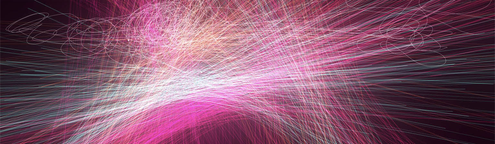
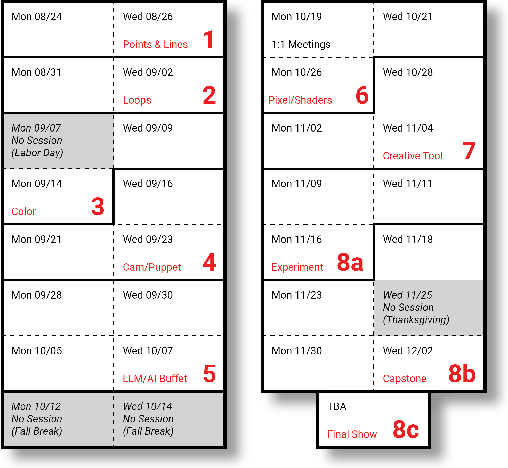
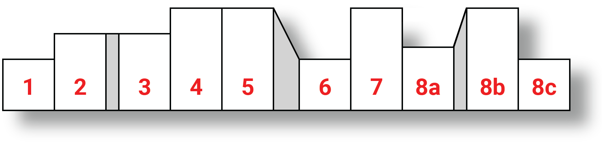

# Creative Coding (60-212) • Fall 2026

* Creative Coding [Fall 2026 Syllabus](syllabus/README.md)
* Time and Location: Mon/Wed, 2:00-4:50pm in CFA-303
* OpenProcessing Classroom: [openprocessing.org/class/107236](https://openprocessing.org/class/107236/#/)
* Professor: [Golan Levin](http://www.art.cmu.edu/people/golan-levin/), `golan@`
* TA: [Libby McCaffrey](https://elizabethmccaffrey.com/), `lmccaffr@`

 

---

## Assignments

There are 10 sets of assignments. Unless otherwise noted, projects should be *submitted* in [OpenProcessing](https://openprocessing.org/class/107236/#/) and *documented* in our course Discord. 

* `Wed 08/26` — #1 Due (Form; Points and Lines) 
* `Wed 09/02` — #2 Due (Movement; Illusion, Loops)
* `Mon 09/14` — #3 Due (Pattern; Color)
* `Wed 09/23` — #4 Due (Camera/Puppet)
* `Wed 10/07` — #5 Due (Speech/AI-Buffet)
* `Mon 10/26` — #6 Due (Pixel Logics; Shaders)
* `Mon 11/09` — #7 Due (Creative Tool)
* `Mon 11/16` — #8a Due (Capstone Experiment)
* `Wed 12/02` — #8b Due (Capstone)
* `TBA 12/XX` — #8c Due (Capstone Presentations & Documentation)

Approximate intensity trajectory of the assignments: 

---

## Special Events

*Attendance at these extracurricular presentations is strongly encouraged:*

* `9/14`: [Patrik Hübner](https://www.patrik-huebner.com/) speaks in the IDeATe Creative Conversation Series, 5:30-6:30pm, Hunt Library Studio A (HL 106B) *+snacks*
* `9/18-9/20`: [Art && Code: Transmissions](https://index.artandcode.org/) Symposium & Workshops ([**RSVP**](https://studioforcreativeinquiry.org/events/artcode-transmissions)!)
* `circa ~10/25`: [Char Stiles](https://www.instagram.com/charstiles/) livecode performance (TBA)
* `10/31–11/1`: [2026 Pittsburgh Art Book Fair](https://carnegieart.org/event/2026-pittsburgh-art-book-fair/)

<!-- 
* [*HCII Lecture Series*](https://hcii.cmu.edu/news/event/2026/09/fall-2026-seminar-series-stay-tuned-full-schedule)
* [*Robotics Institute Seminar Series*](https://www.ri.cmu.edu/events/month/2026-09/)
* `9/16-9/18`: [Design Nexus Summit](https://www.design.cmu.edu/design-nexus/design-nexus-summit) Symposium & Workshops -->
---

## Calendar & Daily Meeting Notes

* `Mon 08/24` — [Hello World!](daily_notes/20260824.md)
* `Wed 08/26` — [**Assignment #1 Due**](assignments/assignment_1.md) (Points and Lines)
* `Mon 08/31` 
* `Wed 09/02` — #2 Due (Loops)
* `Mon 09/07` — *No session (Labor Day)*
* `Wed 09/09` — Guest visit ([David Aerne](https://elastiq.ch/))
* `Mon 09/14` — #3 Due (Color); Guest visit ([Patrick Hübner](https://www.patrik-huebner.com/))
* `Wed 09/16` 
* `Mon 09/21` 
* `Wed 09/23` — #4 Due (Mic/Cam/Puppet)
* `Mon 09/28` 
* `Wed 09/30` 
* `Mon 10/05` 
* `Wed 10/07` — #5 Due (AI-Buffet)
* `Mon 10/12` — *No session (Fall Break)*
* `Wed 10/14` — *No session (Fall Break)*
* `Mon 10/19` — 1:1 Meetings; TIXY
* `Wed 10/21` — Guest visit ([Char Stiles](https://www.instagram.com/charstiles/))
* `Mon 10/26` — #6 Due (Shaders)
* `Wed 10/28` 
* `Mon 11/02` 
* `Wed 11/04` 
* `Mon 11/09` — #7 Due (Creative Tool)
* `Wed 11/11` 
* `Mon 11/16` — #8a Due (Experiment)
* `Wed 11/18` — Libby's Day
* `Mon 11/23` 
* `Wed 11/25` — *No session (Thanksgiving)*
* `Mon 11/30` 
* `Wed 12/02` — #8b Due (Capstone)
* `TBA 12/XX` — #8c (Final Presentations and Documentation)

