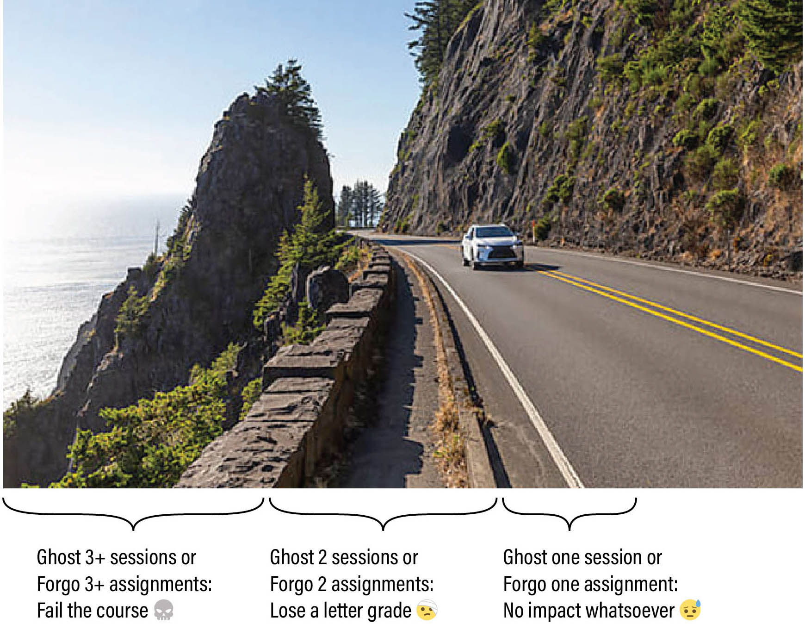
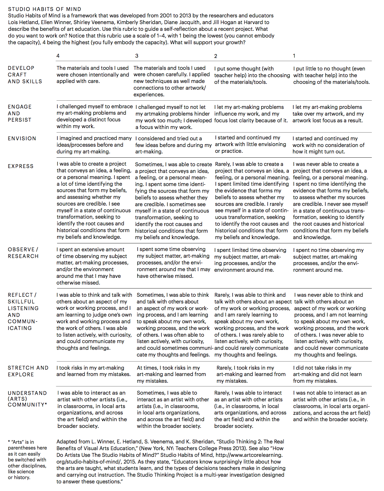

# Syllabus for *Creative Coding* (60-212, Fall 2026)

* Title: *Intermediate Studio: Creative Coding* (60-212), Fall 2026
* Time and Location: Mon/Wed, 2:00-4:50pm in CFA-303
* Departments: Carnegie Mellon University [School of Art](http://www.art.cmu.edu/) and [IDeATe Program](https://ideate.cmu.edu/)
* Course OpenProcessing site: [https://openprocessing.org/class/107236/#/](https://openprocessing.org/class/107236/#/)
* Professor: [Golan Levin](http://www.art.cmu.edu/people/golan-levin/), `golan@`
* TA: [Libby McCaffrey](https://elizabethmccaffrey.com/), `lmccaffr@`

## Contents

*Intermediate Studio: Creative Coding* (60-212) is a practical introduction to the use of programming and computation within the context of the arts. In this intermediate-level course, students develop or deepen the skills and confidence to produce interactive, generative, and computational artworks; discuss their work in relation to current and historical practices of computer art; and engage new technologies critically.

This is a “studio art course in computer science”, in which our objective is art and design, but our medium is student-written software. Intended as a second course for arts students who have already had one semester of elementary programming (in any language), this class develops craft skills in arts-engineering using a variety of creative coding toolkits, especially including [p5.js](https://p5js.org/) (JavaScript) and [ComfyUI](https://www.runcomfy.com/). Through rigorous programming exercises in these environments, students will develop mastery over the basic vocabulary of constructs that govern static, dynamic, and interactive form, with the aim of applying these skills to self-directed inquiries in interactive art, computational design, and other creative explorations of transmediality, connectivity, generativity, and immersivity.

* [TL;DR: Grading](#tldr-grading)
* [Overview](#overview)
* [Administration](#administration)
* [Attendance Policies](#attendance-policies)
* [Grading and Evaluation Policies](#grading-and-evaluation-policies)
* [Academic Integrity and AI Policies](#academic-integrity-and-ai-policies)
* [Accommodations](#accommodations)
* [Code of Conduct](#code-of-conduct)
* [Classroom Hygiene](#classroom-hygiene)
* [Take Care of Yourself](#take-care-of-yourself)

---

# TL;DR: Grading 

> 1. I'm liberal about incidents, strict about patterns.
> 2. You do not need to be perfect, but you do need to participate reliably.
> 3. The *minimum requirements for passing* are that you must substantially complete at least 8 of the 10 assignment sets, and you may not ghost more than two class sessions.

To a first approximation, your grade in this course is based straightforwardly on your **basic professionalism** in completing work and attending class. The policies below deliberately allow for an occasional bad week, missed deadline, or communication failure without penalty. Repeated failures to participate, however, have steep consequences. These grading policies address three independent shortcomings of professionalism:

* **Forgone work:** Did you substantially complete the assigned work?
* **Post-crit submission:** Was your work ready when the class was there to examine it?
* **Ghosting:** Did you fulfill your basic responsibility to show up (or communicate)?

For each of these dimensions, the basic pattern is: *once is free; twice costs you; three times crosses a line.* I have deliberately built slack into the system, but please do not mistake the slack for an absence of standards.

### Summary of Assignment Policy

* 😓 Forgo 1 assignment set: no impact whatsoever.
* 🤕 Forgo 2 assignment sets: lose one letter from your semester grade.
* 💀 Forgo 3+ assignment sets: you have not met the minimum requirements for passing the course.

There will be 10 sets of assignments this semester (the final project has 3 phased subsets). Each assignment set has a clearly defined checklist of subtasks, intended to help you develop discipline in creating and documenting your work. Your grade for these projects is based on your fulfillment of these checklists. An assignment set is considered **forgone** if, one week after its deadline, it remains unsubmitted or is less than 25% completed.

<!-- KW -->
Late submission should not be a loophole for evading the scrutiny of critique. Each assignment set generally has one or two "main" projects which are discussed in critique. Regarding main projects that are submitted after their critique has occurred:

* 😓 First main project submitted after crit: no impact whatsoever.
* 🤕 Second main project submitted after crit: lose one letter from the project's grade.
* 💀 Third main project submitted after crit: no credit for that project.

### Summary of Attendance Policy

* 😓 Ghost 1 session: no impact whatsoever.
* 🤕 Ghost 2 sessions: lose one letter from your semester grade.
* 💀 Ghost 3+ sessions: you have not met the minimum requirements for passing the course.

For the purposes of this course, **"ghosting"** refers specifically to a **no-call, no-show** attendance event. If you need to miss class—which can happen, within reason—you are expected to communicate with me about your absence, generally no later than 30 minutes before class, in order for it to be considered an **excused absence**. Emergencies that make advance communication impossible will, of course, be handled appropriately. 

An excused absence is still an absence; if you accumulate four full-session absences, we will meet to discuss your attendance and make a plan. <!-- AS -->

---

# Overview

### Units and Schedule

This fall, there are 10 primary assignment sets, with the following schedule: 

* `Wed 08/26` — #1 Due (Form; Points and Lines) 
* `Wed 09/02` — #2 Due (Movement, Illusion, Loops)
* `Mon 09/14` — #3 Due (Color, Pattern)
* `Wed 09/23` — #4 Due (Mic/Cam/Puppet)
* `Wed 10/07` — #5 Due (AI-Buffet)
* `Mon 10/26` — #6 Due (Pixel Logics, Shaders)
* `Mon 11/09` — #7 Due (Creative Tool)
* `Mon 11/16` — #8a Due (Capstone Experiment)
* `Wed 12/02` — #8b Due (Capstone)
* `TBA 12/XX` — #8c (Capstone Presentations and Documentation)

 

### Prerequisites

*What prior knowledge must students have in order to be successful in this course?*

* 60-212 is a *doubly-intermediate* course: intended for students who have already had at least one semester of arts foundations, and who have *also* already had at least one semester of introductory computer programming (in any language). To qualify for enrollment in this course: 
	* Students must be familiar and comfortable with computer programming fundamentals, such as iteration, conditional testing, functional abstraction, common memory structures (e.g. arrays), and object-oriented programming, as taught in a course like AP Computer Science, or (at CMU) 15-104, 15-110, or 15-112.
	* Students from outside CFA should be able to demonstrate that they have a creative practice, usually by presenting a portfolio of creative work. 
* General computing skills (such as browser use, file management, word processing, and command-line interfaces) are essential. Students are also expected to have some familiarity with software workflows for editing and distributing images and video.
* This course is taught primarily with JavaScript. Students who are only familiar with Python will benefit from doing some additional preparation, such as viewing p5.js videos on the [Coding Train YouTube Channel](https://www.youtube.com/@TheCodingTrain).

### Learning Objectives and Course Goals

At the conclusion of this course, students will be able to:

* Demonstrate proficiency in using computer programming to make artworks and creative software.
* Demonstrate familiarity with a repertoire of artists, designers, works and practices around creative coding, generative form, interactive art, and computational design.
* Understand the role of computation in artworks and other creative software that explore concepts of transmediality, generativity, connectivity, and immersivity.
* Understand how to document and present artworks created using code.

### Course Relevance

This course is relevant to students who are interested in:

* Exploring the use of computation and contemporary coding practices in creating new culture and expanding their expressive vocabulary
* Developing expertise in the aesthetic nuances and conceptual landscape of interactivity
* Designing procedural form and generative art for games, virtual environments, and other modes of creative expression
* Understanding the practical and social assumptions that underpin code in culture

### Assessment Structure

*How will students be assessed: assignments, exams, final, presentation, project, etc.?*

This course uses [*specifications grading*](https://academictech.uchicago.edu/2025/07/28/specifications-grading-a-powerful-way-to-reflect-what-students-learn/). Work is evaluated against a set of explicit, observable criteria, and these criteria are designed to be relatively unambiguous and quickly verifiable.

* **10 Sets of Assignments**. There will be ten sets of assignments this semester, assigned at approximately weekly intervals. Each set will have several sub-components, usually including multiple warmup exercises and a main project, that may have different intermediate deadlines.
* **Complete the checklists**. For each set of deliverables, an objective checklist of subtasks will be provided, with clearly defined assessment criteria. To ensure transparency, fairness and consistency, grades in this course are straightforwardly calculated according to students' fulfillment of these checklists and criteria. Many items on these checklists are intentionally easy to fulfill; pay attention to them.
* **Qualitative evaluations are decoupled from grades**. In addition to grades that reflect the fulfillment of straightforward checklists, students will also receive qualitative and subjective feedback from a variety of people, including the professor, the teaching assistant, other CMU faculty, outside professionals, and/or your peers. This critical feedback on the content and quality of your projects does not factor into your grade. Sometimes the source of this feedback may be anonymized (e.g. from peers).

This semester, you can expect to receive the following feedback, at a minimum: 

* You will receive a numeric grade for each component of each weekly set of deliverables, as well as a brief written evaluation about one or more of your weekly projects.
* You will receive a mid-semester grade, as well as a brief written evaluation about your overall performance, around the time of Fall Break.
* At the end of the semester you will receive a final grade, and a written evaluation. 

### Extra Time Commitments

*Are there extra time commitments required outside of the regularly scheduled course meeting times?*

* I anticipate that students will spend approximately 6-8 hours per week outside of class working on their projects. For the period from 2023-2025, students reported spending an average of 12.3 hours per week (including 6 in-class hours) in this course.
* There will be a small number of special events outside of class meeting times (such as public artist lectures), for which attendance is strongly recommended, but not strictly required.
* Students may also wish to attend optional and occasional group work sessions.

---

# Administration

### Credits Allocated

60-212 provides **12** units of academic credit, and satisfies a software skills requirement for students pursuing IDeATe minors and concentrations. 

### Required Course Materials

* **Laptop**. Students should have access to a personal laptop with a webcam and a reliable internet connection. Recent installations of macOS, Windows and Linux are all acceptable operating systems. However, it is possible that example projects may only be provided for macOS.
* **Programming Environments**. The primary programming environment used for example projects and sample code will be [p5.js](https://p5js.org/) (JavaScript, optionally programmed within [Visual Studio Code](https://code.visualstudio.com/) with the [p5.vscode](https://marketplace.visualstudio.com/items?itemName=samplavigne.p5-vscode) extension). However, we may also encounter [ComfyUI](https://www.runcomfy.com/), and potentially [TouchDesigner](https://derivative.ca/), [Processing](https://processing.org/) (Java), and/or Python.
* **Sketchbook**. It is extremely wise to plan your projects on paper before writing any code, and some assignments will require you to post images of your project sketches. In support of this, you are strongly advised to maintain a sketchbook for this course, ideally on paper.
* **Smartphone Camera**. Students should have access to a smartphone with a camera to document certain projects.
* **LLM / Coding Agent Account**. You will need to have an account for an AI coding assistant. As a CMU student, you receive free access to [Google Gemini](https://gemini.google.com/) (chat) and [Microsoft Copilot Chat](https://www.cmu.edu/computing/services/ai/tools/copilot/index.html). That said, I strongly recommend that you have a CLI (command-line interface) agent or other LLM tool that can help you manage larger projects, such as OpenAI [Codex via ChatGPT Plus](https://openai.com/chatgpt/pricing/), Anthropic [Claude.ai Pro](https://www.anthropic.com/pricing), Google [AI Studio](https://aistudio.google.com/apps), or Google [Antigravity CLI](https://antigravity.google/).  

### Communication Tools

This course uses the following software systems to share information:

* **Discord** — our primary communication channel. Submit your work and ask for help.
* **Email**. The professor will broadcast summary emails once per week. Please read them.
* **GitHub**, where lectures, assignments and resources will be posted. 
* **Zoom**, for remote meetings, *in the unlikely event that circumstances require it.*

---

# Attendance Policies

In brief:

* **Excused and Excessive Absences:** I trust your reasons, but absence accumulates.
* **Ghosting:** Tell me you're not coming.
* **Partial Attendance:** A lapse gets a nudge; please don't make me start counting.
* **Avoidant Absence on Critique Days:** Being behind does not excuse withdrawal.
* **Health-Related Absences:** Don't infect the room; I don't need medical details.
* **Classroom Recordings:** The classroom is deliberately ephemeral.

### Excused and Excessive Absences

An *excused absence* is one about which you have communicated with me in a timely, professional, and responsible manner. **I generally trust your judgment about when you need to miss class.** You do not need to persuade me that an individual absence is sufficiently important, or disclose private details in order for me to take you seriously.

* **Communication is paramount**. If you're running late or need to miss class—which can happen, within reason—let me know by Discord or email, generally at least 30 minutes before the beginning of that class session. Emergencies that make advance communication impossible will, of course, be handled appropriately.
* **An excused absence is still an absence.** Any individual absence may be entirely reasonable; a pattern of frequent absences can nevertheless become an academic problem. If you accumulate four absences from full class sessions, regardless of whether those individual absences were excused, your attendance has become an academic concern, and we will meet to discuss your attendance and make a plan. Further absences may affect your grade or your ability to complete the course, unless an appropriate accommodation is in place.
* **Missed information is your responsibility**. The professor or TA *may* be able to help, but *you* are ultimately responsible for information you miss as a result of absence. Per CMU policy: *"faculty are not obligated to re-teach material due to a student missing class."* Organize with your classmates to obtain class information and materials that you have missed.

### Ghosting (No-Call, No-Show Absences)

If I am unable to come to class, I will send you a message so that you can plan accordingly. I ask the same courtesy of you.

**Ghosting** means missing class without communicating with me—a "No-Call, No-Show" absence. Missing class can sometimes be necessary; failing to communicate about it is a separate matter of basic professionalism. Allowing everyone the grace of one emergency, the following policy applies (except as otherwise officially accommodated under University policy):

* 😓 Ghost 1 session: no impact on your grade.
* 🤕 Ghost 2 sessions: lose one letter from your semester grade.
* 💀 Ghost 3+ sessions: you have not met the minimum requirements for passing the course.

**If an emergency prevents you from contacting me beforehand, contact me as soon as reasonably possible afterward.** A delayed notice does not automatically erase a ghosting event, but I may excuse it when circumstances genuinely prevented timely communication.

### Partial Attendance

**Focus is precious, and our class time is limited.** Physical presence means little if you're “checked out”; your attention and participation are extremely important. *Partial absence* includes situations like tardiness, sleeping in class, moonlighting, or other forms of conspicuous disengagement or distracted participation.

* **Tardiness** is a form of partial absence. Arriving more than 15 minutes late will generally qualify. Tardiness may be excused or unexcused. Note that I typically begin to lecture (or commence other important class activities) no more than 5 minutes after the official start time. If you know you will be substantially late, please communicate with me just as you would about an absence.
* **Sleeping in class** is considered partial attendance. If you are sleeping in class, I will wake you up. Please understand that it is genuinely difficult to lecture when someone is visibly asleep in front of you; your disengagement affects not only you, but the person who is trying to teach you and the atmosphere of the room. **Sleeping during a guest lecture is particularly unacceptable and profoundly disrespectful to our guest.** If I have to wake you up once, I'll wake you up; if I *keep* having to wake you up, we have a problem.
* **Working on homework for another class** during class time (i.e. *moonlighting*) is considered partial attendance. Moonlighting is particularly harmful to class morale because it signals a willful disengagement and lack of respect, both for your peers and the course content. When you disengage from the collective learning experience, it diminishes the collaborative energy and focus of the group. This behavior can create a ripple effect, distracting others and lowering the overall quality of the class.
* **Stepping out briefly is OK.** I don't require notification if you just need to step out for a few minutes in the middle of class (e.g. to use the restroom, collect yourself, take an urgent call, etc.). If I'm in the middle of lecturing, please don't interrupt me to ask; just quietly excuse yourself. Stepping out for a moment is not considered partial absence.

I am not interested in keeping a tally of minor lapses in attention or participation. People have tired days, arrive late occasionally, or otherwise have imperfect moments. **The problem is when I keep noticing the same problem.** If I notice that your partial attendance has developed into a pattern, I will let you know. **Please don't make me start counting.** Once I have explicitly warned you that a pattern has become a problem, the period of informal slack is over; I will begin documenting further incidents, which may result in a reduction of your semester grade.

### Avoidant Absence on Critique Days

Sometimes, students who haven't completed their projects choose to avoid class on critique days because they are embarrassed to come to class empty-handed. **This is unacceptable, and it compounds the problem.** Being unprepared for critique is not a reason to miss critique.

*Please have courage.* Your participation on critique days is essential even if your own project is incomplete or missing. Critique isn't only about receiving feedback on your own work; listening carefully, discussing your peers' work, and participating in the conversation are themselves important parts of the course. Avoiding critique deprives you of precisely the experience that can help you recover when your work isn't going well, and deprives your classmates of your participation in their critiques.

If you are empty-handed, just say so; it happens. **Come to class anyway.** You are still expected to help your peers by looking carefully, thinking seriously, and contributing productively to the discussion.

### Health-Related Absences

**Please do not come to class when you are sick and potentially contagious.** I would much rather excuse an absence than have you make your classmates, instructors, or their families sick. Use reasonable judgment, and let me know by Discord or email as soon as practical that you will be absent.

I do not need or want intimate details about your medical situation, and you do not need to prove to me that you are sick. It is sufficient to tell me that you are unwell. **I trust you to use this flexibility responsibly.**

If an ongoing medical or disability-related condition is likely to affect your attendance repeatedly, please contact the [Office of Disability Resources](https://www.cmu.edu/disability-resources/) as soon as possible and then speak with me about any appropriate accommodations.

### Classroom Recordings

This course is intended to be experienced **in person, in the room, and in the moment**. To preserve the spontaneity and candor of our classroom environment—and to minimize the amount of surveillance and recording in our lives—class sessions are ordinarily **not recorded or livestreamed**. I do not provide recordings, livestreams, or Zoom connections for absent students, and students should not make their own audio, video, or screen recordings of class without permission. Exceptions will, of course, be made when recording or remote access is required as part of an approved disability accommodation.

---

# Grading and Evaluation Policies

***My Opinion of Your Work is Not Your Grade; Your Grade is Not My Opinion of Your Work.***

In this course, your work is considered through three different lenses, which are decoupled to the greatest extent possible:

* **Grades** reflect your fulfillment of explicit, observable course requirements.
* **Evaluations** reflect subjective judgments about the quality, interest, and significance of your creative work.
* **Expectations of Professionalism** describe habits and conduct that will help you learn, contribute to our class community, and prosper as an artist and practitioner.

Put more simply: **Grades ≠ Evaluations.** It is entirely possible to receive full credit for a project that I don't happen to think is particularly good or interesting. Conversely, it is possible to make something remarkable while failing to fulfill some of the basic requirements of the assignment.

## Policies for Forgone Work

An assignment set is considered **forgone** if, one week after its deadline, it remains unsubmitted or is less than 25% completed. The following grading policy concerns forgone assignments:

* 😓 Forgo 1 assignment set: no impact on your grade whatsoever.
* 🤕 Forgo 2 assignment sets: lose one letter from your semester grade.
* 💀 Forgo 3+ assignment sets: you have not met the minimum requirements for passing the course.

If you know you're going to be late with a project, *contact me* prior to the due date.

## Policies for Incomplete Work

Your grades in 60-212 are primarily based on your self-evident **fulfillment** of simple checklists. Assignment sets and projects will have clearly stated supporting requirements, totaling 100%. These requirements are deliberately straightforward and easy to verify. For example, a project might ask you to:

* **Create** a unique Discord post for your project.
* **Upload** a static image of your project, such as a screenshot or photograph.
* **Upload** dynamic documentation, such as an animated GIF, video recording, or interactive applet.
* **Write** a brief reflection about your project, its development process, and what you learned.
* **Link** to your project or code, if requested.
* **Credit** other students, AI agents, tutors, or anyone else from whom you received substantial advice or help, and briefly describe the help you received.
* **Cite** any code, external libraries, or other media (e.g. photographs, soundtracks, source images) that you used in your project.

**Citing your sources and crediting your helpmeets is extremely important. Err on the side of generosity.**

If you fail to fulfill checklist requirements, points will be deducted accordingly. Because these requirements are objective and easy to verify, some checklist grading may be performed by our teaching assistant.

## Policies for Late Work

When you submit a project late, you miss the chance to share, discuss, and get feedback on your work. These are some of the most valuable affordances of this class.

To receive critical feedback, your work must be available during the designated review period. At various times this semester, your creative projects may be evaluated by your peers in an in-class critique, or by outside experts who review your work online. If your assignment is not viewable when those people conduct their reviews, then your work will generally not receive feedback from them. Likewise, my feedback for late work is often comparatively attenuated.

**Late submission should not be a loophole for evading the scrutiny of critique.** Each assignment set generally has one or two "main" projects that are discussed in critique. For these main projects:

* 😓 First main project submitted after critique: no impact whatsoever.
* 🤕 Second main project submitted after critique: lose one letter from the project's grade.
* 💀 Third main project submitted after critique: no credit for that project.

## Evaluations

**Evaluations** are subjective assessments of your creative work. They are *opinions*.

Evaluations may come from me, our teaching assistant, external guest critics, your peers, or even your own self-evaluation. They articulate someone's personal and professional judgment about whether your creative effort is *good*, *interesting*, *noteworthy*, surprising, skillful, provocative, underdeveloped, etc. **Evaluations do not figure into your grade.**

The purpose of our open-ended projects is to provide well-circumscribed opportunities for you to make creative work. Generally, the prompts will invite you to explore a specific topic or set of tools, but unless stated otherwise, there is no correct solution and no specific requirement for how you should implement your idea. My assignments will often ask not only for a creative solution, but also for some creativity in how you define and approach the problem.

The quality of a creative project may be unrelated to how much time you spent making it. You may sometimes encounter a quickly executed solution that succeeds because of its strong concept. Usually, however, the quality of a project is rewarded by extra attention to its craft.

**There is intentionally no single rubric for creative quality.** Different evaluative lenses call attention to different qualities in creative work, and I like to experiment with different subjective schemas. You may therefore encounter different forms of evaluation for different projects. These schemas are tools for thinking and discussion, not grading systems.

In addition to evaluations for individual projects, I will provide a brief written mid-semester evaluation of your work. Other evaluations may be provided by email or private message and may be quite brief.

Here are some of the evaluative schemas we may use:

### Evaluation Schema 1: C/G/S (Allison Parrish)

Your work may be critiqued based on [these subjective considerations from Allison Parrish](https://eroft.decontextualize.com/#evaluation-rubric):

* An assignment is **Compliant** if it meets the brief.
* An assignment is **Gregarious** if it makes connections between course content and the rest of the world; e.g. your own interests as an artist, designer, technologist, etc., and/or other fields of research and practice.
* An assignment is **Stubborn** if it provides evidence that its maker was opinionated about what they wanted to accomplish and did not let small setbacks (whether conceptual or technical) deter them from this end.

Assignments may be assigned a score of 0, 1, or 2 in these categories, according to the extent to which the assignment demonstrates the properties described:

* **0:** Little or no evidence of this quality
* **1:** Meets expectations
* **2:** Exceptional evidence of this quality

### Evaluation Schema 2: C/T/E/I

* **Curiosity:** Are you asking questions as you work?
* **Tenacity:** Are you forging through difficult problems without giving up?
* **Execution:** Are you crafting with purpose, precision, and attention?
* **Inventiveness:** Are you discovering or exploring methods outside the obvious and predictable?

This schema may also use the 0/1/2 rating, as above. 

### Evaluation Schema 3: Studio Habits of Mind (Lois Hetland et al.)

At some point, you may be asked to perform a self-evaluation of a project using the four-point "Studio Habits of Mind" rubric by Lois Hetland et al. (via Zach Lieberman):

## Expectations of Professionalism

**Earning good grades is roughly correlated with, but is not the same thing as, being a good learner.**

Because your grade primarily reflects your fulfillment of basic requirements, I regularly give **A** grades to work that fully meets the checklist criteria but that I don't happen to think is particularly good or interesting.

I am just one person, and despite my years of experience in this field, my particular taste is ultimately irrelevant. I have been known to dismiss student projects that later proved to be highly influential and significant. I have brought in outside critics whose opinions I deeply respect, only to be surprised by their radically different (but equally valid) opinions about student projects. And I have been known to change my own mind about student projects quickly, and often.

That said, there are some habits of professional conduct that will set you up to actually learn stuff. They are simple, but they matter:

* **Be present and responsible.** Show up, participate, communicate when you have a problem, submit your work punctually, and clean up after yourself.
* **Be generous.** Help your classmates when they're stuck. Make space for others. Contribute thoughtfully to discussions and critiques.
* **Be curious.** If you don't understand something, start with curiosity rather than judgment. Ask questions. Ask for help.
* **Be conscientious.** Pay attention to craft, execution, and documentation. Put your heart in the work.
* **Be tenacious and resourceful.** Difficult problems are part of the work. Figure out what you need to learn, and get the assistance you need rather than simply giving up.
* **Be fearless.** Work outside your comfort zone. Explore methods outside the obvious and predictable. Give yourself permission to weird.

These qualities are **not another hidden grading rubric**. I am not assigning points for generosity, curiosity, fearlessness, or whether I happen to enjoy working with you. But grades are not the only form of consequence in a professional community. Over time, the way you work with other people naturally shapes their confidence in you as a colleague.

When professors recommend students for opportunities, introduce them to professional contacts, agree to supervise independent work, admit students from waitlists, or write letters of recommendation, we necessarily draw on our experience of working with those students. Reliability, generosity, curiosity, initiative, and collegiality become part of that professional reputation. This isn't a system of rewards for pleasing me; it's one of the ways professional communities actually work.

## Feedback and Critique

We are a diverse group with broad interests and a great deal of interdisciplinary hybridity. It is impossible to have one single standard we can use for "what is good."

Sharing our perspectives in critiques, while understanding that others may have very different perspectives on what is good, **is an act of care.** In art school, it is one of the highest forms of care we can give each other.

Outside of art school, if people don't find your work compelling, they will generally not tell you so; they will simply move on to something they like better. Critiques in an art school are a *gift*—a context in which you can receive candid feedback from "inside the house." Take them seriously, listen generously, and make a good-faith effort to help your peers see their own work more clearly.

There often isn't enough time to provide in-depth feedback for every student during critiques. If you would like more feedback on a project, ask me.

---

# Academic Integrity and AI Policies

#### TL;DR: *Acknowledge, Credit, Cite*

**Credit is one of the most important forms of currency** in the economies of commons-based peer production and open-source media arts. For more than a quarter-century, the field of creative coding has involved learning from other people's work, borrowing and modifying code, using open-source libraries, following tutorials, asking friends for help, and building on ideas that came before us. Generative AI has made these relationships more complicated, but it has not changed the basic principle:

**Be honest and generous about where your work came from and who, or what, helped you make it.**

* **Did you use an AI coding agent?** Acknowledge it.
* **Did your friend, TA, or tutor help you?** Credit them.
* **Did you use some code you found?** Cite it.
* **Did you use a library, dataset, image, sound, or other media made by someone else?** Cite it.
* **Were you inspired by an artwork you saw?** Say so.
* **Did you follow a tutorial?** Tell us.

When in doubt: **give credit.**

## Assignment-Specific Rules Come First

This semester we will—intentionally, critically, and with care—make extensive use of LLM-based coding agents and other generative AI systems. In many assignments, their use will be explicitly permitted or even required. In other assignments, I may ask you to do something entirely by hand, without AI assistance, because the intellectual activity of doing it yourself is the point of the exercise.

**The rules of the individual assignment always take precedence over the general policies below.** An assignment may require, permit, restrict, or prohibit the use of AI, collaboration, particular libraries, tutorials, or other forms of assistance. I will make these restrictions clear.

Using an AI agent on an assignment where AI is explicitly prohibited is no different, for the purposes of Academic Integrity, from using any other unauthorized assistance.

## Policies Regarding AI Coding Agents

In this class, you are generally permitted—and often *affirmatively encouraged*—to explore generative AI as an instrument for programming and art-making.

We do this:

* Partially, to understand firsthand the new things we can do and make with these systems;
* Partially, because it is incumbent upon us to understand how these systems are changing the nature of creative coding, software development, and digital culture; and
* Partially, to see whether it is possible to make something with them that feels like it is *ours*, and whether it is possible to find some joy in doing so.

It may no longer be practical or important to ask "who typed this code?" Instead, I am interested in questions like: 

* Did you follow the rules of the assignment? 
* Were you honest about how the work was made? 
* Did you engage with the intellectual activity the assignment was designed to address?
* Can you take responsibility for what you submitted?

### Take Ownership of ALL Your Work

**AI assistance does not transfer responsibility.** You are fully responsible for everything you submit in this course, regardless of whether you wrote it yourself, adapted it from another source, developed it collaboratively, or generated it with an AI system.

If your coding agent generates something **mediocre, broken, plagiaristic, or offensive**, and you choose to submit it, then it is *your* mediocre, broken, plagiaristic, or offensive submission.

You don't necessarily need to understand every line of code an agent produces. Indeed, part of what we will investigate this semester is what it means to work productively with systems capable of doing things that exceed our own technical knowledge. But you should understand your project well enough to use it, test it, evaluate it, modify it, discuss it, and stand behind it.

### Acknowledge Your Use

Carnegie Mellon University's Academic Integrity Policy prohibits the use of *unauthorized* assistance to complete coursework, while allowing instructors to establish what forms of assistance are authorized for their courses and assignments.

So here it is: **unless an assignment specifically says otherwise, generative AI is authorized in this course. But if you use it, you are required to say so.**

In your project write-up and/or code, identify which AI system or coding agent you used and briefly describe how you used it. You do not need to provide a detailed transcript of every prompt, but I want your honest account of the role the system played in making the work.

Your honesty in this matter is of the utmost importance as we all learn to understand this new landscape.

### Use Your Own Voice When Requested

Some assignments will specifically ask you to write **"in your own voice"**: for example, reflecting briefly on something you made, explaining a decision, describing your experience, or providing critical feedback to your peers.

These are not difficult writing assignments, and polished prose is generally not the point. When I ask for your own thoughts, observations, opinions, or voice, using an AI system to speak for you is a small but real betrayal of yourself: you are outsourcing the one contribution to the class that only you can make. I would much rather read two awkward sentences that actually contain *your observation* than a polished paragraph generated by a machine.

### Pay Attention to What You Delegate

The person who benefits most from engaging with studio work and academic projects is you. An AI agent can assist with, or simply take over, many of the tasks involved in making a project. Sometimes that's exactly what I want you to explore. Other times, **outsourcing the task also outsources the learning.**

**Pay attention to what you are delegating.** It can be useful to distinguish between *plumbing* and *expression*.

By **plumbing**, I mean technical infrastructure that is necessary for a project to function but incidental to what you are trying to express: a file-loader, an FFT implementation, a routine for parsing some data, a tedious interface to an API. Delegating this kind of work to an AI coding agent may be entirely sensible. There is often little educational or creative value in reinventing the plumbing yourself.

But be much more cautious about delegating decisions that contribute to the **voice, perspective, behavior, or character** of your work. 

Unfortunately, in the media arts, plumbing and expression are often coextensive: the particular way something moves, responds, glitches, interpolates, selects, sorts, draws, or fails may *be* the artwork. Seemingly small implementation decisions accumulate into style.

There is therefore no clean boundary between plumbing and expression. Worse, delegation has a tendency to **creep**. An agent solves one incidental technical problem, then another; soon it is proposing the architecture, determining the aesthetics, and filling in decisions you never consciously decided to delegate. The convenience is seductive.

**Delegate plumbing strategically; don't accidentally delegate your point of view.** Periodically ask yourself: *Which parts of this project are actually mine? Which decisions am I still making?*

### Beware the Loss of Your Voice

This is an art course that seeks to cultivate your unique creative voice. Generative AI systems are extraordinarily capable, but they are also very good at producing a digested version of things they've seen before: a **brownish-gray paste made from human knowledge**.

Slop may be perfectly adequate for solving a technical problem in which there is a well-defined correct answer. It is much less useful when the purpose of a creative project is to express a distinctive perspective.

I may hope that you make something *beautiful*. I may hope that you make something *interesting*. But most importantly of all, my assignments exist to challenge you to make something ***yours***.

### Beware the Loss of Your Time

AI systems can produce inaccurate information, inappropriate solutions, hard-to-find bugs, imaginary APIs, unnecessary complexity, and confident explanations of things that simply aren't true.

Check claims, test code, verify sources. Look at what the agent actually made.

Sometimes an AI agent will save you hours, but sometimes **it may be easier just to program the damn thing yourself** than to spend your time coping with an AI's errors, hallucinations, and poor decisions. Learning to recognize which situation you're in is part of learning to use these tools well.

### Beware the Loss of Serendipity

Bob Ross famously quipped, *"We don't make mistakes—we just have happy accidents."*

Although it may be expedient to have a system write your code for you, there is value in becoming intimately familiar with the grain of your medium. Programming something yourself exposes you to errors, misunderstandings, unexpected behaviors, and strange intermediate states. Sometimes those accidents suggest possibilities that neither you nor an AI agent would have deliberately proposed.

Efficiency is useful. **It is not always the point.**

### Protect Private and Sensitive Information

Do not provide confidential, private, sensitive, or personally identifying information to third-party AI systems unless you understand and accept how that information will be handled. This includes other people's information as well as your own.

## Informal Collaboration

Our course places a high value on civic responsibility, which includes helping other people learn. **Giving and receiving help is encouraged.**

Ask your classmates, friends, teaching assistant, and other knowledgeable people for help. Explain things to one another, debug together, recommend libraries and techniques. Point someone toward useful documentation. Show someone how you solved a technical problem.

A few expectations apply:

* **We are all teachers.** Students with advanced skills are expected to help others when they can.
* **Don't pretend you did it alone.** If someone substantially helped you solve a problem or develop a project, acknowledge them and briefly describe the help you received.
* **When in doubt, give credit.**

## Formal Collaboration

Most assignments in this course are intended to be executed individually. Some assignments may permit or explicitly require collaboration.

If you formally collaborate on a project:

* **Notify me.** Let me know who is working together.
* **Describe who did what.** Your project documentation should briefly explain how the work was distributed among collaborators.
* **No third wheels.** Unless I explicitly say otherwise, formal collaborations are restricted to pairs of students.
* **Collaborate within the class.** Formal project collaborators must be members of this semester's 60-212 cohort. Getting informal help from someone outside the course is fine; submitting a project jointly with them is not.
* **Avoid co-dependency.** I'm glad you have a bestie, but don't automatically work with the same person every time. You may submit jointly with the same collaborator on no more than two projects.

## Borrowed Code, Libraries, Media, and Ideas

Creative coding is built on other people's work. In this course, reuse is not inherently plagiarism; **misrepresentation is the problem.**

* **Use libraries.** General-purpose, reusable libraries that solve technical problems are strongly encouraged. The people who developed these components worked hard, often for no pay; acknowledge their contributions by naming the library and linking to its source when appropriate.
* **Use tutorials and examples.** Learning by modifying examples is a normal part of programming. Cite the tutorial or example when it materially contributed to your project.
* **Be careful when borrowing from artworks.** Sometimes an artist publishes the complete source code for an artwork, or another student somewhere has posted code responding to an assignment remarkably similar to yours. That is very different from using a general-purpose library. Forking an *artwork* from someone's OpenProcessing page and merely changing its colors is disgracefully lazy; doing so without thorough and proper citation is plagiarism.
* **Acknowledge inspiration.** Citation isn't only for code. If another artwork, artist, paper, tutorial, image, movie, game, or idea materially shaped what you made, say so.

Your creative work didn't arise out of nowhere: it has a lineage. Make it visible by acknowledging the people, tools, ideas, and sources that helped shape what you made. Doing so will make it more interesting, not less.

## Summary of CMU Academic Integrity Policies

Carnegie Mellon University prohibits academic dishonesty. This includes plagiarism and may include submitting someone else's work as your own, using unauthorized assistance, failing to acknowledge assistance you received, or failing to properly cite materials or ideas from other sources.

**Nearly all of the academic integrity issues relevant to this course can be avoided by following two rules:**

1. **Follow the specific rules of the assignment.**
2. **Be clear and generous in giving credit where credit is due.**

Violations of CMU's Academic Integrity Policy may carry serious consequences, ranging from loss of credit on an assignment to failure in the course and other University sanctions.

If you are ever uncertain whether a particular form of assistance, borrowing, collaboration, or AI use is permitted, **ask me before you submit the work.**

---

# Accommodations

### Inclusivity Statement

I want students with different backgrounds, perspectives, circumstances, and access needs to be able to participate fully in this course. If you have an approved disability accommodation, please share it with me early so that we can discuss how it applies to the particular activities of this class. If religious observances or other university-recognized circumstances conflict with course activities, please let me know as early as practical.

### Content Considerations

In order to best engage as critical makers and thinkers, we will approach a diverse range of work with care and curiosity. During this course, it is possible that you may encounter media containing nudity, strong language, or other material that some may find challenging. When possible, advance notice will be given before showing violent or sexual imagery. All content — including student work — must comply with CMU’s community standards and applicable laws, and should be relevant to our course material and presented professionally. If you have specific sensitivities or require accommodations, please let me know privately so we can make a plan together.

# Code of Conduct

I am committed to providing an educational experience that is free of harassment and intimidation for everyone in this course. I will not tolerate any form of harassment and/or discriminatory, oppressive, suppressive, or violent behavior. If someone engages in such behavior, I may take any action deemed appropriate in the Carnegie Mellon University Policy against [Sexual Harassment and Sexual Assault](https://www.cmu.edu/policies/administrative-and-governance/sexual-harassment-and-sexual-assault.html), [Discriminatory Harassment](https://www.cmu.edu/student-affairs/theword/community-policies/discriminatory-harassment.html), or other [community policies](https://www.cmu.edu/student-affairs/theword/community-policies/index.html). If you experience or witness harassment, threatening behavior, suppressive behavior, or have any other concerns, I encourage you to speak up, say something, and/or let us know immediately.

For incidents that may not violate any formal policies or require disciplinary action, but which still cause harm and necessitate a thoughtful response, Carnegie Mellon has also developed a [Campus Climate and Bias Reporting Protocol](https://www.cmu.edu/title-ix/how-to-report-+-options-for-resolution/ccbrp/index.html) (CCBRP). This is a non-disciplinary mechanism for reporting and informally resolving incidents of alleged bias; it focuses on education, restoration, and upholding our core values as a university community. If you need guidance or are uncertain as to what your options are, please feel free to contact CFA's Office for Diversity, Equity, and Inclusion prior to submitting a CCBRP report.

---

# Classroom Hygiene

* **Masks** are welcome and respected.
* **Drinks** in containers with lids are permitted.
* **Messy, greasy, and/or pungent meals** in our classroom are strongly discouraged.
* **Keep food and open drinks away from computer equipment.**
* If you are sick and potentially contagious, please follow the Health-Related Absences policy above and stay home.

---

# Take Care of Yourself

**Please take care of yourself.** College can sometimes become difficult for reasons that extend well beyond a particular course. If academic stress, difficult life circumstances, anxiety, depression, or other problems are interfering with your ability to function, please seek support rather than trying to handle everything alone.

* **[Counseling and Psychological Services](http://www.cmu.edu/counseling/) (CaPS): +1-412-268-2922**
* **[Resolve Crisis Network](https://www.upmc.com/services/behavioral-health/resolve-crisis-services) (UPMC): +1-888-796-8226**
* **[On-Campus CMU Police](https://www.cmu.edu/police/): +1-412-268-2323**

---
