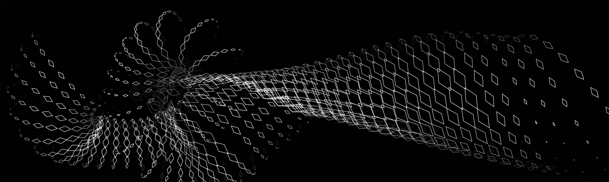

# Creative Coding • 60-212

*Professor Golan Levin • School of Art & IDeATe • Carnegie Mellon University*

---

## 2026 Edition - Key Links

* [Fall 2026 Syllabus](2026/syllabus/README.md)
* [Fall 2026 Main Page (Daily Notes & Assignments)](2026/readme.md)
* OpenProcessing Site: [openprocessing.org/class/107236](https://openprocessing.org/class/107236/#/) 

---

### Past Editions

* 2025: [Creative Coding](2025/readme.md)
* 2024: [Creative Coding](2024/readme.md)
* 2023: [Creative Coding](https://golancourses.net/fall23/)
* 2022: [Interactivity and Computation](https://courses.ideate.cmu.edu/60-212/s2022/)
* 2020: [Interactivity and Computation](https://courses.ideate.cmu.edu/60-212/f2020/)
* 2019: [Interactivity and Computation](https://ems.andrew.cmu.edu/2019-60212/)
* 2018: [Interactivity and Computation](https://ems.andrew.cmu.edu/2018_60212f/) (Fall)
* 2018: [Interactivity and Computation](https://ems.andrew.cmu.edu/2018/60212s/) (Spring)
* 2016: [Interactivity and Computation](https://ems.andrew.cmu.edu/2016-60212/)

