# Color

---

### Level 1: Basics

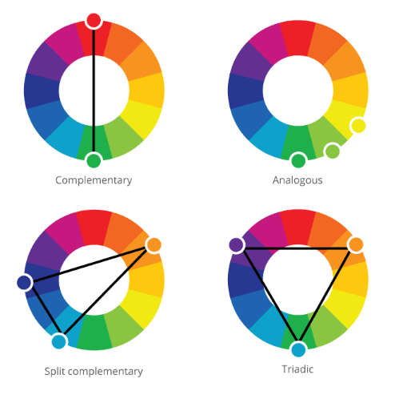

---

### Level 2: Color Relativity 

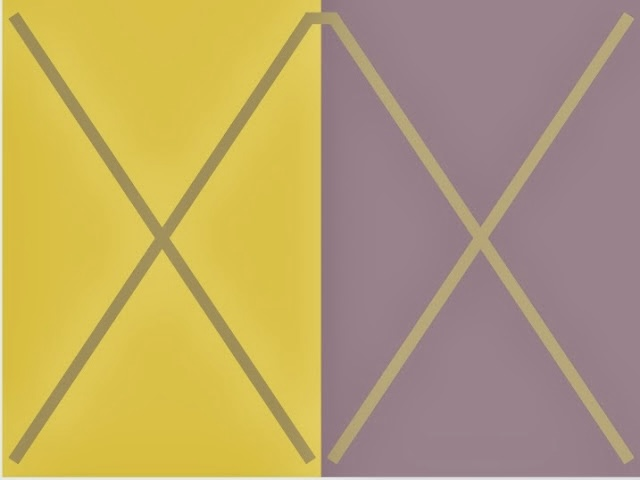

Josef Albers' discoveries of color relativity highlight how the perception of a color is influenced by its surrounding colors. He demonstrated that colors are not seen in isolation; instead, they interact with adjacent colors, often altering how we perceive them. He showed that a single color can appear differently depending on context, subjectively and dynamically, showing that understanding color requires direct experimentation and observation rather than relying solely on theory.

**Make three colors look like four:**

**Make four colors look like three:**


---

## Color on the Computer is Broken

Nonlinearity in our perception of brightness means that **brightness** on the computer is broken:

[**Computer Color is Broken**](https://www.youtube.com/watch?v=LKnqECcg6Gw) YouTube video (4m)

The mathematical spaces that we use to represent colors don't reflect our perception of it. On the top is an interpolation in RGB space; on the bottom row is an interpolation from the same colors in the Oklab space.

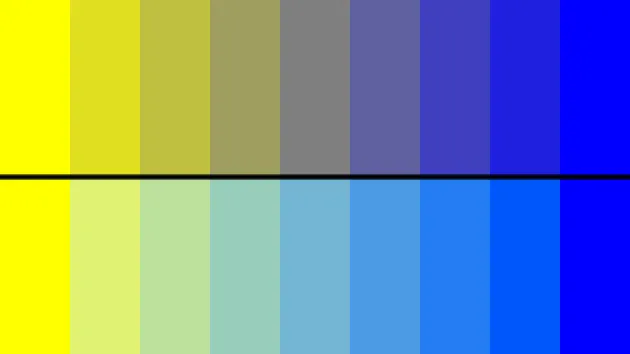

[Verify this for yourself in p5.js!](https://editor.p5js.org/golan/sketches/H82KcF8eB)

---

### RGB Color Space

Here's the sensitivity of the eye: 

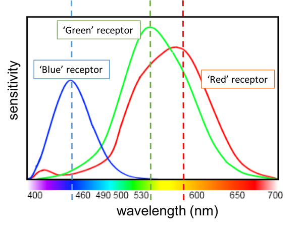

Current understanding is that the 6 to 7 million cones in your eye can be divided into

* "red" cones (64%)
* "green" cones (32%)
* "blue" cones (2%)

Note that the "blue" cones have the highest sensitivity and are mostly found outside the fovea. 

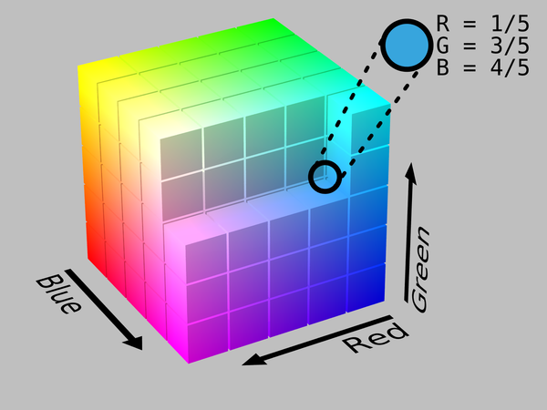

---

### HSL and HSV Color Space

* **Hue**: The "attribute of a visual sensation according to which an area appears to be similar to one of the perceived colors: red, yellow, green, and blue, or to a combination of two of them".
* **Brightness/Value**: The "attribute of a visual sensation according to which an area appears to emit more or less light".
* **Lightness**: The "brightness relative to the brightness of a similarly illuminated white".[16]
* **Saturation**: The "colorfulness of a stimulus relative to its own brightness".

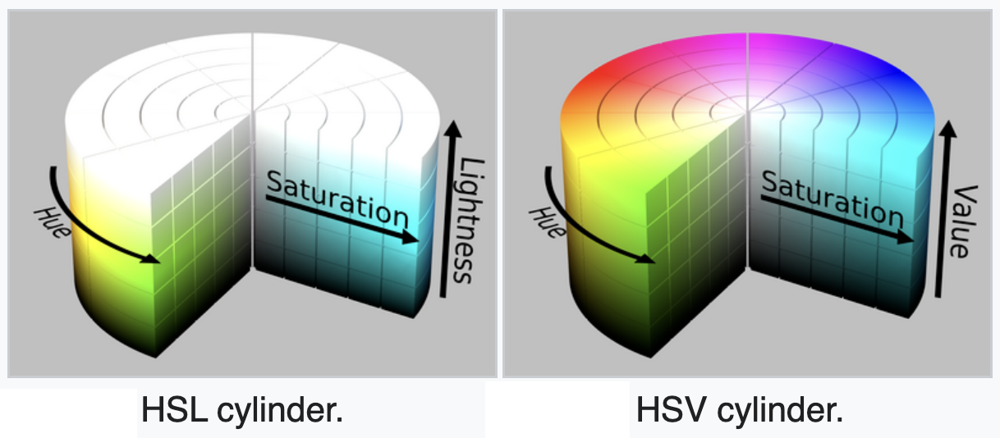

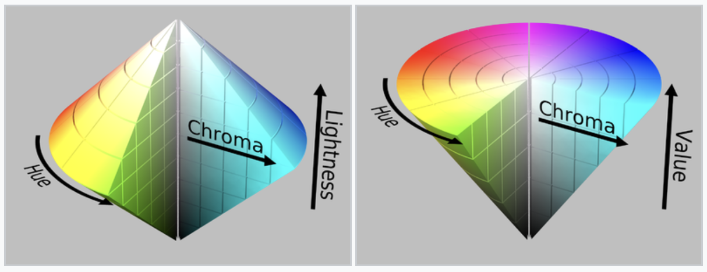

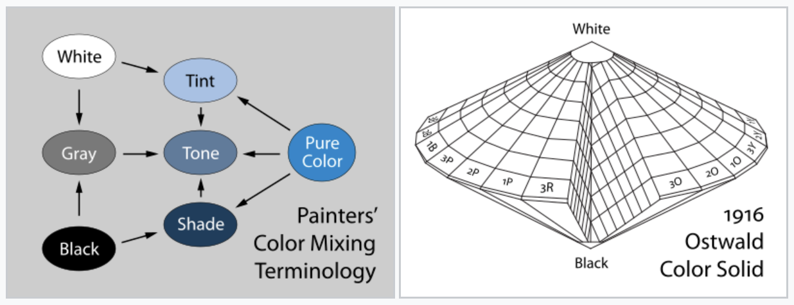

---

### CIE 1931

In 1931 the International Commission on Illumination (CIE) published the CIE 1931 color space which defines the relationship between the visible light spectrum and the sensation of specific colors by human vision.

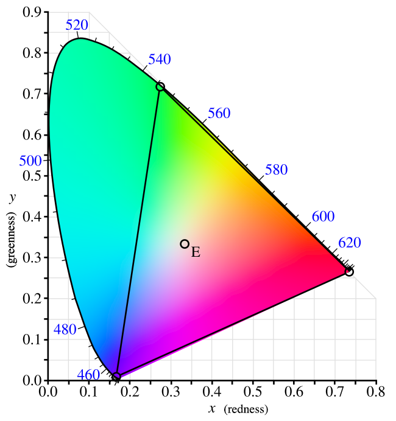

(Magenta is not a spectral color!)

[Color Gamuts - Video](https://www.youtube.com/watch?v=Ciqa3JYnpLI&t=103s) - watch from 1:43-2:20

---

### CIE Lab Color Space (1976)

Two of the major goals of CIE Lab were:

1. **Perceptual Uniformity**: Lab color space aims to make the Euclidean distance between two colors correspond more closely to the perceived color difference. A given numerical change in the color values corresponds to roughly the same visual difference perceived by the human eye.
This is important in industries like printing, graphic design, and digital imaging.
2. **Device Independence**: Unlike RGB, which is tied to specific display devices (monitors, cameras), or CMYK, which depends on the printer, Lab is device-independent. It is based on how humans perceive color rather than how a machine produces or records it. 

Lab has a red-green axis, a blue-yellow axis, a white-black axis, in a sphere. 

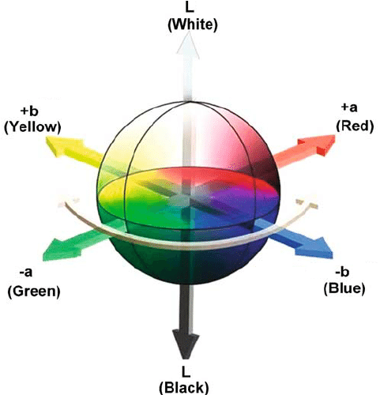

---

### Oklab Color Space

OKLab is an improvement over the CIELAB color space, [introduced by Björn Ottosson in 2020](https://bottosson.github.io/posts/oklab/). It has:

1. Better Perceptual Uniformity
2. Improved Hue Linearity
3. Simpler Computation
4. Consistency in Color Grading and Image Processing
5. Better Saturation Representation
6. Open-Source and Easily Accessible

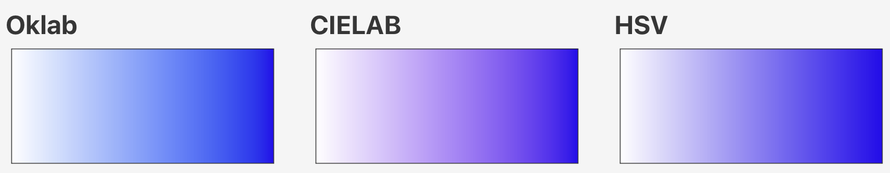

[Verify this for yourself in p5.js!](https://editor.p5js.org/golan/sketches/y48rXgXZv)

---

## Inspirations

#### Color Pickers: 

* [OK* Color Picker](https://bottosson.github.io/misc/colorpicker/) and related [article](https://bottosson.github.io/posts/colorpicker/) by Björn Ottosson
* [OKLCH Color Picker & Converter](https://oklch.com/#77.33,0.141,123.88,100) by Evil Martians
* [CIELUV Color Picker](https://www.hsluv.org/) by  Alexei Boronine

(Additional color pickers):

* [Google HSV Color Picker](https://g.co/kgs/xoe6Sv)
* [OKHSV and OKHSL Color Picker](https://ok-color-picker.netlify.app/)
* [HSLuv](https://www.hsluv.org/)

#### Color Explorers

* [**Chroma.js Color Palette Helper**](https://gka.github.io/palettes/#/9|s|00429d,96ffea,ffffe0|ffffe0,ff005e,93003a|1|1)
* David Aerne's [**Poline**](https://meodai.github.io/poline/)
* David Aerne's [**Rampensau**](https://meodai.github.io/rampensau/). RampenSau is a lightweight, dependency-free and blazingly fast color generation library. It makes use of hue cycling and easing functions to generate pleasing color ramps.
* Cynthia Brewer's [**Color Advice for Cartographers**](https://colorbrewer2.org/#type=sequential&scheme=BuPu&n=3)

#### Artworks

* Kjetil Golid's [**Archetype**](https://www.artblocks.io/curated/collections/archetype-by-kjetil-golid?tab=Artworks)
* Anatoly Zenkov's [**Parametric Pottery**](https://anatolyzenkov.com/parametric-pottery/preview/22) (click!) & [code](https://anatolyzenkov.com/preview/parametric-pottery/js/colors.js) (uses OKlab!)
* David Aerne's [**Albers**](https://albers.elastiq.ch/)

