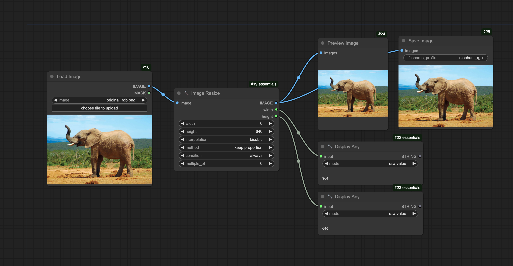
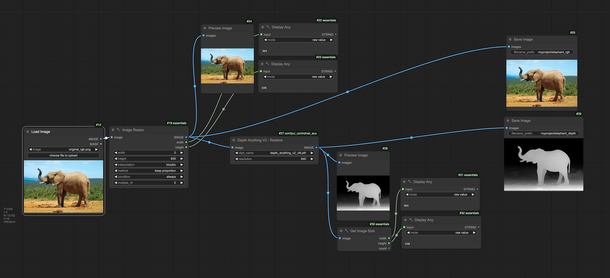
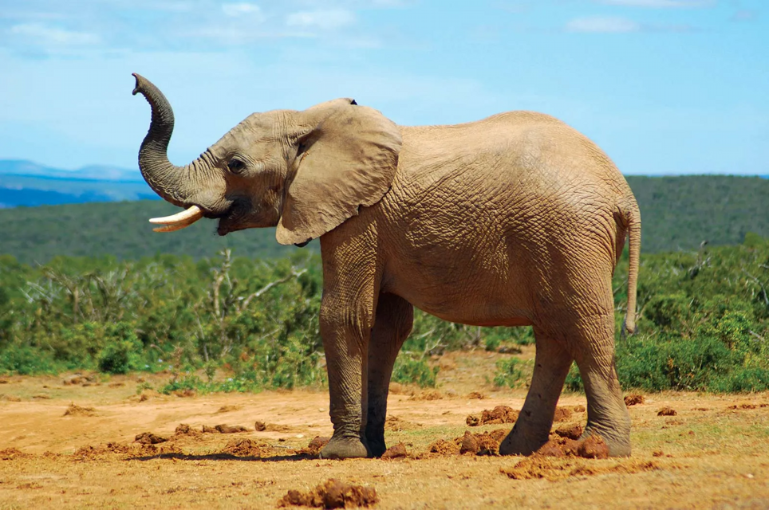
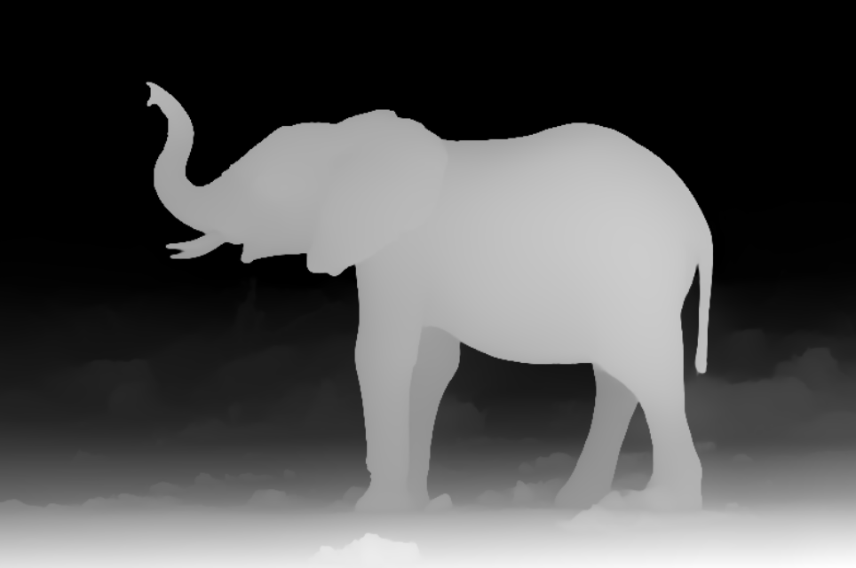
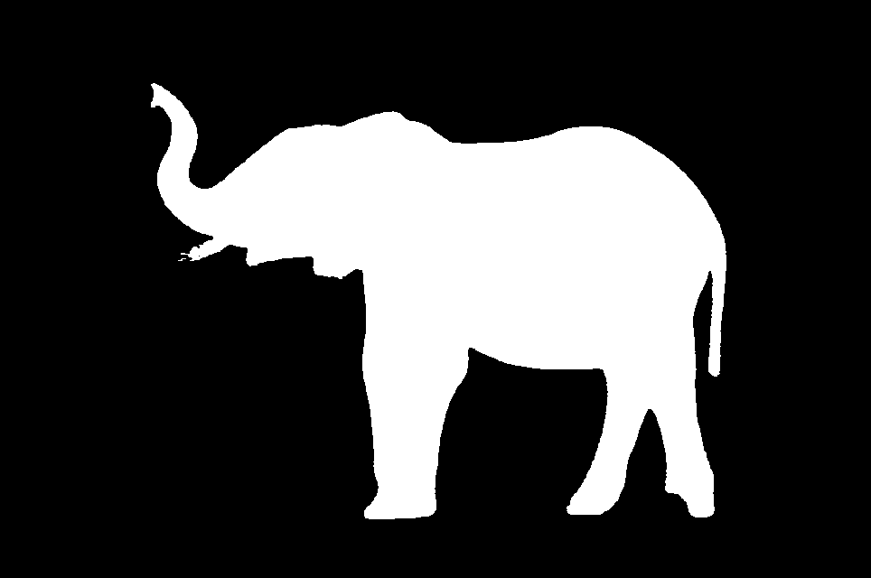

# ComfyUI: Introduction & Image Analysis

*These instructions are current as of 10 November 2024.*

**Contents:** 

* [Setting up the RunComfy Virtual Machine](#setting-up-the-runcomfy-virtual-machine)
* [Testing RunComfy's Default Patch](#testing-runcomfys-default-patch)
* [Let's Make an Image Analysis Patch](#lets-make-an-image-analysis-patch)
	1. [Loading and Resizing an Image](#1-loading-and-resizing-an-image)
	2. [Estimate an Image's Depth Map with AI](#2-estimate-an-images-depth-map-with-ai)
	3. [Segment the Image with AI](#3-segment-the-image-with-ai)
* [Let's Use our Image Analysis in p5!](#lets-use-our-image-analysis-in-p5)

---

## Setting up the RunComfy Virtual Machine

* **Navigate** to [RunComfy.com](https://www.runcomfy.com/). 
* **Create** an account and sign in. 
* **Add** some funds ($10.00 should be plenty for the moment).
* **Choose** "My Workflows" 
* **Choose** "ComfyUI-NodesLoaded"; click "Run Workflow"
* **Launch** a "Medium"-sized "Hobby" machine. This should cost around $0.99/hr.
* Click through to launch the machine, and **wait** 3-5 minutes until it is ready for you. A virtual machine is being launched in the cloud. If desired, you can **enable** the switch "Play a sound when machine is ready".

## Testing RunComfy's Default Patch

* Now that RunComfy is ready, we will **test out** the default patch ("Purple Galaxy Bottle").
* **Hide** the "Assets" folder panel by clicking on the >> button. The panel should stow. (You can reveal it again by clicking on the Assets folder on the right side of the window.) Now you can **examine** the entire patch. 
* In the vertical control panel with all the buttons, click **Queue Prompt**. Now **observe** how each of the nodes becomes activated from left to right. After about 10 seconds, you'll see the generated image with the Purple Galaxy Bottle.
* **Right-click** on the generated image, **choose** Save Image, and save the image to your computer. Great work!

## Let's Make an Image Analysis Patch

In this section, we will make a patch to: 

1. Load and resize an image
2. Estimage the image's depth map
3. Segment the image's subject

*Now:*

* We will now make a patch to analyze an image using various AI nodes. To start, we need to **upload** an image into our cloud-based filesystem. **Ensure** your "Assets" file browser is visible by clicking on the little folder icon (labeled "Assets") in the upper right of the RunComfy window. 
* You should see a folder called "ComfyUI". Double-click on this to **reveal** a folder called "input". **Enter** that folder by double-clicking on it as well.
* **Click** on the vertical-three-dots icon (⋮) in the upper right of the file browser, and **select** ↥Upload. 
* Upload the file: [original_rgb.png](input/original_rgb.png), a photo of an elephant. If you are successful, you'll see `original_rgb.png` located in the directory, *Home > ComfyUI > input*.

#### 1. Loading and Resizing an Image

* On the main gray background canvas: **press** Control and **drag** a rectangle around the default patch. **Press** Delete to delete the default patch and clear the canvas.
* **Double-click** on the gray background canvas; you'll see a "Search" interface. Type *Load Image* and place a *Load Image* node on the canvas.
* To choose which image to load, use the interface widget on the *Load Image* node which says `◀ image ▶`. You should be able to select `original_rgb.png`. If you don't see it listed, you probably need to **click** "⟳Restart Comfy" and then also **refresh** your browser.
* Connect the following network of nodes shown below, including: 
  * *Load Image* (as we have already done, with `original_rgb.png`); 
  * *Image Resize* (from *essentials > image manipulation*). Set *width* to `0`; *height* to `640`; *interpolation* to `bicubic`; and *method* to `keep proportion`.
  * Connect a *Preview Image* node to the *IMAGE* outlet of the *Image Resize* node. 
  * *Also* connect a *Save Image* node to the *IMAGE* outlet of the *Image Resize* node. 
  * Add two *Display Any* nodes (from *essentials > utilities*). Connect their inputs to the width and height outlets of the *Image Resize* node. At this point, you can verify the *Image Resize* node by clicking *Queue Prompt*; you should see values of `964` and `640` in the *Display* Any nodes. 
  * If you need it, the above network is available in this [`image-resize-workflow.json`](workflows/1_image-resize-workflow.json). At this point, your network should look like this: 
  

  
#### 2. Estimate an Image's Depth Map with AI

Now we will use machine learning to perform monocular depth estimation on the elephant image. At the end of this section, your workflow will look like the image below. ([Here](workflows/2_image_depth_workflow.json) is a JSON workflow if you need it.) 

* We add the node, *Depth Anything V2 - Relative* via comfyui_controlnet_aux. In this node, set the *resolution* to `640`. (To install this node, you *may* need to go to the *Manager > Custom Nodes Manager*, using the "Manager" button on the Control Panel, then search for and install the node.) The *Depth Anything V2 - Relative* algorithm was created by [researchers at Hong Kong University and TikTok](https://github.com/DepthAnything/Depth-Anything-V2). 
* In case you're uploading a readymade workflow and see **red** (missing) nodes, follow these steps to resolve the issues: 
	* Click on "Manager" near the bottom of the Control Panel;
	* Click "Install Missing Custom Nodes"
	* Click the checkboxes at the far left for all missing nodes; 
	* Click "Install" in the bottom left of the Manager. 
	* You will need to "Restart Comfy" to reboot the server. This will take 10 seconds. 
	* You will also need to Refresh the browser/website.
	* There should no longer be any red nodes. 
* Now, we will add a couple extra nodes to verify that the *Depth Anything V2 - Relative* node is working. In particular: 
	* Connect the image inlet of a *Preview Image* node to the *IMAGE* output of the *Depth Anything V2 - Relative* node.
	* The *Depth Anything V2 - Relative* node does not have outlets to report the image size. We want to make sure it's producing images of the correct size, so add a *Get Image Size* to its *IMAGE* outlet, and two *Display Any* nodes to view the values. The depth image (of this particular elephant image) should be `964` x `640`.
	* Connect the *Depth Anything V2 - Relative* outlet to a second *Save Image* node. Change the *filename_prefix* fields of the two *Save Image* nodes to *myproject/elephant_rgb* and *myproject/elephant_depth*, respectively. 
	* Press *Queue Prompt*. Note that the first time the *Depth Anything V2 - Relative* node runs, it can take a long time; it's downloading a large model. 
	* The depth and rgb images shold be saved to *Home > ComfyUI > output > myproject*. 

#### 3. Segment the Image with AI

In computer vision, there is a difference between *detection* (is there an elephant?), *recognition* (which elephant is that?), *tracking/localization* (where is the elephant's bounding box?), and *segmentation* (which pixels belong to the elephant?). Now we will perform an *image segmentation* using Meta/Facebook's "Segment Anything Model v2" (SAM2). We can get a quick taste of this algorithm in this online demo: 

* [Segment Anything v1 Demo](https://segment-anything.com/)
* [Segment Anything v2 Demo](https://sam2.metademolab.com/demo) 

*Now:* We will add to our current workflow to become [`3_image_depth_and_segmentation.json`](workflows/3_image_depth_and_segmentation.json), shown below. In particular, we will be adding the nodes that have been labeled green:

The conceptual overview of the workflow is as follows: 

* A tracker/localizer node called [*Florence*](https://www.microsoft.com/en-us/research/project/projectflorence/) (created by Microsoft) is provided with the input image and a text prompt ("elephant"). *Florence* produces a bounding box around the elephant's outline. Note that *Florence* was [ported to Comfy by someone named Kijai](https://github.com/kijai/ComfyUI-Florence2), using Microsoft's code.
* We take the center point of the elephant's bounding box, and the input image, and provide them to a *SAM2* node. Then *SAM2* treats the center point just like the mouse click in [this demo](https://segment-anything.com/), and produces a "mask image" (i.e. segmentation) for whatever object the center point occupies. Note that *SAM2* node was also ported to Comfy by [Kijai](https://github.com/kijai/ComfyUI-segment-anything-2) using Meta's code.
* We then convert that mask into a regular image.

Study the [workflow image](workflows/3_image_depth_and_segmentation_sm.png) to reproduce it, follow the instructions below, or upload the entire [`3_image_depth_and_segmentation.json`](workflows/3_image_depth_and_segmentation.json) workflow if you prefer. You will need to install the following ComfyUI nodes: 

* *DownloadAndLoadFlorence2Model* 
* *Florence2Run*
* *Florence2 Coordinates*
* *Mask Preview*
* *Sam2Segmentation*
* *(Down)Load SAM2Model*
* *Convert Mask to Image*
* You might also need Kijai's *ComfyUI-KJNodes* utilities.

*Good luck!* When you're done, you should be able to download the following three images, and they should all have the same dimensions: 

* [elephant_rgb.png](output/elephant_rgb.png)
* [elephant_depth.png](output/elephant_depth.png)
* [elephant_segment.png](output/elephant_segment.png)

---

## Let's Use our Image Analysis in p5!

We can now use this AI workflow to extend our creative coding practice in p5. Here is a p5.js sketch, similar to our [Custom Pixel assignment, 7.5](https://github.com/golanlevin/60-212/blob/main/2024/assignments/assignment_7b.md#75-custom-pixel-camera-color-nested-iteration), which ingests the three elephant images. 

* [https://editor.p5js.org/golan/sketches/-_cFmLtoP](https://editor.p5js.org/golan/sketches/-_cFmLtoP) **Fancy version**, at editor.p5js.org
* [https://editor.p5js.org/golan/sketches/yZNdwF2sP](https://editor.p5js.org/golan/sketches/yZNdwF2sP) **Simplified version**, at editor.p5js.org
* [https://openprocessing.org/sketch/2440728](https://openprocessing.org/sketch/2440728) **Simplified version**, at editor.p5js.org

*Now:*

* Consider how our *Custom Pixel* project can be extended when you are able to use computer vision to provide more channels of information about your input image: not just the three usual channels of RGB — but an *additional* channel of (estimated) depth, and *another* channel with semantic (segementation) information about what's what in the image.

