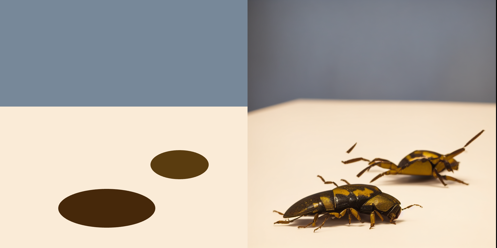

# p5js *in* ComfyUI

*In this lesson, we will use p5.js code to generate an image that conditions a full-featued Stable Diffusion process within ComfyUI. With this setup, you can use traditional generative art to scaffold more naturalistically textured images. These instructions are current as of 10 November 2024.*



**Contents:** 

* [Setting up the RunComfy Virtual Machine](#setting-up-the-runcomfy-virtual-machine)
* [Testing RunComfy's Default Patch](#testing-runcomfys-default-patch)
* [Let's Use p5 in ComfyUI!](#lets-use-p5-in-comfyui)

---


## Setting up the RunComfy Virtual Machine

* **Navigate** to [RunComfy.com](https://www.runcomfy.com/). 
* **Create** an account and sign in. 
* **Add** some funds if you haven't already ($10.00 should be plenty for the moment).
* **Choose** "My Workflows" 
* **Choose** "ComfyUI-NodesLoaded"; click "Run Workflow"
* **Launch** a "Medium"-sized "Hobby" machine. This should cost around $0.99/hr.
* Click through to launch the machine, and **wait** 3-5 minutes until it is ready for you. A virtual machine is being launched in the cloud. If desired, you can **enable** the switch "Play a sound when machine is ready".

---

## Testing RunComfy's Default Patch

* Now that RunComfy is ready, we will **test out** the default patch ("Purple Galaxy Bottle").
* **Hide** the "Assets" folder panel by clicking on the >> button. The panel should stow. (You can reveal it again by clicking on the Assets folder on the right side of the window.) Now you can **examine** the entire patch. 
* In the vertical control panel with all the buttons, click **Queue Prompt**. Now **observe** how each of the nodes becomes activated from left to right. After about 10 seconds, you'll see the generated image with the Purple Galaxy Bottle.
* **Right-click** on the generated image, **choose** Save Image, and save the image to your computer. Good job!

--- 

## Let's Use p5 in Comfy!

We will be using [**comfyui-p5js-node**](https://github.com/tracerstar/comfyui-p5js-node), a custom node for using p5.js within ComfyUI, created by Benjamin Fox. We will create the following workflow, [`p5-in-comfy.json`](workflows/p5-in-comfy.json), which is based on very minimal modifications from the RunComfy Default Patch:


#### Steps to get p5 in RunComfy:

* Begin with the RunComfy Default Patch. 
* We need to install the *comfyui-p5js-node*. Unfortunately, to do this we will need to temporarily lower our RunComfy security settings, or else we will receive an error, “This action is not allowed with this security level configuration”. 
* Per the advice in [this article](https://comfyui-guides.runcomfy.com/ultimate-comfyui-how-tos-a-runcomfy-guide/how-to-fix-this-action-is-not-allowed-with-this-security-level-configuration): Inside the Assets file browser, go to `ComfyUI > custom_nodes > ComfyUI-Manager` and find the `config.ini` file. 
* Double-click on the `config.ini`. This will open the file in a simple text editor. Now you can config the manager. 
* Change `security_level` to `weak` at the bottom of the file. 
* Click the floppy disk icon in upper right to save the change. Close that editor.
* Once you finish editing `config.ini`, you need to restart the ComfyUI by clicking the top left *Restart Comfy* button (NOT restart the machine!). This should take a few seconds. 
* For good measure, refresh the browser page. 
* Now, click on the "Manager" button near the bottom of the Control Panel
* Click "Install via Git URL"
* Enter `https://github.com/tracerstar/comfyui-p5js-node.git`
* Click *Restart Comfy* again 
* Refresh the browser page again
* In your Assets, under `Home > ComfyUI > custom_nodes`, you should now see `comfyui-p5js-node`. 
* At this point you can double-click on the gray Comfy desktop and add the *comfyui-p5js-node*. 
* You'll also need to add a *VAE Encode* node. You will likely also want to wire in a *Preview Image* and *Save Image* node. Wire these in as shown in the image above. 
* If you get stuck, you can just load in the [`p5-in-comfy.json` workflow linked here](workflows/p5-in-comfy.json). 

I created a [simple landscape generator](https://editor.p5js.org/golan/sketches/LPXbObyb5) in p5.js. (Note that I developed this using a proper p5.js editor like OpenProcessing, editor.p5js.org, or Visual Studio Code. Unfortunately the *comfyui-p5js-node* text entry area is not a proper code editor, and has many UI bugs.) Here's the code for my simple landscape. Paste this into the text area of the *comfyui-p5js-node*: 

```
function setup() {
  createCanvas(512, 512); // must be this size for SD1.5
  noLoop(); 
}

function draw() {
  background('lightblue');
  ellipseMode(CENTER); 
  noStroke(); 
  
  let colA = color(173, 216, 230);
  let colB = color(47, 79, 79);
  let nHills = 7; 
  for (let i=1; i<=nHills; i++){
    let t = map(i, 0,nHills, 0,1); 
    let col = lerpColor(colA, colB, t);
    fill(col); 
    let ry = map(pow(t,1.5),0,1, 250,500) + t*10*random(-1,1); 
    let rx = 300 * random(-1,1); 
    let rw = width * random(2.5,3.5); 
    ellipse(width/2+rx,ry, rw,height*random(0.4,0.5)); 
  }
}

```

* NOTE: Our conditioning images from p5.js must have dimensions of **512x512** to work properly with Stable Diffusion 1.5, which (for now) is what we're using. 
* I also modified the prompt in the (positive) *CLIP Text Conditioning* node. I changed it to `Rolling hills, foggy day, cloudy sky, mountains with trees`. 
* If you now click Queue Prompt, you should be able to generate images using Stable Diffusion that are conditioned by your text prompt and your p5.js generative art! An example of my landscape is below. 


#### Using other Stable Diffusion Models

Many other Stable Diffusion models are available: Some are tuned to look like paintings, some are tuned to look like drawings, some are tuned to look like photographs of food, etcetera. We will obtain trained [image-generation models from civitai.com](https://civitai.com/models). There are two important notes:

* **CAUTION 1**. Where do these AI models come from? Many Stable Diffusion models are developed by individuals for the purpose of generating virtual pornography — sometimes to satisfy extremely specific kinks. These AI models are often advertised to the "AI art community" using insipid, salacious, and offensive thumbnail pics — reflecting the culture of these individuals. I'm sorry: browsing tools should not require an immersion in creep culture. The AI models are capable of generating a much wider range of images than the thumbnails would suggest.
* **CAUTION 2**. You will need to obtain models in the *correct format* for things to work. Search for "SD 1.5" "Checkpoint" "Trained" "Safe Tensor" models [as in this search](https://civitai.com/search/models?baseModel=SD%201.5&modelType=Checkpoint&checkpointType=Trained&sortBy=models_v9). 

The following models are all working for me in this setup (these models are each 2-4GB in size): 

* [DreamShaper](https://civitai.com/models/4384/dreamshaper)
* [Realistic Stock Photo](https://civitai.com/models/139565/realistic-stock-photo) 
* [dvArch - Multi-Prompt Architecture Tuned Model](https://civitai.com/models/8552/dvarch-multi-prompt-architecture-tuned-model)
* [Product Design (minimalism-eddiemauro)](https://civitai.com/models/23893/product-design-minimalism-eddiemauro)
* [Fruit Fusion](https://civitai.com/models/18742/fruit-fusion)
* [Impressionism (Oil painting)](https://civitai.com/models/28068/impressionism-oil-painting)
* [Slate_pencil_mix](https://civitai.com/models/389528/slatepencilmix)

---

