# Moiré Pattern Unit for *Creative Coding*

Golan Levin, CMU School of Art

*[Moiré patterns](https://en.wikipedia.org/wiki/Moir%C3%A9_pattern) are complex visual effects that arise when two sets of lines or grids overlap with slight differences in angle, spacing, or position. Named after a type of rippled silk fabric, these patterns can produce striking interference effects from extremely simple ingredients. In computational art, Moiré offers a powerful means to create exciting visuals through iteration and subtle variation.*

---

## Assignment

Using iteration, generate a set of parallel lines or curves, spaced at narrow intervals. Onto this, overlap another set of lines, differing by a small rotation and/or translation, to create a subtle Moiré pattern. I strongly recommend keeping your composition *simple* and allowing the interference patterns to do the work for you.

To achieve the rotation, I recommend that you use the p5.js `rotate()` function. (Here's a [Coding Train tutorial on rotation](https://www.youtube.com/watch?v=o9sgjuh-CBM), if it's helpful, and a [tutorial about rotate() by Xin Xin](https://www.youtube.com/watch?v=maTfm84mLbo).) If you're feeling more advanced, consider creating sets of near-parallel polylines that are subtly perturbed by Perlin noise, as described in [this tutorial](https://www.patreon.com/posts/exploring-moire-61867805) by Maks Surguy.

Place some dimensions of variability (such as the line separation, line weight, position, and/or rotation angle) under time-based or interactive control.

Present your composition in a fullscreen canvas (use `createCanvas(windowWidth, windowHeight)` or the [`fullscreen()`](https://p5js.org/reference/#/p5/fullscreen) command). You may use any colors you prefer.

<table>
<tr>
<td>
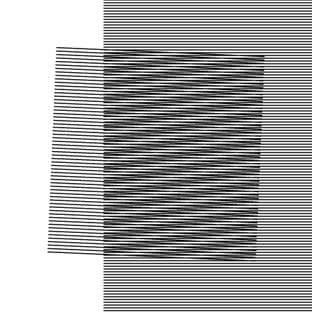
</td>
<td>
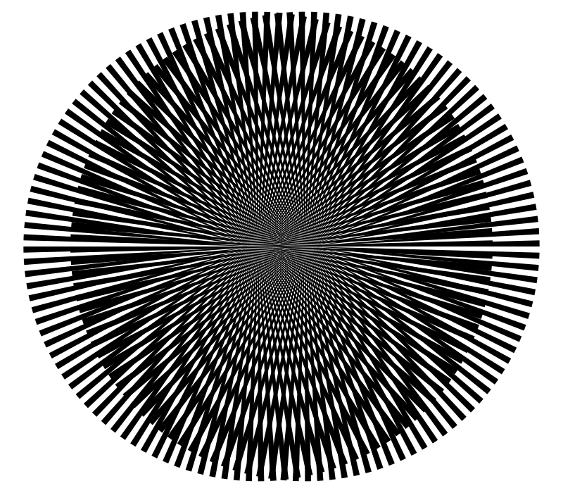
</td>
</tr>
</table>

<!--

-->

It's possible to make some very sophisticated and mind-bending displays using the Moiré effect. Check out [this video](https://www.youtube.com/watch?v=4nn1MqCMa1M), for example around 2'35":

[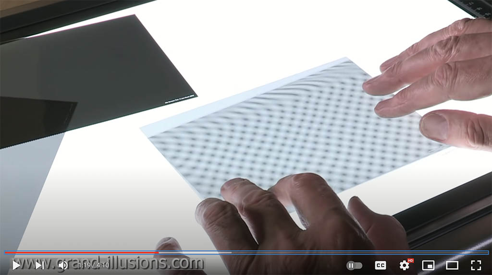](https://www.youtube.com/watch?v=4nn1MqCMa1M)

Moiré patterns are a "real thing" that have effects in the physical world. Here's a 1958 photo of Moiré interference patterns in water waves by the influential 20th-century science photographer, Berenice Abbott:

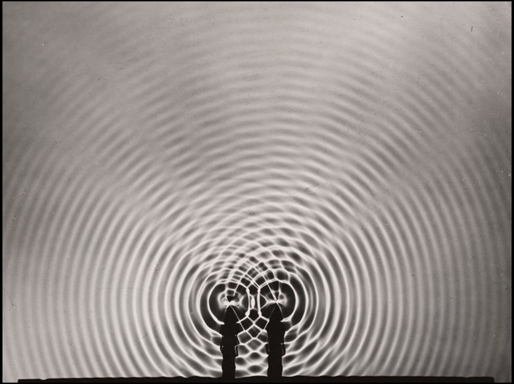

---

## Some Art that Uses Moiré Patterns

[**Anoka Faruqee**](https://www.artsy.net/artist/anoka-faruqee), on the painting faculty at Yale, creates paintings that make use of Moiré-type interference patterns. 

[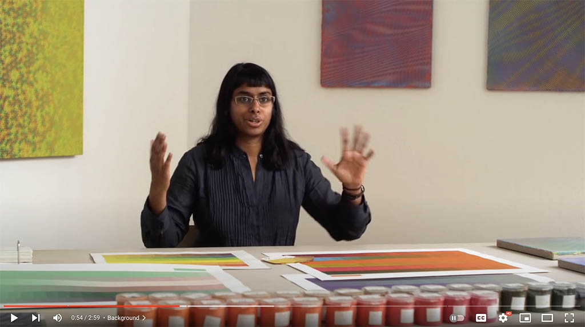](https://www.youtube.com/watch?v=hYn3Ou8L3o0&t=107s)

---

In "seeking a new type of visual music", experimental filmmaker **Stan Van Der Beek** created [*Moirage*](https://www.instagram.com/p/C0iDRo2sXcY/) (1967), an abstract film study in optical illusions and pattern-superimpositions. More of *Moirage* can be seen at [Instagram](https://www.instagram.com/magentaplains/reel/C0iDRo2sXcY/) or [here](stan_van_der_beek_moirage.mp4). (*Stills and video are copyright Estate of Stan VanDerBeek.*)

Van Der Beek's *Moirage* was created with a moiré "pattern kit", released by biophysicist Gerald Oster alongside his 1964 book, [*The Science of Moiré Patterns*](img/the_science_of_moire_patterns_gerald_oster_1964.pdf). ([PDF](the_science_of_moire_patterns_gerald_oster_1964.pdf) / [link](https://www.herocomm.com/Details/MoireStory.htm)).

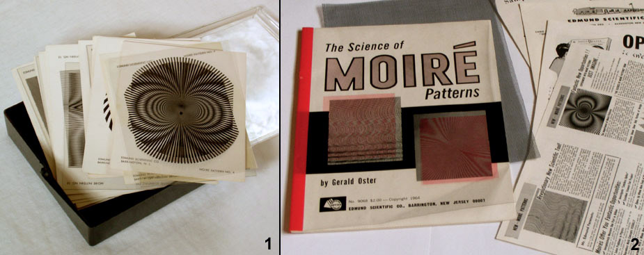

---

Works by painter Julian Stanczak: *Permutation* (1967), *Wandering Line* (1990):

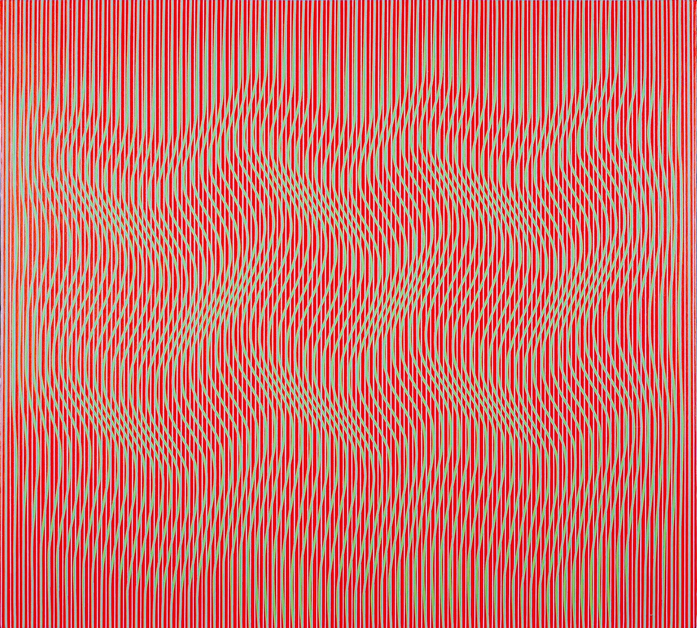


---

Designer [Pat Kim](https://www.instagram.com/p/CIjDGOxDjo4/) makes Moiré prints [using hand-made rollers](https://www.instagram.com/reel/C3jiiGEt9A9/): 

[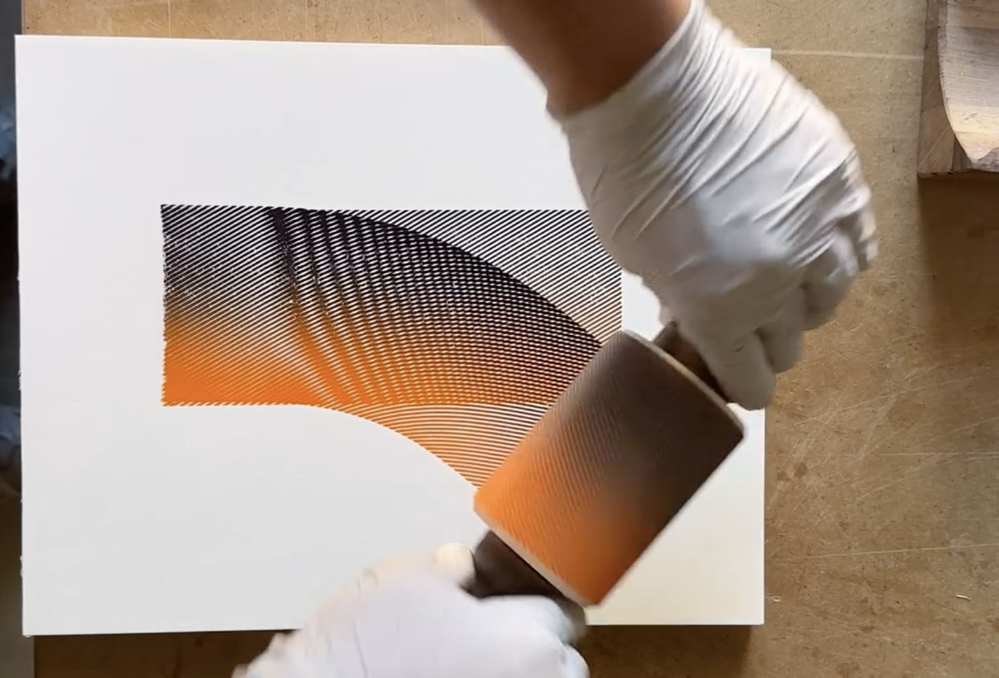](https://www.instagram.com/reel/C3jiiGEt9A9/)

[Joel Cammarata](https://www.instagram.com/j.cammarata.art/?hl=en) creates computer plots that explore simple Moiré patterns:

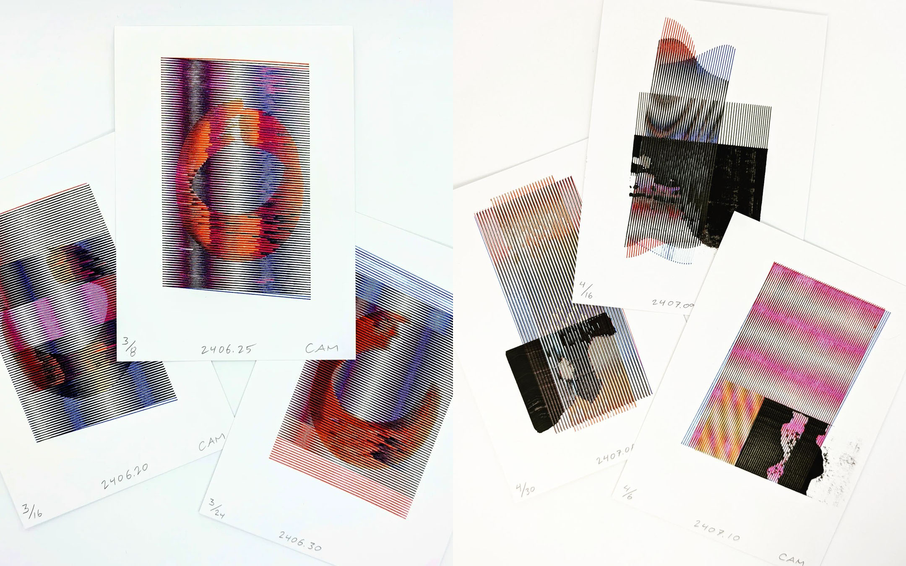

[Jean-Pierre Hébert](https://www.artsy.net/artist/jean-pierre-hebert) was an early computer artist who used computer-controlled plotters to create nuanced interference patterns. This is from c.1990:

[Jenn Karson](https://www.instagram.com/p/DG59D_Vxjhb/) generates offset curves from leaf boundaries, and then creates interference patterns between multiple sets of offset curves. 

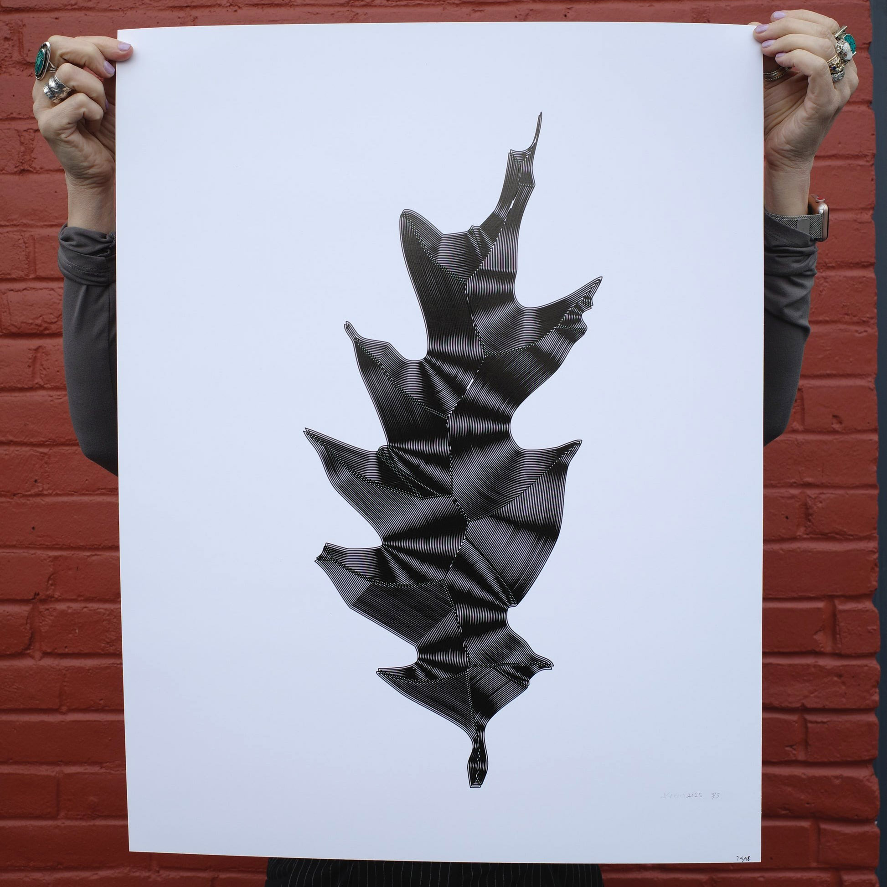

Nicolas Sassoon's [*PATTERNS*](http://www.nicolassassoon.com/PATTERNS.html) stunning series of browser-based studies:

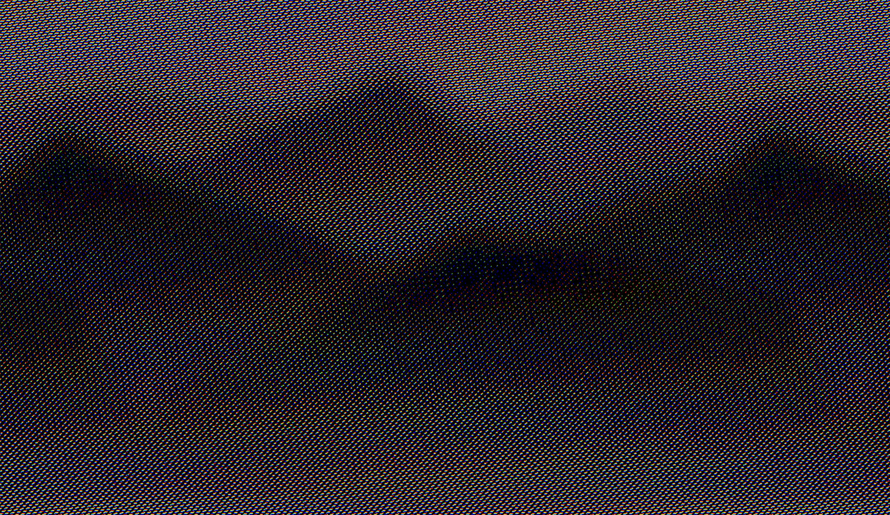

Liam Egan creates [interactive Moiré patterns](https://www.fxhash.xyz/generative/slug/euphonic) with lovely colors:

Amy Goodchild's lavalike [*No Apologies*](https://foundation.app/@amygoodchild/foundation/80549) animation is mesmerizing.

 

Cacheflowe (Justin Gitlin)'s [*Moiré-Room*](https://cacheflowe.com/art/physical/moire-room) is an immersive projection environment at Meow Wolf Denver. 

Takahiro Kurashima's interactive [*Poemotion*](https://www.lars-mueller-publishers.com/poemotion-1) and [*Moirémotion*](https://www.youtube.com/watch?v=zG5omMyxmNI) books explore the closely related phenomenon of "[barrier-grid animation](https://en.wikipedia.org/wiki/Barrier-grid_animation_and_stereography)" or "picket-fence animation":

[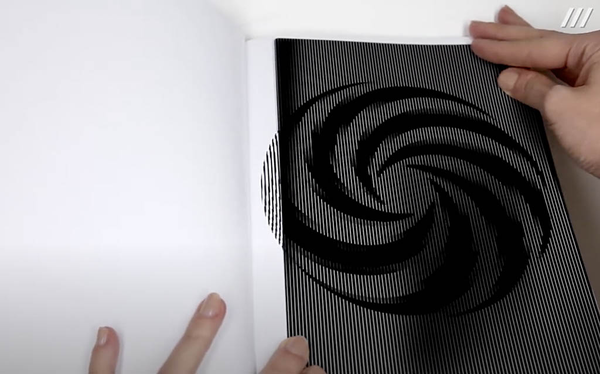](https://www.youtube.com/watch?v=zG5omMyxmNI)

---

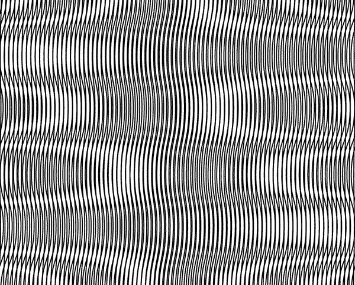
Animation by Mathijs Delbaere.

---

Here's some nice work by Zach Lieberman, who has made some lovely shader-based [interference studies](https://x.com/zachlieberman/status/1799588785245618467):

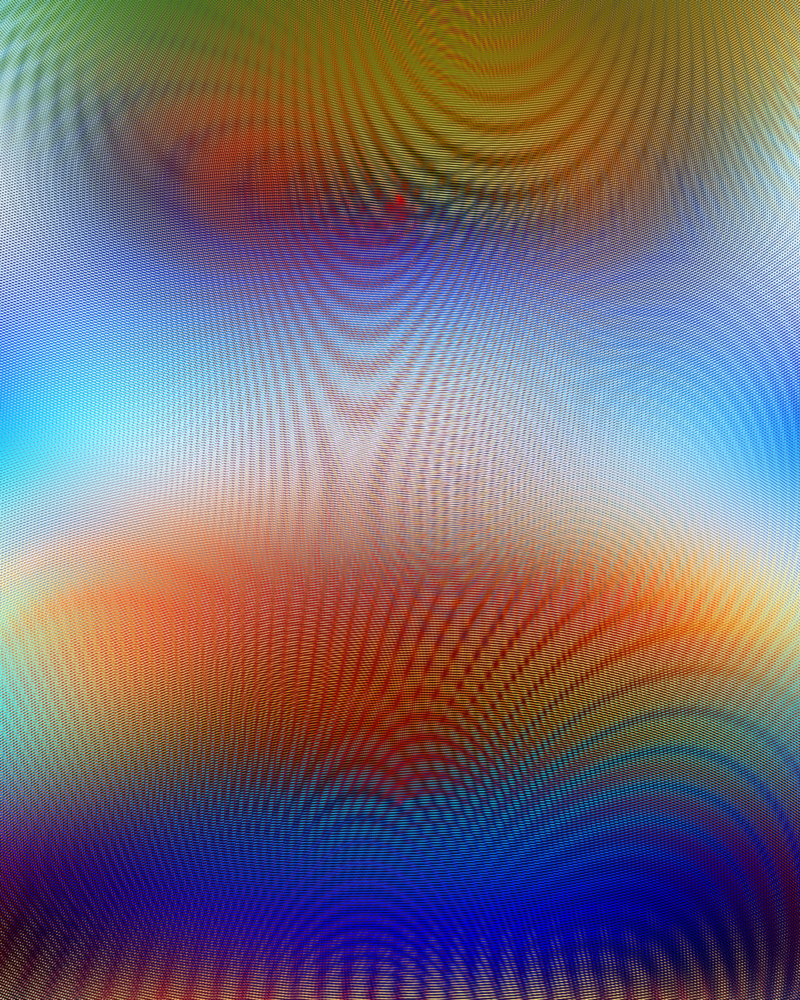

--

### For Further Consideration

Some additional Moiré work you might like includes: 

* [Plotter drawings by Julien Gachadoat (v3ga)](https://twitter.com/v3ga/status/1699054503431946727) ([*image*](../../openprocessing_images/julien_gachadoat_v3ga_moire.jpg))
* [Plotter drawings by Julien Espagnon](https://twitter.com/Julien_Espagnon/status/1697540035451461656) ([*image*](../../openprocessing_images/julien_espagnon_moire_plot.jpg))
* [Plotter drawings by Piterpasma](https://twitter.com/piterpasma/status/1697568448727875941) ([*image*](../../openprocessing_images/piterpasma_moire_plot.jpg))
* [Dynamic design by Adam Fuhrer](https://x.com/adamfuhrer/status/1928929130424259014), and another [here](https://x.com/adamfuhrer/status/1910442659388272688)
* [Plotter drawings by Jakub Antolak](https://twitter.com/jakub_antolak/status/1680915719339352064) ([*image*](../../openprocessing_images/jakub_antolak_moire.jpg))
* Kath O'Donnell develops Moiré interference patterns [from the trails left by the edges of rotating 3D forms](https://www.fxhash.xyz/generative/20956) ([*image*](../../openprocessing_images/kath_odonnell_moire.png))
* Melissa Weiderrecht's [*Both Be Both*](https://superrare.com/artwork-v2/both-be-both-41921) (2023) animation explores contrasts: "pixelated and soft, glitchy and smooth, digital and textured" ([*image*](../../openprocessing_images/melissa_weiderrecht_both_be_both_moire.jpg))
* This 1973 quartet of computer plotter drawings by Manfred Mohr obtains intensity from Moiré-type interference ([*image*](../../openprocessing_images/p137_mohr_1973.png)) 
* Nat Sarkissian's [*Hello Modulo*](https://verse.works/collections/hello-modulo-by-nat-sarkissian) presents a contrast between machinic interference patterns and a 'hand-drawn' (computational) rendering style ([*image*](../../openprocessing_images/nat_sarkissian_moire.jpg))
* [Loren Bednar's *Phase* NFT](https://opensea.io/collection/phase-by-loren-bednar) ([*image*](../../openprocessing_images/bednar_phase_moire.jpg))
* [Tutorial for SVG Moiré Patterns in Blender by Maks Surguy](https://www.patreon.com/posts/exploring-moire-61867805)
* [Mario Klingemann's shader replication of a hex lattice in the Manchester Airport smoking area (Twitter thread)](https://twitter.com/quasimondo/status/1132276597405495298)

