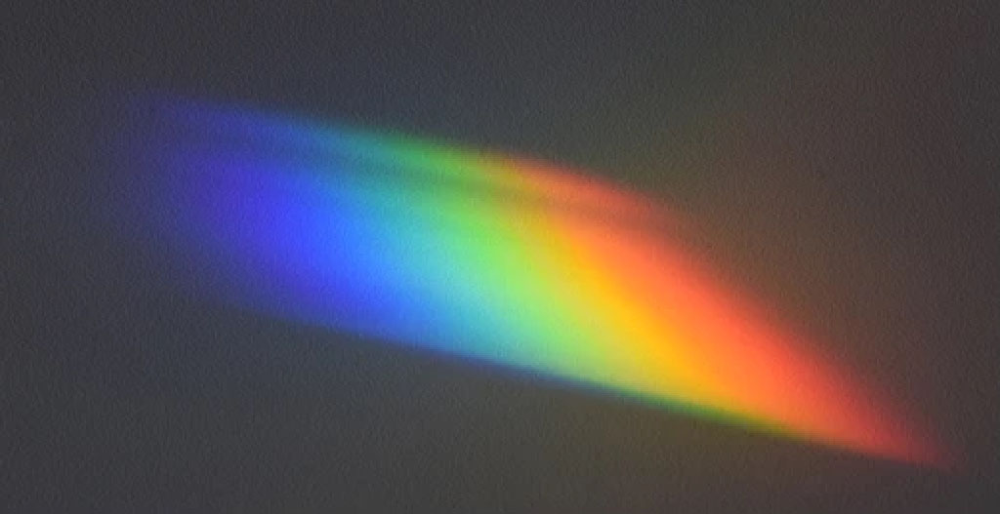
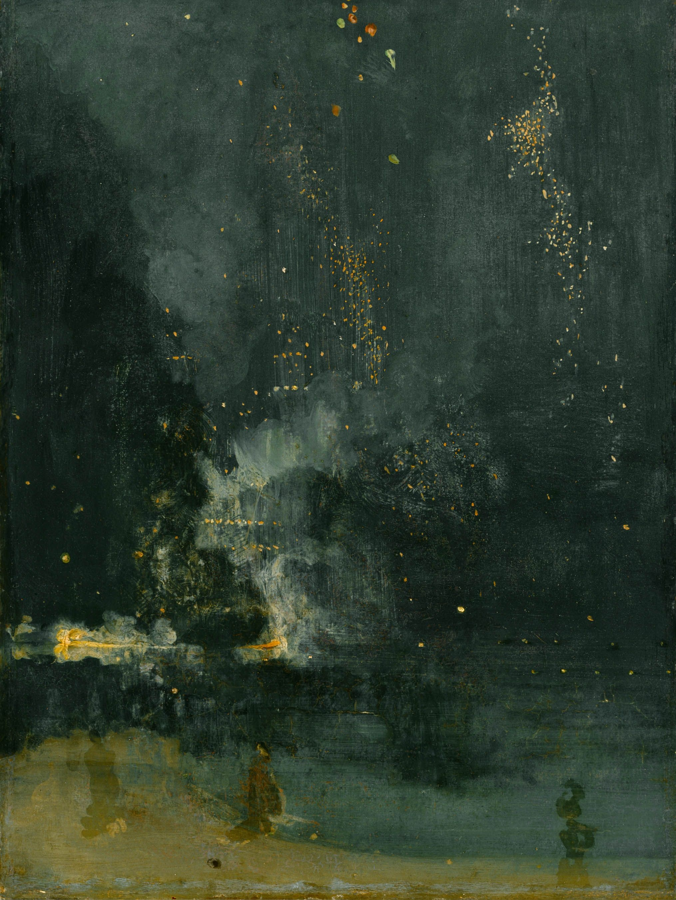
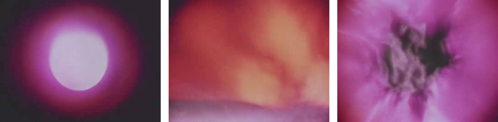
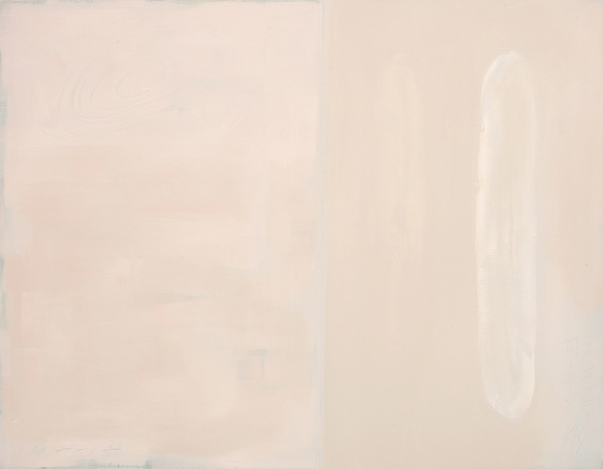
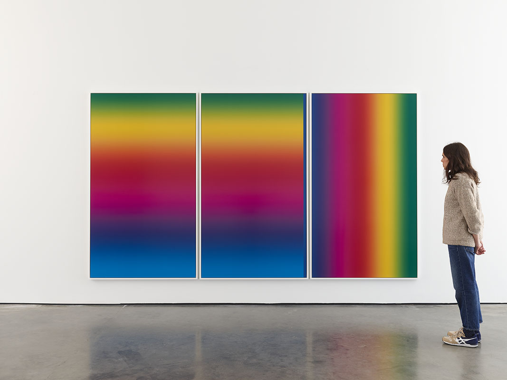
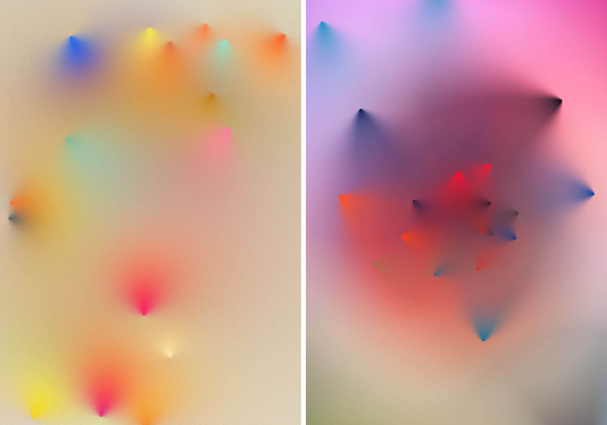
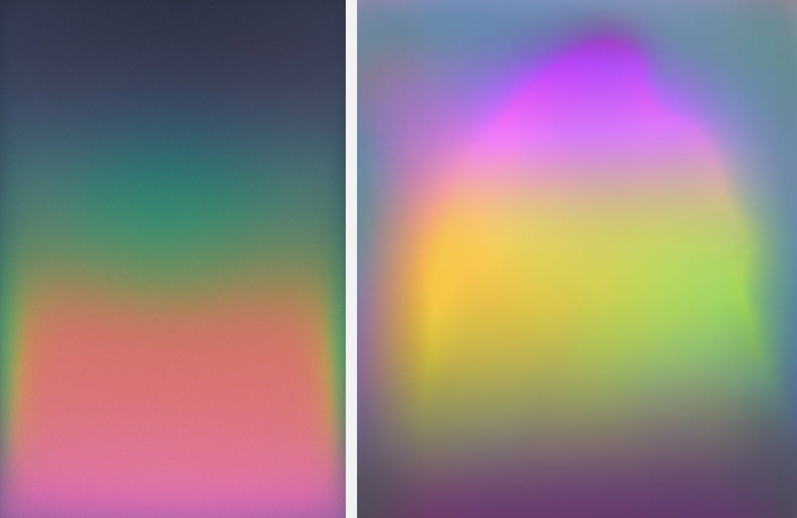
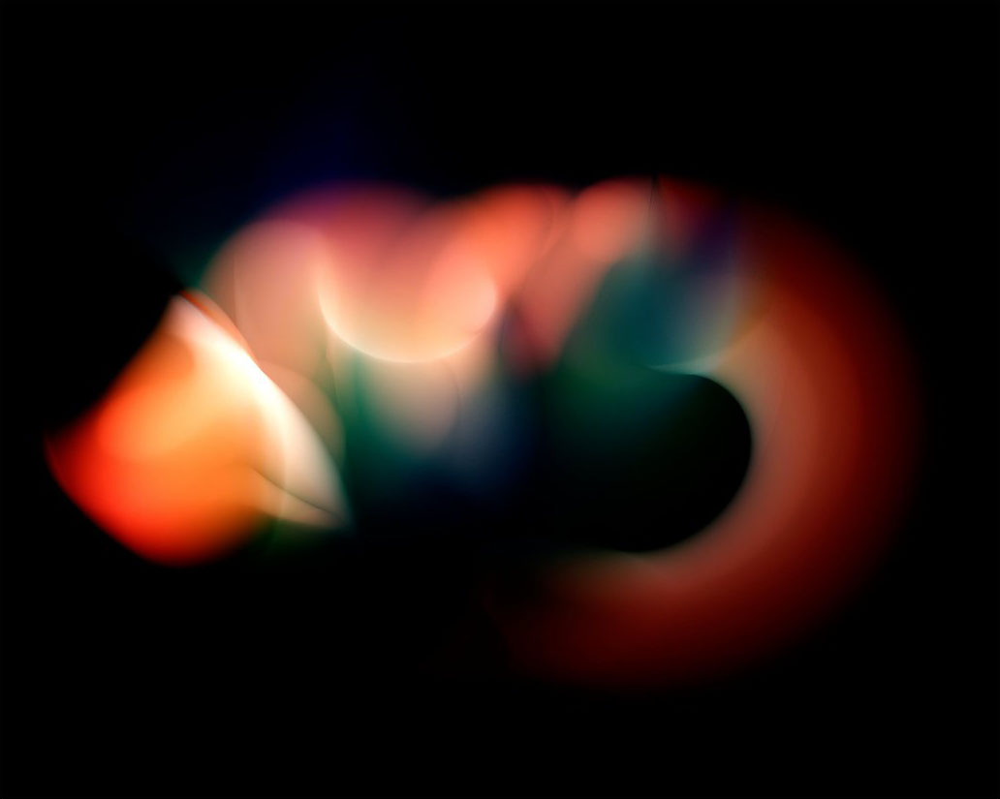

# No Hard Edges

*Work in Progress*

---

*Articulating the Indistinct*

<!--

https://openprocessing.org/sketch/2334454 - Shader Template

An image that *is*, not one that depicts 
a photograph of math
fragment shader programmed as a felt field rather than a rendered object.
resisting literal interpretation
Compositional flatness (or shallow space)
Field-based logic (no hierarchy or figure/ground)
Built from small gestures: dots, strokes, dabs
Light, color, or texture emerge from accumulation
No “image of” — just image
-->

---

 Caspar David Friedrich, [*Monk by the Sea*](https://en.wikipedia.org/wiki/The_Monk_by_the_Sea), 1808. A visitor to Friedrich’s studio, Helene von Kügelgen, suggested that the painting would be less frightening if he put a sea monster in it.

 Caspar David Friedrich, *Morning*, 1824.

---

 J.M.W. Turner, [*Snow Storm – Steam-Boat off a Harbour’s Mouth Making Signals in Shallow Water, and going by the Lead. The Artist was in this Storm on the Night the Ariel left Harwich*](https://en.wikipedia.org/wiki/Snow_Storm:_Steam-Boat_off_a_Harbour%27s_Mouth), 1842.

---

**Tonalism** was a style of painting that emerged in the US in the late 19th century, characterized by a narrow range of muted colors and soft, atmospheric effects to evoke mood and quiet introspection. Instead of emphasizing clear detail or dramatic contrast, Tonalist artists built their images from subtle shifts in tone—often in a single dominant color family, like warm browns or cool grays.

Tonalist landscapes often depict twilight, mist, or still water, with hazy silhouettes and a sense of stillness. The goal wasn’t to document nature precisely, but to convey a mood of reverie, often bordering on the spiritual or melancholic. In short, Tonalism is about painting with mood first, form second—a good parallel for shader programming focused on soft, immersive fields rather than objects or outlines. Here are various tonalist works by James Whistler: 

 J.M. Whistler, *Nocturne in Grey and Silver*, 1875

 J.M. Whistler, *Nocturne in Black and Gold*, 1875

 J.M. Whistler, *Nocturne in Grey and Gold*, 1884

---

 Claude Monet, *Houses of Parliament in Fog*, 1903.

---

 Berthe Morisot, *The Garden at Bougival*, 1884

 Cy Twombly, *Hero and Leandro*, 1984.

 Felix Bachmann, *Red and White*, 2024

 Gerhard Richter, *858-5*, 1999. [Another](gerhard_richter_858-3_1999.jpg)

 Gerhard Richter, *809-4*, 1994. Richter's work is meant to be inhabited. [Original](img/gerhard_richter_809-4_1994.jpg)

---

**Étienne Léopold Trouvelot** was an illustrator and astronomer active in the late 19th century. He created over 7,000 astronomical illustrations. These [pastel drawings of astronomical phenomena](https://publicdomainreview.org/collection/the-trouvelot-astronomical-drawings-1882/), including sunspots, auroras, and eclipses, were praised for their scientific accuracy and visual beauty.

 Étienne Léopold Trouvelot, *Aurora Borealis*, 1882

---

In the mid-20th century, *Color Field* painting aimed to evoke emotional and spiritual responses through large expanses of color, emphasizing the viewer's immersive experience. As a branch of Abstract Expressionism, it shifted focus from gesture and action to atmosphere and contemplation. Rather than focusing on shapes, figures, or composition in the traditional sense, Color Field artists aimed to surround the viewer with mood, light, and atmosphere through color alone. The paintings are typically big enough to fill your field of vision, and their gently shifting hues don’t depict anything—they act on you, inviting you to feel.

**Mark Rothko**'s Color Field paintings are especially relevant for studying hue shifts, saturation, and edge softness. Observe how the edges glow or dissolve, and how the “fields” imply not flatness, but atmosphere and depth. (Here's another, [*No. 61, Rust and Blue*](img/mark_rothko_no61_rust_and_blue_1953.jpg))

 Mark Rothko, *No. 14*, 1960.  [another](img/mark_rothko_no61_rust_and_blue_1953.jpg)

Dana Gordon reflected on a visit to the Mark Rothko retrospective at The Fondation Vuitton in Paris. [Gordon observed](https://www.painters-table.com/synopsis/notes-and-reflections-on-rothko-in-paris/) that his paintings from the 1950s:

> *"are [Rothko’s] best. They have the most full expression of color possible. I found them easy to look at, drawing me to them, and they made me want to look at them longer and longer. The longer I looked, the better they got. This large room full of so many of them said that painting, these paintings, this man’s paintings – these thin films on flimsy surfaces — were providing as deep and brilliant an experience as the world can provide. After leaving this gallery, I looked back and had the recognition, saying to myself, ‘He did it.’"*

Jordan Belson (1926–2011) was an American abstract filmmaker whose work explored visionary and cosmic imagery, often described as meditative journeys into inner and outer space. Drawing on influences from Eastern mysticism, meditation, and metaphysical traditions, his films use shifting fields of light, color, and sound to evoke transcendent, spiritual states of consciousness. Belson’s aesthetics aimed less at narrative and more at evoking an experiential encounter with the sublime, the infinite, and the unseen. Here is a clip from [*Momentum*](https://www.youtube.com/watch?v=F2EBAksEoJM&t=77s) (1968):

*Dansaekhwa*, sometimes known as Korean monochrome painting, is an art movement born in South Korea in the 1970s. Dansaekhwa artists avoided any reference to Western realism in their works, creating primarily monochrome and minimalist paintings with a strong focus on materiality. An example is Hur Hwang (허황), whose paintings explore subtle variations of the color white, which he believes invokes diverse psychological responses. Hur Hwang creates his own paint, mostly out of a thick mix of natural stone powder that he poured onto the canvas.

 Hur Hwang, *Variable Consciousness*, 1993.

---

I realize I said "no hard edges". In these two works, intermediate colors are achieved by a kind of half-tone or dithering technique: placing small chips or lines of different colors, with admittedly hard edges, in close alternation. 

 Alma Thomas, 1977

 Richard Anuszkiewicz, *Temple of Midnight Red*, 1983

---

 Vija Celmins, [*Night Sky (Ochre)*](https://matthewmarks.com/exhibitions/vija-celmins-02-2017/lightbox/works/night-sky-ochre-2016-42137/), oil on canvas, 2016

---

 Hiroshi Sugimoto, *Seascape*, photograph.

---

 Rita Ackermann, *Coronation and Massacre of Love*, 2018. [another](img/rita_ackermann_coronation_and_massacre_of_love_3_2018.jpg)

---

 
Tauba Auerbach, [*Untitled (Fold)*](https://taubaauerbach.com/view.php?id=376), 2012.

---

 James Turrell, *Aftershock*, 2021; [another](img/james_turrell_ganzfeld_double_vision_2013.jpg)

---

## Computational Approaches

<!--
 Cory Arcangel, *"Photoshop CS: 84 by 144 inches, 300 DPI, RGB, square pixels, default gradient "Spectrum", mousedown y=12100, x=26340, mouseup y=12100, x=42000; tool "Wand", select y= 12100, x=20000, tolerance=94, contiguous=on; default gradient "Spectrum", mousedown y=24300, x=16320, mouseup y=0, x=16320"*, 2017
-->

 Manolo Gamboa Naon, [*cirrrll*](https://www.behance.net/gallery/95976629/cirrrll), 2020

---

Light: Rafaël Rozendaal at MoMA

[another](img/rafael_rozendaal_light_moma_2025_2.jpg) by Rozendaal

[Lenticular paintings by Rozendaal](https://x.com/heft_gallery/status/1943345145887265077)

---

Works by [Krista Kim](https://www.kristakimstudio.com/), 2024:

---

 Zach Lieberman, [*Cone Gradient Study*](https://verse.works/series/color-gradient-study-by-zach-lieberman) #18 and #32 (2023) Some additional examples by Lieberman: 

* [DENYFFnJfXo](https://www.instagram.com/zach.lieberman/reel/DENYFFnJfXo/) (dynamic)
* [C59Po3Ypu4p](https://www.instagram.com/zach.lieberman/p/C59Po3Ypu4p/?img_index=5)
* [C3id8aXp7Mg](https://www.instagram.com/zach.lieberman/p/C3id8aXp7Mg/?img_index=1)
* [C3YhGT3Jd1p](https://www.instagram.com/zach.lieberman/p/C3YhGT3Jd1p/?img_index=1)
* [DGPf6PNsXQ-](https://www.instagram.com/zach.lieberman/p/DGPf6PNsXQ-/?img_index=1)

 Anton Dubrovn (MCHX), 2025.

 Anton Dubrovn (MCHX), [2025](https://www.instagram.com/p/DNSeYfRMyrV/?img_index=1).

<!-- 
 Lars Wander, [Light Doesn't Bend that Way](https://larswander.com/art/light-doesnt-bend-that-way/), 2023.
-->

---

<!--

https://x.com/XorDev/status/1927869795304669566

---

https://www.ruxandra-duru.com/work/gradients-soft-boundaries

https://medium.com/design-bootcamp/color-gradients-and-blurry-boundaries-f1739003b955

https://design.google/library/color-theory-ruxandra-duru

---

* https://mini.gmshaders.com/p/decoding-phosphor
* https://tympanus.net/codrops/2025/06/23/modeling-the-world-in-280-characters/
* https://twigl.app/?ol=true&ss=-OV-iPL4DQkXYW-ABUrV
* https://twigl.app/?ol=true&ss=-OURN9GfEmqqTAhL71vg
* https://bsky.app/profile/xordev.com/post/3lqqqeecldk2a

-->