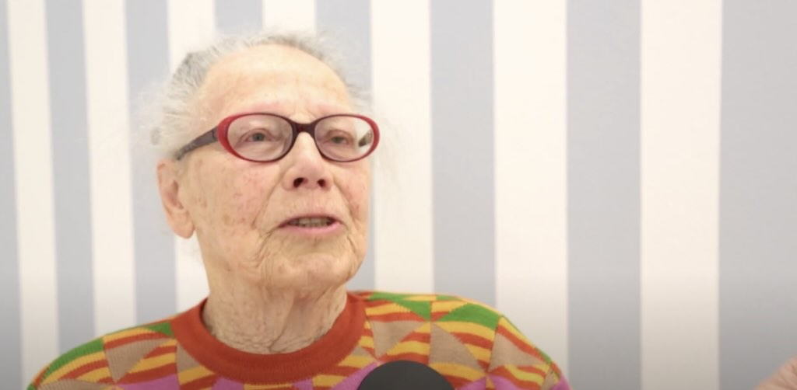
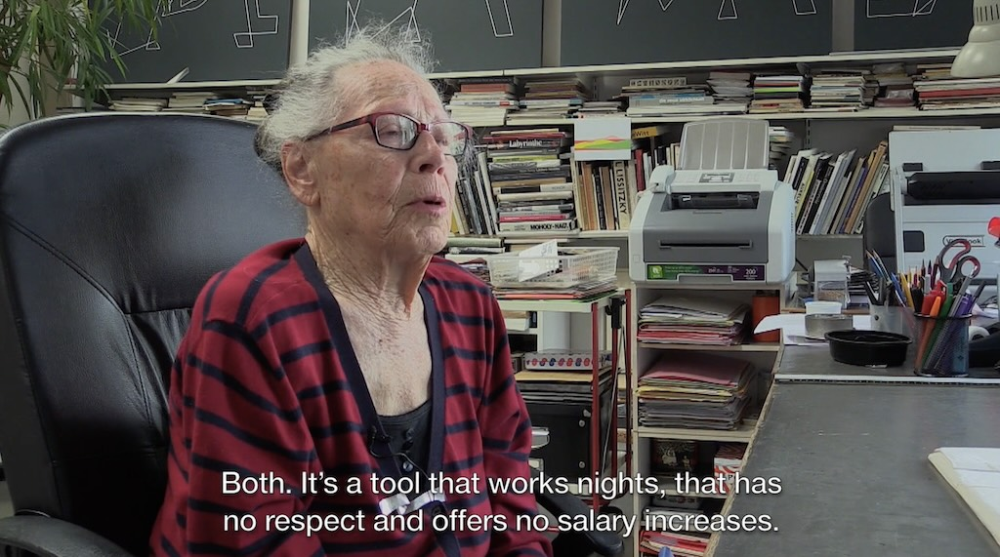
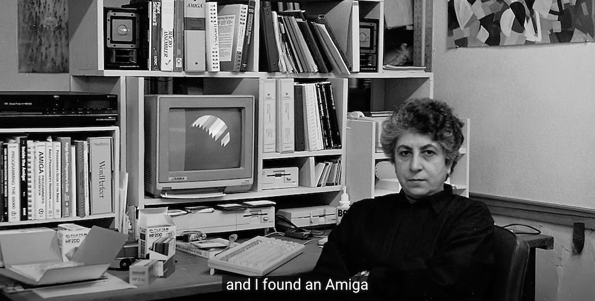
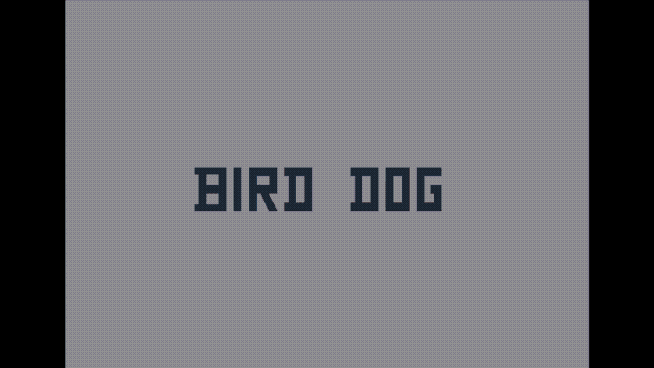
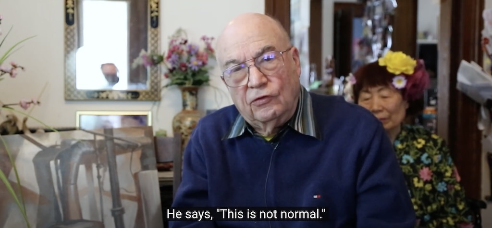

# Origins

---

Computer Art has been called the bastard child of computer science and fine art—rejected by both parents. Manfred Mohr (born 1938) is one of the first dozen or so people to make art with a computer; Here’s a brief excerpt from an [interview with him](https://www.thewhitereview.org/feature/interview-with-manfred-mohr/).

---

Origins & Pioneers: Vera Molnár, Duane Palyka
An homage from Gen-Z generative artist, Alida Sun:

## Vera Molnár (1924–2024)

[Vera Molnár](https://www.sothebys.com/en/articles/vera-molnar-the-grande-dame-of-generative-art), who passed away earlier this year at 99, was a living Hungarian-French artist who was one of the first ten people to make art with a computer. She has been called the “Grande Dame of Generative Art”. In 1968, Vera Molnar started working with a computer at the experimental psychology lab in Sorbonne, where she created her first plotter drawings, applying what she had been exploring in earlier years without using a machine.

She wrote:

> “Thanks to its many possibilities of combination the computer helps to systematically research the visual realm, helps the painter to free herself from cultural ′readymades′ and find combinations in forms never seen before, neither in nature nor at a museum: It helps to create inconceivable images. The computer helps, but it does not ′do′, does not ′design′ or ′invent′ anything. To avoid another misunderstanding I wish to underline something else: The fact that something is new and has not been seen before is no guarantee in any manner for its aesthetic quality. Was the portrayal of a young man with curly hair − Dürer′s self-portrait from around 1500 − new?”

<!-- 
([Molnár in 2017](https://vimeo.com/273642211), above. Watch from 15:10.) Here’s Molnár in the mid-1960s, and below it, in 2020:

-->

---

## Samia Halaby (1936-)

Samia Halaby is a Palestinian-American visual artist, activist, educator, and scholar. Halaby is recognized as a pioneer of abstract painting and Computer art. Since the mid-1980s she has been developing ["kinetic paintings"](https://www.moma.org/magazine/articles/1216) through code. She currently has a [solo exhibition at the Museum of Modern Art which is open through November 9th](https://www.moma.org/calendar/exhibitions/5819)

 [Watch from 7:40-12:20](https://www.youtube.com/watch?v=SdrYqKOBe5E&t=460s)

---

## Duane M. Palyka (1944–)

[Duane M. Palyka](https://www.atariarchives.org/artist/sec18.php) (born in Pittsburgh, 1944) studied mathematics (B.A. 1968) and fine arts (B.F.A. 1969) here at Carnegie Mellon University — making him the first person to earn a Computer Science and Art degree combination at our school. His path to freely creating cutting-edge, computer-generated art was not without obstacles. The head of the CMU computation center frowned upon using precious computer time for the creation of art; he called the undertaking “not normal,” and halted Palyka’s work. Luckily, CMU professor Herb Simon stepped in and offered support to Palyka through mentoring and a stipend to further his research. In 1968, while still an undergraduate, Palyka’s computer-generated art was exhibited alongside other pioneering artists like Nam June Paik in the landmark Cybernetic Serendipity exhibition at the ICA London. Watch his interview in this [CMU oral history video](https://www.cmu.edu/mcs/news-events/2023/0622_oral-history-duane-palyka.html) (from 5:12-10:07).

