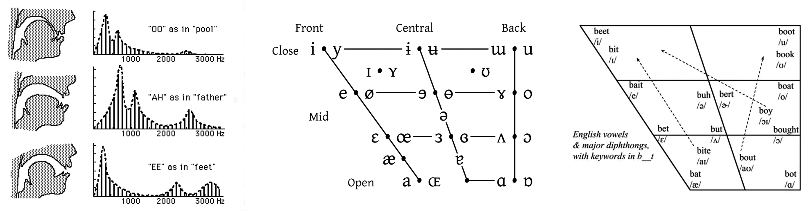
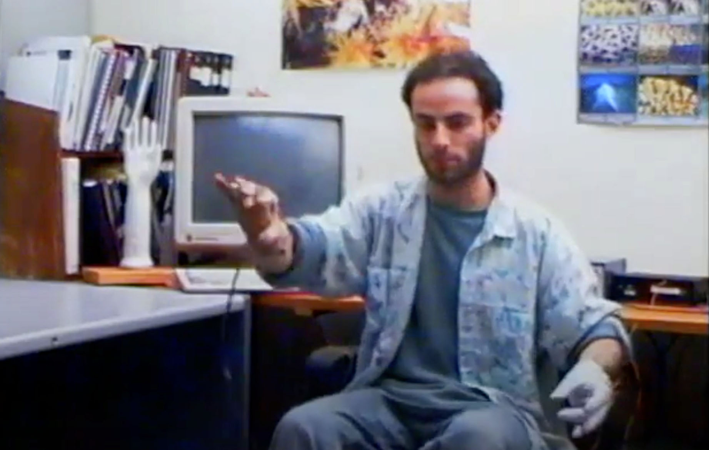

# p5.js + Pink Trombone

> *"Bare-handed procedural speech synthesis"*

We present a [**p5.js version**](https://editor.p5js.org/golan/sketches/E9Hd-deVy) of Neil Thapen's popular [**Pink Trombone**](https://dood.al/pinktrombone/), adapted for use in a creative coding assignment concerned with interaction design and absurd puppeteering. Adapted by Golan Levin, July 2025. 

## Overview

[**Pink Trombone**](https://dood.al/pinktrombone/) is a real-time, articulatory speech synthesizer that generates human-like vocal sounds by physically modeling the shape and dynamics of the human vocal tract. Developed by Neil Thapen, it simulates voiced sound production by passing a glottal waveform through a configurable waveguide representing the vocal tract's cross-sectional diameters. By adjusting these diameters over time—mimicking tongue, lips, and nasal cavity movements—the system can produce a wide range of vowel- and consonant-like utterances without relying on prerecorded phonemes or text-to-speech techniques.

This [**p5.js version of Pink Trombone**](https://editor.p5js.org/golan/sketches/E9Hd-deVy) serves as a pedagogical tool for teaching interactive audio synthesis and user interface design. Unlike the original implementation, it deliberately omits most of Thapen's visual interface representing the vocal tract. This is to allow students to create their *own* alternative interaction modalities—using e.g. gestural body-tracking controls—while engaging with the core synthesis engine.

---

## p5 Code

This adaptation of Pink Trombone is known to work with p5.js v.1.11.9. Code can be found:

* In [this repository](p5-pinktrombone/): [sketch.js](p5-pinktrombone/sketch.js), [p5.pinktrombone.js](p5-pinktrombone/p5.pinktrombone.js)
* At [Editor.p5js.org](https://editor.p5js.org/golan/sketches/E9Hd-deVy)
* At [OpenProcessing.org](https://openprocessing.org/sketch/2695444)

---

## Discussion and References

The human voice can be understood not only as a vehicle for spoken language, but also as an expressive instrument capable of abstraction. Asemic and abstract speech—nonsense vocalizations that retain the affective contours of speaking—shows up across a wide spectrum of cultural forms: from [**scat singing**](https://www.youtube.com/watch?v=jYmVExuuoFc&t=58s) and [**glossolalia**](https://www.youtube.com/watch?v=uf3kR6gZC0A&t=10s), to cartoon voices like the [**Minions**](https://www.youtube.com/watch?v=S0CLA2bUB4o) or the [**adults in Peanuts**](https://www.youtube.com/watch?v=_8_HsEKlr6A). These vocalizations are expressive without being linguistic: evoking mood, gesture, and personality without relying on recognizable words. Synthetic speech-song in games and interactive apps like [**Animalese**](https://www.youtube.com/watch?v=3HoDZVK3J24), [**Simlish**](https://www.youtube.com/shorts/EmK_fFAFZTA), or [**Bebot**](https://www.youtube.com/watch?v=JTlsu296ed8) make clear that even in software, computationally constructed speech-like sounds can conjure the illusion of communication through rhythm, inflection, and timbre alone.

Depending on the shape of the vocal tract, the buzzing source signal from the vocal cords is filtered to produce different vowels. Thus one approach to vocal sound synthesis is to create a simulated vocal tract, and use that shape as a resonant filter for a vibrating sound. You can see this in precisely shaped duck calls of the SF Exporatorium's "Vocal Vowels" exhibit; in 3D-printed vocal tracts created by Takayuki Arai ([**here**](https://www.youtube.com/watch?v=0LxiA5CFOzg) and [**here**](https://www.youtube.com/watch?v=DyQ96oerZEs&t=135s)); and in a disturbing [**vocal robot**](https://www.youtube.com/watch?v=ocpWpPkxxos) from Kagawa University. 

*Formants* are the resonant frequencies of the vocal tract that define the acoustic qualities of different vowel sounds. These frequency regions shift according to tongue height and frontness—independently of the pitch of the vocal cords—which makes it possible to sing different vowels for the same note. Although the vocal tract has many resonant frequencies, the first two formants, F1 and F2, account for the vast majority of vowel identity — typically estimated at around 80–90% of the perceptual information required to distinguish vowels in most languages. The *vowel trapezoid* is a conceptual map that organizes vowels based on the relative positions of these two dimensions. You can explore the vowel trapezoid in this [**interactive IPA vowel browser**](https://www.ipachart.com/).

In his doctoral research project [**GloveTalk II**](https://www.youtube.com/watch?v=hJpGkroFP3o&t=25s) (1990), Sid Fels used a 3D spatial tracker to allow a performer’s hand to navigate this trapezoidal formant space in real time, generating intelligible or abstract speech through gestural control. These kinds of mappings show how expressive movement can be directly tied to vocal shape, creating an embodied voice instrument.

If [**Pink Trombone**](https://dood.al/pinktrombone/) is a "disembodied mouth", then the purpose of this project is to give it the body it lacks. You are invited to *control* the Pink Trombone speech synthesizer using your own body—via Google's MediaPipe hand-, [face-](https://openprocessing.org/sketch/2066195/), or body-tracking systems—and to *visualize* it with a new body of your own design. The goal is to explore the creative potential of gestural voice control, whether for expressive performance, musical augmentation, or absurd vocal puppetry. One of the core challenges lies in *mapping*: how to use tracked geometries to manipulate continuous control parameters in a way that feels intuitive, expressive, or playful. You will confront questions of control resolution, parameter coupling, and feedback—all central to real-time interaction design.

*You may also enjoy:*

* [Pink Trombone with extra controls and visualizations](https://www.yacavone.net/vowel-space/)
* Zack Qattan's [Text-to-Speech Pink Trombone](https://www.youtube.com/watch?v=YhlIgTvHwa0)
* These [researchers controlled Pink Trombone with a neural net](https://courses.ideate.cmu.edu/60-428/f2021/index.html%3Fp=111.html)
