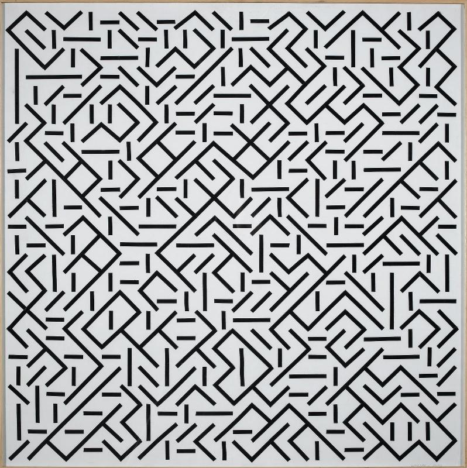
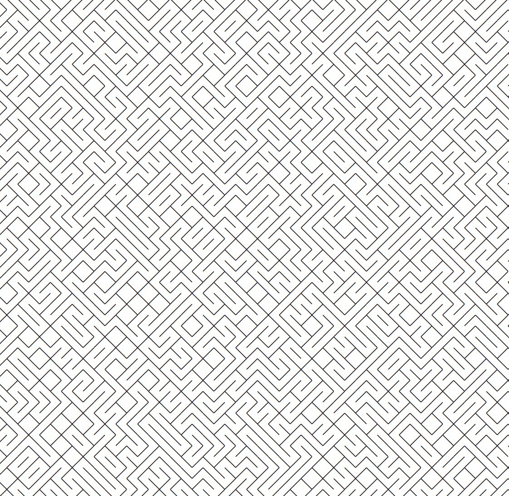

# Truchet Tiles

## Modular Elements, Randomized; Larger Structures Seemingly Emerging Therefrom

---


Vera Molnár, *Untitled (Quatre éléments distribués au hasard)*, 1959:



Anna Carreras, [*Trossets*](https://www.artblocks.io/curated/collections/trossets-by-anna-carreras?tab=Artworks), 2021:


---

## 10 PRINT

Commodore C64 Basic:

```
10 PRINT CHR$(205.5+RND(1)); : GOTO 10
```


Processing (Java):

```
while (true) {
  print ((char)(random(1)<0.5? 47:92));
}
```

HTML version by Alexander Reben. (Paste this into the address bar of the browser):

```
data:text/html,<div style="line-height:1em;word-wrap:break-word;"id=d><script>for(i=0;1e4>i;i++)d.innerHTML+=String.fromCharCode(9585+Math.random()*2);</script>
```



---

## Truchet Tiles


In 1704, Sebastien Truchet considered all possible patterns formed by tilings of right triangles oriented at the four corners of a square.


[From Mathworld](https://mathworld.wolfram.com/TruchetTiling.html): A modification of Truchet’s tiles leads to a single tile consisting of two circular arcs of radius equal to half the tile edge length centered at opposed corners. There are two possible orientations of this tile, and tiling the plane using tiles with random orientations gives visually interesting patterns.


Milled version by Sabine Wieluch (Bleeptrack): [Video](https://www.youtube.com/watch?v=k0wkpYMZ984)


---

## Expanded Truchet Patterns

From [Duotone Truchet-Like Tilings](http://cambolbro.com/graphics/duotone/), by Cameron Browne:







[**Interactive demonstration at Observable**](https://observablehq.com/@nrabinowitz/truchet-tiles) by Nick Rabinowitz:



---

## Multiscale Truchet Patterns

* From [Multiscale Truchet Patterns](https://christophercarlson.com/portfolio/multi-scale-truchet-patterns/) (blog post) by Christopher Carlson
* [Full PDF paper](http://archive.bridgesmathart.org/2018/bridges2018-39.pdf) by Christopher Carlson
* [Truchet-Carlson Tiles at Observable](https://observablehq.com/@osteele/truchet-carlson-tiles)



